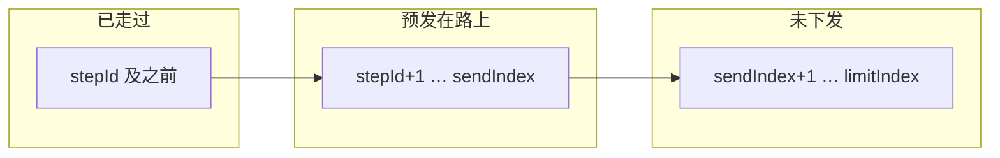
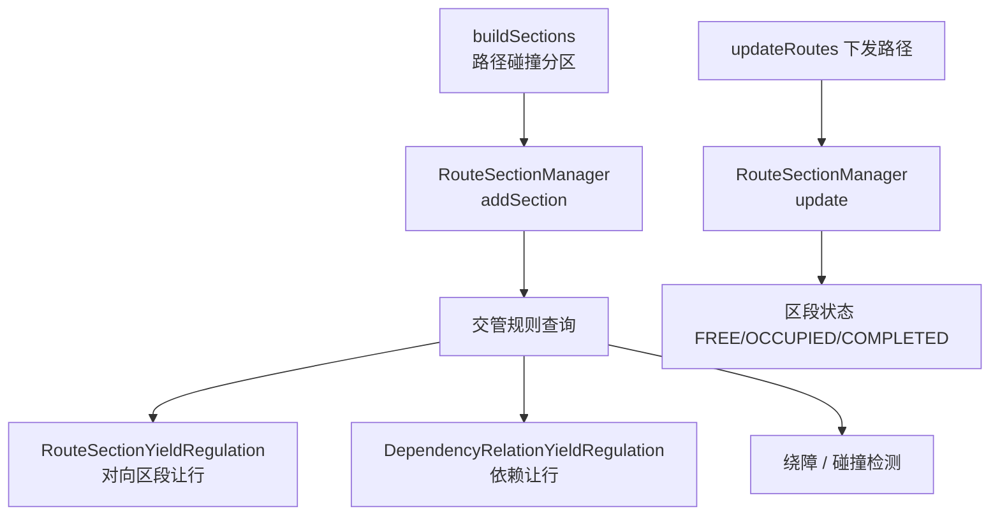

# 路径下发两参数passed/maxApply

`passedRoadLineCount_` 和 `maxApplyRoadLineCount_` 共同决定**路径段「滑动窗口」**怎么下发。下面按代码逻辑说明含义，并给出你要的「走过一段就立刻补段」的设参建议。

---

## 1. 三个关键索引

`Control` 里和下发相关的字段：

| 字段           | 含义                                   |
| ------------ | ------------------------------------ |
| `stepId`     | 车辆**当前进度**（走到哪一段），`positionId` 变化时更新 |
| `sendIndex`  | 已下发给车辆的**最远路段**下标（-1 表示还没发过）         |
| `limitIndex` | 交管规则允许的**最远可发**下标（让行、冲突等会压低）         |

**未走完的「预发」段数**（管道深度）：

\[
\text{gap} = \text{sendIndex} - \text{stepId}
\]

---

## 2. `passedRoadLineCount_` 的含义

在 `applyRoadLines` 入口有这道门：

```1288:1290:core/module/traffic/src/traffic_control_service_regulation.cpp
    if (sendI - stepId >= passedRoadLineCount_) {
        return;
    }
```

含义：

- 当 **gap ≥ passedRoadLineCount_** 时，**本周期不再追加下发**
- 只有 **gap < passedRoadLineCount_** 时，才进入后面的补发逻辑

所以 `passedRoadLineCount_` 是**允许预发在路上的最大段数上限**（闸门），不是「走过几段才发」的计数器。

当前默认值（头文件）：

```21:22:core/module/traffic/include/traffic/traffic_control_service_regulation.hpp
            int maxApplyRoadLineCount_ = 10;
            int passedRoadLineCount_   = 8;
```

即：最多允许约 **8 段** 预发在路上（实际稳态 gap 一般是 `passedRoadLineCount_ - 1`，见下文）。

---

## 3. `maxApplyRoadLineCount_` 的含义

```1322:1362:core/module/traffic/src/traffic_control_service_regulation.cpp
    for (int index = 0; index < maxApplyRoadLineCount_; ++index) {
        ...
        ++sendIndex;
        addRoad(applyRoads, control->roadLines[sendIndex]);
        ...
        if (sendIndex >= limitIndex) { break; }
        if (sendIndex + 1 >= roadCount) { break; }
    }
```

含义：**单次** `applyRoadLines` 调用里，最多连续追加 **maxApplyRoadLineCount_** 段（还会被 `limitIndex`、门、风门等打断）。

- 首次下发：可能一次连发多段，把 gap 快速拉满  
- 之后：车每往前走，`stepId` 增大 → gap 缩小 → 闸门打开 → 再补段

---

## 4. 二者如何配合（滑动窗口）



典型过程：

1. 初次：`sendIndex=-1` → 一次最多发 `maxApply` 段 → 例如 `sendIndex=9`
2. 车未动：`stepId=0`，gap=9 ≥ 8 → **停止补发**
3. 车到下一站：`stepId=1`，gap=8 ≥ 8 → **仍不发**（这是当前默认 8/10 的一个坑）
4. 车再到下一站：`stepId=2`，gap=7 < 8 → **开门**，本轮最多再发 10 段

要点：**车每走过一个站点（`positionId` 变），`stepId` 才 +1**，不是按连续坐标走满一段就算。

---

## 5. 你要的效果该怎么设

目标：

> 走过一段就立刻补段，让预发段数**一直接近** `maxApplyRoadLineCount_`

### 核心公式

```text
passedRoadLineCount_ = maxApplyRoadLineCount_ + 1
```

原因：闸门是 `gap >= passedRoadLineCount_` 才停发，要让最大 gap 达到 `maxApply`，需要：

passedRoadLineCount_  >=  \maxApplyRoadLineCount_ + 1

### 按站间距举例（80 cm/站）

| 目标预发距离     | maxApplyRoadLineCount_ | passedRoadLineCount_ | 说明                  |
| ---------- | ---------------------- | -------------------- | ------------------- |
| ~4 m（5 站）  | **5**                  | **6**                | 密集站点常用              |
| ~8 m（10 站） | **10**                 | **11**               | 与当前 max=10 对齐       |
| 更激进补发      | **5**                  | **6**                | 走过 1 站就补，保持约 5 段在路上 |

当前默认 `maxApply=10, passed=8` 的问题：

- 稳态最多约 **7 段**预发（gap 到 8 就停），达不到 10
- 车走过 **1 站**后 gap 仍可能 ≥ 8，**不会立刻补发**，要再走一站才补

若要「走过 1 站就补、并保持接近 maxApply」：

```cpp
int maxApplyRoadLineCount_ = 5;   // 按你想要的预发站数
int passedRoadLineCount_   = 6;   // = maxApply + 1
```

---

## 6. 只改这两个值够不够？

不够，还有这些瓶颈：

### （1）交管循环约 2Hz

```62:62:core/module/traffic/src/traffic_control_service_regulation.cpp
            std::this_thread::sleep_for(std::chrono::milliseconds(500));
```

补发最快约 **500ms 一次**，不是车一过站就瞬时补。

### （2）`stepId` 依赖站点上报

```527:528:core/module/traffic/src/traffic_control_service_regulation.cpp
        if (positionChanged) {
            updateVehilceStepId(control, curtPosition, control->stepId);
```

只有 `positionId` 变化才更新 `stepId`。SINEVA 若状态刷新慢，会拖慢「走过一段」的感知。

### （3）`limitIndex` 可能更小

让行、区段占用等会把 `limitIndex` 压低，即使闸门打开也可能发不出去。

### （4）参数是硬编码

目前在 `traffic_control_service_regulation.hpp`，**不能**通过 `scene.json` 配置，需改代码并重新编译。

---

## 7. 推荐配置策略

**密集站点（80 cm）、希望车始终有足够「前瞻」：**

```cpp
maxApplyRoadLineCount_ = 5;   // 约 4m 预发（5×0.8m）
passedRoadLineCount_   = 6;
```

**更激进（走过 1 站就补满窗口）：**

- 保持 `passed = maxApply + 1`
- `maxApply` 不要过大（5~8 通常够用），过大反而让行/冲突计算更重
- 若仍觉得补发慢，考虑把交管 `sleep(500)` 改为 `200~300ms`（需评估 CPU 与稳定性）

**不建议：**

| 做法                              | 问题                       |
| ------------------------------- | ------------------------ |
| `passedRoadLineCount_` 设很小（如 2） | 预发窗口太浅，车容易等下一段           |
| `passed < maxApply`             | 永远补不满到 maxApply          |
| 只加大 `maxApply`、不改 `passed`      | 首次能连发很多，稳态仍被 `passed` 卡住 |

---

## 8. 一句话总结

- **`passedRoadLineCount_`**：预发在路上的**最大段数闸门**（gap 达到它就停发）  
- **`maxApplyRoadLineCount_`**：每次开门时**最多连发几段**  
- 若要「走过一站就补、并维持接近 maxApply」：设 **`passedRoadLineCount_ = maxApplyRoadLineCount_ + 1`**，再按站间距选 `maxApply`（例如 80cm 站间距用 5/6）

# Route Section Manager

`RouteSectionManager` 是 Matrix 交管模块里的**路径区段（Route Section）管理器**，负责记录和管理**两辆车路径之间的空间冲突关系**，为多车让行、限发、绕障提供依据。

---

## 一句话

它维护「**车 A 与车 B 的路径在哪些站点/路段上会相遇、谁占用了冲突区**」这张表，供交管规则查询和更新。

---

## 在整体架构中的位置



挂在 `RegulationTrafficControlService` 里，和 `controlBlockManager_`（单车控制块）、`yieldInfoManager_`（让行信息）配合使用。

---

## 核心数据结构

内部是一张表：

```cpp
std::unordered_map<std::string, std::vector<RouteSectionSharedPtr>> routeSections_;
// key = "vehicleId1_vehicleId2"
```

每个 `RouteSection` 描述**一对车**之间的一段冲突区，包含：

| 字段                        | 含义                                   |
| ------------------------- | ------------------------------------ |
| `vehicles_[2]`            | 冲突双方车辆 ID                            |
| `blockTaskIds_[2]`        | 双方当前 block 任务                        |
| `minIndexs_ / maxIndexs_` | 各自路径上冲突区起止路段下标                       |
| `positions_[2]`           | 冲突区涉及的站点序列                           |
| `sectionType_`            | `SAME` / `OPPOSITE` / `INTERSECTION` |
| `sectionState_`           | `FREE` / `OCCUPIED` / `COMPLETED`    |
| `occupiedVehicles_`       | 当前占用该区段的车辆                           |

---

## 主要 API 做什么

| 方法                                           | 作用                      |
| -------------------------------------------- | ----------------------- |
| `addSection(v1, v2, section)`                | 登记两车之间新发现的冲突区段          |
| `exist(v1, v2)`                              | 是否已有这对车的区段记录            |
| `getSections(vehicleId)`                     | 查某车参与的所有**未完成**区段       |
| `getSections(vehicleId, positionId)`         | 查某车在某站点相关的区段            |
| `update(vehicleId, blockTaskId, step, sent)` | 根据车辆进度更新区段占用状态          |
| `clearSections(vehicleId)`                   | 清掉与某车相关的所有区段（任务结束/重规划时） |

---

## 生命周期：何时创建、更新、清除

### 1. 创建 — `buildSections`

交管循环里，对多辆有任务的车两两做路径分区（`RouteSectionPartition`），把几何/碰撞上可能冲突的路段切成 `RouteSection`，再 `addSection`：

```1234:1241:core/module/traffic/src/traffic_control_service_regulation.cpp
            sections::RouteSectionPartition partition(vehicleI, vehicleJ, ...);
            auto sections = partition.partition(controlI->roadLines, controlJ->roadLines, ...);
            for (auto& section : sections) {
                section->setBlockTasks(controlI->blockTaskId, controlJ->blockTaskId);
                routeSectionManager_->addSection(vehicleI->id, vehicleJ->id, section);
            }
```

### 2. 更新 — `update`

路径下发后，用车辆的 `stepId`（走到哪）、`sendIndex`（发到哪）更新区段是否被占用：

```683:683:core/module/traffic/src/traffic_control_service_regulation.cpp
        routeSectionManager_->update(vehicle->id, control->blockTaskId, control->stepId, control->sendIndex);
```

`RouteSection::update` 逻辑要点：

- 任务变了 → 区段标记 `COMPLETED` 并清空
- 车已走过冲突区（`step >= maxIndex`）→ `COMPLETED`
- 路径已发到冲突区 → 车辆进入 `occupiedVehicles_`，状态变 `OCCUPIED`

### 3. 清除 — `clearSections`

在以下场景调用：

- 新车要派任务（`updateBlockTasks`）
- 重规划 / 绕障（`detour`）
- 任务结束（`clearVehicleBlockTaskInfo`）

避免旧冲突区段影响新路径。

---

## 被谁消费（为什么需要它）

### 1. 对向区段让行 — `RouteSectionYieldRegulation`

查某路段终点是否有 `OPPOSITE` 类型区段，且**已被另一辆车占用** → 压低 `limitIndex`，限制继续下发，触发让行。

### 2. 依赖关系让行 — `DependencyRelationYieldRegulation`

根据区段判断谁先谁后，避免在窄通道、对向路径上抢行。

### 3. 绕障服务

`detourService_` 和 `VehicleDetourTriggerBlocked` 等会读区段，判断车辆是否被堵在冲突区。

### 4. 碰撞检测 — `collision_detector`

结合区段判断某位置是否处于多车冲突区域。

---

## 和 `ControlBlockManager` 的分工

| 组件                    | 管什么                                   |
| --------------------- | ------------------------------------- |
| `ControlBlockManager` | **单车**：整条路径、`sendIndex`、`stepId`、任务信息 |
| `RouteSectionManager` | **车与车之间**：路径交叉/对向/汇合区段的占用与释放          |

单车管「我走哪条路、发到第几段」；区段管「这段路上会不会和别的车撞、谁该让」。

---

## 总结

`RouteSectionManager` 是 Matrix 多车交管的**冲突区段注册表**：

1. **建**：`buildSections` 根据两车路径几何关系生成区段  
2. **记**：`addSection` 存进 `routeSections_`  
3. **跟**：`update` 随车辆推进更新 `OCCUPIED` / `COMPLETED`  
4. **查**：让行、绕障、限发规则通过 `getSections` 决定能不能继续发点  
5. **清**：任务切换或重规划时 `clearSections` 回收  

没有它，系统仍能给单车下发路径，但**多车对向/交汇时的协调让行**会缺少关键依据。
