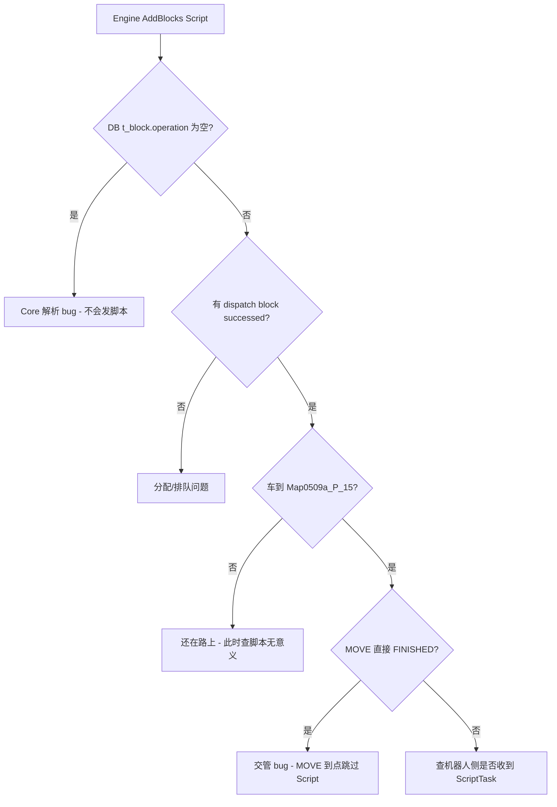

根据你贴的 **10:20:46** 这段 Core 日志，可以先把结论说清楚：**这一刻调度还没有、也不应该下发脚本命令**——机器人还在 `Map0509a_P_16`，Script block 也还没真正派发给交管。下面是一套**从快到慢**的定位方法，以及当前代码里为什么脚本大概率永远不会发。

---

## 1. 先理解时间线（避免在错误时刻查日志）

脚本下发发生在：**机器人到达 `Map0509a_P_15` 且路径全部发完** 之后，不是 `addBlocks` 当下。

你当前日志里：

| 现象                                                      | 含义                                  |
| ------------------------------------------------------- | ----------------------------------- |
| `add block task:... MOVE 75c1e463...`                   | block 被当成 **MOVE** 类型入库             |
| `waiting vehicle:10.1.11.137 leisure:false`             | 车还在执行前一个 block，Script block **在排队** |
| `positionId:Map0509a_P_16`, `taskType:MOVE`, `block:` 空 | 车**未到** P_15，当前也没有 Script block 在执行 |

所以 10:20:46 附近**查不到** `compass_assist_copy.py` 是正常的；要在**车到 P_15 之后**再 grep。

---

## 2. 最快验证：一条 SQL（30 秒）

Core 会把 block 写入 `t_block`，`operation` 和 `operationArgs` 是分开存的：

```sql
SELECT id, location, operation, operationArgs, state
FROM t_block
WHERE orderId = '1b9bf7d0d73844d98b1e236e769f5d92';
```

**若 bug 存在，典型结果是：**

- `location` = `Map0509a_P_15`
- `operation` = **空字符串**（Script 没被写进去）
- `operationArgs` = `{"scriptName":"compass_assist_copy.py", ...}`（脚本名只在 JSON 里）

这说明 Engine 下发了 Script，但 Core **解析时丢了 operation**，后面交管也就不会触发脚本。

---

## 3. Core 日志 grep 清单（按执行阶段）

在 Core 日志文件上，用订单/block ID 串起来查（把路径换成你的实际日志路径）：

```bash
ORDER=1b9bf7d0d73844d98b1e236e769f5d92
BLOCK=75c1e463571a4be58a6b2f73776617bd

grep -E "$ORDER|$BLOCK|Map0509a_P_15|compass_assist|\[dispatch\] \[block\]|add block to traffic|startOperation|sendOperation|lowerOperation|onSubtaskStateChanged|Sent:.*10\.1\.11\.137" /path/to/core.log
```

### 阶段 A — block 是否派发给交管

应出现：

```text
[dispatch] [block] successed, add block to traffic control, vehicle:10.1.11.137, block id:75c1e463...
```

若没有 → 问题在**任务分配**（车 busy、leisure、优先级等），还没到脚本环节。

### 阶段 B — 车到目标点后是否触发动作

**脚本若真的下发**，会走：

`traffic_control` → `vehicleCommandSender_->startOperation()` → `sendNewScriptTask()` → TCP `Sent:xxx bytes to:10.1.11.137:...`

但注意：**Script 路径几乎没有专用 INFO 日志**（不像 `jackload` 会打 `lowerOperation:jackload`），所以：

| 日志关键词                                 | 发了脚本？                          |
| ------------------------------------- | ------------------------------ |
| `lowerOperation:script`               | **当前代码里不会出现**（Script 分支没打 log） |
| `compass_assist_copy`                 | Core 日志里**不会出现**（除非你们自己加了）     |
| `Sent:xxx bytes to:10.1.11.137`       | 只能说明**发了某种 TCP 包**，无法区分是路径还是脚本 |
| block 直接 `FINISHED` + `taskType:MOVE` | **高度怀疑没发脚本**（见下文根因）            |

### 阶段 C — 车到 P_15 时的 vehicle info

```text
positionId:Map0509a_P_15, state:FREE, taskType:MOVE, block:75c1e463...
```

若紧接着 block 变 `FINISHED`、且全程无 `startOperation` 相关痕迹 → **确认未发脚本**。

---

## 4. 根因（代码层面，和你现象一致）

### 4.1 `addBlocks` 把 Script 的 operation 丢掉了

```656:664:core/src/core_application.cpp
            if (block.operation.empty()) {
                blockTaskPtr->type = TaskType::MOVE;
            } else {
                blockTaskPtr->type = orderPtr->type;
            }

            if (blockTaskPtr->type != TaskType::NONE && blockTaskPtr->type != TaskType::MOVE) {
                blockTaskPtr->opreation = block.operation;
            }
```

当订单类型是 **MOVE**、block 带 `operation:"Script"` 时：

- `type` 仍是 **MOVE**（日志里 `add block task:... MOVE` 就是这个）
- `opreation` **不会被赋值**（空）
- `scriptName` 只进了 `opreationArgs`

### 4.2 交管到达目标点后，MOVE 直接完成，不执行 Script

```554:589:core/module/traffic/src/traffic_control_service_regulation.cpp
                if (control->operation != "" && (control->taskType == TaskType::LOAD || control->taskType == TaskType::UNLOAD)) {
                    ...
                        vehicleCommandSender_->startOperation(vehicle, control->blockTaskId, control->operation, control->operationArgs);
                    ...
                } else if (control->taskType == TaskType::MOVE || control->taskType == TaskType::IDLE) {
                    // 路径已全部下发完成，车辆在目标点且状态是空闲，认为任务完成
                    onSubtaskStateChanged(control->orderId, control->blockTaskId, TaskState::FINISHED);
```

`startOperation`（内部才会 `sendNewScriptTask`）**只对 LOAD/UNLOAD 且 operation 非空**触发；MOVE 到点就直接 `FINISHED`。

即使 `operationArgs.scriptName` 有值，`control->operation` 为空时也走不到 Script 分支：

```291:301:core/module/domain/include/vehicles/vehicle_command_sender.hpp
        if ("script" == lowerOperation) {
            ...
            if (vehicle->sendNewScriptTask(scriptTask)) {
                return VehicleCommandResult::success();
            }
```

---

## 5. 现场排查决策树（简版）



---

## 6. 对你当前日志的直接判断

- **10:20:46**：Engine 已成功 `AddBlocks`，Core 已入库 block `75c1e463...`。
- 同一时刻：`waiting vehicle ... leisure:false` → Script block **尚未 dispatch**。
- 车在 **P_16**，不是目标 **P_15** → **不可能**此时发脚本。
- 结合代码：**即使车到 P_15，当前 Core 也大概率不会发 `compass_assist_copy.py`**，因为 `operation` 为空 + MOVE 到点直接 FINISHED。

---

## 7. 建议的修复方向（如需改代码）

1. **`addBlocks` / `http_server_api`**：`block.operation` 非空时**始终**设置 `opreation`，不要因 `type==MOVE` 跳过。
2. **`traffic_control_service_regulation.cpp`**：MOVE/IDLE 到点且 `control->operation == "Script"`（或非空）时，先 `startOperation`，等脚本完成再 FINISHED。
3. **可选**：在 `doStartOperation` 的 Script 分支加一行 `SPDLOG_INFO("vehicle:{}, script:{}", ...)`，以后现场 grep 会容易很多。

如果你希望，我可以直接在仓库里提交上述修复并补一条单元/集成测试路径。

---


# Data base check

按你们 **matrix_auto_install.sh** 的默认配置，MySQL 连接信息是：

| 项目  | 默认值             |
| --- | --------------- |
| 主机  | `127.0.0.1`（本机） |
| 端口  | `3306`          |
| 用户  | `root`          |
| 密码  | `mysql`         |
| 数据库 | `sineva_matrix` |

（若生产环境改过密码，以实际为准。）

---

## 方式一：一条命令直接查（推荐）

SSH 登录 Matrix 服务器后执行：

```bash
mysql -uroot -pmysql -D sineva_matrix -e "
SELECT id, location, operation, operationArgs, state
FROM t_block
WHERE orderId = '1b9bf7d0d73844d98b1e236e769f5d92';
"
```

`-p` 和密码之间**不能有空格**（`-pmysql`）。

---

## 方式二：先进入 MySQL 交互模式

```bash
mysql -uroot -pmysql
```

进入后：

```sql
USE sineva_matrix;

SELECT id, location, operation, operationArgs, state
FROM t_block
WHERE orderId = '1b9bf7d0d73844d98b1e236e769f5d92';
```

退出：

```sql
EXIT;
```

或按 `Ctrl+D`。

---

## 方式三：密码不想写在命令行里

```bash
mysql -uroot -p
```

提示 `Enter password:` 时输入 `mysql`，再执行上面的 `USE` 和 `SELECT`。

---

## 查之前可先确认 MySQL 是否在跑

```bash
systemctl status mysql
```

若未启动：

```bash
sudo systemctl start mysql
```

---

## 结果怎么读

- **`operation` 为空**，但 **`operationArgs` 里有 `"scriptName":"compass_assist_copy.py"`** → 符合前面分析的 Core 解析 bug。
- **`state` 含义**（常见值）：
  - `1` = CREATED（已创建）
  - `2` = DISPATCHED（已分配）
  - `5` = FINISHED（已完成）

若查不到记录，可先确认库和表是否存在：

```bash
mysql -uroot -pmysql -e "SHOW DATABASES LIKE 'sineva_matrix';"
mysql -uroot -pmysql -D sineva_matrix -e "SHOW TABLES LIKE 't_block';"
```

若默认密码连不上，可在服务器上查看是否被改过（Engine 配置在 `/etc/sinevaAGV/matrix/config/systemParams.json`，但数据库账号是写死在 Engine 代码里的，默认仍是 `root` / `mysql`）。


# confirm issue

你的 SQL 结果已经把问题钉死了，和之前代码分析完全一致。

## 结论

| 字段                         | 你的结果                                      | 含义                          |
| -------------------------- | ----------------------------------------- | --------------------------- |
| `location`                 | `Map0509a_P_15`                           | 目标点正确，机器人应已到达               |
| `operation`                | **空**                                     | Core 入库时**没有**写入 `"Script"` |
| `operationArgs.scriptName` | `compass_assist_copy.py`                  | Engine 下发的脚本名**有保存**        |
| `operationArgs` 里其它字段为空    | `binTaskKey`、`scriptArgs` 等均为 `""` / `{}` | 正常，这次任务本来就没配这些              |
| `state`                    | `5`                                       | **FINISHED（已完成）**           |

这说明整条链路是：

1. Engine 通过 `AddBlocks` 正确传了 `operation:"Script"` 和 `scriptName`
2. Core 在 `addBlocks` 里因为订单类型是 **MOVE**，只把 `scriptName` 写进了 `operationArgs`，**`operation` 字段被留空**
3. 交管模块到达 `Map0509a_P_15` 后，把该 block 当成普通 **MOVE** 直接标记完成（`state=5`），**从未调用** `startOperation` → `sendNewScriptTask`
4. 所以调度**没有**向机器人下发执行 `compass_assist_copy.py` 的命令

`preBinTaskKey`、`recognizeFile` 等出现在 JSON 里是 Core 入库时的**固定结构**（空值也会写入），不是这次任务单独配置的字段；关键只看 **`operation` 是否为空** 以及 **`scriptName` 是否有值**。

---

## 和日志的对应关系

- Core 日志里 `add block task:... MOVE 75c1e463...` → block 被当成 MOVE
- 车到 P_15 后 block 直接 `FINISHED`，无 `startOperation` / 脚本相关 TCP 日志
- 数据库里 `operation` 空 + `state=5` → **双重印证：脚本步骤被跳过**

---

## 修复方向（需改 Core 代码）

两处：

1. **`core_application.cpp` / `http_server_api.cpp`**：`block.operation` 非空时**始终**设置 `opreation`，不要因为 `type==MOVE` 就跳过  
2. **`traffic_control_service_regulation.cpp`**：MOVE/IDLE 到点后，若 `control->operation == "Script"`，先 `startOperation` 发脚本，完成后再 FINISHED

如果你需要，我可以在仓库里直接提交这个修复。


# DEV

已在 **`feature/scriptsend`** 分支（基于 `develop`）完成修复，**未提交**，你可自行审核后 commit。

## 修复内容

### 1. 新增可测试工具头文件

`core/module/domain/include/orders/block_operation_utils.hpp`

- `assignBlockTaskTypeAndOperation()` — MOVE 订单 + Script block 时也会写入 `opreation`
- `decideMoveArrivalAction()` — 到点后先发脚本，下一周期再 FINISHED

### 2. 入库修复

- `core/src/core_application.cpp`（Engine `AddBlocks` 主路径）
- `core/module/external/src/http_server_api.cpp`（HTTP addBlocks 路径）

### 3. 交管到点逻辑

`core/module/traffic/src/traffic_control_service_regulation.cpp`

MOVE/IDLE 到目标点且 `operation` 非空时：

- 第 1 次循环：`startOperation` → `sendNewScriptTask`
- 第 2 次循环：block FINISHED

### 4. 日志增强

`vehicle_command_sender.hpp` 发脚本时打印：

```text
vehicle:{id}, script:compass_assist_copy.py
```

---

## 单元测试

新增：`core/module/domain/unit_tests/test_block_operation_utils.cpp`  
覆盖 3 个场景、14 条断言（含你遇到的 MOVE + Script 组合）。

### 编译测试

```bash
cd /home/wp/Documents/Matrix/core
mkdir -p build && cd build
cmake .. -DCMAKE_BUILD_TYPE=Debug
cmake --build . --target unit_tests_block_operation_utils -j$(nproc)
```

### 运行测试

```bash
# 方式一：直接运行（推荐）
./build/module/domain/unit_tests/unit_tests_block_operation_utils

# 方式二：ctest（需在 build 目录，且该 target 已编译）
cd build
ctest -R test_block_operation_utils --output-on-failure
```

本地已验证：**All tests passed (14 assertions in 3 test cases)**。

### 编译完整 Core 库

```bash
cd /home/wp/Documents/Matrix/core/build
cmake --build . --target matrix_core -j$(nproc)
```

产物：`core/build/libmatrix_core.so`

---

## 部署后现场验证

1. 替换服务器上的 `libmatrix_core.so` 并重启 `matrix_engine`
2. 重新下发同一类 Script block 任务
3. 查 Core 日志应有：`vehicle:10.1.11.137, script:compass_assist_copy.py`
4. 查 MySQL：

```sql
SELECT id, location, operation, operationArgs, state
FROM t_block
WHERE orderId = '<新订单ID>';
```

**修复后预期：**

- `operation` = `Script`（不再为空）
- 车到点后才会 `state = 5`（先发脚本，再完成）

---

## 当前分支状态

```text
## feature/scriptsend
 M core/src/core_application.cpp
 M core/module/traffic/src/traffic_control_service_regulation.cpp
 M core/module/domain/include/vehicles/vehicle_command_sender.hpp
 M core/module/external/src/http_server_api.cpp
 M core/module/domain/unit_tests/CMakeLists.txt
?? core/module/domain/include/orders/block_operation_utils.hpp
?? core/module/domain/unit_tests/test_block_operation_utils.cpp
```

审核满意后可自行：

```bash
git add -A
git commit -m "fix: send script operation for MOVE blocks after arrival"
```


