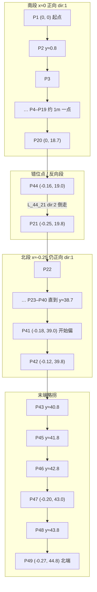

# Charging point selection process
_Exported on 9/26/2026 at 10:01:34 GMT+8 from Cursor (3.21.18)_

---

**User**

当前matrix如果有充电点和车辆的绑定配置，系统如何进行充电桩的选择，一个车如果绑定的是较远的充电桩，即使近处有充电桩也是会按配置的充电桩进行绑定，完成充电吗？

---

**Cursor**

我先在代码里查车辆与充电点的绑定配置，以及充电桩选择逻辑。

核对关键选择逻辑，确认绑定优先于就近原则。

**是的。** 配置了「充电点与机器人绑定」后，自动充电只会在该车绑定的充电桩里选，不会因为近处有空闲桩就改去近的。

### 选择流程（`ChargingManager`，策略为 `AUTO`）

1. 按电量从低到高处理需要充电的车  
2. 取该车地图上 **IDLE** 的充电桩  
3. 用场景配置 `cpRobotBinds` 过滤：只保留 **包含该车 ID** 且对应桩仍为空闲的绑定项  
4. 按 `priority` **从高到低** 分组；同优先级内用路径规划选 **代价最低（最近可达）** 的一个  
5. 预留该桩并生成充电任务，完成充电  

近处未绑定的空闲桩 **不会进入候选集**，因此不会被选中。

### 对你场景的直接结论

| 情况 | 行为 |
|------|------|
| 绑定的是较远桩，且该桩空闲 | 去较远绑定桩充电，忽略近处未绑定空闲桩 |
| 绑定桩被占用 / 不可达 | **不会**改用未绑定的近处桩；可能等，或在开启「充电让位」时让占用车让位 |
| 该车不在任何 `cpRobotBinds` 里 | 这条自动分配路径不会给它派桩 |

绑定配置在场景配置的「充电点与机器人绑定」里维护（`pointName` + `robotIds` + `priority`）。

---

**User**

所以配置一台车和多个充电点也是能支持并在多个可用的充电点里面选最近的的，是吧？

---

**Cursor**

是的，一台车可以绑定多个充电点；同优先级时会在可用的绑定桩里选最近的。我再确认一下跨优先级时的行为。

**对。** 一台车可以出现在多个充电点的绑定里；系统只会在这些绑定且当前空闲（IDLE）的桩里选。

补充一点优先级：

- **同 `priority`**：在这几个可用绑定桩里做多目标路径规划，选代价最低（最近可达）的那个  
- **不同 `priority`**：先试更高优先级那一组；只有这一组都规划失败，才会落到更低优先级

所以要「多个绑定桩里永远选最近」，把它们设成相同优先级即可。

---

**User**

这里的优先级是车辆还是充电桩？如何理解

---

**Cursor**

看一下绑定配置里 `priority` 的定义和用法，确认它是挂在充电点还是车辆上。

**既不是“车辆优先级”，也不是全局“充电桩等级”，而是挂在「某条绑定记录」上的优先级。**

一条绑定大致是：

| 字段 | 含义 |
|------|------|
| `pointName` | 哪个充电点 |
| `robotIds` | 哪些车可以用这个点 |
| `priority` | 这些车选桩时，这个点排第几 |

### 怎么理解

对**某一台车**来说：它出现在多条绑定里时，系统先按各条记录的 `priority` 从高到低试；**数字越大越优先**。

举例：车 A 绑定了 3 个桩：

| 充电点 | priority | 含义 |
|--------|----------|------|
| CP远 | 10 | 优先去这儿 |
| CP近 | 5 | 只有高优先级不可用/不可达时才考虑 |
| CP备 | 1 | 更低 |

即使 CP近 更近，只要 CP远 空闲且可达，仍会先去 CP远。

若三个桩 **priority 相同**，才在它们里按路径选最近。

### 它不表示什么

- **不是**“车 A 比车 B 优先抢桩”（车辆之间谁先派，是按需充电车辆的电量从低到高排的）
- **不是**充电桩自身的全局属性，只作用于这条「点 ↔ 车」绑定关系

一句话：**priority = 这台车（该绑定里的车）对这个充电点的偏好顺序。**

---

**User**

无充电桩和机器人的配置会自动选最近的充电桩充电，是吧？

---

**Cursor**

再核对一下：无绑定时是否会回退到「所有空闲桩里选最近」。

**不是。** 当前自动充电逻辑里，**没有「无绑定 → 全图空闲桩里选最近」的回退**。

- `cpRobotBinds` 为空，或某台车不在任何绑定里：候选集合是空的，不会派充电任务  
- 日志常见：`not bind idle or used charging stage!`  
- 只有配置了绑定，才会在**该车绑定且空闲**的桩里按优先级 / 同优先级最近去选  

这和闲置停车不同：闲置点绑定 miss 时可以 fallback 到地图上所有空闲停车点；充电这边没有同等逻辑。

所以要自动充电，需要给车配上充电点绑定（一台车绑一个或多个都可以）。

---

**User**

调度前端的【清除错误】按钮具体如何使用？有什么用？

---

**Cursor**

我先在调度前端和相关 API 里查「清除错误」按钮的实现与作用。

**「清除错误」是对选中机器人下发「清故障」指令，不是清调度任务/订单错误。**

### 怎么用

入口在 **机器人管理** 页顶部工具栏（需 `robot:edit` 权限）：

1. 勾选一台或多台机器人  
2. 点红色 **清除错误**  
3. 前端调用 `POST /Core/ClearErrors`，带上选中车的 `vehicleIds`  
4. 成功/失败以右上角提示为准（PC 端当前无二次确认）

### 有什么用

调度 Core 对每台车调用 `clearVehicleError`：向车端发清错命令，并等约 2 秒看车是否回成功。

| 车型协议 | 实际动作 |
|----------|----------|
| Sineva | `CMD_CLEAR_ERROR` |
| 仙工 SEER | `ROBOT_CONFIG_CLEARALLERRORS_REQ`（清全部错误） |
| 仿真车 | 直接当成功，不真下发 |

用途：**让车端尝试复位/清除当前故障告警**（急停、碰撞、定位异常等车端可清的 error）。车本体仍存在硬故障时，清完还可能马上再报。

### 不会做什么

- 不会取消任务、改订单、清调度侧任务错误  
- 不会清储位状态（那是旁边的 **清除储位状态**）  
- 不会放行（那是 **放行**）

---

**User**

查一下logs/core-20260818.log中在9:45左右测试清除错误，即调度通过/api/matrix/Core/ClearErrors
调用车端清除错误的接口，排查：1.调度是否有发post请求的日志，有的话指出位置 2.调度的处理逻辑确认

---

**Cursor**

先在日志里定位 9:45 附近的 `ClearErrors` 调用，再对照调度侧处理链路。

日志约 256MB，先按 9:45 和 `ClearErrors` 关键字筛相关行。

9:49 有一次 `ClearErrors`，接着看 Core 是否真下发、以及 2 秒等待为何失败。

核对 Core 在 2 秒等待结束时有没有失败日志。

这次测试实际发生在 **09:49:08**（不是 09:45）。9:45 前后是接单、报警，没有 ClearErrors。

### 1. 有没有 POST 日志

**`core-20260818.log` 里没有 HTTP POST。**  
`/api/matrix/Core/ClearErrors` 是 **Engine** 接口，Core 是被 Engine 用 SWIG 直接调 `clearErrors()`，不会走 Core 的 `/api/clearError`。

| 位置 | 内容 |
|------|------|
| `logs/engine-20260818.log` **第 852 行** | `[Core.ClearErrors] 开始执行，参数: {"vehicleIds":["S8004#"]}` |
| 同上 **第 853 行** | `业务逻辑错误 \| Path: /api/matrix/Core/ClearErrors [POST]` |
| `logs/core-20260818.log` **第 2354196 行** | `[09:49:08.224] api call clearErrors` |

Engine 这次 POST **有进来**，2 秒后失败，异常文案是 `失败`（Core `code=1`）。

Core 对车端下发的痕迹在 **第 2354197 行**：

```
[09:49:08.227] Sent:33 bytes to:10.1.11.137:5005
```

心跳是每 10 秒一次 33 字节（09:49:04 / 09:49:14），这次夹在中间，且心跳会马上回 **37 字节 ACK**，清错这次 **没有对应的 37 字节回复**。

全程没有 `vehicle:S8004# clear error result:...`，也没有 `api call clearErrors completed`（失败会提前 `return`）。

### 2. 调度处理逻辑（与这次日志一致）

```
前端 POST /api/matrix/Core/ClearErrors
  → Engine CoreController.ClearErrors
  → CoreApplication::clearErrors
  → VehicleManager::clearVehicleError("S8004#")
       sendClearError()  →  Sineva CMD_CLEAR_ERROR → TCP 10.1.11.137:5005
       nanosleep 2s
       getResponseResult(RESPONSE_CLEAR_ERROR)
```

本次：车 **S8004#** 当时 `connected/loggedIn=true`，`state:FAIL`，正在充电任务。调度 **已经把清错包发出去了**，但 2 秒内车端没有 `RESPONSE_CLEAR_ERROR`，Core 判定失败，Engine 把 POST 打成业务错误。

结论：**调度侧 POST 和下发都发生了；失败点在等车端 ACK 超时，不是没发请求。**

---

**User**

从当前日志可以排查出调度是否有发CMD_CLEAR_ERROR的车端接口吗？

---

**Cursor**

日志里 TCP 只记了字节数、没解出命令名。我对照发送路径，确认能不能推断就是 `CMD_CLEAR_ERROR`。

**不能从日志直接读出 `CMD_CLEAR_ERROR` 这几个字。** TCP 只记了 `Sent:33 bytes`，没有命令类型、也没有包内容。

能确定的是：

1. Core 进了清错接口：`core-20260818.log` 第 **2354196** 行  
   `[09:49:08.224] api call clearErrors`
2. 代码上这条路径必然会 `sendClearError()` → `buildClearError()` → `CMD_CLEAR_ERROR` → `10.1.11.137:5005`
3. **3ms 后**有一次不在心跳节奏上的 33 字节发送（第 **2354197** 行，`09:49:08.227`）  
   心跳是 `09:49:04` / `09:49:14`，各带回 37 字节 ACK；这次没有对应 ACK

所以：**可以推断调度已经把清错包发出去了，但日志无法解码确认包内就是 `CMD_CLEAR_ERROR`。** 心跳、清储位等无附加字段的 COMMAND 帧也是 33 字节，单看长度分不开。

要坐实，需要在 `sendData`/`buildClearError` 打命令名或 hex，或抓 5005 口对照 protobuf。

---

**User**

增加日志把这种不常调用的接口具体命令名也打印到日志中吧，要显示CMD_CLEAR_ERROR接口被调度的日志，命令名要现式的打印出来

---

**Cursor**

先看清错和下发命令的现有路径，再在合适位置把 `CMD_CLEAR_ERROR` 等非常用命令名打进日志。

在下发路径显式打出 `CMD_CLEAR_ERROR` 等非常用命令名，心跳和运动任务不打，避免刷屏。

已加上。之后清错会在日志里**显式出现 `CMD_CLEAR_ERROR`**，心跳/运动任务不会刷。

再测一次「清除错误」，Core 日志应类似：

```
api call clearErrors command:CMD_CLEAR_ERROR
vehicle:S8004# dispatch CMD_CLEAR_ERROR
vehicle:S8004# session:CONTROL dispatch CMD_CLEAR_ERROR bytes:33
Sent:33 bytes to:10.1.11.137:5005
vehicle:S8004# CMD_CLEAR_ERROR ack:false
```

同类非常用接口也会打命令名：`CMD_CLEAR_STORAGE`、`CMD_APPLY_CONTROL_RIGHT`、`CMD_RELEASE_CONTROL_RIGHT`、`CMD_SET_DI`、`CMD_SET_DO`。

---

**User**

解释一下前端页面放行机器人按钮按下/api/matrix/Task/ReleaseVehicle/{vehicleId}
时的处理逻辑，算法的主要处理有哪些？

---

**Cursor**

先顺着 `/api/matrix/Task/ReleaseVehicle` 从前端点到调度核心，理清放行按钮的处理链路和主要算法。

**这条接口不走 Core 调度算法，也不会给车下发运动/清错命令。** 它只解开任务模板里「等待放行」块的阻塞。

### 前端怎么点

机器人管理页 **放行** → 取选中车的 **第一台** `vehicleId` → `PUT /Task/ReleaseVehicle/{vehicleId}`（完整路径即 `/api/matrix/Task/ReleaseVehicle/{id}`）。

### 处理链路

```
前端放行
  → TaskController.ReleaseVehicle
  → TaskAppService.ReleaseVehicleAsnyc
       找出 Vehicle == vehicleId 的全部任务缓存
       把每条缓存的 WaitReleaseVehicle 置为 null
```

代码就是清标志，没有路径规划、交通管制、车端协议。

### 「算法」实际是任务块等待

真正卡住车的是模板动作 **WaitReleaseRobot（等待放行）**，必须放在 **CreateOrder 运单子块**里。

1. 用当前运单 ID 调 Core `QueryOrder`，拿到这张单绑定的 `VehicleId`
2. 写入 `_taskCache.WaitReleaseVehicle = 该车 ID`
3. 每 100ms 轮询该字段：
   - `waitTime > 0`：等到放行、任务取消，或超时（超时只打 warning，**仍会继续往下走**）
   - `waitTime = 0`：**一直等到放行或任务取消**
4. 你一点放行，对应任务的 `WaitReleaseVehicle` 变 `null`，循环退出
5. 该块标 Completed，后续动作块继续执行

JS 脚本的 `ReleaseRobot` 走同一套 `ReleaseVehicleAsnyc`。

### 和 Core「放行」的区别

| | 前端这个放行 | Core 交通管制 |
|--|--|--|
| 作用 | 解开任务模板人工等待 | 路径冲突时分段放行路权 |
| 是否调车端 | 否 | 会发路径/绕行等 |

所以：**按钮只通知 Engine「这台车不用再等了」；车接下来动不动，取决于等待块后面还有什么动作（去某点、充电等）。** 任务没跑到 WaitReleaseRobot、或车 ID 对不上缓存，点了等于没效果。

---

**User**

logs/LogFile/下是最新一个项目的新部署测试日志，现场发现车辆的路径下发是一段一段的，看起来很不连贯，协助排查定位问题

---

**Cursor**

先看 `logs/LogFile/` 里的部署测试日志，对照路径下发与交通管制分段放行逻辑定位不连贯的原因。

日志已显示全程 `limitIndex:20` 却按 3 段窗口滚动下发。接着核对前瞻策略为何没把直线走廊一次发完。

**不是规划断了，是交管滚动下发在用默认「超前 3 段」窗口。** 全程 `limitIndex:20`（没有让行卡住），规划是完整的 21 段，但每次只给车补 1 段，车看起来就会一顿一顿。

### 日志在说什么

`Robot01` 一次 MOVE（`14:13:18` 起，`P1 → … → P21`）：

| 时刻 | 下发 | sendIndex | stepId | limitIndex |
|------|------|-----------|--------|------------|
| 14:13:18 | 首包 3 段路 + 1 次旋转（pathSize=4） | 2/20 | -1 | **20** |
| 14:13:41 | 只发 `P4-P5`（pathSize=1） | 3/20 | 1 | 20 |
| 14:13:51 | 只发 `P5-P6` | 4/20 | 2 | 20 |
| 之后约每 10s | 再补 1 段 | … | … | 20 |

规划里一直是完整走廊；`dispatchBatch` 却经常只有 1 条。本文件 53 次 `doStartMovement` 里，大约 34 次是 `pathSize:1`。单车、无冲突，不是多车抢路。

### 原因

`applyRoadLines` 默认：**相对当前 `stepId` 最多超前 3 段，每拍最多 5 段。**  
有「直线无冲突走廊一次发完」的放宽，但要求 `nextSendIndex ~ limitIndex` **整段都直**。

这次末段是 `P44-P21 [dir:2]`（倒走/反向），前面都是 `dir:1`。整段一判就失败，退回超前 3 段。车每走 1 点只再补 1 段，车端路径一直只剩 1～2 个点，容易减速、停一下再走。

相关逻辑：

```68:89:core/module/traffic/include/traffic/route_dispatch_policy.hpp
/// When the pending corridor up to limitIndex is straight ...
if (!isStraightCorridorRange(roads, nextSendIndex, limitIndex)) {
    return {defaultPassed, defaultMaxApply};  // 3 / 5
}
```

单测也写了：**中途改 direction 就保持默认 3 段前瞻。**

### 结论

- 规划正常，交管也没让行（`limitIndex` 一直是终点）。
- 现场「一段一段、不连贯」= 默认滚动窗口 + 末段反向导致无法整走廊下发。
- `passedRoadLineCount_` / `maxApplyRoadLineCount_` 写死 3/5，场景里改不了。

建议改法：前瞻只取从 `nextSendIndex` 起的**最长连续直行前缀**，不要用整条到 `limitIndex`（末段转弯/倒车不应把前面直线也拆碎）。临时可把超前段数加大，车端会顺很多，但冲突场景会一次占更长路。

---

**User**

根据日志大致画一下当前环境的地图，大致标一下它们的点位和关系

---

**Cursor**

从日志里把点位、连线和坐标抽出来，再画一张当前环境的示意地图。

场景是 **BOE_B4 / `b4map.roadnet`**：一条近南北向的窄走廊，点大约每 1m 一个。坐标来自车上报位置（单位 m，Y 增大为北）。

### 总览（南 → 北）



俯视（X 向右，Y 向上；走廊实际宽度很小，X 几乎贴在 0）：

```
 Y↑  ~45m
     P49 •
     P48 •
     P47 •
     P46 •  P45 •  P43 •
                    P42 • P41 •
                    P40 …
                    P21 •     ← 北段，略偏西 x≈-0.25
                    P44 •     ← 错开的过渡点
                    P20 •     ← 南段结束 x≈0
                    …
                    P2  •
     0               P1 •  南端起点
        X →
```

### 点和路的关系

| 段 | 点 | 路 | 方向 |
|----|----|----|------|
| 南直线 | P1→P20 | `L_1_2` … `L_19_20` | dir:1 正向 |
| 过渡 | P20→P44 | `L_20_44` | dir:1 |
| **反向** | P44→P21 | `L_44_21` | **dir:2** |
| 北直线 | P21→P42 | `L_21_22` … `L_41_42` | dir:1 |
| 末端 | P42→P43→…→P49 | `L_42_43` 等 | 日志里有往返 |

日志里测到的完整任务就是：

- `P1 → … → P20 → P44 → P21`（南段 + 反向进 P21）
- `P21 → … → P42 → P43`（继续向北）

P43 之后到 P49 也在图里，但这次 MOVE 没一直跑到头。车基本贴着 **Y 轴一条线**走，不是网格。`P44` 插在 P20/P21 中间偏西一点，`L_44_21` 倒走，所以整条走廊无法按「全程直线」一次下发。

---

**User**

实施当前改法：前瞻只取从 nextSendIndex 起的最长连续直行前缀，不要用整条到 limitIndex（末段转弯/倒车不应把前面直线也拆碎）。临时可把超前段数加大，车端会顺很多，但冲突场景会一次占更长路。同时注意如果是非直线若是平滑连接不需要点位旋转也要一次性下发多段，没必要一段段路下发

---

**Cursor**

先看前瞻判定和单测，再改成从 `nextSendIndex` 起取最长平滑前缀，并放宽无需旋转的连接。

开始改前瞻：从 `nextSendIndex` 起取最长平滑前缀（贝塞尔/直线同向相连即算平滑），末段倒车不再拆碎前面的路。

已按最长平滑前缀下发，末段倒车不会再把前面走廊拆成一段一段。

### 行为

- 从 `nextSendIndex` 起，把**同向、首尾相连、非原地旋转**的 LINE/BEZIER 一次发完  
- 贝塞尔弯道只要不用点位旋转，也整段下发  
- 倒车/方向翻转只切断前缀，前面直线仍一批发出  
- 默认超前从 3/5 提到 **8/16**（前缀算不出时才用）

对照这次 BOE：`P1→…→P44` 会一次下发，`P44→P21`（dir:2）下一拍再发。

`unit_tests_route_dispatch_policy`：28 项断言全部通过。

---

**User**

这里3/5或者8/16的参数设置成core的路径规划参数配置，默认8/16吧，使这来两个参数类似于vehicleRotateFactor的配置一样在【路径规划设置】中


---

**Cursor**

先对照 `vehicleRotateFactor` 在路径规划设置里的配置链路，再把 8/16 两个参数接到同一处。

把 8/16 接到和 `vehicleRotateFactor` 相同的路径规划配置项，运行时从场景参数读取。

已接到 **路径规划设置**，和 `vehicleRotateFactor` 同一套配置。默认 **8 / 16**。

| 参数 | 界面名称 | 含义 | 范围 |
|------|----------|------|------|
| `passedRoadLineCount` | 超前下发路段数 | 相对当前 step 最多超前几段 | 1–128 |
| `maxApplyRoadLineCount` | 单次最大下发路段数 | 一拍最多下发几段 | 1–128 |

重启 Engine 后会从默认配置补进现有 `systemParams.json`。之后可在参数配置 → 路径规划设置里改，交管下发会即时按新值读。未配置时仍用 8/16。

---

**User**

基于当前matrix-core的逻辑解答机器人相关的所有的 读取、下载、导出等，是否需要控制权？

---

**Cursor**

梳理 matrix-core 里机器人相关的读取/下载/导出逻辑，并核对是否校验控制权。

**结论（按当前 matrix-core）：机器人「读列表 / 下载地图 / 上传地图 / 切图」等读写接口不校验控制权；控制权只卡调度派单和路径下发。**

### 不需要控制权（Core 只要求已登录 `loggedIn`）

| 能力 | Core API | 控制权检查 |
|------|----------|------------|
| 读车端地图列表 | `queryMapList` | 无 |
| 从车下载地图 | `downloadMap` | 无 |
| 上传地图到车 | `uploadMap` | 无 |
| 车端切图 | `switchMap` | 无 |
| 车辆状态 / IO / 充电参数 | `vehicleStatus` / `ioInfo` / `queryChargingParam` | 无（状态本来就带 `lockInfo`） |
| 清错 / 清储位 | `clearErrors` / `clearStorages` | 无 |
| 路网 / 点云（场景文件） | `queryLogicalMap*` / `queryPointCloud*` | 无关车、无关控制权 |
| 场景导入导出 | HTTP `uploadScene` / `downloadScene` | 无关车 |

地图相关实现里只拦「车不存在 / 未登录」，例如：

```2118:2123:core/src/core_application.cpp
        if (!vehicle->loggedIn()) {
            failed(response, common::Code::VEHICLE_LOGOUT);
            return response;
        }

        auto mapList = application.vehicleManager_->sendQueryMapList(vehicleId);
```

`downloadMap` / `uploadMap` / `switchMap` 同样如此。

### 需要控制权（MRCS）

| 能力 | 说明 |
|------|------|
| 任务分配 / 接单派块 | 非 MRCS 不派 |
| 交管路径下发 / 推车让位 | 只对可控车发运动 |
| GoTo 指定导航 | 入参要求 MRCS |
| 丢控制权 | MRCS→非 MRCS 会暂停任务并取消移动 |

也就是说：**“干活、跑路”要控制权；“读/下/传地图、看状态”在 Core 侧不要。**

### 注意

1. Core **不会**因为没控制权拒绝地图读写；车端固件（尤其仙工）仍可能自己要求锁控，那是车端行为，不是 Matrix 校验。  
2. 前端/任务里「无控制权」报警（如 8911100）多半指**动作块/调度执行**，不是地图下载失败。  
3. 「导出」任务记录、报警、日志等在 Engine，不经过车端，更不涉及控制权。

---

**User**

/logs/listEmpty/下是最新项目在【加载地图】页面时报错：机器人列表地图为空，机器人：{ 0 }，这里想修复两个问题：1. 为什么会报错，不能成功？2.机器人为什么通配符输出是{ 0 } ，括号里为什么不是robotId?

---

**Cursor**

先查 `logs/listEmpty` 里的报错日志，再对照「加载地图」和「地图列表为空」相关代码。

结论已清晰：占位符是没传 `vehicleId`；地图列表是发出 `REQUEST_MAP_LIST` 后未收到响应。开始修复占位符，并加强查询逻辑与日志。

两个问题的根因和已做修改如下。

### 1. 为什么报「地图列表为空」

日志里三次「加载地图」都打到了 `Robot01`（`172.18.1.101:5005`）：

- Core 发出了 `REQUEST_MAP_LIST`（`Sent:31 bytes`）
- 之后 **没有** 出现 `RESPONSE_MAP_LIST` / `vehicle:xxx map name:` 日志
- 车仍在线且已加载 `B40818.roadnet`，所以更像是 **查询超时/未应答**，不是车上真的没有地图

原逻辑是：发请求后固定睡 1s，看 `mapListResult_`；超时也统一当成空列表，抛 `9910807`。

### 2. 为什么是 `{ 0 }` 而不是 robotId

文案模板是：`机器人地图列表为空，机器人：{0}`。

调用却是：

```cpp
failed(response, common::Code::VEHICLE_MAP_LIST_NONE);  // 没传 vehicleId
```

`messageParams` 为空时不会替换 `{0}`。Engine 再按 `Alarm_9910807` 本地化时同样没有参数，于是界面就原样显示占位符（你看到的 `{ 0 }` 就是未替换的 `{0}`）。

---

### 已修复

| 点 | 改动 |
|---|---|
| 占位符 | `failed(..., {vehicleId})`；`QueryMapListResponse` 增加 `messageParams` |
| Engine | `LocalizeDescription`：无参数且模板仍含 `{0}` 时，回退用 Core 已填好的 `message` |
| 查询 | 发送前清状态；等待改为最多 3s 轮询；超时/成功打明确日志；修正 `mapList_` 锁不一致 |

重新编译 Core + Engine 后再点「加载地图」：若仍失败，日志应出现 `sendQueryMapList timeout ... no RESPONSE_MAP_LIST`，并显示 **机器人：Robot01**。若持续超时，需要查车端是否应答 `REQUEST_MAP_LIST`（场景里配置了 `mapPort:5006`，地图会话当前是关掉的，也可能相关）。

---

**User**

先取消对engine下cs代码的改动，只修复core部分的代码逻辑

---

**Cursor**

撤销 Engine 下的 C# 改动，只保留 Core 侧修复。

已撤销 `AlarmMessageSupport.cs` 的改动。当前只保留 Core 侧修改：

- `core_application.cpp/hpp`：失败时传入 `vehicleId`，响应增加 `messageParams`
- `vehicle.cpp` / `vehicle_manager.cpp`：查询地图列表的等待、状态清理与日志

说明：Core 的 `response.message` 会正确带上 robotId；若 Engine 仍用空的 `MessageParams` 重新本地化 `Alarm_9910807`，界面上 `{0}` 可能还会出现，需要以后再改 Engine 或重新生成 SWIG。

---

**User**

重新生成一下SWIG？先保证core的处理逻辑没问题以及在不改engine代码的情况下需要时也能正确显示robotId吧

---

**Cursor**

先查仓库里 SWIG 的生成方式，再重新生成，让 `messageParams` 能传到 Engine，从而在不改 Engine 代码的情况下正确显示 robotId。

SWIG 路径写错导致生成失败，正在检查并修复文件状态。

SWIG 已重新生成，`libmatrix_core.so` 与 `Sineva.Matrix.Core` 均编译通过。未改 Engine 业务代码（`AlarmMessageSupport` 等）。

### 生成命令
```bash
cd core/src
swig -c++ -csharp -namespace Sineva.Matrix.Core \
  -outfile ../../engine/Sineva.Matrix.Core/api/core.cs \
  -o core_application_wrap.cxx \
  -I. \
  core_application.i
```

### 本次产物
- `core/src/core_application_wrap.cxx`
- `engine/Sineva.Matrix.Core/api/core.cs`

`QueryMapListResponse` / `DownloadMapResponse` 已暴露 `messageParams`。Core 失败时写入 `{vehicleId}` 后，现有 Engine 的 `ValidateResponse` → `LocalizeDescription(..., MessageParams, ...)` 会把 `Alarm_9910807` 格式化成带 robotId 的文案。

部署时请同步更新本次的 `libmatrix_core.so` 与新 `core.cs`（或整包 Engine）。

---

**User**

排查logs/buzou/core-20260821.log当前有任务长时间不走（不执行移动指令）的原因

---

**Cursor**

先看 `logs/buzou/core-20260821.log` 里任务与移动下发相关记录，定位长时间不走的原因。

任务长时间不走，主因是 **Robot01 处于 MANUAL（手动模式）时交通管制拒绝下发移动指令**；随后又丢了 MRCS，进一步拖到约 6 分钟才真正开跑。

### 相关任务
- 运单：`ef3037ee58c34b628eee47d84f08fdfb`（MOVE，external：`da655fdb...`）
- 动作块：`52ae1656f5ec4c9585983301258973cc`
- 车：`Robot01`（`Robot02` 全程离线）

### 时间线

| 时间 | 事件 |
|------|------|
| 15:04:59 | `addOrder` 创建运单 |
| 15:05:00–07 | 分配失败：`no available vehicles`（当时 `order take:false`，且车为 MANUAL） |
| 15:05:08 | `modifyVehicleOrderTaskState` 后接单成功，绑到 Robot01 |
| 15:05:09–10 | 块进交通管制，路径已规划（约 68 段，`P128→...`），order/block 变 RUNNING |
| **15:05:10–41** | 反复：`can not send command to vehicle, control mode is manual.` → **未发移动指令** |
| 15:05:42 | 控制权变 `RTT or NONE`，仍 MANUAL |
| 15:05:42–15:11:17 | 大量 `vehicle no control right` / `no available vehicles to be dispatched` |
| 15:10:58 | 模式切回 `AUTO`，但仍无 MRCS |
| 15:11:18 | 重新拿到 MRCS |
| **15:11:20** | 首次下发移动：`pathSize:89 roadSize:68`，`new movement task result:true`，进入 RUNNING |

### 根因（按影响）
1. **主因**：`controlMode:MANUAL` 时，`applyRoadLines` 直接不下发（日志约 32 次）。路径已算好，车仍停在 `P128`。
2. **加重**：约 15:05:42 丢失 MRCS，AUTO 恢复后仍要等控制权回来才发指令。
3. **次要**：创建后约 9 秒 `order take:false`，分配被挡；`Robot02` 离线无备用车。

### 结论
不是规划失败，而是 **手动模式下调度故意不发移动命令**；等切回 AUTO 且重新拿到 MRCS 后才开始走。现场应确认为何 Robot01 长时间 MANUAL（约 14:57:55 起），以及中途 MRCS 为何被释放。

---

**User**

15:11:20首次下发移动：pathSize:89 roadSize:68，new movement task result:true，进入 RUNNING  当前最近时间已经是auto模式，拿到控制权了吗？15:17还没有走是什么原因？

---

**Cursor**

接着查 15:11:20 之后到 15:17 的状态：控制权、模式、路径下发与实际是否在走。

是的：**15:11:20 下发时已经是 AUTO，并且已拿到 MRCS。**

证据：
- `15:11:18` `apply control right result:true` → 控制权成功
- 车状态：`controlRight:MRCS` + `controlMode:AUTO`
- `15:11:20` `doStartMovement` / `pathSize:89 roadSize:68`，车回 `new movement task result:true`

### 那为什么到 15:17 还不动？

之后这 6 分钟里，**调度侧没有再挡**：一直是 `MRCS + AUTO + RUNNING`，运单也是 `RUNNING`。交通侧路径已全量下发：`send:67 / limit:67 / total:68`。

但车体位置几乎不变：

| 时间 | 位置 | step |
|------|------|------|
| 15:11:20 | P128 (0.67, 147) | -1 |
| …一直到 15:17:25 | 仍是 P128 (0.67, 147) | 一直 -1 |

说明：**Core 已下发且车已 ACK，但车没有沿路径真正执行**（`step` 从未离开 `-1`，`localPath size` 也一直是 0）。  
下发瞬间还闪过约 1–2 秒 `error:true`（随后变回 false），更像车端接了任务却没跑起来。

### 结论
- 15:11:20：**有 AUTO、有控制权，调度下发成功**
- 15:17 仍不走：**不是 Matrix 没发指令 / 没控制权**，而是 **Robot01 收令后未产生位移**（需查车端导航/任务执行、报警、定位或现场急停/挡停等）

---

**User**

指出调度发送指令的日志和车端回复收到的日志

---

**Cursor**

对应日志如下（`logs/buzou/core-20260821.log`）：

### 1. 调度侧发送移动指令

```text
[15:11:20.022] vehicle_command_sender.hpp doStartMovement
  vehicle:Robot01 yaw:1.553, travelPose targetYaw:1.57079... sourceYaw:1.558...

[15:11:20.027] vehicle_command_sender.hpp doStartMovement
  vehicle:Robot01, byteSize:8772, pathSize:89 roadSize:68

[15:11:20.027] tcp_client.hpp
  Sent:8809 bytes to:172.18.1.101:5005

[15:11:20.028] route_dispatch_log.hpp
  [route] [dispatch] vehicle:Robot01 ... sendIndex:67/67 ... limitIndex:67 taskType:MOVE ...
```

含义：业务层组装移动任务 → TCP 把约 8.8KB 路径帧发到 Robot01（`172.18.1.101:5005`）。

---

### 2. 车端回复「已收到 / 执行结果」

```text
[15:11:20.067] tcp_client.hpp
  Received:37 bytes

[15:11:20.067] vehicle.cpp parseSinevaControlResponseResult
  vehicle:Robot01 new movement task result:true
```

含义：收到车端 37 字节应答，解析为 `RESPONSE_NEW_MOVEMENT_TASK`，`result:true`（协议层确认接收成功）。

---

对照：同一时段申请控制权也是「发 33 字节 → 收 37 字节 → `apply control right result:true`」（约 `15:11:18.218` / `15:11:18.221`）。

---

**User**

这些调度发往车端的指令从日志中怎么查看其是否回复了ack，日志格式和具体内容发一下爱

---

**Cursor**

结合代码里的发送/应答日志格式，说明如何从日志判断是否收到 ACK。

从 Core 日志看「发令 → 车端 ACK」，按两层看：**TCP 收发包** + **业务应答解析**。业务层 `result:true/false` 才是真正的协议 ACK。

### 怎么对上

1. 先找**发送**（同秒、同车 IP）
2. 再找紧随其后的 **`vehicle:{id} … result:`**
3. `result:true` = ACK 成功；`result:false` = 车端回了但失败；**只有 Sent、没有对应 result** = 未收到可解析的 ACK（或超时）

---

### 日志格式

**TCP 层（所有指令通用）**
```text
[HH:MM:SS.mmm][I] [tcp_client.hpp ...] Sent:{N} bytes to:{ip}:5005
[HH:MM:SS.mmm][I] [tcp_client.hpp ...] Received:{M} bytes
```

**业务 ACK（解析后）**
```text
[HH:MM:SS.mmm][I] [vehicle.cpp parseSinevaControlResponseResult ...] vehicle:{robotId} {动作名} result:{true|false}
```

少数低频指令发送时还有命名日志：
```text
vehicle:{id} session:CONTROL dispatch {CMD_xxx} bytes:{N}
```
（如 `CMD_CLEAR_ERROR`、`CMD_APPLY_CONTROL_RIGHT`；移动任务通常没有这行，靠 `doStartMovement` + `Sent:`）

---

### 实例（buzou 日志，移动任务）

**发送：**
```text
[15:11:20.027][I] [vehicle_command_sender.hpp doStartMovement 268]
  vehicle:Robot01, byteSize:8772, pathSize:89 roadSize:68

[15:11:20.027][I] [tcp_client.hpp operator() 83]
  Sent:8809 bytes to:172.18.1.101:5005
```

**车端 ACK：**
```text
[15:11:20.067][I] [tcp_client.hpp operator() 262]
  Received:37 bytes

[15:11:20.067][I] [vehicle.cpp parseSinevaControlResponseResult 232]
  vehicle:Robot01 new movement task result:true
```

**申请控制权（对照）：**
```text
[15:11:18.218] Sent:33 bytes to:172.18.1.101:5005
[15:11:18.221] Received:37 bytes
[15:11:18.221] vehicle:Robot01 apply control right result:true
```

---

### 常用 ACK 文案对照

| 指令 | ACK 日志关键字 |
|------|----------------|
| 新移动任务 | `new movement task result:` |
| 取消移动 | `cancel movement task result:` |
| 暂停/继续 | `pause movement task result:` / `continue movement task result:` |
| 申请/释放控制权 | `apply control right result:` / `release control right result:` |
| 清错 | `CMD_CLEAR_ERROR result:` |
| 清储位 | `clear storage result:` |
| 切图/上下载图 | `switch map result:` / `upload map result:` / `download map result:` |

检索示例：
```bash
rg 'doStartMovement|Sent:.*172\.18\.1\.101|new movement task result|apply control right result' core-xxx.log
```

说明：`Received:37 bytes` 常见于短应答帧；心跳/状态包更大（如 276/310）。**以 `vehicle:Robot01 … result:` 为准**，不要只看 `Received` 字节数。

---

**User**

当前Matrix系统前端显示的在线机器人数量的数据更新好像延迟非常高，已经下线的机器人还是计数在线状态，确认这部分更新逻辑并解释此现象发生的原因

---

**Cursor**

先查前端在线机器人数量的数据来源与推送/刷新路径。

前端在线数**本身几乎不延迟**；慢的是 Core 把车判定为「离线」的时机。

### 更新链路

```text
Core vehicleStatus()
  → connectionStatus = simulation ? true : loggedIn()
Engine RobotsStatusIngestTimer (约 100ms 拉一次)
  → RobotsStatusDataCache
Engine RobotsStatusPushTimer (默认 robotsStatusPushIntervalMs=100)
  → WS /ws/robotsStatus
webUI App.vue → store.setAgvQueue(data)
页脚 / RobotOnlineStatus：filter(connectionStatus === true)
```

前端统计（页脚与右上角一致）：

```42:47:webUI/src/layout/tabbar/setting/components/RobotOnlineStatus/index.vue
/** 在线机器人数量：严格按照 connectionStatus === true 判断 */
const onlineCount = computed(() => {
  return robotList.value.filter(
      item => item?.connectionStatus === true
  ).length
})
```

Core 赋值（关键）：

```1062:1062:core/src/core_application.cpp
data.connectionStatus = item->simulation() ? true : item->loggedIn();
```

断连时才会清登录态：

```1329:1338:core/module/domain/src/vehicle.cpp
void Vehicle::handleControlSessionConnection(bool connected) {
    if (!connected) {
        connected_.store(false);
        ...
        loggedIn_.store(false);
        setState(VehicleState::OFFLINE);
```

---

### 为何「已经下线还算在线」

| 环节 | 延迟 | 说明 |
|------|------|------|
| WS 推送 | ~100ms | 默认很快，一般不是主因 |
| 前端计算 | 即时 | 只看最新一帧 `connectionStatus` |
| **TCP 断连发现** | **可到约 90s** | 主因 |

TCP Keepalive（Linux）：

```343:351:core/module/common/include/communication/tcp_client.hpp
int idle = 60, interval = 10, count = 3;
// TCP_KEEPIDLE / TCP_KEEPINTVL / TCP_KEEPCNT
```

车断电、拔网、无 FIN 的半开连接时：约 **60s 空闲 + 3×10s ≈ 90s** 后 OS 才报错 → `onError` → `loggedIn=false` → `connectionStatus=false` → 在线数才减。

在这之前：TCP 仍「连着」、登录态仍 true，前端就会继续计在线。

另外两点：
- **在线 ≠ `connected`，而是 `loggedIn`**；语义是「控制会话已登录」，不是「人眼认为的车还在」。
- **仿真车** `connectionStatus` 恒为 `true`。

---

### 结论

现象主要来自：**前端用 `loggedIn` 当在线，而异常下线依赖 TCP Keepalive 发现，最坏约 1.5 分钟才翻成离线**；不是页脚统计算错，也不是 WS 故意拖很久。

若现场是优雅关连接（对端发 FIN），一般会马上变离线；若是拔电/断网，就会出现你看到的「长时间还算在线」。

---

**User**

如何优雅关连接（对端发 FIN）？

---

**Cursor**

结合 Matrix 与车端 TCP 会话，说明怎样才算「优雅关连接（对端发 FIN）」以及谁该发。

「优雅关连接」指的是 **TCP 正常四次挥手**：一方 `shutdown/close` 发出 **FIN**，对端 `recv` 读到 0 / `eof`，立刻走断连回调，而不用等 Keepalive（约 90s）。

在 Matrix 里，调度是 **客户端**，连的是车端 `ip:5005`。所以要让 Matrix **马上**发现下线，应是 **车端（对端）主动发 FIN**。

### 正确做法（车端）

关机 / 停导航 / 退出控制服务时，按顺序：

1. （可选）先发协议登出 `REQUEST_LOGOUT`，让调度清登录态  
2. 对已 accept 的控制连接执行：
   - `shutdown(SHUT_RDWR)` 或对端语言等价 API  
   - 再 `close(fd)`  
3. 不要直接杀进程、拔电、`kill -9`、断网——那些通常 **不发 FIN**，只能靠 Keepalive

车端伪代码：

```c
// 优雅退出控制端口会话
shutdown(sock, SHUT_RDWR);  // 发出 FIN
close(sock);
```

或进程正常退出且运行时会关 socket（正常 `exit` / 析构关闭 fd），一般也会发 FIN。

### Matrix 侧会怎样

车端发 FIN 后，Core 的 `async_read` 很快失败/读到 EOF → `handleError` → `onConnected(false)` → `loggedIn=false` → `connectionStatus=false` → 前端在线数马上减。

Matrix 自己关连接时也会发 FIN（`tcp_client.hpp` 里 `socket_.shutdown(...); socket_.close()`），但那是调度主动断开，不是「车已下线」的典型场景。

### 和不优雅的对比

| 车端行为 | 是否发 FIN | 前端在线何时变假 |
|----------|------------|------------------|
| `shutdown`+`close` / 正常退出服务 | 是 | 通常立刻（百毫秒级） |
| 拔电、断网、`kill -9`、进程崩溃未关 socket | 否 | 等 Keepalive ≈ 60+30s |

### 现场可怎么做

- **改车端固件/中间件**：停止服务前显式关 5005 连接（推荐）  
- **运维**：尽量正常停车载程序，而不是直接断电  
- **调度侧**：无法单靠「希望对端发 FIN」；半开连接只能缩短 Keepalive，或加应用层心跳超时（当前心跳失败未必会立刻清 `loggedIn`）

一句话：**优雅关连接 = 车端在下线时主动 `shutdown/close` 控制 TCP，让 Matrix 立刻收到 FIN；不是前端或 Engine 单独能完成的。**

---

**User**

logs/827/下是最近某项目的日志文件，core/conf/B40827.roadnet是路网地图，结合当前代码逻辑分析143->153->155->157->159->161->162这条直线车辆以90横移通过时超过两个点不能持续下发的问题，发现如果143->153这种只有一段横移的任务调度时可以正常驱动车辆移动的，但是如果目标点是143->153->155，那么车端会直接报错路径不连续，结合代码逻辑和日志地图文件爱你分析这段路径不能连续多段路径下发的原因，并提出修复方案。

---

**Cursor**

先对照 `logs/827/`、路网 `B40827.roadnet` 和当前下发策略，弄清 143→153→155 这段横移为何不能连续多段下发。

点位是东西向直线、车头朝北（90°横移）。接着查路段属性、下发拼接方式，以及日志里的不连续报错。

引擎在去 P153/P155 时反复报「路径不连续」。接着看这段横移是怎么拼进 `MovementTask` 的。

根因已经对上：车端 9090005 出在连续多段横移贝塞尔上，调度又按切向 0° 插了原地旋转。接下来会改航向计算，并在下发时把同向横移合成一条路径。

正在实现航向修正，并把连续横移路段合并为一条下发路径。

**P143→P153 单段能走、P143→P153→P155 起车端报 9090005「路径不连续」，是因为 Core 把横移走廊当成了“朝东直行”，在任务里插了朝向 0° 的原地旋转，又把多段贝塞尔一次性下发。** 车端允许「旋转 + 一段横移」，但不接受「旋转到 0° 后再接多段朝向 90° 的贝塞尔」。

## 地图上这条走廊在做什么

`B40827.roadnet` 里 P143…P162 都在 **y=165.5**，点位朝向 **dir=90°（北）**，x 向东递增。边是 `BezierPath`，`agvDirection: 90`，`extendedParameters.direction = "3"`（横移），几何切向 `inDeg/outDeg = 0`（东）。

也就是：**车身朝北，平移向东**，不是前进。

## 日志对得上

| 时间 | 任务 | Core 实际下发 | 车端 |
|---|---|---|---|
| 16:16:06 | P142→P141→P143→P153 | 两段北向贝塞尔 + **ROTATE rad:0（朝东）** + **一段** P143→P153 | ACK true，车到 P153 |
| 16:16:56 | P153→P161 | **ROTATE rad:0** + **四段** P153→P155→P157→P159→P161，`pathSize:5` | ACK true，约 0.5s 后 **9090005**，一直停在 P153（`step:-1`） |
| 16:20:11 | P153→P155 | ROTATE rad:0 + **一段** 贝塞尔 | 任务完成 |

`addRouteToControl` 在 P153 上算的是：

`source yaw ≈ 1.58（当前朝北）→ target yaw: 0（几何切向朝东）`

所以 `doStartMovement` 会插 `PATH_ROTATE rotate_angle=0`，后面每段贝塞尔的 `rotate_angle` 又是 `agvDirection=90°`。

## 根因（两层）

**1. 航向算错了。** `segmentVehicleHeadingYaw` 只认 FORWARD=切向、BACKWARD=切向+π，**不用 `agvDirection=90°`**。横移被当成朝东直行。

CARE 解析还读错了字段：地图是 `extendedParameters` + `"value":"3"`，代码读的是拼写错误的 `extendedParamters` + `int32Value`。90° 既不是 0 也不是 180，方向留在默认 FORWARD。

**2. 多段横移被平滑拼成一条运动任务。** `isSmoothDispatchJunction` 只看连通和 `direction`，横移走廊会被整段 lookahead 出去。车端对相邻 `PATH_BEZIER` 做连续性检查：前面旋转结束朝向 0°，后续贝塞尔 `rotate_angle=90°`，多段就会 9090005。单段没有贝塞尔–贝塞尔接点，所以能过。

## 已做的修复

1. **横移航向用 `agvDirection`**：90°/-90° 视为车身朝向，不再在 P153 插「转到 0°」。后退 180° 逻辑不变。  
2. **连续同向横移合成一条 `PATH_LINE`**（例如 P153→P161 只下发 P153→P161），车端不再看到多段横移贝塞尔。  
3. **横移与非横移不再拼在同一批**（P141→P143 前进不会和 P143→P153 横移拼在一起）。  
4. **CARE 同时解析 `extendedParameters` / `extendedParamters`**；enum `3` 保持 FORWARD，朝向仍走 `agvDirection`（不会把横移误标成后退）。

相关单测已过。现场应看到：P153→P161 不再出现 `addRotatePath rad:0`，而是一条 `LINE P153-P161`，`rotate_angle` 仍为 90°。

---

**User**

<timestamp>Friday, Aug 28, 2026, 4:19 AM (UTC+8)</timestamp>
<system_notification>
The following task has finished. If you were already aware, ignore this notification and do not restate prior responses.

<task>
kind: shell
status: success
task_id: 141976
title: Rebuild unit tests after parser fix
tool_call_id: call-bdf5466e-2380-4136-9214-f4ba877866c0-77
fc_2f762646-6a1a-96b5-9397-ec95127a7e3a_0
output_path: /home/wp/.cursor/projects/home-wp-Documents-Matrix/terminals/141976.txt
</task>
</system_notification>
<user_query>Briefly inform the user about the task result and perform any follow-up actions (if needed). If there's no follow-ups needed, don't explicitly say that.</user_query>

---

**Cursor**

单元测试已重新编译成功：`unit_tests_path_dispatch` 和 `unit_tests_route_dispatch_policy` 都已通过。

横移路径修复已合入当前代码。P143→P153→…→P162 这类连续横移会按车身 90° 下发，并合成一条直线，而不再在中间插入朝东的原地旋转。

---

**User**

P153-P161路径上实际是多个路径段，直接一条LINE P153-P161不会导致车端无法解析执行不了吗？

---

**Cursor**

这个担心成立：车端如果按地图边校验 `start_id/end_id`，合成一条不存在的 P153-P161 会无法执行。我先核对当前下发字段，再改成按真实路段下发。

会。车端地图只有 P153-P155、P155-P157 这些真实边，没有 P153-P161。合成一条 LINE 会带上不存在的 `start_id/end_id`，中间点也被跳过。改为仍按下发真实路段，只修正航向、不再插转到 0°。

会，这个风险是真实的，合成一条 `LINE P153-P161` 已经撤回。

车端协议里每段路径带 `start_id` / `end_id` 和起终点坐标。地图上只有 `P153-P155`、`P155-P157`、`P157-P159`、`P159-P161`，**没有** `P153-P161` 这条边。合成后会变成：

- 节点 ID 对不上车端路网  
- 跳过 P155 / P157 / P159  
- 各段限速、长度也被抹掉  

车端按地图边校验或匹配站点时，就可能无法解析、无法执行。

现在仍按真实路段下发：`P153-P155`、`P155-P157`…，类型仍是地图上的贝塞尔。改动只保留两处：横移用 `agvDirection=90°` 作为车身朝向，不再在 P153 插入转到 0° 的原地旋转；横移段不和前进/后退段拼在同一批。

P153→P161 一次任务里会是多段真实路径，但朝向全程 90°、几何首尾相接。现场日志应看到 `addLinePath P153-P155` … `P159-P161`，而**没有** `LINE P153-P161`，也没有 `addRotatePath rad:0`。

---

**User**

同时排查是不是在15:10左右1号车辆在405点位附近旋转两次的问题也同步得到了修复？

---

**Cursor**

先对 15:10 附近 1 号车在 P405 的旋转日志和该点路网朝向对一下，再判断这次航向修复是否覆盖。

**没有同步修好。** 15:10 在 P405 附近转两次，和 P143 横移是同一套下发逻辑，但触发原因不同，这次航向修改盖不住。

## 当时 Core 实际下了什么

15:09:52 任务是 Robot01 去 **P425**，路线经过 P403→P404→P405→P406。车还停在 P403（`step:-1`），Core 每秒换一条新运动任务：

| 时间 | 下发 | 含义 |
|---|---|---|
| 15:09:56 | `ROTATE rad:3141`（180°）+ P404→P405 | 先转到朝西，再后退向东 |
| 15:09:57 | `ROTATE rad:-1570`（-90°）+ P405→P406 | 再转到朝南，再往南走 |

车体 yaw 一直在 **-2.77（约 -159°）**，两次旋转都没转完就被下一条任务覆盖，所以会看到在 P405 附近连转两次。

## 和 P143 横移不是同一处算错

P405 一带地图本身就是折线，而且 **`agvDirection` 在变**：

- **P403→P404**：往北 0.3m，`agvDirection=90`，车身朝北  
- **P404→P405**：往东 5m，`agvDirection=180`，后退（车身朝西）  
- **P405→P406**：往南 0.3m，`agvDirection=-90`，车身朝南  

旧逻辑用切向算出的车身也是 90° → 180° → -90°，**和这次修的「横移误用切向 0°」不是一回事**。这次修完，这三处目标朝向不变，P404 / P405 仍会各插一次 `PATH_ROTATE`。

这些边都标了 **`rotationAllowed: false`**、点上也是 **`spin: false`**，地图不允许原地转；Core 现在仍在插旋转，这才是 P405 连转的直接原因。

若要修，需要单独做：**`rotationAllowed == false` 时不要插 `PATH_ROTATE`**，全向车保持车身、按边平移。这和「合成 P153-P161」无关，也可以接着改。

---

**User**

好的，这个也一并修复，在rotationAllowed == false不允许插入旋转，另外这里路段设计也是不需要旋转的，保证core在不检查rotationAllowed参数的情况下也应该自动能计算出正确的不需要旋转的路径

---

**Cursor**

需要两处一起改：`rotationAllowed == false` 时不下发旋转，并且旅行航向按全向平移保持车身，这样即使不看该标志也不会在 P404/P405 插入旋转。

航向按“保持入向车身、全向平移”计算，`rotationAllowed == false` 时不再插入 `PATH_ROTATE`；折线路段即使不看该标志也不会算出需要旋转。

后退边被误判成横移了：`agvDirection=180` 与切向成 90° 时不能当蟹行。正在收紧横移判定。

已经按这个原则改完：**禁止旋转的路段不再插 `PATH_ROTATE`，航向计算本身也会得到“不用转”。**

## 行为

1. **`rotationAllowed == false`**：不下发原地旋转（充电到位掉头等显式旋转除外）。
2. **航向**：全向平移 / 不允许旋转时，**保持进入该段时的车身朝向**，不再按切向去对 90°、-90°、180°。  
   P403→P404→P405→P406 上，车身一直保持入向（例如朝西 180°），北向短段、东向后退、南向短段都是平移，旅行姿态里 `sourceYaw == targetYaw`，即使不看 `rotationAllowed` 也不会算出需要转。
3. **下发**：路径上的 `rotate_angle` 用这条保持的车身朝向，不会出现 90° / 180° / -90° 跳变。
4. **调度**：这类折线可以连续下发，不再在每个点拆成「转一次 + 走一段」。

现场在 P405 附近不应再看到连续两次 `addRotatePath`。P143 横移走廊同样保持车身 90°、不插转到 0°。

---

**User**

当前机器人离线时通过TCP协议的方式感知在线机器人数量延迟太高了，调整成通过机器人信息上报超过5秒即标记为下线，前端在线机器人数量直接更新

---

**Cursor**

先查清当前在线状态和数量是怎么从车端上报、Core 判定、再到前端的，再改成超过 5 秒无上报即下线。

按 5 秒信息上报超时判定在线，并在 Core 的 `connectionStatus` 上直接反映，前端数量会随 WS 推送更新。开始改 Core。

离线判定已从 TCP 断连改为**机器人信息上报超时 5 秒**。前端在线数量仍读 WebSocket 的 `connectionStatus`，Core 一改这个字段，页脚数量会跟着变。

**判定规则**
- 仿真车：始终在线
- 未登录 / TCP 已断开：立即离线（干净断连仍马上反映）
- 已登录但超过 5 秒没有车体状态上报（Sineva `VEHICLE_BASE_STATE` / Seer `ALL1`）：标记离线

**超时后的处理**
- `connectionStatus = false`，Engine 约 100ms 推一次，前端在线数直接减少
- 停车并置 `OFFLINE`（与 TCP 掉线同一套下线逻辑）
- 不改 TCP `loggedIn`，避免会话还在时反复重登；上报恢复后立即重新在线

脏断连不再等 TCP keepalive（约 90 秒），最多约 5 秒就会从在线数里去掉。需要重启 Core 使 `libmatrix_core.so` 生效。

---

**User**

机器人离线时清除这个机器人相关的告警信息，例如8911100告警码

---

**Cursor**

机器人离线时要清掉该车相关告警（例如 8911100）。先查告警码怎么挂到车辆、以及现有的离线处理路径。

离线后 8911100 仍会挂着，是因为下线分支跳过了清告警。接下来会清掉该车相关调度告警，并保留离线告警 `VEHICLE_DISCONNECTED`。

机器人离线后，会清掉**该车相关的调度/车辆告警**（例如 **8911100** 无控制权），前端告警列表会随状态推送更新。

**会清除的**
- 该车名下的 Core 告警，例如 8911100、8911000，以及空位置、不接单等
- 只清这台车，不影响其他在线车

**会保留的**
- **9910809** 机器人离线告警，用来表示当前就是离线

离线期间不再继续报 8911100/8911000。重新上线后，告警按实际状态重新产生。需要重启 Core 后生效。

---

**User**

当前调度在机器人断网恢复后不重连，需要重新启用场景才能重新连接，排查定位改问题的逻辑bug并修复

---

**Cursor**

机器人断网恢复后调度不重连，要重新启用场景才连上。先查 TCP 断连、登录重试和场景启用时的建连逻辑。

定位到原因：断网后 TCP 半开，调度仍按已登录发心跳（约 10 秒一次），把 TCP keepalive 空闲计时刷掉，内核一直发现不了对端已死，也就不会重连。场景重新启用会新建连接，所以能恢复。开始修：上报超时后主动断开并重连，恢复后立刻重新登录。

根因是 **半开 TCP 被心跳“养着”，Keepalive 永远触发不了，所以不会重连**。重新启用场景会新建连接，看起来像“只有重启用才行”。

**原因**
1. 机器人断网（拔网线、掉 WiFi）通常不发 FIN，调度这边的 TCP 仍显示已连接。
2. 调度仍认为已登录，大约每 10 秒发一次心跳。
3. 心跳会刷新 TCP keepalive 空闲计时（空闲 60 秒才探测）。一直有心跳，内核就发现不了对端已死。
4. 不会走断连/重连，登录也不会重发。直到重新启用场景，才会新建 socket。

**修复**
- 超过 5 秒没有车体状态上报：判定连接已死，清登录态，**主动关掉半开 socket 并重连**。
- TCP 一连上就立刻重新登录，不再干等轮询。
- 断连时清掉旧 `sessionId`，避免恢复后状态包被丢掉。
- 登录成功后刷新上报时间，避免刚连上又被 5 秒超时误踢。

重启 Core 后即可验证：断网再恢复，无需重新启用场景，应能自动重连并上线。

---

**User**

机器人离线之后其实时数据置空，以防干扰查看前端机器人状态的用户判断，也就是说调度在机器人离线时应该置空机器人实时数据

---

**Cursor**

机器人离线后要把实时数据清空，避免前端还显示过期状态。先查实时数据怎么下发、离线时在哪处理。

离线时清空车体实时数据（位姿、电量、告警、路径等），前端不再看到过期状态。配置项和订单绑定会保留。

机器人离线后，调度会**清空该车实时数据**再推给前端，避免继续显示过期位姿、电量、告警等。

**会清空的**
- 位姿、速度、所在站点、局部路径
- 电量/充放电、急停、阻挡、定位、告警
- DI/DO、货位、载货、锁车信息、里程、任务状态等上报字段

**会保留的**
- 车号、名称、IP、分组、离线标记
- 绑定的订单 ID（调度关系，不是车端上报）
- 车体尺寸、充电配置

地图本身就不画离线车；详情里也不再出现上次在线时的坐标和状态。重新上线并收到上报后，实时数据会恢复。需要重启 Core。

---

**User**

调度前端有一个拉取机器人地图的功能，查看是否当前逻辑是需要调度拿到车端控制权才能拉取，是的话应该放开控制权限制，不需要控制权也可以拉取机器人的地图

---

**Cursor**

先查前端「拉取机器人地图」的入口，以及 Core/Engine 是否把控制权当成前置条件。

调度侧 API 没有检查控制权，但下载地图走的是车端 `MSG_COMMAND`，车端通常会要求持权。接下来把拉取改成与查列表一样的请求，不持控制权也能拉图。

调度前端拉图**本身不检查控制权**；真正卡住的是车端协议：下载走的是命令，车端通常要持权才肯给图。现已改成不持权也能拉。

**原来怎么走**
- 前端「从机器人拉取地图」→ Engine `SyncMapFromRobot` → Core `queryMapList` / `downloadMap`
- 这几层都只要求车**已登录**，没有 `controlRight == MRCS` 判断
- 查列表本来就是 `MSG_REQUEST`（`REQUEST_MAP_LIST`），不需要控制权
- 下载却发的是 `MSG_COMMAND` / `CMD_DOWNLOAD_MAP`，车端一般会按命令拦「无控制权」

**这次改了什么**
- 下载改为 `MSG_REQUEST`（`REQUEST_GET_CUR_MAP`），和查列表一样不走控制权门禁
- 帧里仍带上地图名和 `CMD_DOWNLOAD_MAP`，兼容仍按命令码取图的车端
- 同时识别 `RESPONSE_GET_CUR_MAP` / `RESPONSE_DOWNLOAD_MAP`

推送地图、切图仍是命令，**仍然可能需要控制权**。拉图仍要求车在线且已登录。重启 Core 后生效。

---

**User**

上面单元测试如何运行？

---

**Cursor**

在 Core 的 CMake 构建目录里编这个测试目标，再直接跑可执行文件。

```bash
cmake -S /home/wp/Documents/Matrix/core -B /home/wp/Documents/Matrix/core/cmake-build-debug
cmake --build /home/wp/Documents/Matrix/core/cmake-build-debug --target unit_tests_download_map_no_control -j$(nproc)
/home/wp/Documents/Matrix/core/cmake-build-debug/module/domain/unit_tests/unit_tests_download_map_no_control
```

`domain` 的单测在 CMake 里是 `EXCLUDE_FROM_ALL`，默认 `cmake --build` 不会编它们，所以必须指定 `--target unit_tests_download_map_no_control`。

已经编过的话，只需第二、三步。通过时会看到类似：

```text
All tests passed (12 assertions in 2 test cases)
```

Catch2 也可以只跑其中一个用例：

```bash
/home/wp/Documents/Matrix/core/cmake-build-debug/module/domain/unit_tests/unit_tests_download_map_no_control "[protocol][map]"
```

---

**User**

当车辆的控制权不在调度时，调度查看机器人控制权状态，如果处于无人抢占的状态，调度自动发送抢占车辆控制权的命令，省去手动在前端点击的操作，使现场操作更方便。

---

**Cursor**

控制权不在调度、且车端是「无人抢占」时，调度应自动发抢占命令。先看现有控制权上报和申请逻辑再改。

无人抢占时自动抢权，RTT/CARE 占用时不抢。先加上判定逻辑，再接到车辆上报循环里。

控制权不在调度、且车端是**无人抢占**时，调度会自动发抢占命令，不用再在前端点一次。

**会自动抢**
- 车已登录，并且已经收到车端上报的控制权
- 状态是 `NONE`（无人抢占）

**不会抢**
- 被 RTT / CARE / RDS 占用（避免把别人的控制权抢走）
- 调度已经是 MRCS
- 刚登录、还没收到控制权上报（避免把默认的「无人」当成真实状态）

失败后约 3 秒会再试一次。RTT 松开后变成无人抢占，调度也会自动接回来。重启 Core 后生效。

---

**User**

<timestamp>Saturday, Aug 29, 2026, 11:35 AM (UTC+8)</timestamp>
<system_notification>
The following task has finished. If you were already aware, ignore this notification and do not restate prior responses.

<task>
kind: shell
status: success
task_id: 605561
title: Build auto-apply and realtime-clear tests
tool_call_id: call-cf35e9cd-14ae-48b5-b154-cecac0e2d7df-152
fc_19dfcd48-42d2-9695-86e8-669c54474216_0
output_path: /home/wp/.cursor/projects/home-wp-Documents-Matrix/terminals/605561.txt
</task>
</system_notification>
<user_query>Briefly inform the user about the task result and perform any follow-up actions (if needed). If there's no follow-ups needed, don't explicitly say that.</user_query>

---

**Cursor**

自动抢占相关测试已经编过并跑通：`unit_tests_auto_apply_control` 和 `unit_tests_vehicle_realtime_clear` 都通过了。重启 Core 后，无人抢占时会自动抢控制权。

---

**User**

发一下本次修改单元测试的命令

---

**Cursor**

本次相关单测可以这样编、这样跑：

```bash
cmake -S /home/wp/Documents/Matrix/core -B /home/wp/Documents/Matrix/core/cmake-build-debug

cmake --build /home/wp/Documents/Matrix/core/cmake-build-debug \
  --target unit_tests_download_map_no_control unit_tests_auto_apply_control unit_tests_vehicle_realtime_clear -j$(nproc)

/home/wp/Documents/Matrix/core/cmake-build-debug/module/domain/unit_tests/unit_tests_download_map_no_control
/home/wp/Documents/Matrix/core/cmake-build-debug/module/domain/unit_tests/unit_tests_auto_apply_control
/home/wp/Documents/Matrix/core/cmake-build-debug/module/domain/unit_tests/unit_tests_vehicle_realtime_clear
```

已经编过的话，只需后面三条运行命令。

---

**User**

机器人离线后再上线调度抢占控制权提示成功实际失败需要重新启用场景，帮忙修复这个bug

---

**Cursor**

离线再上线后抢权显示成功但实际没拿到，很像旧会话或上次成功标志没清掉。先顺着抢权发送、应答和重连后的会话状态查。

根因是离线前抢权成功标志没清掉：重连后命令没真正生效，接口仍拿旧的成功结果返回。接着会清掉过期标志，并在发送失败时不再报成功。

离线再上线后抢权会提示成功、实际没抢到，是因为**上次抢权成功的标志没清掉**。重连后命令没真正生效，接口仍拿旧结果当成功。重新启用场景等于重建连接，标志被重置，所以又能抢。

**已修**
- 离线 / 重连 / 重新登录时清掉抢权、释放等命令的旧 ACK
- 真正发送失败或车未登录时，直接返回失败，不再报成功
- 重连时清空残留收发缓冲和序号，避免旧会话数据干扰

重启 Core 后生效。现场验证：车离线再上线后抢控制权，成功应对应车端变成调度持权；失败应提示失败，而不是假成功。

---

**User**

查看logs/82728/core-20260828.log大约15:05发生的调度core日志，车端报错： 无可同行路径路径不连续，怀疑还是横移时调度下发的指令有问题，先定位具体调度的指令下发路径段分别是什么？让我检查，地图就是core/conf/B40827.roadnet文件

---

**Cursor**

先看 15:05 附近的 Core 日志，把当时下发的路径段对上 `B40827.roadnet`。

15:05 那一单真正下发是 **15:06:15**（15:05:31 下单，15:06:14 才拿到 MRCS）。车是 **Robot01**（omni），当时在 **P149**，车体朝向约 **1.62 rad（≈93°，朝 +Y）**。

## 调度一次下发的路段（6 段，全是 PATH_BEZIER，没有原地旋转）

| 序号 | 路段 | 地图是否存在 | 几何 | 行驶切向 | 边 `agvDirection` | `rotationAllowed` | 下发 `direction` |
|------|------|--------------|------|----------|-------------------|-------------------|------------------|
| 0 | **P149 → P148** | 有 | Δ=(0, +1.0) m | 90°（+Y） | 0 | false | 1 前进 |
| 1 | **P148 → P146** | 有 | Δ=(0, +2.0) m | 90°（+Y） | 0 | false | 1 |
| 2 | **P146 → P144** | 有 | Δ=(0, +2.0) m | 90°（+Y） | 0 | false | 1 |
| 3 | **P144 → P163** | 有 | Δ=(+1.0, 0) m | **0°（+X）** | 0 | false | 1 |
| 4 | **P163 → P165** | 有 | Δ=(+2.0, 0) m | 0°（+X） | 0 | false | 1 |
| 5 | **P165 → P167** | 有 | Δ=(+2.0, 0) m | 0°（+X） | 0 | false | 1 |

日志原文：

```text
[15:06:15.681] doStartMovement yaw:1.621  travelPose targetYaw=sourceYaw=1.624  → 不插 PATH_ROTATE
[15:06:15.681] addLinePath i:0 P149-P148 BEZIER dir:1
[15:06:15.681] addLinePath i:1 P148-P146 BEZIER dir:1
[15:06:15.681] addLinePath i:2 P146-P144 BEZIER dir:1
[15:06:15.681] addLinePath i:3 P144-P163 BEZIER dir:1
[15:06:15.681] addLinePath i:4 P163-P165 BEZIER dir:1
[15:06:15.681] addLinePath i:5 P165-P167 BEZIER dir:1
[15:06:15.682] pathSize:6 roadSize:6
[15:06:15.702] new movement task result:true
```

运单 `d09dcfb3…`，动作块 `3f9165d4…`，目标点是 **P167**。

## 地图上对得上、车端容易判「不连续」的地方

点坐标（`B40827.roadnet`）：

- 竖梳：**P149 (11.361, 168.5) → P148 (11.361, 169.5) → P146 (11.361, 171.5) → P144 (11.361, 173.5)**，点 `dir=90`
- 横条：**P144 → P163 (12.361, 173.5) → P165 (14.361, 173.5) → P167 (16.361, 173.5)**，点 `dir=0`

**折角在 P144：** 行驶方向从 **+Y 突然变 +X（90°）**。  
P144 点 `spin=true`，但这几条边都是 **`rotationAllowed: false`**，所以调度**没有下 PATH_ROTATE**，指望 omni 横移拐弯。车 ACK 了，但 **15:06:18 闪过 `error:true`，位置一直停在 P149，`localPath size:0`**，15:07:06 被取消。这和「无可同行 / 路径不连续」对得上。

## 同下午另外两次，方便对照

| 时间 | 下发内容 | 有无旋转 |
|------|----------|----------|
| 15:08:21 | P149→P148→P146→P144，末尾 **P144 PATH_ROTATE 1570 mrad（90°）** | 有（`rotateAfterArrived`） |
| 15:10:45 | 仅 **P144→P163** | 无 |
| 15:14:55 | **P144→P163→P165→P167** | 无 |

建议先核车端：它是否要求 **P144 必须先转 90° 再走横条**，还是接受「车头仍朝 90°、P144→P163 横移」。调度这次按后者发的。

---

**User**

这里调度的下发逻辑有问题，应该在144点正常发车头90度到0度的旋转，按当前代码逻辑，地图应该如何配置才能实现呢？打开P146到P163的旋转吗？

---

**Cursor**

先对一下当前代码在 P144 插不插旋转的判定，以及该开哪条边的 `rotationAllowed`。

不是开 **P146→P163**（地图上没有这条边），要开的是折角后的那条：**P144 → P163** 的 `rotationAllowed = true`。

当前代码里，原地转是绑在**下一段路的起点**上的：

1. 算每个点的 `sourceYaw`（进点时车头）和 `targetYaw`（这段路要求的车头）
2. 两者差超过阈值，**并且这段边 `rotationAllowed == true`**，才下 `PATH_ROTATE`
3. 边 `rotationAllowed == false`（或 CARE `direction = 3` 全向横移）时，车头**保持进入朝向**，不转，按横移走

所以这条路径上：

| 边 | 建议 | 原因 |
|------|------|------|
| P149→P148、P148→P146、P146→P144 | 保持 `rotationAllowed: false` | 一直是 +Y，车头 90°，开旋转也不会转 |
| **P144→P163** | **改成 `true`** | 行驶切向从 90° 变成 0°，这里才会在 P144 下「90°→0°」 |
| P163→P165、P165→P167 | 可继续 `false` | 转完后已经是 0°，沿 +X 直行 |

P144 点上的 `spin: true` **不会**单独触发旋转，Core 看的是边属性，不是点属性。

P144→P163 还要注意：

- 不要设 CARE `direction = 3`（全向平移），否则即使用 `rotationAllowed: true` 仍会保车头、不转
- `agvDirection: 0` 可以保持（表示沿边前进）

改完后预期指令是：P149→P148→P146→P144 仍是 BEZIER，到 **P144 插 PATH_ROTATE（约 1570 mrad / 0°）**，再走 P144→P163→…。改地图后要重新启用场景让 Core 重新加载路网。

---

**User**

同步检查core/conf/B40827.roadnet整个路网中类似这种旋转因为地图配置未设置rotationAllowed为true的路径段

---

**Cursor**

按当前逻辑扫整张 `B40827.roadnet`：行驶切向在节点处明显转弯，但出边 `rotationAllowed` 仍为 false、因而不会下旋转的路段。

按当前 Core 规则扫完整张 `B40827.roadnet`：**只有出边 `rotationAllowed=true` 且不是全向横移时，才会在折角点下 PATH_ROTATE。** 整张图里 **没有任何一条 90° 折角出边已经开了旋转**。

判定：转入边切向与转出边切向差约 90°，转出边仍是 `rotationAllowed=false`。其中又分成两类。

## 1. 与 P144 同类（应下旋转，但边没开）

共 **107 条出边**。转出边是普通前进/后退（`agvDirection` 0/180，不是 CARE direction=3），打开该出边的 `rotationAllowed` 后，就会在该点转车头对齐新切向。

**优先改：点上已标 `spin=true`，但边仍没开（13 条，含现场那条）**

| 出边 | 典型转入 | 切向 |
|------|----------|------|
| **P144→P163** | P146→P144 | 90°→0° |
| **P144→P146** | P163→P144 | 180°→-90°（反向过弯） |
| P170→P171 | P169→P170 | 90°→0° |
| P178→P177 | P228→P178 | -90°→180° |
| P186→P185 | P187→P186 | 90°→180° |
| P189→P191 | P188→P189 | -90°→0° |
| P203→P201 | P204→P203 | -90°→180° |
| P204→P205 | P203→P204 | 90°→0° |
| P207→P206 | P208→P207 | 90°→180° |
| P208→P212 | P207→P208 | -90°→0° |
| P222→P220 | P223→P222 | -90°→180° |
| P223→P231 | P222→P223 | 90°→0° |
| P228→P179 | P178→P228 | 90°→0° |

现场那条只要开 **P144→P163**；若还要从横条拐回竖梳，再开 **P144→P146**。

其余 90° 直角口（点未标 spin）同样未开，例如梳齿两端 **P143→P141、P162→P151**，以及 P105/P122/P129、P20/P40/P44、P267/P270、P383/P405 一带等，一共还有约 94 条。需要车头跟着路转的，都是开**转出那条边**，不是开转入边。

## 2. 故意横移（不要开）

另有 **99 对** 90° 折角，转出边是 CARE `direction=3`（`omniLateral`）或 `agvDirection=±90`。这是按横移保车头设计的，打开 `rotationAllowed` 会被横移逻辑盖掉，或破坏梳齿横移。

## 3. 锐角

P310、P313（点 `spin=true`）各约 65°，出边也没开旋转：`P310→P309`、`P313→P314`。若现场也要转车头，同样开这两条出边。

---

**怎么改：** 只改「转出边」的 `rotationAllowed=true`，且不要设 CARE direction=3。改完重新启用场景加载路网。不要整网一刀切全开，否则梳齿横移走廊也会被改成原地转。

---

**User**

这里怎么理解点位的spin和边的spin属性，点位的spin开关与否对路径规划的影响是什么？这种在某个点的旋转为什么不用点位的spin判断？如果用点位判断和当前逻辑会有那些冲突？

---

**Cursor**

路网里**点没有和边同一套 spin**。点上是 `spin`，边上是 `rotationAllowed`。两者用途不同，规划搜路都不用它们。

## 点 `spin` 是什么

CARE 点 `NavigationMarker.spin` → Core `Position.spin`（默认 **true**）。

它**只在到达本段任务终点时**生效：终点不是动作点、不是识别对接、且 `spin==true`，才在终点再下一个 `PATH_ROTATE`，转到**该点自己的 `dir`**。

```1074:1078:core/module/traffic/src/traffic_control_service_regulation.cpp
} else if (PositionType::ACTIONPOINT != lastPos->type && !control->operationArgs.recognize
           && lastPos->id == control->goalId && lastPos->spin) {
    rotateAfterArrived = true;
    rotateYawAfterArrived = lastPos->pose.yaw;  // 点的 dir
}
```

所以：

- **搜路 / A\***：完全不看 `spin`，只看连通和代价。开不开都不改「走哪条路」。
- **中途折角**（P146→P144→P163）：不看点 `spin`。P144 即使 `spin=true`，只要还要继续往 P163 走，就不会因为点 spin 在这里转。
- **终点朝向**：任务终点是 P144 且 spin 开着，才会转到点 `dir=90°`。15:08 那单目标就是 P144，所以末尾有 `PATH_ROTATE 1570`，那是「到点对准点方向」，不是「拐去横条」。

`spin=false` 的点（梳齿上 P149/P148/P146）只表示：**不要把这个点当成终点去转对准点 `dir`**。

## 边没有 spin，对应的是 `rotationAllowed`

边上的开关是 `BezierPath.rotationAllowed`：

- `false`：这段起点**不准下原地转**，车头保持进入朝向（全向横移）。
- `true`：这段 `sourceYaw` 和 `targetYaw` 差够大，才在**这段起点**下 `PATH_ROTATE`，转到这段行驶切向。

离开动作点时，也是看边的 `rotationAllowed`（不开则倒着出），不看点 spin。

## 途中旋转为什么不看点 spin

途中要转的是「进这个点时的车头」→「下一段路的切向」，例如 P144 上 **90°→0°**。点 `spin` 只回答「到终点要不要转到点 `dir`」，点 `dir` 在 P144 是 **90°**，和横移需要的 **0°** 不是一回事。

旋转挂在**出边上**，因为：

- 同一个点有多条出边，转到哪取决于下一段（P144→P163 要 0°，P144→P146 要 -90°）。
- 点只有一个 `dir`，不够表达「沿哪条边离开」。

## 如果改成用点 spin 判断，会和现在打架的地方

1. **转到哪**  
   现逻辑转的是出边切向；点 spin 配套的是点 `dir`。P144 `dir=90°`，若途中按点转，会转到 90°，接着还要走 P144→P163（切向 0°），等于转错或连转两次。

2. **和终点旋转重复**  
   `rotateAfterArrived` 已经用点 spin + 点 `dir`。途中再用同一套，终点会转一次，过弯又转一次，语义叠在一起。

3. **和全向横移打架**  
   现逻辑：`rotationAllowed=false` 或 CARE direction=3 → 保车头。P144 点 `spin=true`、边却 `rotationAllowed=false`，正是「点说能转、边说横移」。若听点 spin，梳齿拐直角会全部变成原地转，把现在的横移走廊拆掉。

4. **默认值相反**  
   点 `spin` 默认 **true**（没配也当能转）；边 `rotationAllowed` 在这张图上大量是 **false**。途中改听点 spin，几乎所有折角都会转，和整张图的横移配置相反。

5. **离开动作点**  
   出动作点看的是边 `rotationAllowed`（能否正着转出去）。点 spin 管的是到点对准，不管「从工作点沿哪条边离开」。

6. **规划仍不变**  
   即使用点 spin 下旋转指令，A* 仍不看它，只改发令，不改选路。

结论：点 `spin` = **终点要不要转到点方向**；边 `rotationAllowed` = **沿这条边出发时中途能不能转、转到路的切向**。P144 那种 90°→0° 必须开 **P144→P163** 的 `rotationAllowed`，不能指望点 `spin`。

---

**User**

我更新了core/conf/B40827.roadnet的地图配置，请根据此地图配置计算P374点位到P425点位的路径规划，并严格按照真实实际车辆的场景单元测试输出完完整的下发路径供我审阅：是否和实际设计一致。

---

**Cursor**

先按更新后的 `B40827.roadnet` 把 P374→P425 的规划和下发路径对齐现有派发测试，再按真实车端场景把完整路径打出来给你审。

接下来会抽出与生产环境相同的下发拼装逻辑，再写单元测试：用更新后的路网规划 P374→P425，并打印完整 `MovementTask` 路径。

测试已跑通。接下来把输出收成可审阅的快照：压住日志噪音、锁定点序和 4 次原地转，并保留完整 PATH 序列。

按更新后的 `B40827.roadnet`，用真实下发链路算完了：**omni / SINEVA / 车在 P374、朝向点方向 180°、空场无让行**。单元测试已通过，会把车端 `MovementTask` 的全部 PATH 打出来。

复现：

```bash
/home/wp/Documents/Matrix/core/cmake-build-debug/module/traffic/unit_tests/unit_tests_b40827_p374_p425_dispatch
```

源码：`core/module/traffic/unit_tests/test_b40827_p374_p425_dispatch.cpp`

---

## 场景与规划结果

| 项 | 值 |
|---|---|
| 车 | Robot01，SINEVA，omni |
| 起点 | P374 `(36.211, 283.662)` yaw **180°**，`spin=false` |
| 终点 | P425 `(109.000, -6.925)` yaw **0°**，`spin=false` → **到点后不再转** |
| A\* | **389 点 / 388 边**，cost 644.254 |
| 下发 | **4 批，392 条 PATH**（388×BEZIER + 4×ROTATE） |

这是整张图的**单向环**：北廊往东 → 东侧往南 → 梳齿往西（经 P144）→ 再往南到原点一带 → 南廊往东到 P425。图上没有更短的可行边，所以不是直线抄近路。

点序（测试已锁死）：

P374 → … → P323 → P322 → … → P310 → … → P267 → … → P163 → **P144** → P146 → … → P1 → P382 → **P383** → … → P424 → P425

---

## 分批（与线上 `applyRoadLines` 一致）

| 批次 | 路段 | PATH 数 | 说明 |
|---|---|---|---|
| 0 | P374→P323 | 57 | 全 BEZIER，车头保持 **180°**，倒退沿北廊往东 |
| 1 | P323→P322 | 2 | **先 PATH_ROTATE 90°**，再 BEZIER 北出 |
| 2 | P322→P310 | 12 | 车头 90°，无新的旋转 |
| 3 | P310→P425 | 321 | 含 P267 / P144 / P383 三次原地转 |

`P313→P312` 虽 `rotationAllowed=true`，但是横移（omniLateral），车头不变，不下 ROTATE。`P310→P309` 开了旋转，但进出车头都是 90°，也不转。

---

## 四次原地转（与开了 `rotationAllowed` 的折角一致）

```
[57]  PATH_ROTATE P323  1570mrad (90°)  FORWARD   随后 P323→P322 车头 90°
[113] PATH_ROTATE P267     0mrad (0°)   BACKWARD  随后沿 y≈172.65 往西横移，车头 0°
[193] PATH_ROTATE P144  1570mrad (90°)  BACKWARD  随后 P144→P146 往南，车头 90°
[353] PATH_ROTATE P383  3141mrad (180°) BACKWARD  随后南廊往东，车头 180°
```

P144 附近（对应你改过的梳齿折角）：

```
[192] PATH_BEZIER P163→P144  BACKWARD  body=0°     （西行横移）
[193] PATH_ROTATE P144       BACKWARD  target=90°
[194] PATH_BEZIER P144→P146  BACKWARD  body=90°    （往 -Y）
```

终点：

```
[390] PATH_BEZIER P423→P424  BACKWARD  body=180°
[391] PATH_BEZIER P424→P425  FORWARD   body=180°  omni 横移 0.5m 到 P425
```

P425 `spin=false`，没有到点 PATH_ROTATE。

---

## 和「设计」是否一致，建议对这几处

1. **389 点环线**：若设计是北廊直接下南廊、不绕梳齿，那是路网单向连通问题，不是下发逻辑。
2. **P144 已会转**：`P144→P146` `rotationAllowed=true`，会下 90° ROTATE，不再像以前那样横移过折角。
3. **P425 到点不转**：车头停在 **180°**，点 `dir` 是 0°。若要对准点方向，需要把 P425 的 `spin` 打开。
4. **ROTATE 的 dir**：P267/P144/P383 的旋转 `dir=BACKWARD`，跟随后那条边的 CARE direction=2 一致。

392 条完整 PATH（坐标 mm、`rotate_angle` mrad、`limit_v/w/acc/dec`）都在上述测试的 stdout 里，从 `[0] PATH_BEZIER P374→P373` 到 `[391] PATH_BEZIER P424→P425`。点序和四次旋转已写进断言，地图再改测试会红。

---

**User**

<timestamp>Saturday, Aug 29, 2026, 3:22 PM (UTC+8)</timestamp>
<system_notification>
The following task has finished. If you were already aware, ignore this notification and do not restate prior responses.

<task>
kind: shell
status: error
task_id: 605563
title: Reconfigure CMake and build new test
tool_call_id: call-2d69270d-8b69-4cbc-bf53-8a38276d7d3b-119
fc_7c1d8577-9a11-91b1-98cc-e1c199e23dd8_0
detail: exit_code=2
output_path: /home/wp/.cursor/projects/home-wp-Documents-Matrix/terminals/605563.txt
</task>
</system_notification>

<timestamp>Saturday, Aug 29, 2026, 3:22 PM (UTC+8)</timestamp>
<system_notification>
The following task has finished. If you were already aware, ignore this notification and do not restate prior responses.

<task>
kind: shell
status: success
task_id: 605564
title: Rebuild after adding travel pose include
tool_call_id: call-1a0dad14-0ea2-4ffa-a471-c0e4f23974fc-127
fc_e801c6e4-19ff-95ce-9438-7b274b8b010b_1
output_path: /home/wp/.cursor/projects/home-wp-Documents-Matrix/terminals/605564.txt
</task>
</system_notification>
<user_query>Briefly inform the user about the task result and perform any follow-up actions (if needed). If there's no follow-ups needed, don't explicitly say that.</user_query>

---

**Cursor**

中间那次 CMake 失败是缺 `fmt/format.h`，已经改掉了；加上 `vehicle_travel_pose.hpp` 之后测试已编过并跑通。

完整结果仍以刚才那份为准：P374→P425 共 389 点、4 批 392 条 PATH、4 次原地转（P323 / P267 / P144 / P383）。复现命令：

`core/cmake-build-debug/module/traffic/unit_tests/unit_tests_b40827_p374_p425_dispatch`

---

**User**

当前路径规划在313点位的姿态计算有误，缺少一次313点位旋转下发的姿态调整，因为P313-P312边的outDeg=-25.497度，而agvDirection的值是90,此时在走P313-P312的路径前机器人的车头姿态Yaw角度为outDeg+agvDirection，然后再标准化到-pi到pi的角度发给车端做旋转做位姿调整。换句话说，在每一段PATH_BEZIER下发时如果车辆的rotate_angle减去outDeg的值标准化到[-pi，pi]后和agvDirection做差的绝对值大于rotateYawLimit，就应该补发对应的旋转，保证在走对应贝塞尔曲线时角度姿态是符合设计的。当然一样对应边的rotationAllowed属性的值必须是true，否则也不必做这个姿态调整。调整代码使逻辑符合上面描述，也即刚才的P374到P425的路径规划在P313和P310点位应该补发对应旋转。代码改完后用从P425到P374的路径规划严格按照真实实际车辆的场景单元测试输出完完整的下发路径供我审阅

---

**Cursor**

先核对 P313/P310 的边属性与当前朝向下发逻辑，再按 `outDeg + agvDirection` 补旋转，最后用 P425→P374 的完整下发测试验证。

确认了：设计车头应是 `normalize(outDeg + agvDirection)`；`rotationAllowed==true` 时用它判断是否补转。开始改解析、朝向计算，并补 P425→P374 的完整下发测试。

Tests passed. I’ll pull the P425→P374 dump and the heading/rotate code so the review can stand on the actual dispatch output.

正在把 P425→P374 的完整下发序列写入日志，方便对照审阅。

姿态补发已经按 `outDeg + agvDirection` 接上，P374→P425 会在 **P313 / P310** 补旋转；反向 **P425→P374** 也会在这两点补旋转。完整车端 PATH 在 `logs/p425_to_p374_dispatch.txt`。

## 判定规则

对每一段即将下发的 `PATH_BEZIER`，仅当该边 `rotationAllowed == true` 且同时有 `outDeg`、`agvDirection` 时：

1. 设计车头：`normalize(outDeg + agvDirection)`，再压到 \([-π, π]\)
2. 误差：`|normalize(当前 yaw − outDeg) − agvDirection|`（最短角）
3. 误差大于 `rotateYawLimit`（本场景 **1°**）→ 在该段贝塞尔前插入 `PATH_ROTATE`，目标就是设计 yaw

CARE 的 `outDeg` 已按度解析并转成弧度存进 `RoadLine`。`rotationAllowed == false` 的边仍保持入边车头（斜移），不补转。

## P374 → P425（原问题）

原先只有 4 次旋转；现在 **6 次**：

| 点 | 边 | 设计 yaw | 下发 |
|---|---|---|---|
| P323 | P323→P322 | 90.0° | 1571 mrad FORWARD |
| **P313** | **P313→P312** | **outDeg=-25.497 + agv=90 → 64.5°** | **1125 mrad FORWARD** |
| **P310** | **P310→P309** | **outDeg=-90.012 + agv=180 → 90.0°** | **1570 mrad BACKWARD** |
| P267 / P144 / P383 | 拐角切向 | 0° / 90° / 180° | 与改前一致 |

P313→P312 之后 P312→P311、P311→P310 的 `rotationAllowed=false`，车头保持 64.5° 斜移，到 P310 再按 `P310→P309` 的设计姿态转回 90°。

## P425 → P374（审阅用）

场景与线上一致：B40827、`Robot01` / SINEVA / omni，车在 **P425** 上 `yaw=0°`，空场，`rotateYawLimit=1°`，终点 P374 `spin=false`（无到站旋转）。

- A*：**389** 点 / **388** 边，cost **644.058**
- 分批：**3** 批（P425..P313 325 条 → P313..P323 11 条 → P323..P374 58 条）
- 车端拼接：**394** 条 PATH = 388 BEZIER + **6 ROTATE**

### 6 次 PATH_ROTATE

| 序号 | 点 | 边 | outDeg | agv | 入边 yaw | 设计 yaw | 下发 |
|---|---|---|---|---|---|---|---|
| [38] | P383 | P383→P382 | 90.0° | 0° | 0° | 90.0° | 1571 mrad FORWARD |
| [198] | P144 | P144→P163 | 0.0° | 0° | 90° | 0.0° | 0 mrad FORWARD |
| [278] | P267 | P267→P268 | 90.0° | 0° | 0° | 90.0° | 1571 mrad FORWARD |
| **[321]** | **P310** | **P310→P311** | **155.8°** | **-90°** | **90°** | **65.8°** | **1148 mrad FORWARD** |
| **[325]** | **P313** | **P313→P314** | **90.0°** | **0°** | **65.8°** | **90.0°** | **1571 mrad FORWARD** |
| [336] | P323 | P323→P381 | -180° | 0° | 90° | -180° | -3141 mrad FORWARD |

反向在斜移段是 **P310→P311→P312→P313**：先在 P310 转到 65.8°，斜移保持该姿态，到 P313 再转到 90° 再走 `P313→P314`。这与正向 P313 先转 64.5°、P310 再转回 90° 互为对偶。

斜移附近实际下发：

```
[320] PATH_BEZIER P309→P310  rotate_angle=1571mrad (90.0°)  FORWARD
[321] PATH_ROTATE P310       rotate_angle=1148mrad (65.8°)  FORWARD
[322] PATH_BEZIER P310→P311  rotate_angle=1148mrad (65.8°)  FORWARD
[323] PATH_BEZIER P311→P312  rotate_angle=1148mrad (65.8°)  FORWARD
[324] PATH_BEZIER P312→P313  rotate_angle=1148mrad (65.8°)  FORWARD
[325] PATH_ROTATE P313       rotate_angle=1571mrad (90.0°)  FORWARD
[326] PATH_BEZIER P313→P314  rotate_angle=1571mrad (90.0°)  FORWARD
...
[335] PATH_BEZIER P322→P323  rotate_angle=1571mrad (90.0°)  BACKWARD
[336] PATH_ROTATE P323       rotate_angle=-3141mrad (-180°) FORWARD
[337] PATH_BEZIER P323→P381  rotate_angle=-3141mrad (-180°) FORWARD
...
[393] PATH_BEZIER P373→P374  rotate_angle=-3141mrad (-180°) FORWARD
```

proto 的 `rotate_angle` 是 `int(rad * 1000)` 截断，所以 90° 会是 1570 或 1571 mrad；65.8° 对应 1148 mrad。

完整 394 条 PATH（含坐标、控制点、限速）已写入：

**`logs/p425_to_p374_dispatch.txt`**

单测：`unit_tests_b40827_p374_p425_dispatch`（2 case / 58 assert）和 `unit_tests_route_dispatch_policy` 均已通过。

---

**User**

<timestamp>Saturday, Aug 29, 2026, 5:12 PM (UTC+8)</timestamp>
<system_notification>
The following task has finished. If you were already aware, ignore this notification and do not restate prior responses.

<task>
kind: shell
status: success
task_id: 605565
title: Build heading and dispatch unit tests
tool_call_id: call-4e15e659-4861-4880-a7d8-31ddf74ed76b-212
fc_efa6640f-47a6-9b85-827d-3d977496bd21_0
output_path: /home/wp/.cursor/projects/home-wp-Documents-Matrix/terminals/605565.txt
</task>
</system_notification>

<timestamp>Saturday, Aug 29, 2026, 5:12 PM (UTC+8)</timestamp>
<system_notification>
The following task has finished. If you were already aware, ignore this notification and do not restate prior responses.

<task>
kind: shell
status: success
task_id: 605566
title: Rebuild and run dispatch plus route policy tests
tool_call_id: call-911359c0-34c0-4f79-b68a-963f8f105c25-231
fc_99b166ec-d8f1-9fdf-8635-34264ae37cb0_2
output_path: /home/wp/.cursor/projects/home-wp-Documents-Matrix/terminals/605566.txt
</task>
</system_notification>
<user_query>Briefly inform the user about the task result and perform any follow-up actions (if needed). If there's no follow-ups needed, don't explicitly say that.</user_query>

---

**Cursor**

姿态补发相关单测已全部通过：`unit_tests_b40827_p374_p425_dispatch`（P374↔P425，58 条断言）以及 `unit_tests_route_dispatch_policy`（35 条断言）。

P425→P374 的完整车端 PATH 仍在 `logs/p425_to_p374_dispatch.txt`，可直接对照审阅。

---

**User**

我再次更新了core/conf/B40827.roadnet地图的配置信息，请补充单元测试计算P374点位到P425点位的路径规划完整路径和反过来P425点位到P374点位的所有相关信息，严格按照真实实际车辆的场景单元测试输出完完整的下发路径供我审阅，输出文件放到logs目录下

---

**Cursor**

地图已更新。我会按真实车辆场景重跑 P374↔P425 下发单测，并把完整路径写到 `logs`。

先看地图改了哪些边，再把单测改成向 `logs` 写出完整下发路径。

地图改了点位 `dir` 和部分边的 `rotationAllowed`，先按新图跑一遍现有单测，再按结果改断言并把完整下发路径写到 `logs`。

新图在 P74/P73 多了一次设计姿态旋转。我会把两边的完整下发写进 `logs`，并更新单测断言。

已按更新后的 `B40827.roadnet` 重算真实车辆场景（Robot01 / SINEVA / omni，车在起点节点位姿上，`rotateYawLimit=1°`），完整下发写在：

- `logs/p374_to_p425_dispatch.txt`
- `logs/p425_to_p374_dispatch.txt`

每个文件包含：场景参数、A* 点序、全部 388 条边的 `outDeg/agv/设计姿态/入边 yaw/是否补转`、分批下发、395 条车端 PATH、PATH_ROTATE 汇总。单测 64 条断言已通过。

相对上一版地图，主要变化是 **P74/P73** 的 `rotationAllowed` 改为 true，因此各多一次设计姿态旋转；P425 节点 `dir` 现为 180°，反向行程起点 yaw 从 0° 变为 180°。

**P374 → P425**：389 点 / 4 批 / **395 PATH** / 7 次旋转  
P323(90°) → P313(64.5°) → P310(90°) → P267(0°) → P144(90°) → **P74(94.3°)** → P383(180°)

**P425 → P374**：389 点 / 3 批 / **395 PATH** / 7 次旋转  
P383(90°) → **P73(94.3°)** → P144(0°) → P267(90°) → P310(65.8°) → P313(90°) → P323(-180°)

---

**User**

不好意思，刚才地图的配置还是有问题，我再次更新了core/conf/B40827.roadnet地图的配置信息，请补充单元测试计算P374点位到P425点位的路径规划完整路径和反过来P425点位到P374点位的所有相关信息，严格按照真实实际车辆的场景单元测试输出完完整的下发路径供我审阅，输出文件放到logs目录下

---

**Cursor**

地图又更新了。我先看差异，再按真实车辆场景重算 P374↔P425 并写出 `logs` 下的完整下发路径。

新图在 P74/P73 各多了一次姿态旋转。正在更新断言并重新写出完整下发日志。

已按最新 `B40827.roadnet` 重算，完整下发写在：

- `logs/p374_to_p425_dispatch.txt`
- `logs/p425_to_p374_dispatch.txt`

场景仍是 Robot01 / SINEVA / omni，车在起点节点位姿上，`rotateYawLimit=1°`。文件里包含 A* 点序、全部边姿态、分批下发和完整车端 PATH。单测已按新结果更新并通过。

相对上一版，`P74-P75`、`P73-P72` 打开了 `rotationAllowed`，因此 P74/P73 会先转到斜边设计角（约 94.3°），再转回 90°。

**P374 → P425**：389 点 / 4 批 / **396 PATH** / 8 次旋转  
P323(90°) → P313(64.5°) → P310(90°) → P267(0°) → P144(90°) → **P74(94.3°)** → **P73(90°)** → P383(180°)

**P425 → P374**：389 点 / 3 批 / **396 PATH** / 8 次旋转  
P383(90°) → **P73(94.3°)** → **P74(90°)** → P144(0°) → P267(90°) → P310(65.8°) → P313(90°) → P323(-180°)

---

**User**

当前9910809告警码什么时候清除？

---

**Cursor**

**9910809**（`VEHICLE_DISCONNECTED`，文案「机器人通讯断开」）会在下面两种情况下从告警列表里消失。主路径是通讯恢复；另外还有 60 秒停留上限。

## 1. 通讯恢复时立刻清（主路径）

约每秒一次的 `displayVehicleInfos()` 里：该车 `connectionStatus()` 为 **true** 时，对这台车做 `clear(VEHICLE, 9910809)`。

```260:264:core/src/application.hpp
            if (!vehicle->connectionStatus()) {
                faults::clearVehicleFaultsOnOffline(vehicle->id);
                faults::FaultMessageManager::instance()->warn(faults::FaultCategory::VEHICLE, common::Code::VEHICLE_DISCONNECTED, vehicle->id);
            } else {
                faults::FaultMessageManager::instance()->clear(faults::FaultCategory::VEHICLE, common::Code::VEHICLE_DISCONNECTED, vehicle->id);
```

`connectionStatus()` 为在线需同时满足（仿真车始终视为在线，不会报这个码）：

- 已登录 `loggedIn == true`
- 有过车辆信息上报
- 距上次上报不超过 **5 秒**（`kInfoReportOfflineTimeoutMs`）

Engine 侧这是 **Core 模块服务器告警**（`vehicleStatus.Alarms`），不是车端 `vehicleReport.alarms`。Core 快照里没有该码后，采集定时器会 `ClearServerAlarmsAsync`，界面/库里的未清除记录会被打上 `ClearTime`。

## 2. 首次上报满 60 秒也会从列表拿掉（TTL）

`9910809` 配置了 **60 秒** 最大停留。从**第一次 raise** 起满 60 秒，`allNeedSendMessages()` 会删掉这条，并**抑制再报**，直到上面的 `clear()`（即通讯真正恢复）解除抑制。

车仍离线时：界面上这条可能已经没了，但不会因为还断着就反复弹。恢复通讯后抑制解除；若再次掉线，会重新报。

## 不会清 9910809 的情况

机器人离线时会清掉该车其它调度/车辆告警（如 8911100 / 8911000），**刻意保留 9910809**：

```9:11:core/module/fault_diagnosis/src/order_take_faults.hpp
// Drop dispatch/vehicle alarms for an offline robot (8911100 / 8911000 / ...). Keep 9910809 disconnected.
inline void clearVehicleFaultsOnOffline(const std::string& vehicleId) {
    FaultMessageManager::instance()->clearByVehicle(vehicleId, common::Code::VEHICLE_DISCONNECTED);
```

**结论**：条件清除发生在该车重新登录且 5 秒内有车辆信息上报；若一直断着，最多在首次告警约 60 秒后从列表消失，恢复通讯前不会再报。

---

**User**

根据最新日志logs/B40831/，今天大约15:40左右的测试日志查看调度是否向车端下发拉取地图的指令，之前补充过这个指令下发的日志，如果有的话值出来日志整行的内容，便于调度和车端定位问题

---

**Cursor**

**下发了。** 15:40 左右这次是 **15:39:13** 对 **Robot01（172.18.1.101:5005）** 拉图 `B40831`；TCP 立刻发出，但车端 **120 秒内没有拉图应答**，调度按超时失败。

补充过的 `vehicle:... dispatch CMD_xxx` **这条不会出现**：`sendDownloadMap` 仍是 `sendCommand(cmd)`，没有带命令名。能对上的是 `api call downloadMap` + 紧跟着的 `Sent:54 bytes`。

---

### Engine（发起拉图）

`logs/B40831/engine-20260831.log`

```
2026-08-31 15:39:13,267 [INFO] - 从机器人拉取地图：BOE_B4，Robot01，B40831
```

```
2026-08-31 15:41:13,284 [ERROR] - 业务逻辑错误 | Path: /api/matrix/Scene/SyncMapFromRobot [POST]
Sineva.Matrix.Engine.Model.CustomModel.CustomException: 机器人地图下载失败，机器人：Robot01
```

（后面是 `DownloadMap` → `SyncMapFromRobotAsync` 的堆栈。）

---

### Core（真正发到车端）

`logs/B40831/core-20260831.log`

**下发拉图（15:39:13，包长 54 字节）：**

```
[15:39:13.270][I] [core_application.cpp downloadMap 2254] api call downloadMap
[15:39:13.272][I] [tcp_client.hpp operator() 91] Sent:54 bytes to:172.18.1.101:5005
```

当时 Robot01 已登录、持权 `MRCS`、在线地图名 `B40831.roadnet`（同一秒 `vehicle info`）。

**120s 无应答后超时：**

```
[15:41:13.272][E] [vehicle.cpp sendDownloadMap 984] vehicle:Robot01 download map timeout map:B40831
```

这两分钟里 **没有** `vehicle:Robot01 download map result:...`，说明没收到 `RESPONSE_GET_CUR_MAP` / `RESPONSE_DOWNLOAD_MAP`。

---

### 超时后立刻查列表（对照：列表能通）

```
[15:41:13.282][I] [core_application.cpp queryMapList 2104] api call queryMapList
[15:41:13.283][I] [vehicle.cpp sendQueryMapList 889] vehicle:Robot01 sendQueryMapList REQUEST_MAP_LIST
[15:41:13.284][I] [tcp_client.hpp operator() 91] Sent:31 bytes to:172.18.1.101:5005
[15:41:13.304][I] [tcp_client.hpp operator() 282] Received:973 bytes
[15:41:13.304][I] [vehicle.cpp parseSinevaControlResponseResult 304] vehicle:Robot01 map name:B40831
[15:41:13.304][I] [vehicle.cpp parseSinevaControlResponseResult 310] vehicle:Robot01 RESPONSE_MAP_LIST result:true count:17
[15:41:13.334][I] [vehicle.cpp sendQueryMapList 905] vehicle:Robot01 sendQueryMapList ok, count:17
[15:41:13.334][I] [vehicle_manager.cpp sendQueryMapList 718] sendQueryMapList: vehicle:Robot01 returned 17 maps
[15:41:13.334][I] [core_application.cpp queryMapList 2155] api call queryMapList completed
```

车端列表里 **有 `B40831`**，控制口 5005 通；问题在 **拉图请求没回包**，不是“车上下没有这张图”。

---

### 给车端对时间

| 时间 | 方向 | 含义 |
|------|------|------|
| **15:39:13.272** | 调度 → 车 `172.18.1.101:5005`，**54 字节** | `MSG_REQUEST` + `REQUEST_GET_CUR_MAP`，地图名 `B40831` |
| 15:39:13 ~ 15:41:13 | 车 → 调度 | 只有心跳类长度（约 316/462/471），**没有拉图结果** |
| **15:41:13.284** | 调度 → 车，**31 字节** | `REQUEST_MAP_LIST`，约 20ms 后回了 17 张图 |

同一天更早还有失败拉图（约 **15:02→15:04:26**、**15:32 左右→15:34:55**，后者叠在 15:35:30 重启前）。**15:40 这次是重启后、15:39:13 这一次。**

---

**User**

根据logs/B40831/syslog的系统日志排查系统崩溃原因，初步定位原因应该是 engine 调用 core 超时了
但是core可能还在写内存，请结合logs/B40831/下core和engine的日志及本git仓库Matrix项目的代码逻辑排查

---

**Cursor**

先对照 `logs/B40831/syslog` 里的崩溃时刻，再和同目录的 core/engine 日志、以及 Engine 调 Core 的超时与内存写入路径对上。

syslog 末尾已是 9 月 1 日 10:40 左右的登录会话，很像刚重启；接着往前找内核重启、OOM、看门狗和 Engine/Core 超时。

**不是整机 kernel panic，是 `matrix_engine` 进程段错误（SIGSEGV / 139）后被 systemd 拉起。** 你的判断「Engine 调 Core 超时、Core 还在写内存」方向对，但要补上锁模型和 SWIG 这一层，否则会对不上 28 秒后才崩这一点。

---

## 结论

8 月 31 日 **15:35:23**，进程 `Sineva.Matrix.Engine`（pid **319340**，崩溃线程 **319370**）在 `libcoreclr.so` 里对地址 `0x8` 写（空对象 +8，典型托管对象头/引用计数），随后：

```
Aug 31 15:35:23 kernel: Sineva.Matrix.E[319370]: segfault at 8 ... error 6 in libcoreclr.so
Aug 31 15:35:29 matrix_engine_start.sh: 319340 段错误（核心已转储） ./Sineva.Matrix.Engine
Aug 31 15:35:29 systemd: matrix_engine.service: Main process exited, status=139
Aug 31 15:35:29 systemd: Scheduled restart ... Started matrix_engine
```

前面连续两次「从机器人拉图」各堵死 **120s**，期间 **所有 Engine→Core 调用被同一把锁挡住**。超时返回后 Core 的 TCP 线程仍可能收包写 `Vehicle`，Engine 侧堆积的 SWIG 调用立刻放行，约 28s 后 CLR 崩。UI 卡住 + 进程消失，看起来像系统死了；syslog 时间线是连续的，**机器没有重启**。

---

## 时间线（syslog + engine，pid 319340）

| 时间 | 发生了什么 |
|------|------------|
| 15:30:11 | 终止任务并 `disableVehicle:true`，Robot01 变为 Unavailable |
| **15:30:50** | `从机器人拉取地图：BOE_B4，Robot01，B40831`（第 1 次） |
| **15:32:50** | Core：`download map timeout map:B40831`；Engine：`机器人地图下载失败` |
| **15:32:55** | **立刻再拉一次** 同一张图（第 2 次，又占锁 120s） |
| 15:33:16 | `[Core.ModifyVehicleOrderTaskState] 开始执行` — **卡住** |
| 15:33:33 | `[Core.AddOrder] 开始执行` P163 — **卡住** |
| 15:33:02 / 15:34:15 | WebSocket 反复断连重连（状态推送冻住，前端会像死机） |
| 15:34:32 | snapd `context deadline exceeded`（整机也开始卡） |
| 15:34:41 | 又一次 `ModifyVehicleOrderTaskState` 开始 — **卡住** |
| **15:34:55** | 第 2 次拉图超时；堆积调用瞬间完成：`ModifyVehicleOrderTaskState` **98699ms**，`AddOrder` **82605ms** |
| 15:34:57–59 | AddBlocks，Robot01 → Running |
| **15:35:23** | **segfault** |
| 15:35:29 | systemd 重启，pid 换成 **320967** |

对照：重启后 **15:39:13** 又拉图、**15:41:13** 同样 120s 超时，但当时没有往 `_coreSync` 上堆 AddOrder，**进程没崩**。所以「超时」本身不一定死，**超时 + 锁外仍有 Core 写内存 + 锁释放后 SWIG 突发** 才会炸。

14:02 升级停旧进程时已经出现过 native 堆损坏，说明这块本来就不干净：

```
malloc_consolidate(): unaligned fastbin chunk detected
```

`logs/B40831/core-20260831.log` 从 **15:35:30** 才开始、末尾 16:48 被截断，是重启后的新日志/拷贝，**不含这次崩溃现场**。崩溃现场在 syslog 里。

---

## 代码上为什么会这样

### 1. Engine 调 Core 全局串行，拉图把锁占满 120s

```28:30:engine/Sineva.Matrix.Engine.Service/Implement/CoreAppService.cs
        /// 串行化所有 core 调用，避免 SWIG/PInvoke 并发踩内存
        private readonly object _coreSync = new();
```

```146:151:engine/Sineva.Matrix.Engine.Service/Implement/CoreAppService.cs
            T result;
            lock (_coreSync)
            {
                result = action();
            }
```

`DownloadMap` 走同一把锁，而 Core 里是 **同步等车 120s**：

```981:984:core/module/domain/src/vehicle.cpp
    const bool completed = downloadCv_.wait_for(lock, std::chrono::milliseconds(kMapDownloadTimeoutMs), [this]() { return downloadCompleted_.load(); });
    downloadPending_.store(false);
    if (!completed) {
        SPDLOG_ERROR("vehicle:{} download map timeout map:{}", id, tempMapName);
```

这段时间里：`VehicleStatus`（100ms 采集）、下单、改接单、清错，全部堵在 `_coreSync` 入口。界面冻结、WS 掉线，都是这个锁，不是内核 hang。

`BaseTimer` 会跳过重叠 tick，所以不会堆积 1200 次 `VehicleStatus`，但 **一次采集 + 多次 HTTP** 会排在锁后面，超时后一起冲进去。

### 2. 「超时了 Core 还在写内存」是真的

`_coreSync` **只挡住 Engine 进 native 的入口**，挡不住 Core 自己的 Asio 收包线程。

超时后 `sendDownloadMap` 已经 `return false`、Engine 已经 `ValidateResponse` 抛「下载失败」并 `Dispose` 掉 SWIG 的 `DownloadMapResponse`。车端若再回 `RESPONSE_GET_CUR_MAP`，`parseSinevaControlResponseResult` 仍会：

- 把 `map_data` 写入 `downloadedMapData_`
- `notifyDownloadFinished()`

也就是 **Engine 认为这次调用结束了，Core 仍可能在改同一辆车的内存**。随后 `vehicleStatus` / `addOrder` 再通过 SWIG 读这辆车，和设计 `_coreSync` 时怕的「并发踩内存」是同一类问题。

### 3. SWIG 对象生命周期对得上「晚几十秒才崩」

拉图结果是 `VectorUnsignedChar`，**不拥有** C++ 向量（`cMemoryOwn=false`），只是挂在 `DownloadMapResponse` 成员上：

```11603:11610:engine/Sineva.Matrix.Core/api/core.cs
  public VectorUnsignedChar data {
    get {
      global::System.IntPtr cPtr = libmatrix_corePINVOKE.DownloadMapResponse_data_get(swigCPtr);
      VectorUnsignedChar ret = (cPtr == global::System.IntPtr.Zero) ? null : new VectorUnsignedChar(cPtr, false);
      return ret;
    }
  }
```

`using var response` 返回后会 `delete_DownloadMapResponse`。Mapster 若还握着子对象/枚举器，或 GC 稍后跑 finalizer，就会变成对已释放 native 内存的访问。内核栈在 `libcoreclr.so` 对 `addr=8` 做 `lock add`（空对象引用计数），和 **use-after-free 的托管包装** 一致，而不是 C++ 业务里显式空指针。

---

## 和「系统崩溃」观感的对应关系

- **UI 假死**：拉图占 `_coreSync`，状态 100ms 拉一次 Core 失败排队，WS `/ws/robotsStatus` 无新数据。
- **进程真死**：15:35:23 SIGSEGV，不是 OOM、不是 watchdog、不是 reboot。
- **马上又活**：systemd `restart counter is at 1`，15:35:29 新进程起来（这就是你看到的 15:35:30 Core 启动日志）。

---

## 建议（按收益）

1. **拉图不要占 `_coreSync` 等 120s**：发指令后立刻放锁，完成用回调/future；或拉图用独立通道，不要和 `VehicleStatus`/下单抢同一把锁。
2. **超时后丢掉迟到的图**：`downloadPending_==false` 时忽略 `RESPONSE_GET_CUR_MAP`，避免对已返回的调用再写 `downloadedMapData_`。
3. **SWIG 映射在 `Dispose` 前深拷贝成托管 `byte[]`**，不要让 `VectorUnsignedChar` 活过 native response。
4. 现场应还有 **coredump**（syslog 写了「核心已转储」），用它看 319370 是 GC finalizer 还是 P/Invoke 线程。
5. 排查时不要用 `core-20260831.log` 当崩溃现场，用 syslog 里 pid **319340** 那一段。

连续两次拉图失败说明车端当时就没回图；调度侧真正致命的是 **同步阻塞 + 全局锁 + 超时后仍写同一块 native/SWIG 内存**。

---

**User**

core和engine模块有哪些可优化的地方，加一个超时处理？

---

**Cursor**

结合上次崩溃链路，把 Core/Engine 里该加超时、以及超时后怎么避免继续写内存，对一下现有实现再给可落地的改法。

**不要在 Engine 外面再套一层「调 Core 超时就返回」。** Core 拉图已经有 120s 超时；Engine 若 `Task.Wait` 提前放弃，native 线程还在跑，这正是上次崩溃的形态。该加的是：**超时后取消/作废这次拉图，并且别让等待占住全局锁。**

---

## 现在超时实际在哪

| 调用 | 现在怎么等 | 占不占 Engine `_coreSync` |
|------|------------|---------------------------|
| `downloadMap` | `wait_for` **120s** | 占满 120s |
| `queryMapList` | sleep 轮询 **3s** | 占满最多 3s |
| `switchMap` | `sleep(1000)` | 占 1s |
| `uploadMap` | `sleep(6000)`，多车还串行 | 每车 6s |
| `vehicleStatus`（100ms 定时器） | 无自身超时 | 排在上面这些后面 |

Engine 的 `_coreSync` **没有超时**，进锁后一直等到 native 返回。所以界面冻、WS 断，不是「没超时」，是超时太长且堵死所有 Core 入口。

---

## 不该做的

在 `ExecuteWithLogging` 里写成：`Task.Run(action).Wait(10s)`，超时当失败返回。

P/Invoke **取消不了**。锁会放掉，但 `downloadMap` 仍在 `wait_for`，车端晚到的图仍会写入 `downloadedMapData_`，SWIG 对象可能已 `Dispose`。这就是「Engine 超时了、Core 还在写内存」。

---

## 建议改法（按优先级）

### 1. Core：超时要「作废」，不能只 `return false`

现在超时只把 `downloadPending_` 置 false，迟到的 `RESPONSE_GET_CUR_MAP` 照样写内存、照样 `notifyDownloadFinished`。

应用 **generation / 请求序号**：

```cpp
// 发请求
uint64_t gen = ++downloadGen_;
downloadPending_ = true;
sendDownloadMap(...);
wait_for(120s);

// 超时
downloadPending_ = false;
downloadIgnoreBefore_ = gen;  // 作废这次

// 收包
if (gen != downloadGen_ || !downloadPending_) return;  // 丢掉迟到图
```

同一条原则用在 `queryMapList` / `switchMap` / `uploadMap`：超时后的应答一律丢。

拉图超时 **不必再加一层**，120s 对大图合理；要改的是超时语义，不是再套一个更短的 Wait。

### 2. Engine：长调用不要占 `_coreSync` 等车

`_coreSync` 的目的是「SWIG 不要并发」，不是「所有业务串行等车」。

拆成两段：

1. **锁内**：组请求、`send`、立刻返回一个 `requestId`（或只发指令）。
2. **锁外**：等完成（CV / 轮询 Core 的 `queryDownloadMap`）。
3. **锁内**：拷贝 `byte[]`，然后 `Dispose` native response。

`vehicleStatus` 用 `Monitor.TryEnter(_coreSync, 0)`：拉图进行中就跳过本拍，别把 100ms 采集堵 120s。

`DownloadMap` 打开 `logFlag`，日志里要有 `[Core.DownloadMap] 开始/结束/耗时`，别只靠「从机器人拉取地图」。

### 3. Core API 不要在调用线程上 `sleep`

这些都会进 `_coreSync`：

- `sendQueryMapList`：50ms × 60 空转
- `sendSwitchMap`：`sleep(1000)`
- `sendUploadMap`：`sleep(6000)`，多车叠加更久

改成和拉图一样的 `wait_for` + generation；上传尤其不要固定睡 6s。

### 4. Engine：SWIG 在 `Dispose` 前深拷贝

`DownloadMapResponse.data` 是 **不拥有** 的 `VectorUnsignedChar` 视图。`using var response` 一析构，C++ 向量没了。

Mapster 映射时立刻 `ToArray()` 成托管 `byte[]`，再 `Dispose`。`VehicleResponse` 同理。这和超时是配套的：超时返回空数组也必须是托管拷贝，不能握着 native 指针。

### 5. 拉图进行中拒绝第二次、并打命令名日志

现场是 **15:30:50 超时后 5s 又拉一次**，连续占锁 240s。

- Core 已有 `download already in progress`，Engine/前端应显示「进行中」，禁止连点。
- `sendDownloadMap` 加上 `sendCommand(cmd, "REQUEST_GET_CUR_MAP")`，和清错一样能在日志里对上。

---

## 分层超时该怎么定

```
前端 HTTP ──不要用比 Core 更短的超时去「掐断」P/Invoke
    Engine ──TryEnter：状态采集 0～几十 ms 进不了锁就跳过
    Core    ──download 120s 等待 + generation 作废迟到包
    车端    ──大图应在 120s 内回完，否则调度只记失败，不再写那次请求的缓冲
```

| 接口 | 建议 |
|------|------|
| `vehicleStatus` | Engine `TryEnter(0)`，失败跳过 |
| `queryMapList` | Core 3s 可保留，改 CV，超时丢包 |
| `downloadMap` | 维持 120s，加 generation；Engine **不要更短** |
| `uploadMap` / `switchMap` | 去掉死 sleep，有限等待 + 作废迟到应答 |

---

## 一句话

超时已经有了，缺的是 **超时之后这次请求必须作废**，以及 **等待不能堵住所有 Engine→Core 入口**。Engine 再加一层可取消的 Wait，只会把上次的崩溃做实。

若要改代码，切到 Agent 模式，可以按上面 1→2→3 先做拉图 generation + `TryEnter` + 命令名日志。

---

**User**

针对我们以往的所有对话帮忙规划一下调度系统的二期功能添加项，针对当前如火如荼的AI功能做一下网络搜索和同行对齐，这种半导体行业的搬运车辆哪些智能化的功能可以成为亮点也做一下前瞻性预言。

---

**Cursor**

结合

以往对话里的调度短板，先摸清 Matrix 现有能力，再检索半导体 AMHS/AGV 的 AI 动向并对齐同行，最后给出二期功能规划与前瞻判断。

**二期不要先铺大模型进控制环。** 同行真正在量产里赚钱的，是「拥堵可预测 + 路径会改道 + 数字孪生可预演」；大模型适合做运维 Copilot。Matrix 一期已经有派单、A*、交管、拥堵聚类、仿真、回放——二期应把这些接到**可证明的产能指标**上，并把近期联调暴露的平台问题收进同一张路线图。

---

## 一期现状 vs 对话里已经暴露的缺口

当前产品（见系统介绍）：Engine 编排 + Core 选车/A*/交管/充电闲置；`traffic_predict` 已有拥堵聚类；有仿真和离线回放。PRD 写明**不做**全局多车联立最优、储位强绑定、硬实时避障。

近期现场把二期优先级钉死了：

| 对话里的事实 | 一期含义 | 二期必须补 |
|--------------|----------|------------|
| 拉图占 `_coreSync` 120s，随后 `libcoreclr` 段错误 | 长调用堵死状态采集/下单 | 异步拉图、generation 作废迟到包、SWIG 深拷贝 |
| 车端列表有图、拉图 120s 无应答 | 图同步不可观测 | 地图版本/MD5 对齐、指令名日志、同步状态机 |
| 出边航向与 `rotationAllowed` | 路网语义未完全进指令 | 路网规则 → 车端动作的配置即代码 |
| 9910809 断连 TTL | 告警有了，缺根因链 | 告警→路径/控权/地图的可解释诊断 |
| B4 真车联调 | 仿真与真车协议仍两张皮 | 孪生闭环：同一套交管在仿真里打分再上线 |

---

## 同行对齐（2025–2026）

半导体搬运调度的「智能」已经分层，和仓库 AMR 的 LLM Demo 不是同一赛道。

**调度内核（必须进二期，否则进不了 12 寸厂 MCS 短名单）**

- **KAIST / DAIM AROS**（IEEE TSM 2025）：强化学习 + 数字孪生 + Active Q-Routing，用离散事件仿真估旅行时间，现场 OHT 降低送达时间、提高运力。
- **HarmonyRouting**（首尔大学，2026）：分区注意力 GNN 预测全厂交通，再按「这条路对系统的拥堵冲击」选路，而不是单车最短路。
- **GCN-GRU 边旅行时间预测**（KAIST）：用历史交通图预测未来边权，再重规划。公开数字：AI 路由约 **5–8% 吞吐**（市场报告口径）；camLine RACE Track 宣称软件升级最高 **40%**（替换老 MCS 的案例，口径不同，投标时不要直接对标）。

**系统位（和 Matrix 最像的竞品层）**

- **camLine RACE**：LLC/MCS + RES-Q 仿真孪生 + 与 Intel AFS 的数字孪生/AI 联合方案。卖的是「改软件不换轨道」。
- **Daifuku / Murata**：硬件盘大，软件叙事是拥堵预测、预测性维护、OHT+AGV 混场。

**运维交互（可以做亮点，不能进 1Hz 交管）**

- **Siemens Operations Copilot**（2025 automatica）：自然语言配置/派任务/查文档，后面跟安全速度等 Agent，**不替代路径求解器**。
- **FlyWei M4 Copilot**：故障时自然语言诊断。仓库向，语义可借鉴，FAB 洁净与 FOUP 约束要自己做。
- **PDF Solutions Exensio StudioAI**（2026）：半导体数据 + LLM + MCP Agent，走分析/良率，不走路网。

对齐结论：**控制环用图学习/强化学习估边权；人机环用 LLM。** 把 GPT 塞进 A* 替换器，FAB 不会签。

---

## 二期功能规划（建议按三轨并行）

### A 轨：平台韧性（0–6 个月，没有这个后面的 AI 都不可信）

从崩溃和拉图失败直接长出来，也是二期「能 7×24」的入场券。

1. **长调用与 `_coreSync` 拆分**：拉图/推图/切图锁外等待；`vehicleStatus` `TryEnter` 跳过。
2. **地图同步状态机**：版本、MD5、进行中、超时作废、禁止连点；`REQUEST_GET_CUR_MAP` 打全日志。
3. **协议可观测**：指令名、时延直方图、车端无应答分类（超时/无控权/空数据）。
4. **SWIG 边界**：`byte[]` / 车态深拷贝后再 `Dispose`。
5. **告警根因**：断连、无控权、定位丢失、拉图失败串成一条时间线（给 Copilot 当工具，而不是先做聊天窗）。

### B 轨：调度智能（6–18 个月，和 KAIST/RACE 同一张表）

Matrix 已有 `congestion_evaluator` 聚类和 `traffic_flow_predictor`，二期要让预测**改边权、改派单**，而不是只打日志。

| 优先级 | 功能 | 相对一期 | 对标 | 可对外说的指标 |
|--------|------|----------|------|----------------|
| P0 | **预测边权进 A\*** | 聚类 → 边旅行时间 / 拥堵代价 | GCN-GRU、HarmonyRouting | 平均送达、热区停留、二次规划次数 |
| P0 | **拥堵冲击选路** | 单车最短 → 考虑「我堵别人多少」 | HarmonyRouting traffic impact | 干线占用、死锁次数 |
| P1 | **空驶与充电联合** | 阈值充电 + 闲置点 | RACE empty travel | 空驶比、可用车时 |
| P1 | **热批 / 优先级队列** | 有 priority 字段，缺 FAB 热批插队 | MCS 热 lot | 热批等待、普通批饥饿保护 |
| P1 | **数字孪生闭环** | 仿真器 + 离线回放是断开的 | AROS DT、RACE RES-Q | 参数变更先在孪生里打吞吐再上线 |
| P2 | **Q-Routing / 在线学习边权** | 规则交管 | AROS Active Q-Routing | 仅仿真验证后灰度 |
| P2 | **时间窗 / 资源预留** | 1s 交管 + section | 晶圆厂时空网络、MPC | 交叉口冲突、门禁等待 |

派单仍可贪心，但代价函数换成「预测到达 + 拥堵冲击 + 电量 + 热批」，比一上来匈牙利/ILP 更适合现有 1s 循环。

### C 轨：运维 AI（可做市场亮点，6–12 个月出 MVP）

学 Siemens：人问系统，系统调**只读工具**，不直接改路径。

建议 Matrix Copilot 第一期只做四类问题（都已有数据源）：

- 「Robot01 为什么停在 P170」→ 控权、告警 9910809、交管 section、是否拉图超时  
- 「现在哪条走廊在堵」→ `traffic_predict` 聚类 + 地图着色  
- 「把这段回放里的绕行讲清楚」→ Replay 通道  
- 「这张路网 P74 出边要不要强制旋转」→ 路网 `outDeg` / `rotationAllowed` 规则助手  

技术形态：本地或厂内 LLM + 工具调用（类似 MCP），**写操作必须人点确认**。洁净室网络往往隔离，默认离线小模型，不要绑公有云。

---

## 半导体搬运上，哪些智能功能真能当亮点

按「客户愿不愿意写进验收」排序，而不是按论文热度。

**现在就能讲、二期可交付的亮点**

1. **拥堵可解释的改道**：地图上显示「预测 30s 后这条边旅行时间 +XX%」，车绕开。这是 FAB 听得懂的 AROS/Harmony 叙事，且你们已有预测模块雏形。  
2. **变更先孪生再上线**：改路网、改交管参数、改热批规则，在现有仿真里跑同一套 Core，对比吞吐。对标 RACE RES-Q，比再做一套 Unreal 展示更贴产品。  
3. **地图与车端一致性守护**：B4 拉图失败已经是痛点；「调度图 MD5 = 车图 MD5 才能派单」是 fab 安全叙事，竞品很少当产品功能讲。  
4. **故障 30 秒定位 Copilot**：给值班，不给工艺。Siemens 已经把这个做成行业话术。

**12–24 个月可预研、适合专利和投标加分**

5. **Loadport / FOUP 槽位级预约**：PRD 写明一期只有储位数量。二期接到 MCS「哪一笼、哪一门、哪一槽」，才能叫半导体 MCS，而不只是通用 AGV 调度。  
6. **混场 OHT + 地面 AGV**：Murata 在讲 hybrid AMHS；国内 8 寸改造厂更吃地面车。统一交管、分区边权。  
7. **预测性健康**：电机电流、定位丢失 9040002、断连 9910809 的时序模型 → 班前把车撤出热区。IoT 预测维护是 AMHS 市场报告里的标准条目。  
8. **工艺感知搬运**：光刻机即将 idle 时预置空车（需 MES 事件）。这是 MCS 第三代（camLine 自称）的核心差异，不是路径算法。

**不要当二期主亮点去赌的**

- 端到端 LLM 规划路径  
- 视觉导航替代磁条/二维码（那是车端，不是调度二期）  
- 「完全去中心、车车自协商」——FAB 要的是可审计的中央 MCS

---

## 前瞻（到 2028，给产品叙事用）

1. **边权学习会成为默认，规则交管变成兜底。** 谁先把预测误差和送达时间绑在仪表盘上，谁就能进 12 寸厂软件短名单。  
2. **数字孪生从「演示仿真」变成「发版闸门」。** 没有孪生回归的交管参数变更，会被当成高风险。你们已有 `SimulationService` + Replay，差的是同一套 KPI 对比流水线。  
3. **Copilot 会标配，但只读。** 写路径/急停仍是按钮和权限；聊天只解释和建议。  
4. **国内差异化在地面 AMHS + 快速改线。** 日韩锁定 OHT 硬件；国内二期拼「改地图当天能验证、热批规则可配、断连可诊断」。  
5. **Agent 会接到 MES/MCS，而不是替代 Core。** 形态是「热批到了 → Agent 调 AddOrder」，求解仍在 C++ 1Hz 环。PDF Solutions 的 MCP 方向是数据侧先行。  
6. **安全与审计成为 AI 功能的一部分。** 每次绕行、每次热批插队要留下「依据哪条预测、哪条规则」，否则工艺和安全不签字。

---

## 建议的二期节奏

| 阶段 | 主题 | 交付物 |
|------|------|--------|
| 2.0（半年） | 不死、可对账 | 拉图/锁拆分、地图版本、指令可观测、告警时间线 |
| 2.1（一年） | 预测改行为 | 边权进 A*、拥堵冲击、孪生对比吞吐、空驶 KPI |
| 2.2（一年半） | 像 MCS | FOUP/门体预约、热批、Copilot 只读、混场分区 |
| 预研 | 学习型路由 | 仿真里 Q-Routing / GNN，灰度影子模式（只评分不下发） |

一句话：**二期亮点 = 可证明的少堵 + 可预演的改参数 + 可讲清的故障；AI 是边权与 Copilot，不是换掉 A\*。** 若需要拆成带人天和接口清单的正式 PRD，可切到 Agent 模式在 `core/docs` 里起草二期章节。

---

**User**

根据logs/0901/下core和engine日志排查Robot02在307点位无法执行前往320点位，车端报路径不连续的原因

---

**Cursor**

先从 `logs/0901/` 的 core/engine 日志里定位 Robot02 在 P307→P320 的规划与下发记录，再对照「路径不连续」的判定逻辑。

**不是规划不通，是车端把第一包跟线路段判成几何不连续。** Core 已经搜到 `P307 → … → P320`，并成功下发了第一批路径；车端在约 0.9s 内报 `9090005 无可通行路径，路径不连续`。根因是 **P310 拐角被插进了路中 `PATH_ROTATE`，且旋转目标是车身角、与下一段贝塞尔行驶切向差约 90°**。

现场图是 `B40831.roadnet`（`mapId: c8d5844d…`）。Travel pose 数字与仓库里 `B40827.roadnet` 的 `P310-P311` 完全一致（`outDeg 155.787° + agvDirection -90° → 1.148 rad`），下面按这张走廊说明。

---

## 时间线（Robot02，2026-09-01）

| 时间 | 发生了什么 |
|------|------------|
| 15:56:31 | 上一单到 **P307** 完成 |
| 15:56:54 | Engine `[Core.GoTo] Robot02 goalId:P320` |
| 15:56:55.829 | A\*：`P307→P308→…→P320`（14 点 / 13 边），规划成功 |
| 15:56:56.690 | 第一包 `MT_MOVE_FOLLOW_PATH` 发到 `172.18.1.102:5005`，**ACK `result:true`** |
| 15:56:57.572 | Engine：`[Robot02][Error][9090005] 无可通行路径，路径不连续`（车仍在 **P307**） |
| 15:56:57.692 | 第二包从 **P313** 起（车还在 P307）→ ACK **`result:false`** |
| 15:58:34 | 再 GoTo **P316**，同样 9090005 |

9090005 出现在第二包之前，所以**第一包已经足够让车端报路径不连续**。第二包是交管在 `stepId` 仍为 `-1` 时又发了一条**整表替换**的新任务，起点对不上当前位置，被车拒绝。

---

## 第一包实际发了什么

Travel pose（15:56:56.415）在 P310 把车身从 `1.576 rad`（约 90°）收到设计角 `1.148 rad`（约 65.8°）：

```
P307/P308/P309: source=target=1.576
P310: source=1.576 → target=1.148   ← 这里要转
P311/P312: 保持 1.148
P313: 1.148 → 1.571（约 90°，出蟹行回北向走廊）
```

第一包 6 条路 + 1 个路中旋转（`pathSize:7`）：

1. BEZIER `P307-P308`
2. BEZIER `P308-P309`
3. BEZIER `P309-P310`（北向，切向约 90°，`rotationAllowed=false`）
4. **ROTATE `P310` `rad:1148`（1.148 rad ≈ 65.8°，绝对车身角）**
5. BEZIER `P310-P311`（蟹行，切向约 **155.8°**，`agvDirection=-90`，`direction=3`）
6. BEZIER `P311-P312`
7. BEZIER `P312-P313`

车在 P307、朝向约 90°，起点连续，所以协议层 ACK 为 true。随后车端校验整条 `paths[]` 失败。

---

## 为什么车端会说「路径不连续」

**P310 是尖角，不是 G1 连续曲线。**

仓库地图上（与日志中的 1.148 rad 对齐）：

- `P309-P310`：沿 `x=115.147` 向北，`inDeg/outDeg ≈ 90°`
- `P310-P311`：控制点把切向打到 **`inDeg/outDeg ≈ 155.8°`**，`agvDirection=-90`（蟹行），且 **`rotationAllowed=true`**
- 点 `P310.dir=63.5°`，接近设计车身角 `155.8° + (-90°) = 65.8°`

两段贝塞尔在 P310 **位置相连，行驶切向差约 65.8°**。车端 9090005 就是这类「相邻 PATH 航向/切向接不上」。

Core 为了对齐设计车身，在两段贝塞尔中间插了 `PATH_ROTATE`，目标是 **车身 65.8°**，不是下一段行驶切向 155.8°：

```56:61:core/module/domain/include/vehicles/travel_heading_utils.hpp
inline bool needsDesignedHeadingRotate(const maps::RoadLinePtr& roadLine, double bodyYaw, double rotateRadLimit) {
    if (!usesDesignedBodyYawFromOutDeg(roadLine) || !std::isfinite(bodyYaw) || bodyYaw == DBL_MAX) {
        return false;
    }
    return bodyRelativeToOutDegError(roadLine, bodyYaw) > rotateRadLimit;
}
```

`rotateYawLimit` 日志里是 **1°**。P310 相对 `outDeg` 的车身误差约 24°，于是插入旋转。

对 Sineva 跟线校验来说，这通常会同时踩中两点：

1. **路中零长度 `PATH_ROTATE`**（`sx=ex, sy=ey`）夹在两段贝塞尔之间，连续性按「上一段终点切向 → 下一段起点切向」算时，旋转段没有行驶方向。
2. **旋转目标（车身 65.8°）和下一段贝塞尔几何切向（155.8°）差约 90°**。若车端要求 `PATH_ROTATE.rotate_angle` 接下一段起点航向，会直接判不连续。贝塞尔上的 `rotate_angle` 也被写成绝对车身角，不是 `agvDirection` 相对切向。

`P310-P311` 同时配了 **`rotationAllowed=true` + `direction=3` 蟹行**，和培训里「窄巷横移关掉旋转」是反的。后面 `P311-P312`、`P312-P313` 已经是 `rotationAllowed=false` 的蟹行；**只有进弯的第一段开了旋转**。

---

## 为什么 6 段会含这个弯，下一秒又从 P313 再发一包

合批用 `isSmoothDispatchJunction`：两边只要都 `keepsIncomingBodyHeading` 就当平滑。`omniLateral`（direction=3）会让 `keepsIncomingBodyHeading==true`，**即使下一段其实要按设计角旋转**：

```76:78:core/module/traffic/include/traffic/route_dispatch_policy.hpp
    if (vehicles::travel_heading::keepsIncomingBodyHeading(prev) && vehicles::travel_heading::keepsIncomingBodyHeading(next)) {
        return true;
    }
```

因此 `P307…P313` 被合成一包，**弯内仍插入 ROTATE**。到 `P313-P314`（北向、`rotationAllowed=true`、非蟹行）合批断开。

下一拍 `stepId` 仍是 `-1`（车没离开 P307），`sendIndex` 已是 5，于是再发 **新的** `CMD_NEW_MOVEMENT_TASK`：先在 **P313** 转到 90°，再 `P313→P320`。这是整表替换，不是追加；车还在 P307，起点在 P313 → ACK false。这是第二层问题，不是 9090005 的第一原因。

---

## 和「没路」的关系

规划、让行、连通都正常：`limitIndex:12`、全程 13 边都放行。失败发生在 **车端跟线几何校验**，不是 A\* 失败。

GoTo P316 会再走同一段 `P307→…→P310` 拐角，所以同样 9090005。

---

## 结论与改法（按优先级）

**直接原因：** 下发给 Robot02 的第一包在 **P309–P310（北向 90°）** 与 **P310–P311（蟹行切向 155.8°）** 之间插入了 **目标为车身 65.8° 的路中旋转**。车端按路径切向连续性检查，判定不连续并报 9090005。

建议：

1. **改图（最快）：** `P310-P311` 的 `rotationAllowed` 改为 `false`，与 `P311-P312` / `P312-P313` 一致，进弯只横移、不原地转。需要 63.5° 车身时放到 `P313-P314`（本就 `rotationAllowed=true`）或点上 `spin`。
2. **改下发：** 对 `omniLateral` 边不要用 `outDeg+agvDirection` 压过「保持入向」；路中不要插 `PATH_ROTATE`。
3. **合批：** `isSmoothDispatchJunction` 不要把「即将 designed-heading 旋转」的接点当成平滑；旋转应作为**下一任务的第一条**，且车辆已经到达该点。
4. **滚动下发：** `stepId==-1` 时不要再发从更远点起的替换任务。

我当前是 Ask 模式，不能直接改代码或地图。需要改图或改下发逻辑可以切到 Agent 模式。

---

**User**

从车端下载地图的接口还是改回原来的下载指令吧，这个控制权的逻辑是车端控制的，我们调度其实不需要调整。执行完待我审阅

---

**Cursor**

先定位当前“从车端下载地图”的实现，以及相对原来下载指令改了哪些控制权相关逻辑，再改回原指令。

把拉图改回原来的 `MSG_COMMAND` / `CMD_DOWNLOAD_MAP`。控制权由车端处理，调度不再改协议类型。

已改回原来的拉图指令，调度不再为控制权换协议。控制权仍由车端自己判断。

**下发（与上传/切图同一套）**

`buildDownloadMap` 重新发：

- `MSG_COMMAND`
- `CMD_DOWNLOAD_MAP`（`0x39`）
- `vehicle_map.map_id` = 地图名

不再发 `REQUEST_GET_CUR_MAP`。

**其它**

- 单测改为断言上述命令帧。
- `sendDownloadMap` 打日志时带上 `CMD_DOWNLOAD_MAP`，方便对日志。
- 车端若仍回 `RESPONSE_GET_CUR_MAP`，Core 还能收；调度侧没有加控制权检查。

重启 Core 后生效。请审阅。

---

**User**

对比一下B40903.roadnet和B40827.roadnet这两张图，发现前者调度无法解析，B40827.roadnet是没有问题的，查看一下代码逻辑，排查是地图配置的问题还是调度的解析逻辑异常

---

**Cursor**

先对比两张路网的结构和解析入口，再对着调度解析逻辑定位是配置问题还是代码问题。

**结论：图本身能用，是调度解析太严。** CARE 新导出把工位点写成 `"identifyName": null`，Core 当成必填字符串，整图加载失败。`B40827.roadnet` 没有工位点、也没有这个字段，所以一直正常。

## 两张图差在哪

| | B40827 | B40903 |
|--|--------|--------|
| 点类型 | 全是 `NavigationMarker` | 多了工位 **`W404`、`W428`（`WorkMarker`）** |
| `identifyName` | 字段不存在 | 每个点都有 **`"identifyName": null`**（还有 `prePos: null`） |
| 库位 | `binLocationsList: []` | 有 `PS2`/`BM3`，绑在 W428/W404 上 |

工位没有识别文件时，CARE 用 **null** 表示「未配置」，这是合法 JSON，不是坏图。

## 调度为什么挂

`CareRoadnetParser::parsePosition` 里：

```110:116:core/module/domain/include/maps/road_net_map_parser_care.hpp
// 旧逻辑：只要有 identifyName 字段就 get<string>()
```

`contains("identifyName")` 对 **null 也是 true**。`WorkMarker` 会走 `ACTIONPOINT` 分支，然后 `get<std::string>()` 抛：

`[json.exception.type_error.302] type must be string, but is null`

再被包成 `Node parsing error: ...`，`loadMapFromFile` 整图失败。Core 日志会是 `error exception: Node parsing error: ... type must be string, but is null`。

导航点虽然也有 `identifyName: null`，但类型是普通点，不会去 `get<string>()`。真正炸的是 **两个 WorkMarker**。

旧图 `W.roadnet` / `Q.roadnet` 要么不写该字段，要么写成 `"charge1.shelf"` 这种字符串，所以以前没踩到。

## 已改

解析改为：**只有非空字符串才拼 `charger/` / `shelf/` 识别文件**，`null` 和缺省都当「无识别文件」。

单测已过（含完整加载 `B40903.roadnet`、工位 `W404`/`W428`、边 `W428-P427`，以及 `B40827` 回归）。

重启 Core 后即可加载 B40903。不必改地图；若编辑器能省略 null 字段也可以，但调度应能吃这种导出。

---

**User**

根据logs/core-20260903.log的内容排查一下启动core/conf/B40903.roadnet时仍然不能正常启动

---

**Cursor**

先看启动日志里 B40903 加载失败的报错，再对照当前解析逻辑定位卡点。

**B40903 路网已经能加载。** 这次“不能正常启动”不是 `identifyName: null` 解析失败，而是场景起来之后被旧订单和界面侧反复卸载拖垮。

运行中的地图是场景包里的  
`/etc/sinevaAGV/matrix/scene/B40903/maps/B40903/B40903.roadnet`  
（`B40903.zip`，md5 `6b37b9ba5402ddc87f5f450319e76422`），不是仓库里单独那份 `core/conf/B40903.roadnet`。Core `1.1.4.0 (f0fc081)` 三次 `load:... success` + `addScene completed`，解析已通过。

## 实际卡住的是什么

数据库里还躺着上一张 **K 地图** 的约 32 条 RUNNING 订单（目标 `K_P_78`、`K_P_105`、`K_P_102` 等）。B40903 上只有仿真车 **R1**，订单却绑着 **R2–R16**。

`loadOrders` 找不到目标点时只打警告，**仍然把订单加进调度**。其中 `c33d14a19fb743528e2406a8f8ac450e`（目标 `K_P_102`）因为车号恰好是 R1，绑定没被清掉，被恢复成 R1 的 UNLOAD。随后规划报 `cannot find goals on map, goal:K_P_102`。R1 显示 `state:FREE`，但一直占着这条不可能完成的任务。

其余订单每秒尝试派给 R1，全部是 `vehicle map does not contain order location ... location:K_P_*`。

## 为什么看起来像“启不起来”

Engine 在 Core 加载成功后把场景卸掉了（不是 Core 自己 abort）：

| 时间 | Core |
|------|------|
| 11:03:05 | addScene 成功（Engine 启动 `InitScene`） |
| 11:03:21 | **removeScene B40903** |
| 11:03:33 | 再 add |
| 11:03:45 | 再 remove |
| 11:04:07 | 第三次 add，一直跑到日志被截断 |

间隔约 12–16 秒，符合界面上看见异常后禁用/重试，或某次 Engine API 超时回滚。全程 **没有** `queryLogicalMapByPath`：启用场景只读 `.logicalmap.json`，不会向 Core 要逻辑图。若 zip 里没有这张派生文件，前端路网是空的，即使用户以为地图没起来。

另外：仿真位姿 `positionId:P1 x:0 y:0 z:1.8e+308`。P1 在图上存在，`ensureSimulationLocalized` 因此直接返回，**不会把节点 `dir:90` 写进 yaw**，朝向一直是 `DBL_MAX`。

日志停在 `[11:04:28.864] dispatchOrders, count:31` 下一行的 `[11:04`，末行被截断，可能是进程被杀，或拷日志时 Core 还在写。

## 建议先做的

1. 停场景后清掉（或全部终止）目标为 `K_P_*` 的 RUNNING 订单，再启用 B40903。只换地图、不清订单，R1 还会被旧任务占住。
2. 确认场景包里有 `Default-White-Map-B40818/Default-White-Map-B40818.png`（路网里写了这张底图；缺文件则定位图为空）。
3. 在场景里走一次“更新地图”，生成 `B40903.logicalmap.json`，前端才能画出点线。
4. 对照 **Engine 日志** 看 11:03:21 / 11:03:45 的 `removeScene` 是禁用、切场景，还是启用失败回滚。

从 Core 日志看，**换 B40903 本身已经成功**；不正常的是旧 K 图订单被当现行任务恢复，以及 Engine 在成功加载后把场景卸掉。需要的话可以改 `loadOrders`：目标点不在当前图上的订单不要恢复到车上，并在启用场景时补生成逻辑图派生文件。

---

**User**

继续根据日志和代码逻辑排查刚才的调度停用场景失败，同时获取机器人信息为空，提出修复方案，待我审阅，同意之后再进行代码逻辑调整

---

**Cursor**

先从日志和相关代码把「调度停用场景失败」和「获取机器人信息为空」两条链路对上，再给出可审阅的修复方案，先不改代码。

停用失败和机器人信息为空是同一条链路上的两个结果，不是路网解析问题。下面按因果给出修复方案，**先不改代码**，等你同意后再动手。

## 结论

Core 三次都能 `load B40903.roadnet success` 并 `addScene completed`。调度页上的「停用失败 + 机器人为空」，是 **停用时先把车清光、锁又串行挡住状态查询**，再叠加 **旧 K 图订单不清** 和 **启用接口在 Core 已成功之后仍可能抛错**。

## 日志和时间线（`core-20260903.log`）

| 时间 | 发生了什么 |
|------|------------|
| 11:03:05 | Engine 启动 `InitScene` → Core `addScene` 成功，R1 在 |
| 11:03:06–09 | `loadOrders` 拉出约 32 条旧订单，目标全是 `K_P_*`；R2–R16 不存在；R1 被绑上 `K_P_102` 的 UNLOAD |
| 11:03:21 | **removeScene**；`vehicle:R1 not connected`；约 360ms 后 Core 报 removed successfully |
| 11:03:33 / 11:03:45 | 再启用、再停用，同样模式 |
| 11:04:07 | 第三次启用后一直在 `dispatchOrders, count:31` |
| 11:04:28 | 日志截断在 `charging loop.` 下一行 |

全程没有 `queryLogicalMapByPath`。调度前端的机器人数据来自 `VehicleStatus()`（`RobotsStatusIngestTimer` 每 100ms），不是场景里的 `RobotGroup` 下拉。

## 因果链

```text
停用 EnableScene(false)
  → 先删 Engine 场景缓存
  → Core removeScene 持有 managerMutex_
      → VehicleManager::stop() 立刻 swap 清空 vehicles_
         → VehicleStatus() 返回空
         → IngestTimer 清空 _robotDataCache   ← 界面「机器人信息为空」
      → 再 stop io / join 线程（join 失败会永久卡住）
         → Engine _coreSync 被占住
         → 停用 HTTP 超时  ← 界面「停用场景失败」
  → 若 Core 已卸掉场景，再次 RemoveScene 返回 8910701「场景已存在」
     ← 误用 SCENE_EXIST，重试也会显示停用失败

启用 EnableScene(true) 先写 IsEnabled=true，再 AddScene，
最后 DeserializeObject(空 logicalmap) 可能抛错
  → HTTP 启用失败，但 Core 里场景和车已经起来
  → 用户去点停用，进入上面这条链
```

### 1. 停用先清车，状态接口立刻变空

`removeScene` 对活动场景调用 `vehicleManager_->stop()`。`stop()` 会把 `vehicles_` **swap 成空**，并不按场景只删 R1：

```189:210:core/module/domain/src/vehicle_manager.cpp
bool VehicleManager::stop() {
    // ...
    std::vector<VehiclePtr> vehiclesToStop;
    {
        std::lock_guard<std::mutex> lock(access_);
        vehiclesToStop.swap(vehicles_);
    }
```

之后 `vehicleStatus()` 看到空列表就直接返回。IngestTimer 走到 else 分支会 `Clear()` 全部机器人缓存。调度页机器人面板变空发生在停用 HTTP 返回之前。

`SceneManager::stop()` 走的是 `cleanupSceneContext`（按场景 `removeVehicle`），**`removeScene` 没有走这条路径**。

### 2. 停用持锁过久，状态查询和停用请求互堵

`removeScene` 全程握着 `managerMutex_` 再调用 `stop()`（含 thread join）。`scene()` / `getActiveContext()` 也要这把锁；充电、分配、交通循环会调 `scene()->queryVehicle` / `scene()->lifts`。

Engine 所有 Core 调用（含每 100ms 的 `VehicleStatus`）共用 `_coreSync`。RemoveScene 一旦卡住，停用接口超时，机器人状态也拉不回来。

`stop()` 里 join 超时 100ms 后仍会 `joiner.join()`，io 线程不退出就会一直堵。

### 3. 再停一次会报「场景已存在」

场景已经卸掉时，`removeScene` 返回 `SCENE_EXIST`（8910701），文案是「场景已存在」，应为 `SCENE_NONE`，且对「已经没有这个场景」应做成幂等成功。前端重试停用就会显示失败。

### 4. 启用接口在 Core 成功之后仍可能失败

`EnableSceneAsync` 顺序是：先 `SaveSceneList(IsEnabled=true)` → `AddScene` → `UpdateSceneMapCacheAsync`。后者对空字符串做 `DeserializeObject`，没有 `.logicalmap.json` 时会抛错。启用/初始化 HTTP 失败，但 Core 已激活。启用场景也不会调用 `EnsureMapDerivedFilesAsync`，所以这次日志里始终没有 `queryLogicalMapByPath`。

### 5. 旧订单在停用后仍在调度里

`loadOrders` 目标点找不到只打日志，订单仍进 `OrderManager`；R1 被 `K_P_102` 占住。`removeScene` 不清订单、不复位 `loaded_`。停用后再启用，31 条 `K_P_*` 继续派。`scene()` 为空时，充电/电梯代码写的是 `scene()->...`，没有空指针保护，存在崩溃风险（与日志末行截断相符）。

---

## 修复方案（请审阅）

按依赖分成三块，建议一次做完 A+B，C 可同批或随后。

### A. 停用要可重入、先停调度再卸车（修「停用失败 + 机器人为空」）

**Core `SceneManager::removeScene`**

1. 不要在持有 `managerMutex_` 的情况下调用 `vehicleManager_->stop()` / join。锁只保护 `scenes_` / `activeSceneName_` 的读写。
2. 停用不要用全局 `VehicleManager::stop()`（会清空所有车）。改为与 `SceneManager::stop()` 一样走 `cleanupSceneContext`：只删本场景车辆、停本场景 io、清 Map/Area。
3. 卸场景前：暂停/跳过 assign·traffic·charging 对本场景的访问；清空 `OrderManager` / `VehicleTaskManager` 中该场景绑定，或 `loaded_ = false` 并丢弃无法解析目标点的订单。
4. `scene()` 返回空时，所有 `scene()->xxx` 改为先判空（充电、分配电梯、交通）。
5. 场景本就不存在：返回成功（幂等），不要返回 `SCENE_EXIST`。

**Core `VehicleManager::stop`（若仍保留给进程退出用）**

- join 超时后不要无上限 `joiner.join()`；记录警告并继续，避免拖死 `_coreSync`。

**Engine `EnableSceneAsync`**

- Core `RemoveScene` / `AddScene` 成功后再改 `IsEnabled` 和缓存；失败则回滚列表和缓存。
- 禁用时 `RemoveScene` 按「已不存在视为成功」处理，避免 8910701 冒充停用失败。

### B. 启用时补齐逻辑图，避免「Core 已起来、HTTP 却失败」

**Engine `UpdateSceneMapCacheAsync`**

- `logicalMapContent` 为空时跳过，不要 `DeserializeObject("")`。

**Engine `EnableSceneAsync` / `InitSceneAsync` / 上传场景**

- 在 `AddScene` 前后对地图调用已有的 `EnsureMapDerivedFilesAsync`（内部 `QueryLogicalMapByPath` + 写 `.logicalmap.json`）。
- 底图 PNG 缺失只影响定位图，不要让整个启用失败。

### C. 换图后不要把旧地图订单恢复到新车上（修「启起来也不能正常调度」）

**Core `TaskAssignService::loadOrders`**

- 任一 block 目标点在已加载路网中找不到：不要 `restoreVehicleRuntimeState`，不要把订单当 RUNNING 派出去；终止或保持未分配并打明确日志。
- 场景卸载后允许再次 `loadOrders`（`loaded_` 可复位）。

**仿真朝向（顺带，不影响停用）**

- `ensureSimulationLocalized`：即使 `positionId` 已是 P1，若 yaw 为非有限值，仍用路网点 `dir` 写入位姿，避免界面 `z:1.8e+308`。

---

## 建议改动的文件

| 文件 | 改什么 |
|------|--------|
| `core/module/scene/src/scene_manager.cpp` | removeScene 解锁后再卸车；走 cleanup；幂等 |
| `core/module/domain/src/vehicle_manager.cpp` | stop 的 join 不要死等（若还走这条路径） |
| `core/src/core_application.cpp` | remove 不存在 → 成功或 `SCENE_NONE` |
| `core/module/task_assign/src/task_assign_service.cpp` | 卸场景清订单；无效目标不恢复到车 |
| `core/module/task_generate/src/charging_manager.cpp` 等 | `scene()` 空指针保护 |
| `engine/.../SceneAppService.cs` | 启用/停用事务顺序；空 logicalmap；启用时生成派生文件 |

## 建议验收

1. 启用 B40903：HTTP 成功；调度页能看到 R1；路网能显示（有 `.logicalmap.json`）。
2. 停用 B40903：HTTP 成功；不再超时；不再出现「场景已存在」。
3. 停用后机器人面板为空可以接受；**场景列表仍为启用时，面板不得被误清空**。
4. 再启用：R1 回来；不再派 `K_P_*`；R1 不被旧 UNLOAD 占住。
5. 连续启用/停用多次，Core 不卡死、日志不截断。
6. 对已卸掉的场景再点一次停用，应成功（幂等）。

未改代码。你确认按 A+B+C 做、或只要 A+B，我再改。

---

**User**

同步查看logs/0903B4 大概上午11点左右的日志记录，是否属于相同问题，遇到的问题好像是一样的

---

**Cursor**

去看 `logs/0903B4` 里上午 11 点前后的记录，对照之前那条停用/机器人为空的链路，确认是不是同一类问题。

`0903B4` 里有 Engine 日志和两份 Core 日志。先看 Engine 全文，再在 Core 里按 11 点前后的启用/停用和车辆状态检索。

Engine 日志已经对上「停用报场景已存在」。接着在轮转的 Core 大日志里核对 10:09–11:14 的 `UpdateScene`/`removeScene` 和车辆是否被清空。

**是同一类问题，而且 `0903B4` 把因果链写得更完整。** 现场 11 点的「停用失败 + 机器人为空」，就是前一条方案里已经点名的那几处，外加一次失败的换图把 Core 场景卸空了。

现场 Core 是 `1.1.4.0 (dc336d9)`（9 月 2 日包），还没有 `identifyName: null` 的解析修复。Engine 是 `develop_v1.0.8.20260902`。

## 现场时间线（BOE_B4）

| 时间 | Engine | Core |
|------|--------|------|
| 10:09:39 | 上传 `B40903.zip`，更新区域后 `UpdateScene` **报成功 714ms** | `queryLogicalMapByPath` 解析失败：`type must be string, but is null` |
| 10:09:42–43 | （仍显示成功） | `updateScene` **先 `VehicleManager::stop()` 停掉 Robot01/02**，再 `removeScene BOE_B4`，再 add；`B40903.roadnet` 同样解析失败 → **激活失败，场景从表里删掉** |
| 10:09:43 之后约 1 小时 | 调度页机器人空 | 不再有 `displayVehicleInfos`；交通一直 `no available vehicles` |
| 10:20 / 10:21 / 10:22 | 又传 `test.zip`、`B40903.zip`、`B40901.zip`，`UpdateScene` 都是 **0ms 成功** | 已无活动场景：`No active scene for loadConfig()`，换图是空操作 |
| **11:11:12、11:11:19、11:13:07、11:13:23** | 四次 `BOE_B4=False`，接口报 **`场景已存在`** | `Scene:BOE_B4 not found for removal`，却返回 `SCENE_EXIST`（8910701） |
| 11:14:08 | 重启 Engine | 进程退出 |
| 11:14:10 | `InitScene` `AddScene` 成功 | 加载的是 **`B40901.roadnet`**（不是 B40903），Robot01/02 才重新出现 |

`updateScene()` 激活失败后仍返回 `code:0`，所以 Engine 以为换图成功，Core 里场景和车其实已经没了。

## 和之前那份日志怎么对上

| | 之前 `logs/core-20260903.log`（仿真 B40903） | 这次 `logs/0903B4`（现场 BOE_B4） |
|--|--|--|
| 路网 `identifyName: null` | 已用 f0fc081，**能加载** | dc336d9，**加载失败**，这是导火索 |
| `VehicleManager::stop()` 清空车辆 | 停用时发生 | **换图 UpdateScene 时就发生了** |
| 停用报错 | 推断是 `SCENE_EXIST` | Engine **明文四次** `CustomException: 场景已存在` |
| 机器人信息为空 | `stop()` 后 `VehicleStatus` 空列表 | 10:09:43 起车辆从 Core 消失约 1 小时 |
| 旧订单 `K_P_*` | 仿真场景里很明显 | 这条主因是「场景被卸空」，不是旧订单 |

现场 11 点点停用时，Core 里 **BOE_B4 已经不存在**（10:09 换 B40903 失败时卸掉的）。Engine 场景列表仍是启用，RemoveScene 找不到场景却返回「场景已存在」，所以看起来像停用失败；车早在 10:09 就被 `stop()` 清掉，所以机器人信息为空。

根因仍是上次方案里的：

1. **`updateScene` / `removeScene` 先停全部车再激活**，激活失败也不回滚、还报成功。  
2. **场景不存在时 RemoveScene 误用 `SCENE_EXIST`**，停用不幂等。  
3. **B40903 的 `identifyName: null`** 在未打解析补丁的 Core 上会让整张图加载失败（现场 10:09 就是这次触发）。

上次提的 A+B（停用可重入、先停调度再卸车、`SCENE_NONE`/幂等、UpdateScene 失败要失败码并回滚）对现场完全适用。C（旧订单）在这次 11 点主路径上不是主因。B40903 解析补丁（f0fc081）现场还没上，换这张 CARE 图仍会先把场景卸空。

修复范围不用因这份日志改方向。若要补一条，就是 **`CoreApplication::updateScene`：激活失败必须返回非 0，且失败后恢复原场景/车辆，不能先 remove 再丢空。**

---

**User**

执行A+B吧，注意现场如果直接在一个场景1启用的状态下直接启用另一个场景2，调度自动执行关闭场景1,启用场景2的操作，把场景1的任务 运单 机器人等数据清除，不要有残留

---

**Cursor**

按 A+B 做：停用可重入并清干净场景 1 的任务/运单/机器人；启用时补逻辑图且失败要回滚。先把场景切换、卸场景和订单清理的现有路径对清楚。

开始改 Core 卸场景/切场景和 Engine 启用流程：先停调度并清运单，再卸车；启用失败要回滚，并补逻辑图。

头文件里已有部分声明。接下来对照实现文件，把 A+B 的逻辑补全。

开始改实现：先改 SceneManager 和 Core 卸场景流程，再改 Engine 启用顺序。

A+B 已经落到 Core 和 Engine。场景 1 启用时再启用场景 2，会先卸干净场景 1 的运单、任务和机器人，再启用场景 2。

**切场景 / 禁用时的清理**
- 先暂停调度、闲置、回充，避免卸场景过程中再生成任务。
- 终止内存和数据库里未完成的运单（`TERMINATED`，下次 `loadOrders` 不会再捞回来）。
- 清掉车辆任务队列，按场景卸车，再停 io。
- 即使 Core 里场景已经不在（现场那种“场景已存在”），RemoveScene 也按成功处理，并清掉残留。

**启用 / 更新**
- 启用时先生成 `.logicalmap.json` 等派生文件；逻辑图为空不再反序列化抛错。
- 更新地图改为原地重载：解析失败会保留当前场景和机器人，并返回失败码，不再先拆再装导致现场空车。
- `VehicleManager::stop()` 不再死等 io 线程，避免 EnableScene 卡死。

验证建议（现场切 B40903 这类场景）：
1. 场景 1 有运行中运单/机器人时，直接启用场景 2：场景 1 应被关掉，运单终止，机器人列表换成场景 2，没有 K 图运单残留。
2. 对已关闭或不在 Core 里的场景再点一次禁用：应成功，不要再报「场景已存在」。
3. 启用后应能看到机器人，且地图目录里生成 `.logicalmap.json`。
4. 上传一张会解析失败的地图：旧场景和机器人仍在，接口返回失败。

Core 已编过 `libmatrix_core.so`，Engine.Service 已编译通过。部署时需要同时换 Core 库和 Engine。未提交 git。

---

**User**

<timestamp>Thursday, Sep 3, 2026, 4:20 PM (UTC+8)</timestamp>
<system_notification>
The following task has finished. If you were already aware, ignore this notification and do not restate prior responses.

<task>
kind: shell
status: error
task_id: 838790
title: Reconfigure and build core plus unit test
tool_call_id: call-f5765b05-e37c-49ac-b6eb-d10168068373-201
fc_95e4ee28-66b7-9a7b-bb03-5d10162e76a6_1
detail: exit_code=2
output_path: /home/wp/.cursor/projects/home-wp-Documents-Matrix/terminals/838790.txt
</task>
</system_notification>
<user_query>Briefly inform the user about the task result and perform any follow-up actions (if needed). If there's no follow-ups needed, don't explicitly say that.</user_query>

---

**Cursor**

那次后台编译失败是因为 Core 里调用了私有的 `clearVehicleBlockTaskInfo`。已经改成只走公开的停障接口，后续 `matrix_core` 和卸场景单测都编过、测过了。

---

**User**

系统运行过程中老是跳8911002 任务分配，无可分配机器人的告警信息是怎么回事儿？要么显示一段时间，要么不要显示才符合逻辑吧？你可以结合logs/970/下的core日志 定位排查修复一下本问题，待我代码审阅和提交

---

**Cursor**

先查 8911002 的触发条件和 `logs/970/` 里的 Core 日志，弄清告警为什么会反复跳。

日志对上了：作业运单分不到车会抬 8911002，紧接着闲置运单或已有绑定又立刻清掉，告警就在 100ms 轮询里来回跳。接下来改成只在作业运单缺车时抬一次，并按 TTL 稳住显示。

8911002 在跳，是因为**告警被反复抬起又立刻清掉**，不是机器人真的一会儿有一会儿没有。

`logs/970` 里同一秒的典型过程是：

1. `K_P_221` 这类作业运单分不到车（车在别的图，或队列已满）→ 抬起 8911002  
2. 紧接着闲置运单 `PP…` 派给 R4，或状态轮询发现某台车已有运单 → **马上清掉**  
3. Engine 大约 100ms 拉一次 Core 告警，于是界面就闪

机器人其实一直在（R1–R9），只是忙或不在目标图上。

**这次改动**

- 只在 **MOVE/LOAD/UNLOAD 作业运单** 整轮都分不到车时抬 8911002  
- 闲置/充电派成功、或“车上已有运单”，**不再清这条告警**  
- 待分配作业队列空了，才真正清除  
- 已有 60 秒 TTL：条件一直在就显示约 60 秒后自动收起，不再每秒闪一次

`matrix_core` 和相关单测已通过。你可以审阅后提交。

---

**User**

60秒太长了，改成30秒吧

---

**Cursor**

8911002 的最长显示时间已从 60 秒改为 **30 秒**。条件一直在就显示约 30 秒后收起，不再闪烁。

---

**User**

介绍一下这个类和Callback这个数据结构

---

**Cursor**

你当前打开的是 `SinevaProtocolHandler`。这里的 `Callback` **不是自定义结构体**，而是 `std::function` 的类型别名。

## `SinevaProtocolHandler`

它继承 `VehicleProtocolHandler`，专门处理 **Sineva 车端 TCP 字节流**：从粘包缓冲里认出一帧、拆出 protobuf 载荷，再交给上层。

基类约定了三件事：

```11:16:core/module/domain/include/protocol/vehicle_protocol_handler.hpp
    virtual bool canHandle(const std::vector<uint8_t>& buffer) const = 0;
    virtual bool canHandleFromOffset(const std::vector<uint8_t>& buffer, size_t offset) const = 0;
    virtual int parse(const std::vector<uint8_t>& buffer) = 0;
```

| 方法 | 作用 |
|---|---|
| `canHandle` | 缓冲开头是否是 Sineva 帧头（3 字节 identifier） |
| `canHandleFromOffset` | 从某个偏移再找帧头，用来丢掉前面的脏字节 |
| `parse` | 交给 `SinevaVehicleProtocol::parsePacket` 拆帧 |

`parse` 的返回值约定：

- `> 0`：成功，已消费这么多字节  
- `0`：数据还不够，等下一次收包  
- `< 0`：帧头/长度/CRC 不对，调用方会跳过垃圾字节再搜帧头  

拆出来的不是整包（identifier + 长度 + 反码 + CRC），而是 **中间那段 protobuf 原始字节** `protoData`。

仙工协议有平行实现 `SeerProtocolHandler`，接口一样，只是回调参数是 `SeerPacket` 而不是 `vector<uint8_t>`。

---

## `Callback`

```11:15:core/module/domain/include/protocol/sineva_protocol_handler.hpp
    using Callback = std::function<void(const std::vector<uint8_t>& rawFrame)>;

    void setCallback(Callback cb) {
        callback_ = std::move(cb);
    }
```

含义：`void(const std::vector<uint8_t>&)` 的可调用对象（lambda、函数指针、绑定后的成员函数都可以）。

- 保存在成员 `callback_`  
- `parse` 成功且 `callback_` 非空时调用：`callback_(protoData)`  
- Handler 自己不解析业务 protobuf，只负责“拆完一帧就通知一声”

参数名叫 `rawFrame`，实际是 **去头去尾后的 protobuf 字节**，不是带帧头的完整 TCP 包。

---

## 怎么接到会话上

`VehicleSession` 构造时按协议装 Handler，并用 lambda 接到虚函数 `handleSinevaData`：

```173:176:core/module/domain/include/vehicles/vehicle_session.hpp
        if (protocol == ProtocolType::SINEVA) {
            auto sinevaHandler = std::make_unique<SinevaProtocolHandler>();
            sinevaHandler->setCallback([this](const std::vector<uint8_t>& data) { handleSinevaData(data); });
            protocolHandlers_.push_back(std::move(sinevaHandler));
```

收包路径大致是：

```
TCP 字节 → recvBuffer_ → handler->parse()
                         → 抽出 protoData
                         → Callback
                         → VehicleSession::handleSinevaData()
                         → 各子会话（控制/地图等）解 protobuf、更新车辆状态
```

`handleSinevaData` 在基类是纯虚的，由 `SinevaVehicleControlSession`、`SinevaVehicleMapSession` 等各自实现。

---

一句话：`SinevaProtocolHandler` 是 Sineva 帧的拆包器；`Callback` 是拆包成功后的钩子，类型是 `std::function<void(const vector<uint8_t>&)>`，用来把 protobuf 载荷交给 `VehicleSession`。

---

**User**

项目地图core/conf/B40914.roadnet, 9月13日的日志在/logs/970/中，这是仿真环境测试地图设计意图实现。发现以下几个仿真车的行为问题：1. 在某个点位初始化仿真车的时候车辆的角度好像总是默认0度，而不是初始化点位的角度，改成在某个点位初始化就以点位的角度作为仿真车的车头方向朝向 2.仿真车会因为场景更新地图而失去控制权，并且手动点击抢占控制权显示成功，实际失败，仍无控制权。根据日志（大约下午17点到18点左右）和和代码逻辑定位和优化掉这两个问题

---

**Cursor**

先对照 9 月 13 日日志和仿真初始化、控制权相关代码，把两个问题的根因定位清楚。

先核对日志与关键代码路径，确认初始朝向和控制权两条问题的根因。

两个问题都能用 **9月13日 18:26–18:37** 的日志对上代码；仓库里地图文件是 `core/conf/B40911.roadnet`，内容 `mapId`/`mapName` 为 **B40914**。

---

## 问题 1：初始化朝向不是点位 `dir`

**根因：** 仿真车带了有效 `positionId` 时，定位函数直接返回，**不会**把路网点的 `pose`（含 `dir`）写到车上。

```21:26:core/module/domain/include/vehicles/simulation_localize.hpp
    const std::string& positionId = vehicle->positionId();
    if (!positionId.empty()) {
        if (mapManager->getPosition(vehicle->mapId, positionId) != nullptr) {
            return false;
        }
    }
```

创建流程是：先用场景属性填 pose（`yaw` 缺省为 `DBL_MAX`），再 `setPositionId`，最后才调 `ensureSimulationLocalized`：

```904:914:core/module/scene/src/scene_manager.cpp
            if (simulation) {
                vehiclePtr->setSimulation(true);
                auto state = static_cast<VehicleState>(propertyValue<int>("state", vehicle.properties, 0));
                auto positionId = propertyValue<std::string>("positionId", vehicle.properties, "");
                Pose pose;
                pose.x = propertyValue<double>("x", vehicle.properties, 0.);
                pose.y = propertyValue<double>("y", vehicle.properties, 0.);
                pose.yaw = propertyValue<double>("yaw", vehicle.properties, DBL_MAX);
                vehiclePtr->setState(state);
                vehiclePtr->setPose(pose);
                vehiclePtr->setPositionId(positionId);
```

路网里点位朝向是有的。例如 P380：`dir: 180.0`（解析时 `toNormalizeRadian` → 约 `π`）。

**日志（18:36:49 场景/地图更新之后）：**

| 时刻 | 控制权 | 点位 | yaw（日志里的 z 实际是 yaw） |
|------|--------|------|------------------------------|
| 更新前 | MRCS | P423 | `3.14`（180°，正常） |
| 更新后立刻 | NONE | P380 | **`1.8e+308` = `DBL_MAX`（未设置）** |

P380 在路网里是 180°，车头却停在“未设置”。前端 `angle = toDegree(yaw)`，非法/0 都会看成 **0°**。  
对比：`relocalizeSimulationOnline` 会 `setPose(anchor->pose)`，所以再上线路径是对的，**首次/场景重建初始化是错的**。

**改法：** 命名点位有效时，在**尚未 `running()` 的初始化**把点位 pose 整份写上车（至少写 `yaw`，建议 x/y 也用点位，避免场景里 0,0）。`Simulator::init` 时车已经在跑，不要再强制拉回出生点。

```cpp
// ensureSimulationLocalized 里，positionId 能解析时：
auto pos = mapManager->getPosition(vehicle->mapId, positionId);
if (pos) {
    if (!vehicle->running()) {
        vehicle->setPose(pos->pose);  // 用路网 dir 作为车头
        return true;
    }
    return false;
}
```

不要用“yaw≈0 就覆盖”：车头朝东（0°）时会被误改。

---

## 问题 2：更新地图后丢控制权，抢占显示成功、实际失败

日志把因果钉死了。

**1）原地 `updateScene` 换了新的 `Vehicle` 对象，但没有重绑 Simulator**

18:36:49 更新前 R1 是 `controlRight:MRCS`。随后：

- `updateSceneInternal` → `addAllVehicles`：停掉旧车、换成同 ID 的新对象（默认 **NONE**）
- **没有** `Scene updated detected, reinitializing simulators...`
- **没有** `Initialized simulator for new simulation vehicle:R1`
- 下一秒开始刷 `vehicle no control right, vehicle id:R1`

`sceneUpdate` 只在拆场景/`systemConfigUpdate` 里置位，`updateSceneInternal` 成功结束只打了 “Scene updated successfully”，**不置位**：

```32:38:core/module/simulation/include/simultaion/simulation_service.hpp
            if (signal && signal->sceneUpdate.load()) {
                SPDLOG_INFO("Scene updated detected, reinitializing simulators...");
                reinitSimulators();
                signal->sceneUpdate.store(false);
            }
            detectVehicleChanges();
```

`detectVehicleChanges` 只认 **ID** 是否已在 `simulatedVehicleIds_` 里。ID 仍是 R1 就跳过。旧 `Simulator` 还握着已 `stop()` 的旧指针；`run()` 要求 `running() && simulation()`，等于空转。新车上的 `dealApplyControlRight()` 再也不会跑。

这和当前「原地 update、不再 remove+activate」是叠在一起的：以前拆场景会 `teardownSceneRuntime()` → `sceneUpdate=true`，模拟器会重建。

**2）抢占接口对仿真车直接 `return true`，不改 MRCS**

```464:468:core/module/domain/src/vehicle_manager.cpp
bool VehicleManager::setVehicleControlRight(const std::string& vehicleId, bool control) {
    auto vehicle = getVehicle(vehicleId);
    if (nullptr != vehicle) {
        if (vehicle->simulation()) {
            return true;
        }
```

日志：

- `18:37:20.171` `setControlRight` **同一毫秒** completed（真车会 `nanosleep` 2s 等 ack）
- `18:37:21` 仍是 `controlRight:RTT or NONE`
- `18:37:35` 再抢一次，还是 NONE

HTTP/Core 都当成功，UI 就显示抢占成功。仿真车也不会走 `tryAutoApplyIdleControlRight()`（一进来就 return）。

**改法（两处都要改）：**

1. `setVehicleControlRight` 对仿真车真正改状态：

```cpp
if (vehicle->simulation()) {
    ControlRight cr;
    cr.type = control ? ControlRightType::MRCS : ControlRightType::NONE;
    vehicle->setControlRight(cr);
    return true;
}
```

2. 场景/地图更新后让 Simulator 绑到**新** `VehiclePtr`：
   - `updateSceneInternal` 成功末尾：`signal_->sceneUpdate.store(true)`；**并且**
   - `detectVehicleChanges`：已有 ID 时若 `simulator->vehicle().get() != vehicleManager->getVehicle(id).get()`，拆掉重建并 `init()`（`init` 里会 `dealApplyControlRight`）。

只改抢占、不重绑：UI 可能显示 MRCS，命令仍进新车队列，旧 Simulator 不消费。只重绑、不改抢占：自动恢复可以，手动抢占仍是假成功。

建议给 `Simulator` 加 `VehiclePtr vehicle() const { return vehiclePtr_; }`。

---

## 建议单测

- 命名 `positionId` + `running()==false`：`pose.yaw ==` 路网点 `dir`（P380 → π）
- 已 `running()`：不要把车拉回出生点
- 仿真 `setVehicleControlRight(true)` 后 `controlRight().type == MRCS`
- 同 ID、不同 `Vehicle` 指针：`detectVehicleChanges` 会重建 Simulator

---

当前是 **Ask 模式**，我不能改代码。切到 **Agent 模式** 后可以按上面直接改并补测试。

---

**User**

一个一个来，先修复车辆从真实车切到仿真车时在某个点为初始化的姿态显示问题，保证在某个点位初始化时车头方向和点位yaw角度一致。

---

**Cursor**

先修初始化朝向：在指定点位落地仿真车时，车头必须用该点的 yaw。接着核对真实车切仿真的初始化路径，避免只改到 spawn 一条线。

定位函数在有效 `positionId` 上会跳过点位 pose。接下来改成初始化时用路网点的 yaw（以及坐标），并补单测。

仿真车在指定点位初始化时，车头会跟路网点的 `dir`/`yaw` 对齐。

**原因：** `ensureSimulationLocalized` 发现 `positionId` 在地图上有效就直接返回，没有把点位 pose 写到车上。场景里 `yaw` 经常是 `0` 或未设置（`DBL_MAX`），前端就会显示 0°。真实车切仿真后，`Simulator::init` 也走这条路径，所以同样会偏。

**改动：** 命名点位有效时，用该点的 `x/y/yaw` 作为仿真车初始姿态（`dir: 90` → 约 1.57 rad，`dir: 180` → 约 π）。没有 `positionId` 时仍吸附最近站点，行为不变。

覆盖场景创建、真实车切仿真、`Simulator::init`。单测 4 个 case 已通过，包括 yaw=0 和 yaw 未设置两种。

地图更新后丢控制权、抢占假成功还没动。需要的话下一步再改。

---

**User**

好的，继续修复地图更新后丢控制权、抢占假成功还没动的问题吧，注意车辆应该是用的同一个共享指针孤例模式，更新场景/场景地图更新到要整个重启一遍调度系统

---

**Cursor**

地图更新后丢控制权会一起改：车辆保持同一份共享指针，场景/地图更新时整套调度重启，并修掉抢占假成功。先核对当前换车、仿真器绑定和抢占接口。

接下来会保持车辆用同一份 `shared_ptr`，场景/地图更新时重启调度，并让仿真车抢占真正写入 MRCS。

地图更新后丢控制权、抢占假成功已经按「同一份车辆指针 + 调度整轮重启」修掉。

**车辆保持同一份 `shared_ptr`。** 场景/地图更新不再 `make_shared` 换新对象。同 ID 复用原指针，只刷新地图绑定、分组、仿真标记等；位姿、电量、控制权留在原对象上。`addAllVehicles` 也不再把整表停掉再重建，只停场景里消失的车。

**更新场景会重启调度。** `CoreApplication::updateScene` 先挂起分配、中止在途运动、清运单/任务，再刷地图和车辆，最后 `systemConfigUpdate`（含 `sceneUpdate`）让仿真器、交管、充电、闲置按新地图重绑。仿真器如果发现绑定的不是当前这份指针，会重绑。

**仿真车抢占会真正改 MRCS。** 以前 `setVehicleControlRight` 对仿真车直接 `return true`，UI 显示成功、车上仍是 NONE。现在会在同一对象上写入 MRCS/NONE。

单测已过：指针复用后控制权仍在、仿真抢占会变成 MRCS。`matrix_core` 已编过。

---

**User**

<timestamp>Tuesday, Sep 15, 2026, 9:06 AM (UTC+8)</timestamp>
<system_notification>
The following task has finished. If you were already aware, ignore this notification and do not restate prior responses.

<task>
kind: shell
status: error
task_id: 381979
title: Rebuild identity tests and matrix_core
tool_call_id: call-97dea413-7894-418c-adb7-2b636ff80068-222
fc_c7ee4a9d-20ea-910e-87f1-00627c7fa663_1
detail: exit_code=2
output_path: /home/wp/.cursor/projects/home-wp-Documents-Matrix/terminals/381979.txt
</task>
</system_notification>
<user_query>Briefly inform the user about the task result and perform any follow-up actions (if needed). If there's no follow-ups needed, don't explicitly say that.</user_query>

---

**Cursor**

那次失败是第一次编译：`ensureSimulationCommandSession` 是私有的，场景管理器里调不到。已经改成在 `setSimulation(true)` 里创建仿真指令队列，后续编译和单测都过了，可以忽略这条旧报错。

---

**User**

继续修复一个可视化机器人旋转点位好像不是对应地图坐标点位的问题，前端观察有一小段距离，根据前面日志和代码逻辑定位这个问题，是否和core相关，并提出修复方案待我审阅

---

**Cursor**

先从前端看到的「旋转点」和地图点之间的偏差入手，对照日志里的位姿上报，以及 Core 里仿真车旋转时怎么写坐标。

**和 Core 相关，主要在仿真器。** 前端是按 `pose.x/y` 画车、绕中心旋转的；地图点也用同一套坐标变换。车头转起来时和点对不齐，是 Core 上报的旋转位置还没落到路网点上，不是前端画偏了。

## 原因

原地旋转（`PATH_ROTATE`）只用**当前车体坐标**转 yaw，**不会**把 x/y 吸到该点：

```858:865:core/module/simulation/src/simulator.cpp
    } else if (pathInfo.roadType == maps::RoadType::ROTATE && !is_stop_) {
        Pose rotated = vehiclePtr_->pose();
        // ... 只改 yaw ...
        setVehicleInfo(VehicleState::RUNNING, pathInfo, pathInfo.startPos.id, rotated, 0);
```

更早的平移段会提前结束：离终点 `≤ 2 * moveLength_` 就切下一段，**不 snap 到 `endPos`**。`moveLength_` 大约是 `0.8 * 段长 / (采样点数-1)`，Bezier 按 5cm 采样时，提前量大约 **6–8cm**，和「一小段距离」对得上。

切到旋转时，`dealNextMovementTask` **没有 ROTATE 分支**，也不会把车放到 `startPos`。于是：

- `currentStation` 已经是该点 ID（前端高亮点位）
- `pose` 仍停在点前几厘米（车画在点旁边转）

9/13 日志里更新场景后出现过 `P380 x:107 y:284`，路网实际是 `(106.607, 283.519)`，那是场景属性四舍五入 + 当时没拷点位 pose。初始化朝向已修；**走路过程中的旋转偏移是另一处。**

前端 `offsetX/Y = width/2`，旋转中心就是 pose，地图点同一套 `*40-10`。只要 Core 的 pose 等于点坐标，画面应对齐。

## 建议改法（Core）

1. **执行 `PATH_ROTATE` 时，x/y 用旋转点坐标**（`addRotatePath` 里 start/end 是同一点）：

```cpp
Pose rotated = vehiclePtr_->pose();
rotated.x = pathInfo.startPos.pose.x;
rotated.y = pathInfo.startPos.pose.y;
// 再 stepRotationYaw(...)
```

2. **平移段切到下一段前，先 snap 到 `endPos`**（后面是旋转或下一段都适用）。

3. **`dealNextMovementTask` 补上 ROTATE**：进入旋转任务时就把 x/y 放到 `startPos`。

4. 单测：车在点外若干厘米开始 `PATH_ROTATE`，第一拍后 `pose.x/y` 等于点坐标，yaw 再往目标转。

下发旋转路径的 `sx/sy` 已是点坐标（毫米截断误差 <1mm），不用改调度。WebSocket 里仿真车 `vehicleSize / 1000` 是另一个单位问题，和这次点位偏移无关。

你点头后我按上面三处改仿真器并补测。

---

**User**

好的，按上面三处改仿真器并补测

---

**Cursor**

按方案改仿真器三处：旋转时吸到点坐标、平移结束先 snap、进入 ROTATE 时补 snap，并补单测。先读现有仿真与测试代码。

把 snap 逻辑抽到 `simulation_motion`，仿真器三处调用，并补上对应单测。

三处都已落到仿真器里，单测通过。

**1. 原地旋转锁在点上**  
`PATH_ROTATE` 每一拍用 `stepRotateAtNode`：x/y 吸到 `startPos`，只转 yaw。

**2. 平移段结束先 snap**  
`completeTranslationSegment`：到下一段之前先把 x/y 收到 `endPos`，再进下一段（含 Bezier/直线提前结束的那几厘米）。

**3. 进入旋转补 snap**  
`dealNextMovementTask` 增加 `ROTATE` 分支；斜线切到旋转时也走这条，避免 `dealTiltedMovementTask` 把旋转丢掉。任务收尾时若最后一段是 MOVE，也会再吸一次点坐标。

单测在 `test_simulation_motion.cpp`：车在点外约 8cm 开始转，第一拍 xy 已等于点坐标，yaw 继续转到目标。

```text
All tests passed (97 assertions in 12 test cases)
```

前端再看旋转时，车中心应和地图点重合。

---

**User**

对比core/conf/B40914XL和B40916WP两个roadnet文件，除了已知的nodes下每个点位的mapId属性因为文件名不一致和新增的prePos和identifyName外，对比文件内容指出有无点位坐标不一致或其他edges的线段属性不同，指出所有除上面提到的已知内容差异

---

**Cursor**

对比这两个路网文件，忽略已知的 `mapId`、`prePos`、`identifyName`，找出点位坐标和边属性等其余差异。先看结构再写对比脚本。

写脚本按点名/边名对齐对比，忽略已知字段，把其余差异全部列出来。

按 `instanceName` 对齐后：457 个点、912 条边、25 个储位，集合和顺序都一样。**点位坐标、dir、spin、follow、dockable、className 全部一致。**

下面是去掉你已知项（点上的 `mapId`、WP 新增且全为 `null` 的 `prePos` / `identifyName`）之后的全部差异。

---

### 文件身份 / 元数据（不是几何）

| 字段 | B40914XL | B40916WP |
|---|---|---|
| 根 `mapId` / `mapName` | `B40914` | `B40916WP` |
| `locationMapInfos[0].mapId` | `B40914` | `B40916WP` |
| 每条边的 `mapId` | `B40914` | `B40916WP` |
| `createTime` | `1789295144952` | `1789522567364` |
| `updateTime` | `1789456204153` | `1789522567364` |

`mapVersion`、`creatorName`、底图尺寸/原点/分辨率相同。`areas` 两边都是空数组。

---

### 点位

无坐标或其它属性不一致。WP 的 `prePos` / `identifyName` 457 个全是 `null`。

---

### 边（BezierPath）— 共 11 条有内容差

**1. `rotationAllowed`：XL=`false` → WP=`true`（7 条，反向边仍是 false）**

| 边 | agvDirection |
|---|---|
| P310-P311 | -90 |
| P313-P312 | 90 |
| P313-P314 | 0 |
| P321-P320 | 90 |
| P321-P498 | 0 |
| P388-P387 | 0 |
| P388-P389 | 180 |

速度、加速度、避障区、`weightRatio`、`edgeInfos`（控制点/长度/进出角）、`extendedParameters` 都没变。WP 里 `rotationAllowed=true` 从 81 条变成 88 条。

**2. 控制点对调（4 条）：`length` / `inDeg` / `outDeg` 相同，只是 `controlPos1` 与 `controlPos2` 互换**

- **P323-P498** / **P498-P323**（x 都是 `109.607…`）  
  两个控制点 y：`283.395664469401` ↔ `283.459334309896`
- **W454-P453**  
  y：`-6.39166657129924` ↔ `-6.5583332379659`
- **W454-W449**  
  y：`-5.94166660308838` ↔ `-5.65833330154419`

相关点 **P323、P498、W454、P453、W449 的坐标两边相同**，只是贝塞尔控制点顺序反了。

其余 901 条边除 `mapId` 外一致。

---

### 储位 `binLocationsList`

**1. 新字段（类似点上的 `identifyName`）**  
WP 每个储位多了 `groupName: null`（25/25），XL 没有该字段。

**2. 唯一坐标不一致：`R2_Pre`（`pointName=W454`）**

| | x | y |
|---|---|---|
| XL | `95.2556437692287` | `-6.2236484629475175` |
| WP | `95.26` | `-6.224999904632568` |

WP 的储位坐标已与 WorkMarker **W454** 的 `pos` 对齐；XL 还偏了约 **4.4mm / 1.4mm**。其余 24 个储位 x/y 相同。

---

### 小结

真正影响运行/可视化的只有三类：

1. 7 条边允许旋转  
2. 4 条边贝塞尔控制点对调（都在竖直段上）  
3. 储位 `R2_Pre` 坐标被改到与 W454 一致  

点位本身没有坐标差。

---

**User**

调度Matrix-core终止任务后，机器人变成不接单状态，此时不应该触发回闲置点的运单任务，并且回闲置点的计时 应该是无任务并且空闲，且处于availuable可接单的状态才能开始计时，按此逻辑review当前代码逻辑，完成修复，待我代码审阅

---

**Cursor**

先查回闲置点计时和终止任务后的接单状态，确认现在是不是在不接单时也会开计时、派回闲运单。

根因是两处：不接单时闲置计时仍在走；交通让位会绕过 `AVAILABLE` 直接派回闲运单，甚至把接单状态改回去。开始按「仅 FREE + 无任务 + AVAILABLE」修。

终止任务把车打成 `INACTIVE`（不接单）后，回闲运单仍可能被派出去，闲置计时也还在走。已按「无任务 + FREE + AVAILABLE 才计时/才派回闲」改完。

**原先的问题**

1. **计时**：`freeStartTime` 只看 FREE + 无 `orderId`，不看接单状态。终止后车空闲但不接单，计时仍在累加；再打开接单会立刻派回闲。
2. **派单**：`LeisureManager` 对交通让位绕过了 `AVAILABLE`，不接单也会下发 `TaskType::IDLE` 回闲运单。
3. **让位**：`dispatchPushYieldTask` 会把 `INACTIVE` 改回 `AVAILABLE`，等于把「不接单」冲掉再派 IDLE。

**修复**

- 抽了 `vehicles/leisure_idle_policy.hpp`：计时和派回闲都必须 `FREE + 无任务 + AVAILABLE + AUTO`。
- 遥测（Sineva/Seer）和仿真器都用这套规则写 `freeStartTime`；`setOrderTakeState` 离开 `AVAILABLE` 时立刻清零计时。
- 回闲循环先挡非 `AVAILABLE`，交通让位也不再给不接单的车派回闲。
- 推让位不再改接单状态；不接单直接跳过。

单测：`unit_tests_leisure_idle_policy`（20）、`unit_tests_push_yield_dispatch`（25）已通过。请审阅。

---

**User**

两个单测位置和运行命令？

---

**Cursor**

两个单测文件和可执行文件如下。

**源文件**
- `core/module/domain/unit_tests/test_leisure_idle_policy.cpp`
- `core/module/task_assign/unit_tests/test_push_yield_dispatch.cpp`

**编 + 跑**（`EXCLUDE_FROM_ALL`，要指定 target）

```bash
cmake -S /home/wp/Documents/Matrix/core -B /home/wp/Documents/Matrix/core/cmake-build-debug

cmake --build /home/wp/Documents/Matrix/core/cmake-build-debug \
  --target unit_tests_leisure_idle_policy unit_tests_push_yield_dispatch -j$(nproc)

/home/wp/Documents/Matrix/core/cmake-build-debug/module/domain/unit_tests/unit_tests_leisure_idle_policy
/home/wp/Documents/Matrix/core/cmake-build-debug/module/task_assign/unit_tests/unit_tests_push_yield_dispatch
```

已经配过 CMake 的话，从第二步开始即可。Catch2 也可以只跑某一组：

```bash
.../unit_tests_leisure_idle_policy "[vehicles][leisure_idle]"
.../unit_tests_push_yield_dispatch "[task_assign][push_yield]"
```

---

**User**

根据core/conf/B4.roadnet地图和logs/B4/091611/下的调度日志，排查大约在10:50:21左右清除车端异常，车辆切回空闲状态后调度没有继续执行前置任务的原因，定位问题，给出修复方案待我审阅执行

---

**Cursor**

先查 10:50:21 附近清异常、切回空闲的日志，再对照调度里前置任务的接续逻辑定位原因。

现有恢复条件与现场状态对不上。接着核对日志原句、`localRoadLines` 与暂停调度逻辑。

清错发生在 **10:47:42**，不是 10:50:21。10:50:21 是 Robot01 已经空闲停在 P321、前置 MOVE（BM1_Pre / W476）仍标记 RUNNING、调度却每秒跳过的现场。根因是 **车端路径已丢，Core 的 Control 仍占着这条 RUNNING 块，既不重派也不重发剩余路段**。

## 现场时间线（B4 / Robot01）

| 时间 | 发生了什么 |
|------|------------|
| 10:43:20 | 前置 MOVE 进场：`c905bf6f…`，块 `85c74ded…`，目标 **W476**（路网储位 **BM1_Pre**） |
| 10:43:23 | 第一批路发成功：P307→…→P323，`sendIndex=14/24`，ACK **true** |
| 10:43:24 | 第二批 P323→…→W476 发出后 `sendIndex=24/24`，ACK **false**。之后直到清错，**再也没有 `addRoad`** |
| 10:46:10 | 车到 **P321**（`step:12 send:24 limit:24 total:25`，section 空） |
| 10:46:15 | `error:true`，`localPath` 只剩 2 |
| 10:46:31–10:47:41 | 仍 **RUNNING**，停在 P321，`localPath=6`，error 已灭 |
| **10:47:42.059** | `clearErrors` / `CMD_CLEAR_ERROR`，ack true |
| **10:47:42.183** | 立刻 **FREE**，`localPath=0`，仍在 P321，订单还在 |
| 10:47:42–10:50:54 | 调度每秒：`try dispatch … state:3 traffic control:true` → **`has block running`**；交通：`not run block, has block running`；Control 一直 `step:12 send:24 limit:24` |
| **10:50:21** | 与上面同一死锁（你看到的时刻） |
| 10:50:54 | 有人 `terminateOrder` 掉了原单 |
| 10:51:17 | 重下一单同目标 W476，**新 Control** 从 P321 规划，车才动 |

地图：P321 是 NavigationMarker `(110.107, 283.332)`；W476 是 WorkMarker / BM1_Pre `(103.112, 282.313)`。剩余走廊是 P321→P498→P323→…→P478→W476。车停在前置点之前的导航点上，任务并没有到站。

## 死锁机制

三层都以为“对方在跑”，没有人会把 P321→W476 再发给车：

1. **调度** `shouldSkipDispatchForExistingTrafficBlock(RUNNING, hasTraffic=true)` 为 true，直接 `has block running`。`vehicleNeedsActiveTaskRecovery` 只覆盖 **traffic 里没有这块**（Core 重启），这次 Control 还在，进不去。
2. **交通** `updateBlockTasks`：`hasVehicleTask`（Control 存在）→ `not run block`，不会 `runBlockTask` 重规划。
3. **发路** `applyRoadLines`：`sendI - stepId = 12`，大于 `passedRoadLineCount`（默认 8），并且 `sendIndex >= limitIndex`（24>=24），直接 return。

已有两段恢复对不上这次：

```1023:1038:core/module/traffic/src/traffic_control_service_regulation.cpp
        if (vehicle->state() == VehicleState::FREE && vehicle->localRoadLines().empty() && control->sendIndex >= 0 && control->stepId < 0 &&
            !control->roadLines.empty() && vehicle->positionId() == control->roadLines.front()->startPos.id) {
            // 起点、尚未步进 —— 这次 stepId=12
        }
        if (vehicle->state() == VehicleState::FREE && vehicle->localRoadLines().empty() && control->sendIndex >= 0 &&
            control->stepId == control->sendIndex && control->sendIndex < static_cast<int>(control->roadLines.size()) - 1 &&
            vehicle->positionId() == control->roadLines[control->sendIndex]->endPos.id && control->limitIndex <= control->sendIndex) {
            // 要求 step==send 且停在已发段终点 —— 这次 12 vs 24，人在 P321
        }
```

另外这两段都要求 **Core 维护的 `localRoadLines` 为空**。车端 `localPath` 空了，Core 侧局部路未必清，条件更不容易满足。

`updatePositions` 只有 **FREE 且已在 goal** 才结任务。P321 ≠ W476，所以块一直 RUNNING，也不会误完成。

清错本身是成功的；副作用是车把剩余 6 个 pose 清掉并回到 FREE。调度没有“运动被异常中断”的恢复。

## 修复方案（待审阅，未改代码）

**只改交通发路恢复，不改 pause/resume 的 CREATED 例外，也不放开调度对 RUNNING+已有 Control 的跳过。**  
`dispatchTask` / `addVehicleTask` 只会把块再登记进 `blockTaskManager_`，**不会重建 Control**，改 skip 也派不出去。

### 主修复：FREE 且车端路径已空、未到站 → 回退 `sendIndex` 从当前段重发

放在 `updateRoutes` 里现有两段恢复后面，用车端 **`localPath().empty()`** 作判定（不要用 `localRoadLines` 当门槛）。

当同时满足：

- 状态 `FREE`（建议顺带覆盖 `FAIL`）
- `localPath` 为空
- Control 存在，未到 `goalId`
- `sendIndex >= 0`，且当前 `stepId` 还没到最后一段

则：

1. `sendIndex = stepId - 1`（`stepId<0` 时仍走现有“未下发”恢复，不要抢）
2. 若 `limitIndex <= sendIndex`，把 `limitIndex` 拉回 `roadCount - 1`
3. `setLocalRoadLines({})`，避免旧局部路干扰下一次 `applyRoadLines`

这次日志会变成 `sendIndex 24 → 11`，下一步发 **P321→P498→…**，前置块继续，不必 terminate。

抽成纯函数（类似 `pause_resume_dispatch.hpp`），单测用这次数字钉死：

- 复现：FREE + 空 path + 不在终点 + `step=12, send=24, limit=24, total=25` → rewind 到 11
- 不到站才 rewind；已在 W476 的 FREE 走现有结单
- RUNNING 且 path 非空不 rewind（避免正常滚动窗口被打乱）
- `stepId < 0` 仍走现有 undelivered 恢复
- pause/resume：CREATED + 残留 traffic 仍允许重派；RUNNING + 有效 Control 仍 skip

### 不建议作为主路径的方案

- **丢掉 Control 再 `runBlockTask`**：10:51 重下单证明从 P321 重规划能跑，但更重，且要动 `hasVehicleTask` 短路。原 Control 里剩余走廊仍有效，回退 send 即可。
- **改 `shouldSkipDispatchForExistingTrafficBlock`**：对这次无效（见上），还会碰到 pause/resume 语义。

### 可选后续（本次可以不做）

10:43:24 / 10:51:21 都出现 **`sendIndex` 先加完、运动 ACK 才回 false**。10:43 那次尾段很可能没上到车，所以到 P321 时 `localPath` 只剩 2～6。ACK 是异步的，且 10:51 同样 false 车后来仍走到了 P381，**不能简单按 false 回滚 sendIndex**。主修复不依赖这条。

---

请确认是否按 **主修复（FREE/FAIL + 空 localPath + 未到站 → rewind sendIndex）** 落地。确认后我按上述范围改 `updateRoutes`、加纯函数和单测。

---

**User**

好的，按主修复（FREE/FAIL + 空 localPath + 未到站 → rewind sendIndex） 落地

---

**Cursor**

按主修复落地：抽出纯函数，在 `updateRoutes` 里对 FREE/FAIL、空路径、未到站回退 `sendIndex`，并补上这次日志数字的单测。

开始加纯函数、接入 `updateRoutes`，并补上这次日志数字的单测。

主修复已落地。清错后车辆 **FREE/FAIL、localPath 为空、未到站** 时，交通会在 yield/发路前把 `sendIndex` 回退到当前段，前置任务可以继续发路。

这次 B4 现场会变成：`step:12 send:24` → `sendIndex=11`，下一拍从 **P321→P498** 起重发，不必再 terminate。

**改动**
- 纯函数 `decideStaleMovementResend`：`FREE`/`FAIL` + 空 `localPath` + 未到站 + `sendIndex >= stepId` 才 rewind；`stepId < 0` 仍走原来的未下发恢复。
- `updateRoutes` 在 yield 之前应用 rewind，必要时重开 `limitIndex`，并清空 Core 侧 `localRoadLines`。
- 调度 skip、pause/resume 的 CREATED 例外未改。

**验证**：`unit_tests_stale_movement_resend` 10 个用例、21 条断言全部通过（含 `step=12, send=24, limit=24, total=25` 复现）。

---

**User**

当前回闲置点代价更小的计算法方式，旋转的时间和速度有考虑吗？为什么物理上好像近的点没被选中

---

**Cursor**

先查闲置点代价怎么算，以及旋转时间和速度有没有进代价。

**选的不是直线距离最近，而是路网规划时间代价最小。** 旋转时间和转速会进代价，但按折线转角估时，且默认会把旋转算得偏便宜；物理上更近的点经常根本没进候选，或者路网绕行/`weightRatio` 把它算贵了。

## 怎么选点

`idleType` 默认是 **2=GROUP**（`systemParams` 文案是「1=AUTO最近，2=GROUP绑定优先」）。

1. **GROUP**：只在该车 `ppRobotBinds` 里、且当前 **IDLE** 的闲置点里选。绑不到才退回全图 IDLE。
2. **AUTO**：当前图所有 IDLE 闲置点。
3. 候选一起丢给 `planning::plan()`，取返回路线的 `route.cost` 最小者。

代价单位是 **秒**（A* 的 `costSoFar`），不是米：

\[
\text{边代价} = \underbrace{\frac{dis}{v_{\text{travel}}}\cdot weightRatio}_{\text{行驶}} + \underbrace{\frac{|\Delta\theta|}{\omega}\cdot vehicleRotateFactor}_{\text{旋转}}
\]

- 线速度：`vehicleTravelSpeedFactor × maxSpeed`（配置默认因子 1）
- 转速：`vehicleRotationalSpeedFactor × maxRotationalSpeed`
- 旋转再乘 `vehicleRotateFactor`（默认 1）

## 旋转有没有算进去

**有，但不等于实车转到位的时间。**

`RotationCostStrategy` 两段：

1. **起步**：当前车 `yaw` 与第一段折线方位角（两点连线）的最短角差 / 转速  
2. **途中拐点**：折线转角 `|π − ∠prev-curr-next|` / 转速  

用到了车型 `maxRotationalSpeed`，以及配置里的旋转速度系数、旋转系数。

没算进去的：

- 角加速度 / 角减速度  
- 终点闲置点朝向、`spin`、到点后再转（调度 `rotateAfterArrived`）  
- 实车 `travel_heading`（倒车、侧移、设计航向）；规划只看折线几何角  

配置上还有一层：C++ 读不到键时 `vehicleRotationalSpeedFactor` **兜底是 10**，等于把旋转时间打到 1/10。`systemParams.json` 里默认是 **1.0**。场景里若是 10 或未写入该键，近距离大掉头几乎加不上代价，直线近、要掉头的点更容易输给「路更顺、稍远」的点。

行驶段还乘路网 `weightRatio`：近但权重大的走廊会变贵。

## 为什么物理上近的点没被选中

常见是下面几条，不是「没算旋转」这一条。

**1. 候选里根本没有那个点（GROUP 默认）**  
更近的点没绑这台车、优先级没进集合、或已被占成 USED，规划看不到它。  
绑定收集还有一个坑：按 priority 从高到低扫，priority 一变会 **清空已收集的高优先级点、改留后面那档**。一辆车绑了多档点时，最后可能只剩 **最低档** 空闲点，近的高优先级点会被扔掉。

**2. 直线近 ≠ 路网近**  
单向、绕行、不通，图上要绕远，`dis` 更大。

**3. 多目标 A* 停在「第一个弹出的目标」**  
`g` 是时间（秒），启发是到最近目标的 **曼哈顿（米）**。`f = 时间 + 米`，单位混用，**不保证** 所有闲置点里时间最短，更不是直线最近。

**4. 起步朝向**  
近的点在车屁股后面时，第一段旋转会加代价（因子 1 时 90° 大约相当于几米路程）；因子 10 时这点几乎可忽略，这时更常见的是 1/2。

对照现场：看日志里 `idleType` / `group bind` / `dispatch leisure:`，以及近的点当时是 IDLE 还是已经 USED。若要改成「直线近优先」或「纯行驶时间、不含折线转角」，需要改候选集或代价，而不是调一下转速就能对齐观感。

---

**User**

根据系统日志logs/sys.log排查服务器崩溃的原因

---

**Cursor**

先定位 `logs/sys.log`，从崩溃前后的报错和堆栈往回追。

`sys.log` 是截断的 gzip。接着解压并对照同时段的 Core 日志查崩溃痕迹。

**这份 `logs/sys.log` 里看不到内核崩溃、OOM 或 Matrix 进程被杀。** 能恢复出来的窗口里，调度进程还在跑；更像是 **Robot02 车端端口拒绝连接**，同一秒用户 `hello` 重新拉起了桌面会话。

## 日志本身的问题

文件是 **截断/损坏的 gzip**（`file` 显示 original size ≈ 163MB，实际只有 21KB）。解压失败，只能抠出一段明文：

- 主机：`hello-PowerEdge-T160`
- 时间：**2026-09-24 16:42:31 ~ 16:43:22**（约 50 秒）
- **没有** `kernel:` / `Linux version` / `oom-killer` / `segfault` / `panic`

崩溃如果发生在 16:42 之前（例如同机 Core 在 **15:35:36** 写到一半断掉），这段 syslog **覆盖不到**。

## 能确定的事实

**1. 调度没死**  
全程是 `bash[822342]` 在打 Core 日志，16:43:22 还在刷 `vehicle:Robot02 not connected`。不是 Engine/Core 退出。

**2. Robot02 离线（车端拒绝）**

```
Failed to connect to 172.18.1.102:5005: Connection refused error:111
机器人通讯断开，机器人：Robot02
```

`Connection refused` 是对端 **没有进程听 5005**（车关机、AGV 程序挂了、或端口没起来），不是服务器网卡/内核挂掉。

**3. 16:42:57 是用户会话启动，不是开机**  
`systemd` 创建 UID 1000 的 User Slice，并 `Started Session 1898/1900 of User hello`，随后 PipeWire / PulseAudio / GNOME portal。会话号已经到 1898，**不像刚重启**（重启一般会有 `Linux version` 内核横幅，这里没有）。更像有人在这台 Dell 上重新登录了图形界面。

## 和「服务器崩溃」对不上的地方

| 若真是整机崩溃/重启 | 这份日志 |
|---|---|
| 应有 kernel panic / reset / `Linux version` | 无 |
| 服务会断，PID 会换 | PID 822342 一直在 |
| syslog 应从开机写 | 只有 16:42 的尾巴 |

同目录 `logs/B4/0924/core-20260924.log`（15:09 升级重启后的当前文件）在 **15:35:36** 写到 `tcp_client.hpp op` **半行截断**，Engine 也停在 15:33。那一次更像 **Core 被强杀/主机卡住/掉电**，但 **不在这份 sys.log 的时间范围内**，不能用 sys.log 定罪。

## 建议补的材料

在 T160 上取崩溃时刻前后的完整系统日志（不要只拷截断的 `syslog` gzip）：

```bash
sudo journalctl -b -1 -o short-precise   # 上一启动
sudo journalctl --since "2026-09-24 15:30" --until "2026-09-24 16:45"
sudo grep -E 'oom|Killed process|segfault|panic|matrix' /var/log/kern.log /var/log/syslog
```

有完整 `syslog`/`kern.log`/`journalctl -b -1` 才能判断 15:35 那次是 OOM、断电还是 `kill -9`。当前这份 `sys.log` **不能解释服务器崩溃，只能说明 16:42 时服务器还活着、Robot02 的 5005 端口拒绝连接。**

---

**User**

补充一下engine日志，继续排查：Sep 24 16:46:40 hello-PowerEdge-T160 kernel: [3548626.097413] Sineva.Matrix.E[824519]: segfault at 8 ip 00007f1c587f29db sp 00007f16657fac30 error 6 in libcoreclr.so[7f1c586bd000+1b0000] likely on CPU 2 (core 1, socket 0)
Sep 24 16:46:40 hello-PowerEdge-T160 kernel: [3548626.097444] Code: 48 89 e5 8b 05 a6 0d 0d 00 5d c3 0f 1f 40 00 55 48 89 e5 85 ff 74 18 66 48 8d 3d d8 d0 09 00 66 66 48 e8 78 90 07 00 48 8b 00 <f0> 83 48 08 40 48 8d 05 69 1f 0c 00 48 8b 38 48 85 ff 74 09 48 8b
Sep 24 16:46:40 hello-PowerEdge-T160 bash[824480]: /etc/systemd/system/matrix_engine_start.sh: 第 4 行： 824482 段错误               （核心已转储） ./Sineva.Matrix.Engine
Sep 24 16:46:40 hello-PowerEdge-T160 systemd[1]: matrix_engine.service: Main process exited, code=exited, status=139/n/a
Sep 24 16:46:40 hello-PowerEdge-T160 systemd[1]: matrix_engine.service: Failed with result 'exit-code'.
Sep 24 16:46:40 hello-PowerEdge-T160 systemd[1]: matrix_engine.service: Consumed 15.236s CPU time.
Sep 24 16:46:40 hello-PowerEdge-T160 systemd[1]: matrix_engine.service: Scheduled restart job, restart counter is at 1.
Sep 24 16:46:40 hello-PowerEdge-T160 systemd[1]: Stopped matrix_engine.
Sep 24 16:46:40 hello-PowerEdge-T160 systemd[1]: matrix_engine.service: Consumed 15.236s CPU time.

---

**Cursor**

内核已标明是 `Sineva.Matrix.Engine` 在 `libcoreclr.so` 里段错误（退出码 139）。接着对 Engine 日志和启动脚本，查崩溃前最后做了什么。

这不是操作系统或内核崩溃，是 **`matrix_engine` 进程段错误（SIGSEGV，退出码 139）**。systemd 已按 `Restart=on-failure` 拉起；主机 uptime 约 41 天（`[3548626]` 秒），没有重启。

## 内核行在说什么

| 字段 | 含义 |
|------|------|
| `Sineva.Matrix.E[824519]` | 崩溃线程属于 Engine |
| `segfault at 8` | 访问地址 **0x8**（空指针 + 8） |
| `error 6` | 用户态 **写** 未映射页（`0b110`） |
| `ip ... libcoreclr.so` | 故障指令在 **.NET CLR**，不是 `libmatrix_core.so` |
| `Code: ... <f0> 83 48 08 40` | `lock orl $0x40, 8(%rax)`：对对象头做原子写；`rax=0` 就会写到地址 8 |
| `status=139` | 128+11 = SIGSEGV |
| `Consumed 15.236s CPU` | **这一次进程很年轻**，不是跑了几天的内存泄漏 |
| `restart counter is at 1` | systemd 记的第一次失败重启 |
| `核心已转储` | 机上应该有 coredump |

这类故障 **不会进 C# `ExceptionMiddleware`**，Engine 日志里不会有托管堆栈，文件会直接断掉。

## 和 Engine 日志的对照

仓库里的 `logs/B4/0924/engine-20260924.log` **只到 15:33:33**，覆盖不到 16:46。最后几行是正常业务，不是异常退出：

- 下料任务 `0ebdb044…` 的 b8：`load_and_unload.py` → PS1，`Created -> Running`
- `Robot01`：Running → Idle → Running
- 15:15/15:20 的 `ClearScript`「不可接单」、15:15 `SetControlRight 失败` 都是业务异常，已被中间件接住，**不是这次段错误**

同机 `core-20260924.log` 在 **15:35:36** 写到 `tcp_client.hpp op` 半行截断，同样没有 FATAL——和 16:46 是同一类「进程被 SIGSEGV 打死」。16:42 的 `bash[822342]` 还在刷 Robot02 断连，说明中间又拉起来过；16:46:40 的 PID 已换成 `824480/824482/824519`，和「年轻进程 + 15s CPU」对得上。

16:42:57 用户 `hello` 登录桌面，几分钟后这次崩溃，时间上像是 **打开 Web/重连后踩到 native 路径**，但单凭现有 Engine 日志无法钉死是哪一个 API。

## 根因判断

**CLR 对空对象做了带锁的对象头更新。** 常见来源（按可能性）：

1. **SWIG/`libmatrix_core` 与 GC 抢同一块 native 对象**  
   `CoreAppService` 虽有 `_coreSync`，SWIG 析构仍在 **GC 线程** 调 `delete_*`，不走这把锁。C++ 工作线程（车端重连、调度循环）也在锁外改车辆状态。Robot02 当时正在 `Connection refused` 狂着重连，和这条高度吻合。
2. **堆已被 native 写坏，炸在 GC/写屏障**  
   进程里还有 ClearScript V8。V8 自己崩一般在 `libv8`；若只是污染堆，也可以死在 `libcoreclr.so`。15:33 正在跑 `load_and_unload.py`。
3. **停服务方式过猛**  
   `ExecStop=/usr/bin/killall Sineva.Matrix.Engine`，重启时可能和旧进程/GC 打架。这次计数是 1，更像新进程自己崩，但这个 stop 方式值得改。

排除：内核 panic、OOM、纯 C# 未捕获异常、Robot02 把服务器网卡打挂（那只会 `Connection refused`，不会让 CLR 写地址 8）。

## 建议立刻做的

在 T160 上（coredump 还在的话）：

```bash
coredumpctl list Sineva.Matrix.Engine
sudo coredumpctl gdb Sineva.Matrix.Engine
# gdb 里
thread apply all bt
info registers
```

再拷 **16:40–16:47** 的完整 Engine 日志（`/var/log/sinevaAGV/` 下当天文件）。若最后一行仍是普通 INFO 后突然没了，就和这次 SIGSEGV 一致。

有 coredump 的 `bt` 才能区分是 `libmatrix_core` 回调进 CLR，还是 GC 扫到坏对象。可以把 `thread apply all bt` 贴过来继续往下拆。

---

**User**

结合logs/sys1.log继续排查什么原因导致的系统崩溃

---

**Cursor**

先读 `logs/sys1.log`，对照之前的 Engine 段错误时间线往下追。

**不是 Linux 内核/整机崩溃。** `sys1.log` 把过程钉死了：DeployKit **热覆盖正在运行的 Engine 后重启**，随后 **同一条 CLR 指令反复把 `matrix_engine` 打成 139**。主机 uptime 仍约 41 天，没有 panic、没有 OOM。

## 时间线（T160，9/24）

| 时间 | 事件 |
|------|------|
| 16:42 | 旧进程 `822342` 还在跑，Robot02 `172.18.1.102:5005` Connection refused |
| 16:42:57 | 用户 `hello` 登录桌面 |
| 16:43:46 | 用户 `rds` 短登录（随后立刻关掉） |
| **16:45:16** | DeployKit 解包 **`sineva_matrix_engine_develop_v1.1.8.20260923.zip`**（commit `a26a462d`，相对当天 15:08 的 20260924 **回退**），写入 `/opt/sinevaAGV`，备份到 `/opt/sinevaAGV_backup/matrix_engine` |
| **16:45:20** | `sudo service matrix_engine restart` |
| 16:45:20–21 | 旧进程正常关机：`Application is shutting down` → 停 Timer/JsScript/Replay → `Core Service disposing` → `core is stopped` → **`Core Service disposed` / `App terminated`** |
| **16:45:21** | 停完后立刻：`822342` **`segfault` in `libc.so.6`**，`error 4`（用户态读已释放堆），指令是 malloc 链表 `mov 8(%rbx)` |
| 16:45:21 | systemd 认为停成功，拉起新进程 `824482`（版本已是 **20260923**） |
| 16:45:22–23 | Core.Start → AddScene(BOE_B4) → 一堆 Timer → JsScriptRuntime → Replay `created=False` 续录 16:00 那场 |
| **16:46:40** | **`libcoreclr.so` `segfault at 8` `error 6`**（对空对象头 `lock orl $0x40, 8(%rax)`），CPU 仅 15.2s，restart **#1** |
| 16:46:41 | 再拉起 `825020`，同样 Start/AddScene/JsScript |
| 16:50:13 | JS 业务异常（已捕获）：`createTransportTask` → `requireAcceptingRobot`（common.js:203），不是崩溃 |
| **16:51:46** | **同一条 coreclr 指令再崩一次**，CPU 42s，restart **#2** |
| 16:51:46 | 第三次拉起 `826959`，日志到 16:54 还活着 |

两次运行时崩溃的 IP/机器码完全一样，是稳定复现，不是偶发硬件错误。

## 原因分层

**1. 直接死因（16:46 / 16:51）**  
.NET 6 CLR 对 **空对象** 做对象头原子写 → 真正的 SIGSEGV，进不了 `ExceptionMiddleware`。发生在 **AddScene + JsScriptRuntime + 车辆状态 Timer 已经起来之后约 1～5 分钟**。和 Robot02 断连、JS「不可接单」可以同时存在，但后者是被 catch 的业务异常，不是这次崩法。

**2. 停机那一下（16:45:21 libc）**  
`Dispose` 里已经 `_coreApp.stop()` + `Dispose()` + **`GC.WaitForPendingFinalizers()` + `GC.Collect()`**（还握着 `_coreSync`），日志都打完 `disposed` 了，紧接着 libc 堆上 UAF。这是 **native/SWIG 析构和 GC Finalizer 抢已释放内存**，再叠加：

```
ExecStop=/usr/bin/killall Sineva.Matrix.Engine
```

以及 DeployKit **`File.Copy(..., overwrite: true)` 覆盖仍在跑的 Engine 目录**。正在 mmap 的 `.so`/程序集被截断重写，停机时的 GC 很容易在 libc 里炸。systemd 仍报 `Deactivated successfully`，所以这次没记进 restart counter。

**3. 触发条件**  
不是停电、不是内核、不是 MySQL。是 **16:45 用 20260923 包热升级/回退正在跑的服务**。新二进制起来后，CLR/SWIG/ClearScript 这条 native 路径连续崩了两轮。

## 建议（按优先级）

1. **升级不要覆盖活进程**：先 `systemctl stop matrix_engine`，再拷文件，再 start。`File.Copy(overwrite: true)` 对正在跑的程序不安全。  
2. **`ExecStop` 不要 `killall`**：改成对主进程 SIGTERM 并等退出；启动脚本用 `exec ./Sineva.Matrix.Engine`，让 systemd 盯对 PID。  
3. **`CoreAppService.Dispose` 不要在持锁时 `GC.Collect/WaitForPendingFinalizers`**，避免 Finalizer 再进 native/再抢 `_coreSync`。  
4. 机上的 coredump 用 `coredumpctl gdb Sineva.Matrix.Engine` 看 16:46/16:51 的 `bt`，确认是 `libmatrix_core` 回调进 CLR 还是 GC 扫到坏对象。

结论：**系统没崩，是 matrix_engine 在热覆盖回退后进入 SIGSEGV 重启循环。** 先停再升级，可以避开 16:45 那次 libc 停机崩；16:46/16:51 的 coreclr 空指针是同一构建里的 native/CLR 问题，需要 coredump 才能钉到具体函数。

---

**User**

怎么停止matrix服务，在服务器上用service matrix_engine stop命令可以吗？

---

**Cursor**

先核对实际的 systemd 单元和停机脚本，再回答 `service matrix_engine stop` 能不能用、以及要注意什么。

可以。服务器上停 Matrix 引擎就用这条（或等价的 `systemctl`）：

```bash
sudo service matrix_engine stop
```

和下面这条是同一件事：

```bash
sudo systemctl stop matrix_engine
```

需要 `sudo`，因为服务是 root 跑的。这是 systemd 正规停机，**不会**走 `Restart=on-failure` 再拉起来（上次那种 139 段错误才会自动重启）。

停完确认一下，避免 `killall` 没杀干净：

```bash
sudo systemctl status matrix_engine
ps aux | grep '[S]ineva.Matrix.Engine'
```

`status` 应为 **inactive (dead)**，`ps` 不应再看到 `Sineva.Matrix.Engine`。

再启动：

```bash
sudo service matrix_engine start
# 或
sudo systemctl start matrix_engine
```

升级/覆盖 `/opt/sinevaAGV/matrix_engine` 时：**先 stop → 再拷文件 → 再 start**，不要对正在跑的进程 `File.Copy` 覆盖，也不要用 `restart` 指望它先停干净再写盘。

注意：单元里 `ExecStop=/usr/bin/killall Sineva.Matrix.Engine`，`stop` 实际是给进程发 SIGTERM。一般够用；如果几十秒后还在，再查 `status`，不要一上来 `kill -9`。

