# Matrix 调度系统介绍

| 项 | 内容 |

|----|------|

| 文档类型 | 系统介绍 / 讲座演示稿 |

| 适用对象 | 研发、实施、联调、客户技术交流 |

| 配套文档 | [PRD.md](./PRD.md)、[CoreDesign.md](./CoreDesign.md)、[培训-任务分配](./培训-任务分配与拼车顺风车逻辑.md)、[培训-路径规划](./培训-路径规划逻辑.md)、[培训-交通管制](./培训-交通管制逻辑.md) |

| 代码依据 | `core/`、`engine/`、`webUI/` / `h5UI/` |

> **讲座一句话**：Matrix = **前端运维** + **Engine 业务编排** + **Core 调度内核**，把「下单 → 选车 → 规划 → 交管 → 下发车辆」跑通。

---

## 目录

1. [系统架构](#1-系统架构)

2. [前端功能](#2-前端功能)

3. [模块功能与技术实现](#3-模块功能与技术实现)
- [任务分配](#31-任务分配)

- [机器人管理](#32-机器人管理)

- [路径规划](#33-路径规划)

- [交通管制](#34-交通管制)

- [异常处理](#35-异常处理)
4. [仿真平台](#4-仿真平台)

5. [讲座速记卡片](#5-讲座速记卡片)

---

## 1. 系统架构

### 1.1 三层产品视角

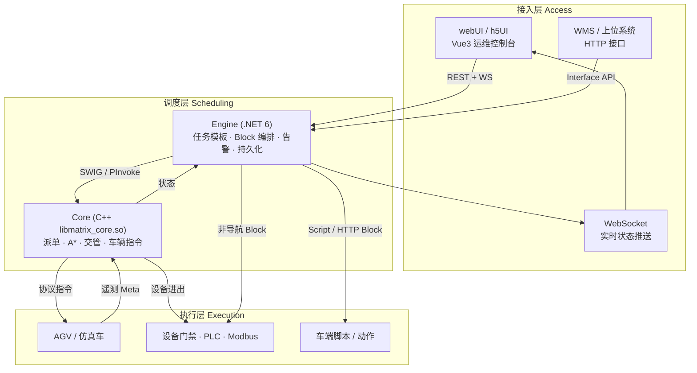

| 层 | 职责（讲座话术） | 主要落点 |

|----|------------------|----------|

| **接入层** | 人怎么下单、怎么看图、外部系统怎么对接 | Controllers、Interface、WebSocket、前端页面 |

| **调度层** | 业务任务怎么拆、哪辆车做、怎么走、怎么避让 | Engine `TaskExecuteService` + Core `TaskAssign` / `Planning` / `Traffic` |

| **执行层** | 真正动起来的东西 | 车辆协议、设备、脚本；仿真时由 `SimulationService` 驱动 |

### 1.2 Engine ↔ Core 协作关系

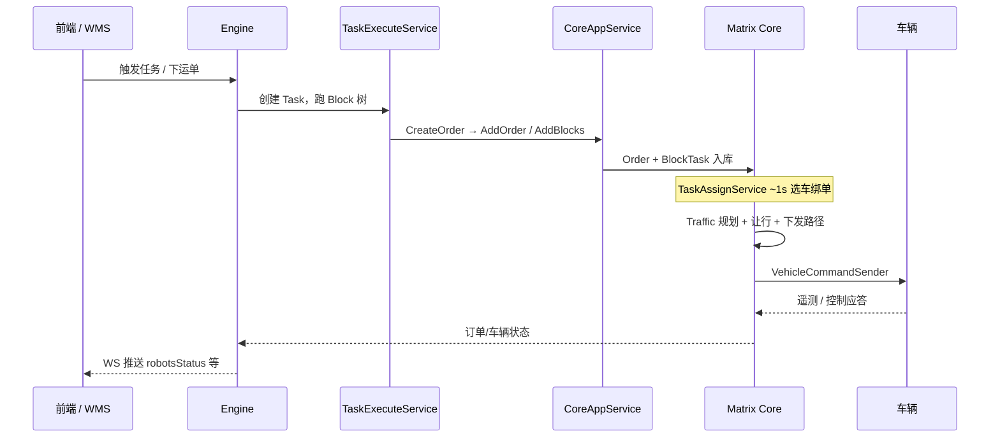

### 1.3 Core 内部模块地图

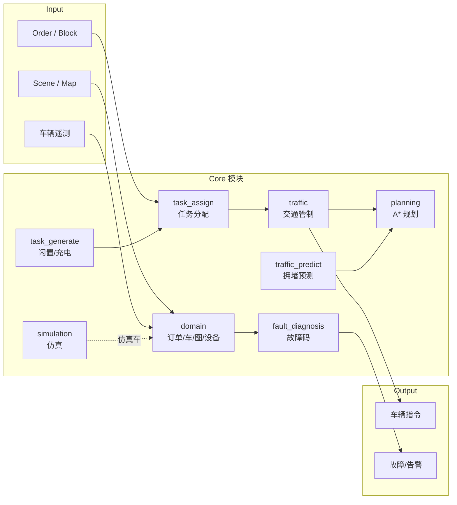

**启动顺序（`Application`）**：

```text

ChargingManager → LeisureManager → TaskAssignService

→ RegulationTrafficControlService → SimulationService → LogService → DeviceService

```

各服务多为 `LoopService`，默认约 **1s** 一拍（仿真循环约 100ms）。

### 1.4 端到端主链路（讲座总图）

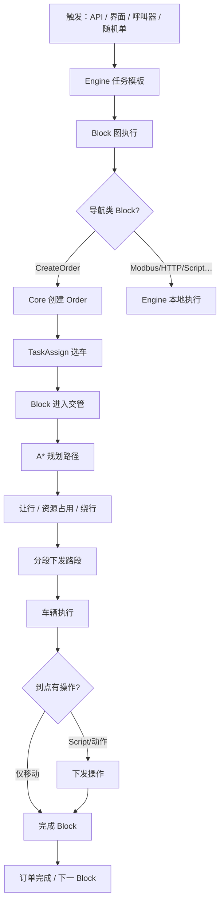

---

## 2. 前端功能

### 2.1 前端产品矩阵

| 产品 | 技术栈 | 定位 |

|------|--------|------|

| **webUI** | Vue 3 + Vite + Element Plus | 主运维控制台 |

| **h5UI** | Vue 3 + Vite | H5 / 移动侧同类能力 |

| **electronUI** | Electron | **离线回放播放器**（非在线调度） |

通信方式：**REST API + WebSocket**（JWT + RBAC）。

### 2.2 功能地图（讲座可投影）

```mermaid
mindmap

root((Matrix 前端))

调度监控

首页地图

运单/订单

机器人状态

交管可视化

任务配置

任务模板

Block 编排

场景参数

设备与接口

PLC / Modbus

呼叫器

外部接口

仿真与回放

仿真页

回放监控

运维分析

告警/故障

统计报表

日志下载

系统管理

用户角色

权限树

在线脚本

```

### 2.3 与调度强相关的页面

| 页面（`webUI/src/views`） | 对应后端能力 |

|---------------------------|--------------|

| `home` / `dispatch` | 地图监控、实时车态 |

| `robotManagement` | 车辆注册、控制权、暂停恢复 |

| `task` / `taskTemplate` / `taskManagement` | 任务与模板 |

| `orderDetail` | 运单详情 |

| `scenarioConfiguration` | 场景 / 拼单等开关 |

| `simulation` | 仿真车配置与运行 |

| `replayMonitoring` | 调度回放 |

| `faultRecord` / `schedulingFaultStatistics` | 故障与统计 |

| `interfaceConfiguration` / `InterfaceManagement` | 上位对接 |

| `plcDevice*` / `modbusSetting` / `pager` | 设备与呼叫 |

> **讲座提示**：前端不直接做 A* / 交管；它只触发 Engine，再由 Core 计算，状态经 WS 回流到地图。

---

## 3. 模块功能与技术实现

### 3.1 任务分配

#### 功能目标

把 **未绑车订单** 分配给合适车辆：优先空闲近车；开启拼单时可 **在途插单**。

#### 核心概念

| 概念 | 说明 |

|------|------|

| Order | 业务派工单元（MOVE / LOAD / UNLOAD / IDLE / CHARGE…） |

| BlockTask | 交管真正执行的一段 |

| externalId | 外部单号；相同则倾向同车成组 |

| merge | 场景开关：是否允许在途插单 |

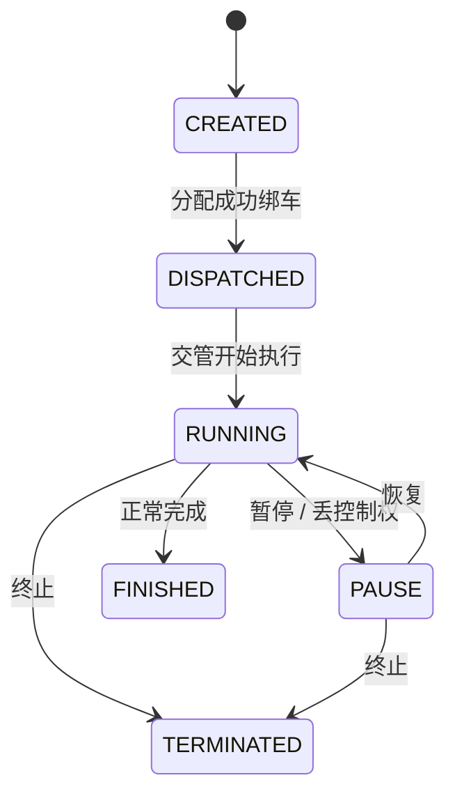

#### 流程

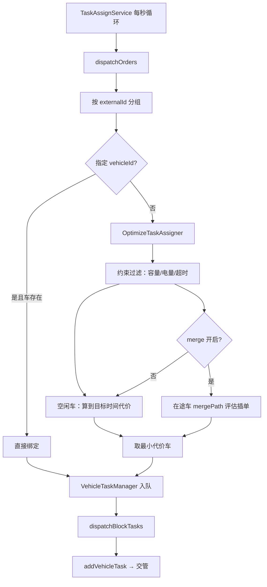

#### 关键代码

| 类 | 路径 |

|----|------|

| `TaskAssignService` | `core/module/task_assign/src/task_assign_service.cpp` |

| `OptimizeTaskAssigner` | `core/module/task_assign/src/task_assigner_optimize.cpp` |

| `VehicleTaskManager` | `core/module/task_assign/include/.../vehicle_task_manager.hpp` |

| 约束 | `VehicleCapacityConstraint` / `VehicleEnergyConstraint` / `OrderTimeoutConstraint` |

| Engine 侧 | `TaskExecuteService` → `CreateOrderHandler` → `CoreAppService.AddOrder` |

```text

选型要点（可板书）：

• 算法 = 贪心最近路径 + HardConstraint，不是匈牙利 / ILP

• 在途插单 = mergePath 逐步「原下一站 vs 新站」二选一

• Engine 负责业务 Block 树；Core 负责「选哪辆车」

```

---

### 3.2 机器人管理

#### 功能目标

车辆 **注册 / 注销**、**状态维护**、**电量监控**、控制权与指令通道。

#### 流程：注册与生命周期

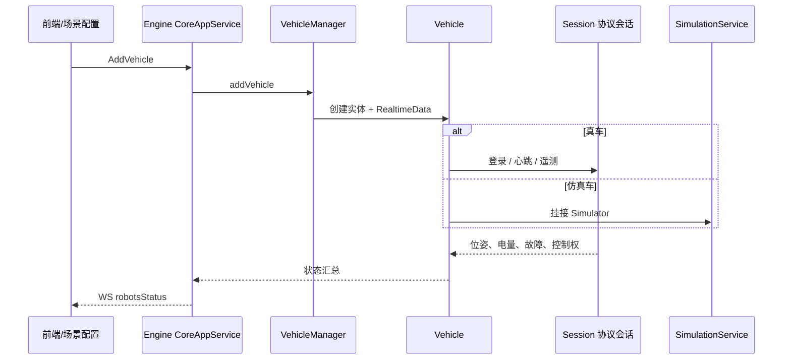

#### 状态维护要点

```mermaid
flowchart LR

META[车端 Meta 遥测] --> RT[VehicleRealtimeData]

RT --> POS[位姿 / positionId]

RT --> BAT[电量 / charging]

RT --> CR[controlRight MRCS/…]

RT --> ST[FREE / RUNNING / …]

RT --> ERR[error / 急停]

POS --> ASSIGN[派单可用性]

BAT --> CHARGE[ChargingManager]

CR --> DISP[是否可下发任务]

ERR --> FAULT[FaultMessageManager]

```

| 能力 | 实现要点 | 代码落点 |

|------|----------|----------|

| 注册/注销 | `AddVehicle` / `RemoveVehicle` | `vehicle_manager.hpp` |

| 状态维护 | 遥测解析 → `VehicleRealtimeData` | `vehicle_realtime_data.hpp`、`vehicle.cpp` |

| 电量监控 | 阈值触发充电任务；Engine 电池配置 API | Core `ChargingManager`；Engine `RobotBatteryAppService` |

| 指令下发 | 移动 / 动作 / 脚本 / 取消 / 控权 | `vehicle_command_sender.hpp` |

| 控制权 | MRCS 持权才可稳定调度；丢权暂停并取消移动 | `task_assign` + `traffic` 协同 |

```text

讲座口诀：

有车 → 有位姿 → 有控权 → 有电量余量 → 才能稳定接单执行。

缺一项，就会表现为「派不出去 / 跑不动 / 到点不下操作」。

```

---

### 3.3 路径规划

#### 功能目标

在路网图上搜索从当前位置到目标站点的可行路径，并输出可下发的路段序列。

#### 流程

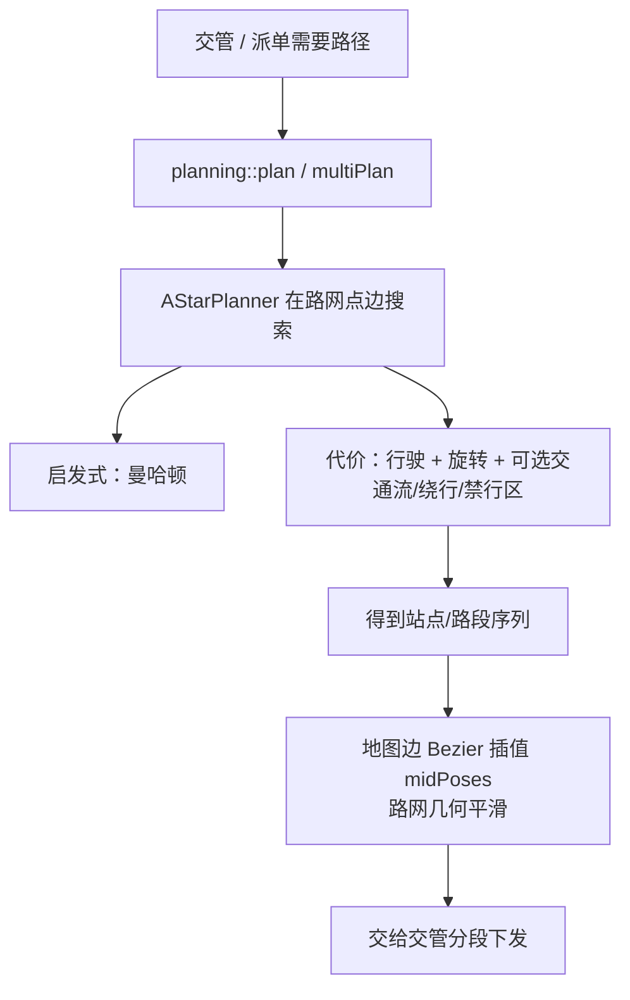

#### 「动态避障」在 Matrix 中的真实含义

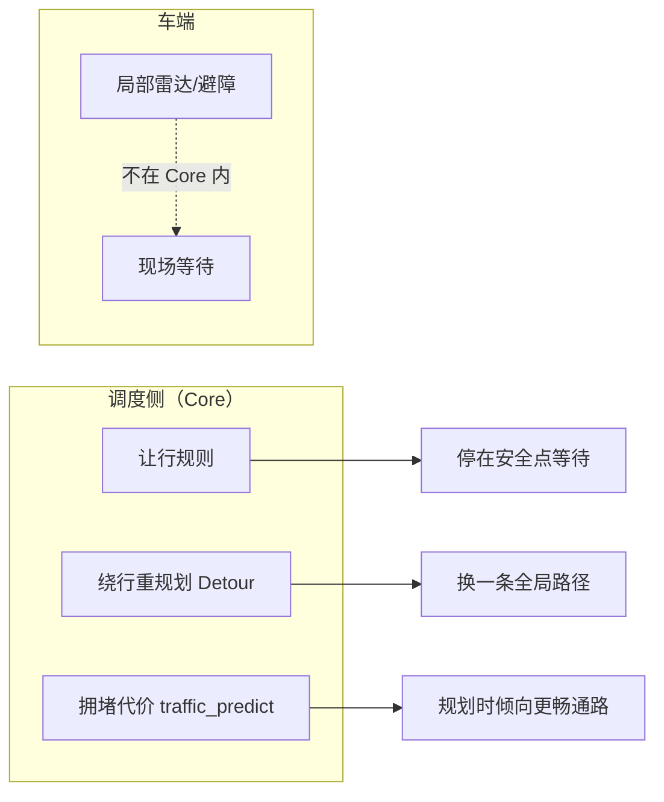

| 说法 | 代码实际 |

|------|----------|

| A* | `AStarPlanner`（`planner_a_star.hpp`） |

| 路径平滑 | 主要是路网解析时的 **Bezier 均匀插值**，不是规划后轨迹优化 |

| 动态避障 | **让行 + 绕行重规划 + 交通流代价**；局部避障在车端 |

| 类 | 路径 |

|----|------|

| `AStarPlanner` | `core/module/planning/include/planning/planner_a_star.hpp` |

| `MultiRoutePlanner` | 多车推闲置车让道 |

| 代价策略 | `cost_strategy_travel` / `rotation` / `TrafficFlow` / `VehicleDetour` / `ProhibittedArea` |

| 插值 | `uniform_interpolation.hpp` |

---

### 3.4 交通管制

#### 功能目标

多车共享路网时，保证 **安全通行**：路口/对向/同向冲突协调，必要时绕行解除死锁。

#### 控制模型

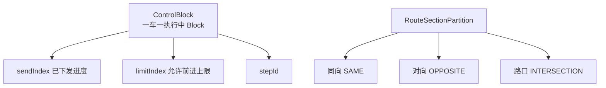

#### 主循环（约 1s）

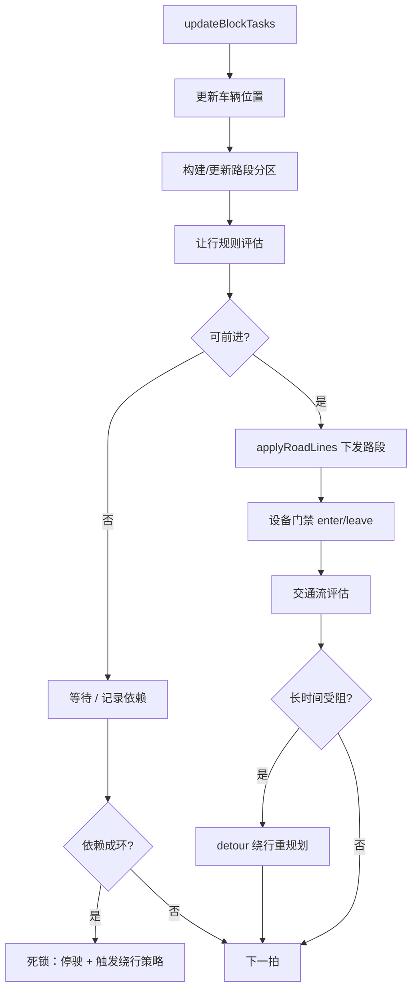

#### 让行与「资源锁」

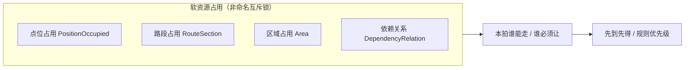

| 能力 | 实现 | 代码 |

|------|------|------|

| 路口/对向分配 | 路段分区 + 让行规则 | `route_section_partition.hpp`、`regulations/*` |

| 死锁检测 | 依赖环检测；久堵触发绕行 | `DependencyRelationYieldRegulation`、`VehicleDetourService` |

| 资源锁管理 | `sendIndex`/`limitIndex` + 分区占用 | `ControlBlock` / `ControlBlockManager` |

| 碰撞几何 | GEOS + 车体尺寸 | `VehicleCollisionChecker` |

```text

讲座口诀：

交管不是「一次性发完全程」，而是「按拍推进走廊占用」。

死锁常见形态 = 对向互相礼让成环；解法 = 绕行换路，而不是无限等待。

```

---

### 3.5 异常处理

#### 功能目标

对 **任务超时、车辆故障、通信中断** 等异常可发现、可告警、可恢复或可终止。

#### 总览

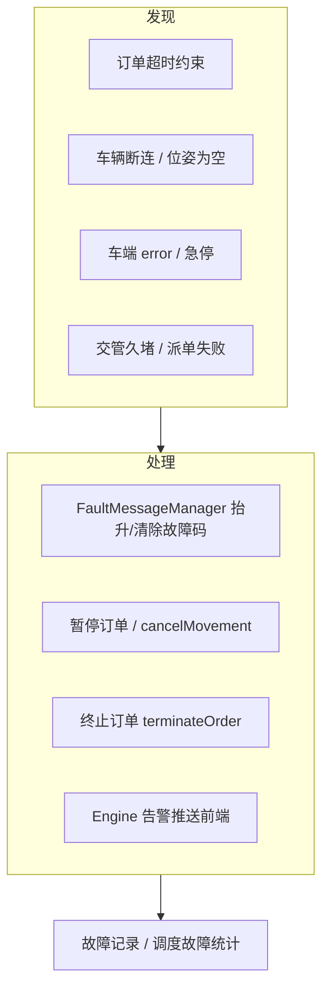

#### 分类与落点

| 异常类型 | 典型表现 | 处理策略 | 关键代码 / 错误码 |

|----------|----------|----------|-------------------|

| **任务超时** | 长时间无法分配或无法完成 | `OrderTimeoutConstraint` 过滤；业务侧终止 | `constraint_order_timeout.hpp`；`ASSIGN_*` |

| **车辆故障** | error / 急停 / 软急停 | 停派、暂停任务、告警 | `VehicleRealtimeData` + `FaultMessageManager` |

| **通信中断** | 断连、丢遥测、位姿空 | 故障码 809/810；不可再下发依赖控权的任务 | `VEHICLE_DISCONNECTED`、`VEHICLE_POSITION_EMPTY` |

| **丢控制权** | MRCS → 非 MRCS | 暂停 + `cancelMovement`（边沿触发） | `task_assign_service` / `traffic` |

| **派单失败** | 无车 / 无路 / 电量不足 | 记录失败原因，订单保持待派 | `ASSIGN_NO_VEHICLE` 等 1000–1008 |

| **交管受阻** | 让行等待过久 | 绕行；必要时人工干预 | `TRAFFIC_CONTROL_*` 1200+ |

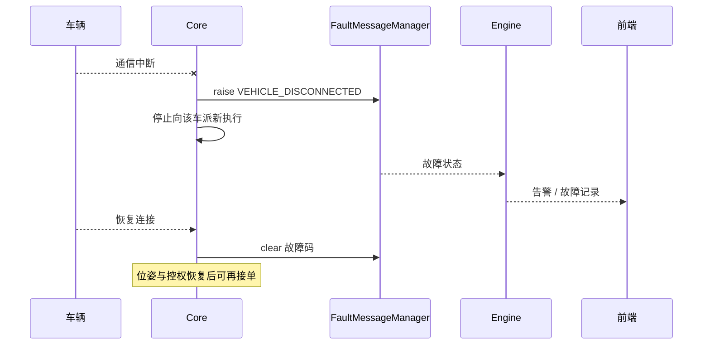

---

## 4. 仿真平台

### 4.1 定位

在 **无真车 / 少真车** 时，用 Core 内仿真器驱动标记为仿真的车辆，走完整派单 → 规划 → 交管链路，便于联调与演示。

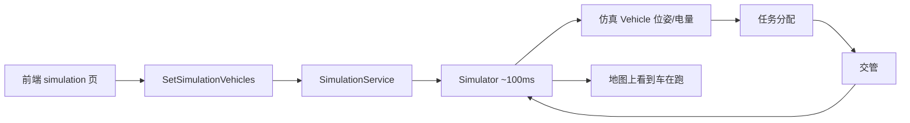

### 4.2 组成

| 组件 | 说明 | 路径 |

|------|------|------|

| `SimulationService` | 仿真总服务 | `core/module/simulation/` |

| `Simulator` | 单车运动/电量推进 | 同模块 |

| `SimulationTask` / `SimulationBattery` | 任务与电量模拟 | 同模块 |

| 前端 | `webUI` / `h5UI` → `views/simulation` | — |

| 随机单 | Engine `RandomOrderService` | 压测/演示流量 |

| 回放（相关） | `Sineva.Matrix.Engine.Replay` + electronUI | **离线回放**，不是物理仿真 |

### 4.3 与真车对比（讲座对照表）

| 维度 | 真车 | 仿真车 |

|------|------|--------|

| 通信 | 协议会话登录/遥测 | 内存推进状态 |

| 指令 | `VehicleCommandSender` 真实下发 | 仿真器消化任务状态 |

| 交管/规划 | **同一套 Core 逻辑** | **同一套** |

| 用途 | 现场生产 | 联调、培训、方案演示 |

```text

讲座强调：

仿真验证的是「调度逻辑对不对」，不是替代车端局部避障与现场标定。

回放验证的是「当时发生了什么」，用于事后复盘。

```

---

## 5. 讲座速记卡片

### 5.1 三层一句话

| 层 | 一句话 |

|----|--------|

| 接入层 | 谁下单、谁看图、谁对接外部 |

| 调度层 | Engine 编排业务，Core 选车/规划/交管 |

| 执行层 | 车、设备、脚本真正执行 |

### 5.2 五大模块一句话

| 模块 | 一句话 |

|------|--------|

| 任务分配 | 1 秒贪心选车，可在途插单 |

| 机器人管理 | 注册 + 遥测状态机 + 电量与控权 |

| 路径规划 | 路网 A*；平滑在路网几何；避障靠让行/绕行 |

| 交通管制 | 分段占用走廊；死锁靠依赖检测 + 绕行 |

| 异常处理 | 故障码抬升/清除 + 暂停终止 + 前端告警 |

### 5.3 推荐演示路径（15–20 分钟）

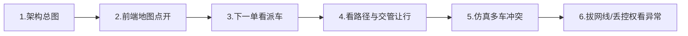

### 5.4 深入阅读

| 想深挖 | 文档 |

|--------|------|

| 详细设计与选型 | [CoreDesign.md](./CoreDesign.md) |

| 派单 / 拼单 | [培训-任务分配与拼车顺风车逻辑.md](./培训-任务分配与拼车顺风车逻辑.md) |

| A* 与代价 | [培训-路径规划逻辑.md](./培训-路径规划逻辑.md) |

| 让行与死锁 | [培训-交通管制逻辑.md](./培训-交通管制逻辑.md) |

| Engine 工程结构 | `engine/README.md` |

---

*文档生成说明：内容对齐当前仓库实装（Core C++ / Engine .NET / Vue 前端），流程图面向讲座投影；细节实现以配套培训文档与代码为准。*
