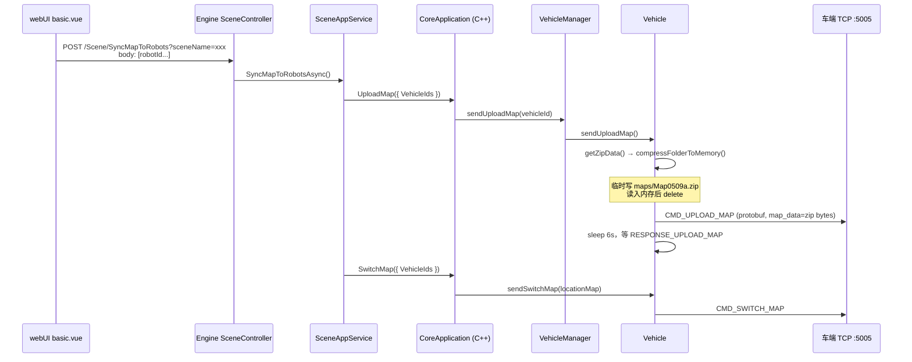
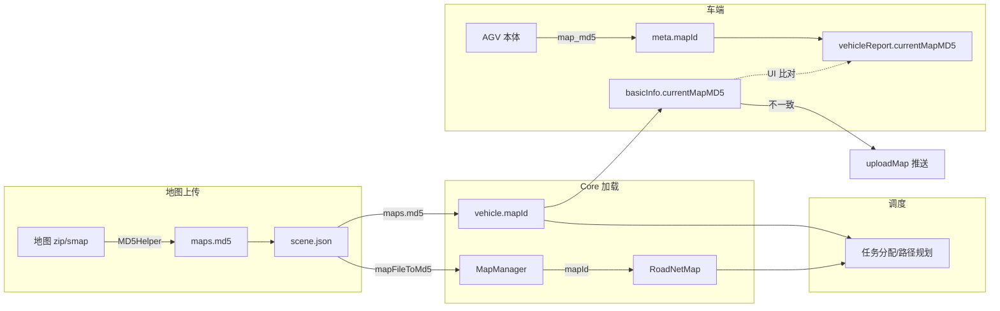

# 完整流程：develop → PR合并release → 打tag v1.0.0 Git命令

> 标准GitFlow流程：develop开发完成，提PR合并到release，release分支稳定后创建版本Tag

## 前提

1. 本地代码拉到最新
2. PR由代码评审后在远端仓库完成合并（推荐**网页端合并PR**，保证合并记录干净）
3. 下面分【本地操作命令】

## 1、同步远端最新代码

```bash
git fetch origin
```

## 2、切换到release分支，拉取PR合并后的最新代码

```bash
git checkout release
git pull origin release
```

## 3、（可选）确认当前release代码就是要发布的版本

```bash
git log --oneline -1
```

## 4、创建**本地轻量Tag / 附注Tag（推荐附注tag，正式版本必备）

### 方式A：附注Tag（正式发布首选，可写备注）

```bash
git tag -a v1.0.0 -m "Release Version v1.0.0，develop功能全部合入，正式上线版本"
```

### 方式B：简易轻量Tag（不推荐生产环境）

```bash
git tag v1.0.0
```

## 5、推送Tag到远端仓库（关键！不推送远端看不到tag）

```bash
git push origin v1.0.0
```

## 配套常用补充命令

### 删除本地tag

```bash
git tag -d v1.0.0
```

### 删除远端错误tag

```bash
git push origin --delete v1.0.0
```

### 查看所有tag

```bash
git tag
```

### 查看tag详情（附注tag才能看到备注）

```bash
git show v1.0.0
```

# 完整一键流程汇总（复制可用）

```bash
git fetch origin
git checkout release
git pull origin release
git tag -a v1.0.0 -m "Release v1.0.0"
git push origin v1.0.0
```

# 重要规范提醒

1. Tag 建议严格遵循语义化版本 `v主.次.修订` `v1.0.0`
2. **禁止直接在develop打tag**，发布tag必须落在release分支
3. 尽量远端PR合并，不要本地merge develop到release，避免冲突记录混乱
4. 如果后续hotfix：基于v1.0.0新建hotfix分支，修复后合并release，打v1.0.1 tag

如果你需要，我可以提供CI/CD脚本形式的自动化tag推送命令。

# Cancel Movement

已按「任意 Offline + 暂停/取消都立即停车」改完，Core 编译通过。

**1. Offline / Logout**

- `controlSession` 断开或 logout：立刻 `cancelMovement`（充电中再 `stopCharge`），清空本地路径，置 `OFFLINE`
- 调度循环消费 `offlineChanged`：对绑定运单 `pauseOrder`，并再补一次停车；Offline 期间不再派发

**2. 任务暂停 / 取消**

- `pauseVehicleTask` / `cancelVehicleTask`：不再按 block 状态跳过，一律 `stopVehicleOnTaskCancel`
- `pauseOrder`：对 `RUNNING`/`PAUSE` block 都处理，并始终 `abortVehicleMovement`

重新部署 Core 后，断连/Care 导致 Offline 时车应停下，任务进入暂停，而不是 UI 消失车还在跑。

# goto new interface

已用 SWIG 4.0.2 重新生成，`matrix_core` 编译通过。

### 生成命令

```bash
swig -c++ -csharp \
  -namespace Sineva.Matrix.Core \
  -outfile core.cs \
  -o core_application_wrap.cxx \
  -Icore/src \
  core/src/core_application.i
```

输出已写入：

- `engine/Sineva.Matrix.Core/api/core.cs`
- `core/src/core_application_wrap.cxx`

### Engine 调用示例

```csharp
using Sineva.Matrix.Core;

// coreApp 为已 start 的 CoreApplication 实例
using var req = new GoToRequest
{
    vehicleId = "AGV-01",   // 机器人 id
    goalId = "P100",        // 路网点位 id
    priority = 1,           // 可选，默认 1
    externalId = "goto-demo-1" // 可选；空则 Core 自动生成 goto-{orderId}
};

using GoToResponse resp = coreApp.goTo(req);
if (resp.code == 0)
{
    // 成功：已建 MOVE 运单并绑定车辆，等待 Core 派发路径
    var orderId = resp.orderId;
    var blockId = resp.blockId;
    var externalId = resp.externalId;
}
else
{
    // 失败：看 code / message（如车忙、无控制权、点位不存在、无路径等）
}
```

同事侧只需对接业务层调用；部署时请同步更新本次编译的 `libmatrix_core.so` 与新 `core.cs`。


# Goto 2

`GoToResponse` 已调整为与 `AddOrderResponse` 相同的结构，SWIG C# 绑定也已重新生成。

## 变更说明

### 1. `GoToResponse` 结构对齐 `AddOrderResponse`

**之前（不兼容）：**

```cpp
class GoToResponse {
    int code; string message; string createOn;
    vector<string> messageParams;
    string orderId; string blockId; string externalId;  // 扁平字段
};
```

**现在（与 AddOrder 一致）：**

```cpp
class GoToResponse {
    int code = 0;
    std::string message;
    std::string createOn;
    std::vector<OrderInfo> data;
};
```

### 2. `CoreApplication::goTo` 成功时填充 `data`

与 `addOrder` 相同，通过 `build(order)` 构造完整 `OrderInfo`（含 `blocks`）：

```388:391:core/src/core_application.cpp
        auto order = application.taskAssignService_->getOrder(result.orderId);
        if (order) {
            response.data.emplace_back(build(order));
        }
```

### 3. SWIG 已重新生成

- `engine/Sineva.Matrix.Core/api/core.cs`
- `core/src/core_application_wrap.cxx`

生成的 `GoToResponse` 现在有 `VectorOrder data` 属性，与 `AddOrderResponse` 一致。

## Engine 调用示例

```csharp
var request = new GoToRequest
{
    vehicleId = "S800_1#",
    goalId = "testQrMap0729_P_45",
    priority = 1,
    externalId = "my-goto-task-001"
};

GoToResponse response = coreApp.goTo(request);

if (response.code == 0 && response.data != null && response.data.Count > 0)
{
    var order = response.data[0];
    string orderId = order.orderId;           // e.g. GTxxxxxxxx
    string externalId = order.externalId;
    string blockId = order.blocks[0].blockId;
    // 与 AddOrder 返回结构完全一致，可复用同一套处理逻辑
}
```

若要在 Engine Managed 层接入，可在 `CoreResponseMapper.cs` 增加一行（与 `AddOrderResponse` 相同模式）：

```csharp
public static CoreResponse<List<CoreOrderInfo>> ToCoreResponse(CoreApi.GoToResponse? response)
    => MapResponse<CoreApi.GoToResponse, CoreResponse<List<CoreOrderInfo>>>(response, CoreApi.GoToResponse.getCPtr, x => x.Data ??= new());
```

需要我帮你把 Engine 侧的 `goTo` 接口和 Mapper 也一并接上吗？


# Sent map

下面把「前端点击推送到车辆」的完整链路、zip 被删的原因，以及如何确认/保障发送成功，一并说明。

---

## 一、完整调用链路



### 1. 前端

场景配置页「推送地图给机器人」在 `basic.vue`：

```936:955:webUI/src/views/scenarioConfiguration/component/basic.vue
async function submitPushMap() {
  ...
  const res = await pushMapToRobot({ sceneName: sceneName.value }, ids)
  ...
}
```

对应 API：`POST /Scene/SyncMapToRobots`。

### 2. Engine 层

```2304:2315:engine/Sineva.Matrix.Engine.Service/Implement/SceneAppService.cs
public async Task SyncMapToRobotsAsync(string sceneName, params string[] robotIds)
{
    ...
    _coreAppService.UploadMap(new() { VehicleIds = new(robotIds) });
    _coreAppService.SwitchMap(new() { VehicleIds = new(robotIds) });
    await Task.CompletedTask;
}
```

顺序是：**先 UploadMap，再 SwitchMap**；两者都不检查车端是否真正 ACK。

Controller 直接 `return Ok()`，前端看到成功只代表 HTTP 200，不代表地图已发到车。

### 3. Core 层

```2191:2235:core/src/core_application.cpp
Response CoreApplication::uploadMap(UploadMapRequest request) {
    ...
    application.vehicleManager_->sendUploadMap(vehicleId);
    ...
    SPDLOG_INFO("api call uploadMap completed");
    return response;  // 只要车辆存在且已登录就返回 success
}
```

### 4. 车辆发送

```899:920:core/module/domain/src/vehicle.cpp
bool Vehicle::sendUploadMap() {
    if (ProtocolType::SINEVA == protocol) {
        sinevaControlSession_->sendUploadMap(zipName + ".zip", getZipData(zipName));
        std::this_thread::sleep_for(std::chrono::milliseconds(6000));
        if (uploadMapResult_.load()) {
            SPDLOG_INFO("sendUploadMap:{}", zipName);
            return true;
        } else {
            SPDLOG_ERROR("sendUploadMap:{}", zipName);
        }
    }
    return false;
}
```

- 地图来源：`vehicle.mapPath` + `vehicle.zipName`（场景加载时在 `scene_manager.cpp` 设置）
- 持久化目录：`{scenePath}/maps/Map0509a/`（解压后的文件夹，不是 zip）
- 发送走控制端口 **5005**（欣奕华 SINEVA 协议），不是单独的 map 端口

---

## 二、为什么服务器上的 zip 会被删掉？谁删的？

**删除者：`compressFolderToMemory()`（`minizip.hpp`）**

```66:96:core/module/common/include/common/minizip.hpp
inline std::string compressFolderToMemory(const std::string& mapPath, const std::string& zipName) {
    std::filesystem::path srcDir = std::filesystem::path(mapPath);
    std::string zipPath = (std::filesystem::path(mapPath) / (zipName + ".zip")).string();
    ...
    if (!compressDirectory(srcDir, zipPath)) { ... }
    ...
    // 读入内存
    std::filesystem::remove(zipPath);  // ← 这里删除
    return zipData;
}
```

每次点击推送都会：

1. 在 `{scene}/maps/` 下**临时生成** `Map0509a.zip`
2. 读进内存
3. **立刻 `remove` 删掉该 zip**

这是设计行为：zip 只是发送时的临时文件，**不是**服务器上的持久存储。

### 服务器上地图实际存什么？

Engine 保存场景时（`ProcessMapsAsync`）会把地图存成**目录**：

```
/etc/sinevaAGV/matrix/scene/test01/maps/Map0509a/
    Map0509a.roadnet
    ... (其他派生文件)
```

上传 zip 时（`UploadMapAsync`）会解压到临时目录，保存场景后再 `Directory.Move` 到上述目录；**原始 zip 在上传阶段也会被删**（`finally` 里 `File.Delete(tempFilePath)`）。

所以：如果你在 `maps/` 下手动放了 `Map0509a.zip`，点击推送后它会被覆盖并删除——这是发送流程的预期结果，**不代表地图源数据丢失**，只要 `maps/Map0509a/` 目录还在即可。

---

## 三、当前链路为何容易“看起来发了、实际没发到车”

结合你们 13:46:30 的日志（`[E] sendUploadMap:Map0509a`，无 `upload map result:true`），常见失败点如下。

### 1. 1MB 协议帧上限（高概率）

```203:206:core/module/domain/include/protocol/sineva_command_builder.hpp
if (!frame || frame->total_size <= 0 || frame->total_size > 1024 * 1024) {
    return "";
}
```

地图 zip 嵌入 protobuf 后若 **> 1MB**，`buildUploadMap` 返回空串 → 不会 TCP 发送 → 车端无 ACK → 6 秒后打 `[E] sendUploadMap`。

日志里若只有 33/54 字节小包、没有 `Sent:XXXXXX bytes`，基本就是这种情况。

### 2. 压缩源目录可能偏大

`vehicle.mapPath` 设为 `{scene}/maps/`，而 `compressFolderToMemory` 把整个 `maps/` 目录打 zip，不是只压 `maps/Map0509a/`：

```985:986:core/module/scene/src/scene_manager.cpp
vehiclePtr->mapPath = ctx.path_ + "/maps/";
vehiclePtr->zipName = mapName.substr(0, pos);  // Map0509a
```

若 `maps/` 下有多个地图目录或历史 zip，打出来的包会更大，更容易超 1MB。

### 3. 上层不传播失败

| 层级                         | 行为                                         |
| -------------------------- | ------------------------------------------ |
| `sendUploadMap()` 返回 false | `uploadMap` API **不检查**                    |
| HTTP `/api/uploadMap`      | 调用后直接 `success(res)`                       |
| Engine `SyncMapToRobots`   | UploadMap 后仍 **SwitchMap**，且 `return Ok()` |
| 前端                         | 只要 HTTP 200 就提示推送成功                        |

### 4. `uploadMapResult_` 发送前未清零

可能沿用上一次结果，导致偶发误判（你们那次是 ERROR，说明当时是 false）。

---

## 四、如何确认地图真的发到车端

在 Core 日志里按顺序查：

| 阶段      | 成功标志                                         | 失败标志                         |
| ------- | -------------------------------------------- | ---------------------------- |
| API 入口  | `api call uploadMap`                         | 车辆未登录 `VEHICLE_LOGOUT`       |
| 压缩      | `zipPath:.../maps/Map0509a.zip`              | `Compression failed`         |
| TCP 发送  | `Sent:较大字节数 bytes to:车IP:5005`               | 无大包，或只有心跳小包                  |
| 车端 ACK  | `vehicle:10.1.11.128 upload map result:true` | 无此行                          |
| Core 汇总 | `[I] sendUploadMap:Map0509a`                 | `[E] sendUploadMap:Map0509a` |
| 切图      | `switch map result:true`                     | 仅切图成功不代表上传成功                 |

**可靠成功 = 同时有：大包 Sent + `upload map result:true` + `[I] sendUploadMap`。**

---

## 五、如何保障当前地图包能成功发到车端

### 运维/排查（不改代码）

1. **确认源目录存在**  
   `{scene}/maps/Map0509a/Map0509a.roadnet` 存在且场景已保存（`ProcessMapsAsync` 已部署）。

2. **估算 zip 大小**  
   手动 `zip -r` 整个 `maps/` 或 `maps/Map0509a/`，若 > ~900KB（protobuf 还有开销），当前协议很可能发不出去。

3. **车辆在线**  
   Core 日志里该 IP 已 login，控制连接 `:5005` 正常。

4. **不要依赖 maps/*.zip**  
   该 zip 每次推送都会被删；以 `maps/Map0509a/` 目录为准。

5. **推送后查日志**  
   不要只看前端“推送成功”。

### 代码层面建议（需 Agent 模式才能改）

1. **修复压缩路径**：`compressFolderToMemory(mapPath + zipName, zipName)`，只压单个地图目录。  
2. **突破或绕过 1MB 限制**：分片上传、走 map 专用端口、或文件流式协议。  
3. **传播失败**：`sendUploadMap` 返回值一路传到 Engine API；Upload 失败则 **不要 SwitchMap**。  
4. **发送前** `uploadMapResult_.store(false)`。  
5. **可选**：`compressFolderToMemory` 增加参数控制是否保留 zip（运维需要留档时）。

---

## 六、与「上传地图」的区别

| 操作         | 入口                                          | 作用                                            |
| ---------- | ------------------------------------------- | --------------------------------------------- |
| **上传地图**   | `region.vue` → `POST /Scene/UploadMap`      | 把 zip 解压到 Engine 临时区，保存场景后落到 `maps/Map0509a/` |
| **推送到机器人** | `basic.vue` → `POST /Scene/SyncMapToRobots` | 从场景目录现场打 zip → 内存 → TCP 发车 → 再 switchMap      |

两条链路独立：**先上传并保存场景，再推送**；只上传不保存，或场景里 md5/mapName 未更新，推送的可能是旧地图或找不到目录。

---

**结论**：服务器上 `Map0509a.zip` 被删是 **`compressFolderToMemory` 在读完内存后主动删除临时 zip**，属于正常行为；持久数据在 `maps/Map0509a/` 目录。你们 13:46 的失败更像是 **地图包过大导致未真正发出 + 上层仍报成功**；要以 Core 日志里的 `Sent` 字节数和 `upload map result:true` 为准。

如需我改压缩路径、1MB 限制或 API 失败回传，可切换到 Agent 模式继续。


# Preoccupy issue/bug

## 问题根因

从 `logs/core-20260805.log` 15:39:52 起，S800_3# 在 Wa_P_47 的状态为：

- `step:1, send:1, limit:1`，`state:FREE`，`localPath size:0`
- 订单 `238e3c2265af4be0a5f875c22354988a`，下一段应为 **Wa_P_47 → Wa_P_6**

日志反复出现：

```
[yield] [position occupied] vehicle id:S800_3# at index:1, road:Wa_P_46-Wa_P_47, by vehicle:S800_4#
```

**死锁链条：**

1. S800_3 已到达 Wa_P_47（段 1 已完成），但 yield 仍重复检查段 1 终点 Wa_P_47
2. S800_4 的路径预留了 `Wa_P_6-Wa_P_47`，其 `endPos=Wa_P_47` 被判定为占用
3. `limitIndex` 被压到 1，而 `sendIndex` 也是 1 → `applyRoadLines` 因 `limitIndex <= sendIndex` 直接返回，**不下发 Wa_P_47-Wa_P_6**
4. S800_4 在 Wa_P_7 同样被 S800_3 和 AREA 规则阻塞，形成双向互让

前端表现为「调度未下发路径」，本质是交通管制层未 dispatch，而非规划失败。

---

## 修复内容

### 1. `yield_position_occupied.hpp`

- **跳过已完成段**：车辆已在 `sendIndex` 段终点且 `step==send` 时，不再重复检查该段 endPos，改为检查后续 egress 段
- **修正 peer 预留误判**：ego 已占 Wa_P_47，peer 尚未进入对应段（`index > peer.stepId`）时，不因 peer 未来段的 `endPos` 误判占用
- **互让死锁打破**：在 coarse collision 检测处也应用「双方均停 + 较小 vehicle id 优先」的不对称规则

### 2. `traffic_control_service_regulation.cpp`

- **中段路线恢复**：FREE + 空 localPath + 停在段终点 + 仍有后续路段时，若 `limitIndex <= sendIndex`，在 yield 前将 `limitIndex` 重新打开到路线末尾，让 yield 能正确评估下一段

---

## 验证

- `traffic` 模块与 `matrix_core` 编译通过
- `unit_tests_vehicle_detour_blocked_yield` 全部通过（19 assertions）

---

修复后，S800_3 在 Wa_P_47 完成段 1 时应能继续评估并下发 Wa_P_47→Wa_P_6；若与 S800_4 在 Wa_P_6 走廊仍有几何冲突，会由正常的 collision/yield 处理，而不会再因「重复检查已完成的 Wa_P_47 终点」永久卡住。

如需我帮你跑完整 publish 或提交 commit，可以说一声。


# 库位


继续前面关于发往Loc-45-1目标点的讨论。core-20260804.log/engine-20260804.log 是测试发往Loc-45-1的任务，这是点testQrMap0729_P_45对应的库位，相关的地图是core/conf/Q.roadnet, 其中binLocationsList记录了每一个库位对应的地图点位信息，机器人在对应点位上即可以操作对应的外部库位。例如Loc-45-1对应的机器人操作点位是testQrMap0729_P_45,换句话说给的任务目标点应该在Q.roadnet的路网中通过binLocationsList下的binLocationList的每一个GeneralLocation结构的instanceName（库位ID）对应于pointName的点位ID，那么Loc-45-1等同于发往testQrMap0729_P_45去生成任务。系统调整这段逻辑保证下发库位信息时也能正常生成库位对应点位的移动任务。


## 问题根因

`core-20260804.log` 15:23:58 的测试链路：

1. Engine 下发 `AddOrder`，`location: "Loc-45-1"`
2. Core 在 `canWorkVehicles` 中用 `getPosition(mapId, "Loc-45-1")` 校验
3. 路网里只有点位 `testQrMap0729_P_45`，没有 `Loc-45-1` 这个 position id
4. 日志反复报：`vehicle map does not contain order location ... location:Loc-45-1`
5. 订单无法派车，`AddBlocks` 也不会执行，移动任务无法生成

`Q.roadnet` 的 `binLocationsList` 已正确配置：

```2095:2097:core/conf/Q.roadnet
          "instanceName": "Loc-45-1",
          "pointName": "testQrMap0729_P_45",
```

但 Core 此前未做 **库位 ID → 路网点位** 的映射。

---

## 修复内容

### 1. `bin_location_utils.hpp`

- 新增 `findPointNameByBinInstanceName`：从 `binLocationsList` 查 `instanceName → pointName`
- 新增 `resolveNavigationPointId`：统一解析导航目标点
- `findBinLocationPropertyValue` 支持按库位 ID（如 `Loc-45-1`）查属性

### 2. `map_manager.cpp` — `findPosition`

- 直接查不到 position 时，查 `binLocationsList` 做别名解析
- 例：`Loc-45-1` → `testQrMap0729_P_45`

### 3. `task_assigner_optimize.cpp`

- `canWorkVehicles` 改用 `findPosition`（支持库位 ID）
- `findBestRoute` / `mergePath` 路径规划前解析库位 ID

### 4. `addBlocks`（`core_application.cpp` / `http_server_api.cpp`）

- `findPosition` 成功后，`goal.id` 设为解析后的路网点位（`testQrMap0729_P_45`），保证调度/路径使用正确 id

### 5. `goTo`

- 路径预检与 block 构建均使用解析后的 `goalPos->id`

---

## 验证

单元测试 `unit_tests_bin_location_utils` 新增 Q 地图用例，全部通过：

- `Loc-45-1` → `testQrMap0729_P_45`
- `findPosition("Loc-45-1")` 返回正确 position
- `resolveNavigationPointId` 正常工作

---

修复后，下发 `Loc-45-1` 与下发 `testQrMap0729_P_45` 在移动任务生成上等价；运单 `order.location` 仍可保留外部库位 ID `Loc-45-1`，内部导航会自动映射到对应路网点位。

重新编译部署 Core 后，可再跑 `dl_task_move` 任务验证派车与路径下发。如需我帮你跑 publish 或提交 commit，可以说一声。


---

## 总体概念：系统里有两类 MD5

| 类型          | 来源                        | 用途                                   |
| ----------- | ------------------------- | ------------------------------------ |
| **场景 MD5**  | `scene.json` 全文内容的 MD5    | 场景配置版本标识，WebSocket/API 下发 `sceneMD5` |
| **地图包 MD5** | 地图 zip / smap **文件**的 MD5 | 作为 `mapId` 贯穿调度、路径规划、地图同步            |

下面说的「地图包 MD5 校验」，主要指第二类。

---

## 地图包 MD5 从哪来

**1. 上传地图时（Engine）**

`SceneAppService.UploadMapAsync` 保存 zip/smap 后计算整包 MD5，返回 `{ MapName, Md5 }`，前端写入 `scene.json` 的 `areas[].maps[].md5`：

```2087:2146:engine/Sineva.Matrix.Engine.Service/Implement/SceneAppService.cs
            // 文件MD5
            var md5 = MD5Helper.GetFileMD5(tempFilePath);
            // ...
            return new() { MapName = mapName, Md5 = md5 };
```

**2. 场景加载时（Core）**

`SceneManager::updateSceneInternal` 读取 `scene.json` 中每个 map 的 `md5`，作为 `mapId` 加载路网：

```1028:1046:core/module/scene/src/scene_manager.cpp
        std::unordered_map<std::string, std::string> mapFileToMd5;
        for (const auto& area : scene.areas) {
            for (const auto& map : area.maps) {
                // ...
                mapFileToMd5[mapFilePath] = map.md5;
            }
        }
        if (!mapManager_->updateMap(mapFileToMd5)) {
```

`RoadNetMap::loadMapFromFile` **优先用 scene.json 的 md5**，而不是重新 hash `.roadnet` 内容——这样和 zip 包 MD5、车端上报保持一致：

```327:333:core/module/domain/src/road_net_map.cpp
        // Prefer scene.json maps[].md5 so package zip md5 matches vehicle push comparison.
        mapId_ = !mapId.empty() ? mapId : (*roadnet).mapId;
```

**3. 车辆绑定时**

每台车在 scene 里绑定地图，`vehicle->mapId = scene.json maps[].md5`：

```987:988:core/module/scene/src/scene_manager.cpp
                        // Use scene.json maps[].md5 for push/compare; do not re-hash the loadable file.
                        vehiclePtr->mapId = !map.md5.empty() ? map.md5 : utils::getMd5(...);
```

---

## 调度侧：怎么用 MD5

调度**不直接比对**「场景 MD5 vs 车端 MD5」，而是用 **`vehicle->mapId`（场景期望的地图包 MD5）** 作为地图命名空间：

**任务分配** — 订单目标点必须在车辆绑定地图中存在：

```148:161:core/module/task_assign/src/task_assigner_optimize.cpp
            if (!order->location.empty()) {
                if (vehicle->mapId.empty()) { ... continue; }
                auto pos = mapManager_->findPosition(order->location, vehicle->mapId);
                if (pos == nullptr || pos->mapId != vehicle->mapId) {
                    SPDLOG_INFO("... vehicle map does not contain order location ...");
                    continue;
                }
            }
```

**路径规划 / 交管** — 全程在 `vehicle->mapId` 对应的路网上算路，点、边、区域都带同一 `mapId`。

**含义**：调度假设「这辆车已经在场景配置的那版地图上运行」。若车端实际地图版本不一致，调度仍会按旧/新版本规划，可能发出去车无法执行的点位或路径。

---

## 车端：怎么上报 MD5

车端通过状态上报 `map_md5`（SINEVA proto 字段）：

```851:855:core/module/domain/src/main.proto
message VehicleBaseState {
    string map_id = 3;      // 地图名称
    string map_md5 = 4;     // 地图md5
```

Core 解析后写入 `meta.mapId`，再通过 WebSocket 以 `vehicleReport.currentMapMD5` 下发。

同时 Core 还维护 **`basicInfo.currentMapMD5 = vehicle->mapId`**（场景期望），与车端上报形成对照：

```1055:1056:core/src/core_application.cpp
            data.basicInfo.currentMapMD5 = item->mapId;   // 场景配置
            // ...
            data.vehicleReport.currentMapMD5 = meta.mapId; // 车端实际上报
```

---

## 为什么需要校验

核心目的：**保证调度端、场景配置、车端本地地图是同一版本**。

若不一致会导致：

1. **路径/点位对不上** — 调度发的 `P_47` 在车端地图上不存在或坐标不同  
2. **库位/导航别名失效** — `Loc-45-1` 等映射只在调度加载的那版 logicalMap 里  
3. **多地图场景串图** — 同名点位在不同 mapId 下是不同物理位置  
4. **地图更新后旧车未同步** — 场景已换新版 md5，车仍跑旧版，任务无法执行  

MD5 是整包 zip 的指纹，比文件名更可靠（同名文件内容可能已变）。

---

# md5 zip file

## 什么场景需要校验 / 同步

### 1. 场景配置 → 推送地图到机器人（主动同步）

前端「推送地图给机器人」→ `SyncMapToRobots` → Core `uploadMap` + `switchMap`：

```2304:2315:engine/Sineva.Matrix.Engine.Service/Implement/SceneAppService.cs
        public async Task SyncMapToRobotsAsync(string sceneName, params string[] robotIds)
        {
            _coreAppService.UploadMap(new() { VehicleIds = new(robotIds) });
            _coreAppService.SwitchMap(new() { VehicleIds = new(robotIds) });
        }
```

Core 从 `scene/maps/` 读 zip，通过协议推到车端。

### 2. 推送前 MD5 不一致检测（UI 层）

场景配置页 `recalcPushMatch` 比较：

- `basicInfo.currentMapMD5` — 场景期望  
- `vehicleReport.currentMapMD5` — 车端实际  

不一致则标记 `mismatch`，默认勾选需推送的车：

```805:833:webUI/src/views/scenarioConfiguration/component/basic.vue
function recalcPushMatch() {
      const basicMd5 = safeStr(ws?.basicInfoCurrentMapMD5 || '')
      const reportMd5 = safeStr(ws?.vehicleReportCurrentMapMD5 || '')
      const st = basicMd5 && reportMd5 && basicMd5 === reportMd5 ? 'match' : 'mismatch'
```

### 3. 从机器人拉取地图（反向同步）

`SyncMapFromRobot` → 从车端 `downloadMap`，重新算 MD5，更新 `scene.json` 并保存场景。适用于以车端地图为准、或现场改图后回灌调度。

### 4. 查询车端地图列表

`queryMapList` / `GetRobotMaps` 返回车端每个地图文件的 `md5sum`，用于人工比对该选哪张、是否已存在。

### 5. 添加车辆

`addVehicle` **强制要求**传入 `md5`，写入 scene 绑定关系：

```1701:1704:core/src/core_application.cpp
        if (request.vehicleId.empty() || ... || request.md5.empty()) {
            failed(response, common::Code::PARAM_EMPTY);
```

### 6. 地图上传 / 场景保存

Engine `UpdateUsedMaps` 用 `{md5}_{mapName}` 临时目录定位正确版本，复制到 `scenes/{scene}/maps/`，避免同名不同内容混用。

### 7. 日常运维监控

机器人管理页展示 `currentMapMD5`；监控页用 `vehicleReport.currentMapMD5` 做展示/回放标识。

---

## 数据流示意



---

## 需要注意的点

1. **Core 调度不会自动拦截 MD5 不一致** — 不一致时主要是 UI 提示 + 人工推送；任务层只校验 `vehicle->mapId` 下有没有目标点，不校验车端实际上报。  
2. **MD5 是 zip 整包 hash**，不是单独 `.roadnet` 文件；scene.json 里的 md5 必须和上传时一致。  
3. **仿真车** — `simulator` 直接把 `meta.mapId = vehicle->mapId`，天然一致，不需要推送。  
4. **sceneMD5 vs mapMD5** — 前者是场景 JSON 版本，后者是地图包版本；改机器人分组会变 sceneMD5，换地图包会变 mapMD5。

若你想深入某一条链路（例如 SINEVA 推送协议细节，或 MD5 不一致时任务失败的具体日志），可以指定场景我继续拆。
