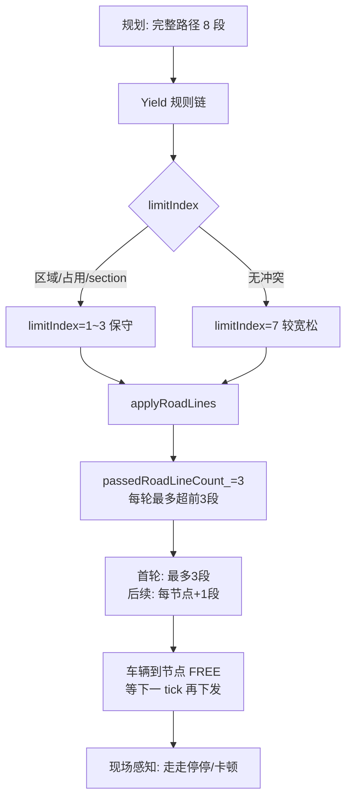

## 排查结论

日志里下午多次测试（主要在 **15:01–15:46**，16:00 前后 core 几乎没有新的 `[route] [dispatch]` 记录）显示：**规划层一次性给出了完整路径，但交通管制的分段下发策略导致车辆在每个节点停顿后再拿下一段**。地图 `wa.roadnet` 本身没有问题。

---

### 1. 地图：路径连通正常

`core/conf/wa.roadnet` 中目标链路完整存在：

| 路段                | 边          |
| ----------------- | ---------- |
| Wa_P_35 → Wa_P_25 | Wa_L_35_25 |
| Wa_P_25 → Wa_P_45 | Wa_L_25_45 |
| Wa_P_45 → Wa_P_46 | Wa_L_45_46 |
| Wa_P_46 → Wa_P_47 | Wa_L_46_47 |

规划日志也一次性输出了完整路径，例如 15:01:35：

```
Wa_P_24 → Wa_P_35 → Wa_P_25 → Wa_P_45 → Wa_P_46 → Wa_P_47 → ...
```

地图文件里 `"areas": []`，**限制区来自场景配置**（日志中有 `RestrictedArea:限制区1辆车 vehicleLimit:1`），不是 roadnet 文件定义的。

---

### 2. 日志证据：分段下发模式

以 **15:01:35** 一次较典型的测试（S800_3#，`limitIndex=7`，无区域阻塞）为例：

| 时间       | 位置      | sendIndex | limitIndex | 本次下发                       |
| -------- | ------- | --------- | ---------- | -------------------------- |
| 15:01:35 | Wa_P_24 | 2/7       | 7          | **3段**：24→35, 35→25, 25→45 |
| 15:01:45 | Wa_P_25 | 3/7       | 7          | **1段**：45→46               |
| 15:01:49 | Wa_P_45 | 4/7       | 7          | **1段**：46→47               |

对应你关心的 **35→25→45→46→47**：

- 第一次下发了 **35→25、25→45**（2 段），**不含** 45→46、46→47
- 到 **Wa_P_25** 才下发 45→46
- 到 **Wa_P_45** 才下发 46→47

车辆在节点处会进入 FREE，等下一 tick 再拿路径，表现为**走走停停**。

当 **S800_4# 停在 Wa_P_45** 时更严重（14:27:46、15:11:07）：

```
[yield] [area] restricited can not enter, vehicle:S800_3# index:1 road:Wa_P_25-Wa_P_45
limitIndex:1
dispatchBatch: 24→35, 35→25   （仅2段，25→45 被挡住）
```

S800_3# 到 **Wa_P_25** 后必须等 S800_4# 离开限制区，才能继续。

---

### 3. 根因 A（主因）：`passedRoadLineCount_ = 3` lookahead 限制

```21:22:core/module/traffic/include/traffic/traffic_control_service_regulation.hpp
            int maxApplyRoadLineCount_ = 5;
            int passedRoadLineCount_   = 3;
```

`applyRoadLines()` 中核心约束：

```1583:1591:core/module/traffic/src/traffic_control_service_regulation.cpp
    for (int index = 0; index < maxApplyRoadLineCount_; ++index) {
        const int prospectiveSend = sendIndex + 1;
        const int effectiveStep = (control->stepId < 0) ? 0 : control->stepId;
        if (prospectiveSend - effectiveStep >= passedRoadLineCount_) {
            break;
        }
        if (prospectiveSend > limitIndex) {
            break;
        }
```

含义：**已下发段数相对当前 stepId 最多超前 3 段**。

- 从 Wa_P_24 出发（stepId=-1→0）：首轮最多发 **3 段**（24→35→25→45），**发不到** 45→46、46→47
- 到 Wa_P_25（stepId=1, sendIndex=2）：gap=2，只能再发 **1 段**
- 到 Wa_P_45（stepId=2, sendIndex=3）：同样只能再发 **1 段**

因此 **35→25→45→46→47 这 4 段直线路径不可能一次全下发**，这是代码设计行为，不是规划 bug。

---

### 4. 根因 B（测试场景加剧）：场景 RestrictedArea + 双车

`AreaYieldRegulation` 在 `Wa_P_25-Wa_P_45` 处截断：

```52:53:core/module/traffic/include/traffic/regulations/yield_area.hpp
                                SPDLOG_INFO("[traffic] [control] [regulation] [area] restricited can not enter, vehicle id:{} index:{} road:{}-{}", 
                                    context.vehicle()->id, indexSelected, roadLine->startPos.id, roadLine->endPos.id);
```

触发条件：

- 场景配置了 **RestrictedArea（vehicleLimit=1）**，覆盖 25→45 走廊
- **S800_4# 空闲停在 Wa_P_45**，占用限制区名额
- `canEnter()` 返回 false → `limitIndex` 被压到 **1**

此时首轮只能发 **24→35、35→25**，到 Wa_P_25 必须停车等待。

另外还有 **position occupied yield**（15:11:07，S800_4# 在 Wa_P_45-Wa_P_46 处占用）和 **opposite route section** 冲突，进一步压低 `limitIndex`。

---

### 5. 因果链（简图）



---

### 6. 建议

**若目标是让 35→25→45→46→47 尽量一次下发：**

1. **调大 `passedRoadLineCount_`**（例如 5 或按场景可配置），使直线路径 4 段能在一个 batch 内发出；需评估碰撞/占用安全边界。
2. **检查场景 RestrictedArea**：
   - 限制区是否过大（Wa_P_45 停车即阻塞整段 25→45）
   - 测试时 S800_4# 是否应移出 Wa_P_45，或提高 `vehicleLimit`
3. **双车测试**：S800_4# 在走廊内有任务/占位时，position occupied 和 route section 会进一步限制下发，属预期交管行为。

**地图 `wa.roadnet` 无需修改**；问题在 **交通管制下发策略（passedRoadLineCount_）** 和 **场景限制区/双车占用**，不是路径规划或地图连通性。

---

如需，我可以基于上述分析直接改一版（例如把 `passedRoadLineCount_` 做成 scene 可配置项，或针对无冲突直线路径放宽 lookahead），并加对应单元测试。
