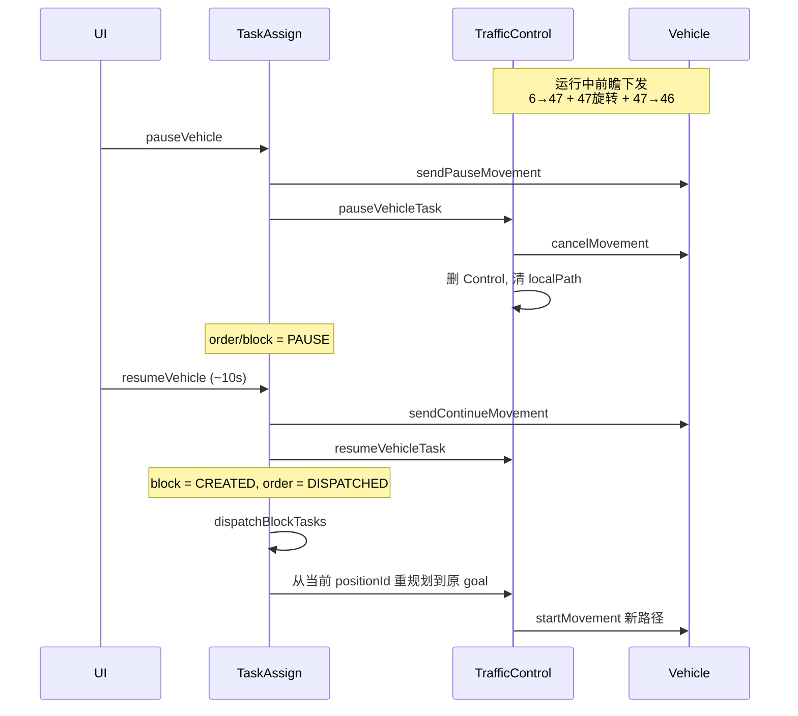

**结论：恢复不是接着发「还没走完的那几段旧指令」，而是取消当前运动、丢掉交管现场，再从车辆当前上报点位重新规划并重新下发。**

你描述的「快到 47 时已经下发了 47 点旋转 + 去 46 的移动」，是暂停前的**前瞻下发**；点恢复后，调度会按**当前 `positionId` 到原目标**重新算路，再走一遍 `applyRoadLines`。

---

## 1. 暂停前：为什么已经发了「47 旋转 + 去 46」

交管不会等车到了 47 才发下一段。每个 tick 用 `applyRoadLines` 按 `sendIndex / limitIndex / lookahead` 把后面几段一次性打进 `startMovement`。

`startMovement` 对每一段会先看进点朝向差，超过 `rotateYawLimit` 就在该点插一段旋转，再发移动：

```244:247:core/module/domain/include/vehicles/vehicle_command_sender.hpp
                if (rotateYaw != DBL_MAX) {
                    hasTask = true;
                    addRotatePath(moveTask, vehicle, roadLine->startPos, direction, rotateYaw, rotateRadLimit, i, roadLine);
                }
```

所以车还在 **6→47** 上时，一批指令里完全可能已经包含：

1. 6 点旋转（如需要）
2. 6→47 移动
3. **47 点旋转**（47→46 进向与 6→47 出向不一致时）
4. **47→46 移动**

这是正常前瞻，不是暂停触发的。`20260807` 里同类日志（`testQrMap0729`，S800_4#，15:20:09）就是车还在 `P_6` 时已经发出 `P_6 旋转 + P_6→P_5→P_4→P_3`。

---

## 2. 点暂停时发生了什么

API：`pauseVehicle` → 车体 `sendPauseMovement` + `pauseOrder`。

对正在跑的 block，交管会：

1. **`cancelMovement`**（立刻停，不靠车体自己消化剩余路径）
2. 把 block 标成 `PAUSE`
3. **从交管表删掉 Control**（`delTraffic` / `blockTaskManager_.remove`）
4. **清空 `localRoadLines` / section**（`clearVehicleTrafficRuntime`）

`20260807` 15:20:31 暂停时：

```
pauseVehicle S800_4#
cancelMovement sent.  (连续两次)
block af25bc... PAUSE
order ... PAUSE
control ---  (section is empty)
```

此时车上那批「47 旋转 + 去 46」被取消。调度侧**不再保留**旧的 `sendIndex`、已发路段、localPath。订单还在，目标还在，但交管现场没了。

暂停期间 `dispatchBlockTasks` 看到 `block is paused` 会跳过，不会再下发。

---

## 3. 点恢复后如何「续传」

API：`resumeVehicle` → 车体 `sendContinueMovement` + `resumeOrder`。

`resumeOrder` 本身**不下发路径**，只做状态复位：

```249:256:core/module/task_assign/src/task_assign_service.cpp
            for (const auto& blockTask : order->getBlockTasks()) {
                if (blockTask->state == TaskState::PAUSE) {
                    trafficControl_->resumeVehicleTask(order->id, blockTask->id, blockTask->vehicleId);
                }
            }
            order->state = TaskState::DISPATCHED;
```

`resumeVehicleTask` 把 block 改回 **`CREATED`**，并确保交管里没有旧条目：

```356:367:core/module/traffic/src/traffic_control_service_regulation.cpp
bool RegulationTrafficControlService::resumeVehicleTask(...) {
    if (blockTaskManager_.exist(subtaskId)) {
        blockTaskManager_.remove(subtaskId);
    }
    onSubtaskStateChanged(orderId, subtaskId, TaskState::CREATED);
    return true;
}
```

真正重新下发发生在**下一轮派单循环**（约 1s 内）：

| 步骤  | 行为                                                       |
| --- | -------------------------------------------------------- |
| 1   | `dispatchBlockTasks` 看到 block=`CREATED` 且交管里没有该 block    |
| 2   | `dispatchTask`：从**当前 `vehicle->positionId()`** 规划到原 goal |
| 3   | `addVehicleTask` 挂回交管，`sendIndex=-1`                     |
| 4   | 下一拍 `runBlockTask` / `addRouteToControl` 生成新 `roadLines` |
| 5   | `applyRoadLines` 从 0 开始前瞻下发，`startMovement` 再组旋转+移动      |

`pause_resume_dispatch.hpp` 专门允许 `CREATED` 时即使交管里还有残留也不跳过，避免恢复后派不出去。

---

## 4. 用 15:20 日志对照你的 6→47→46

`logs/20260807` 没有 `Wa_P_47/P_46`，对应实验是 `testQrMap0729` 的 **P_6 → P_2**，暂停约 21 秒（15:20:31 → 15:20:52）。机制相同。

**暂停前（15:20:09，车还在 P_6）：**

- 规划：`P_6 → P_5 → P_4 → P_3 → P_2`
- 一次下发：`P_6 旋转 + P_6→P_5→P_4→P_3`（`sendIndex:2/3`）

**暂停时（15:20:31）：**

- 车已走到 **`P_4`**（`positionId:testQrMap0729_P_4`，`localPath size:13`）
- `cancelMovement`，control 清空

**恢复后（15:20:52 → 15:20:53）：**

```
block CREATED → order DISPATCHED
dispatch: plan from P_4 to P_2
newPlanned: P_4 → P_3 → P_2
sendIndex:-1 → applyRoadLines
下发: P_4→P_3、P_3→P_2、终点 P_2 旋转
new movement task result:true
```

也就是说：

- **不会**接着发「旧批次里还没执行的 47 旋转 / 去 46」
- **会**以暂停结束时上报的站点为起点，把**剩余路径重新规划、重新打包**再发

对应到你的例子：

- 若暂停后上报仍是 **6**：恢复后从 6 重规划，可能再次出现「6 旋转 + 6→47 + 47 旋转 + 47→46」
- 若车已到 **47**（或上报已是 47）：从 47 重规划，通常变成「47 旋转（如需要）+ 47→46 + 后续」
- 若停在 6、47 之间但 `positionId` 仍是 6：按 6 重规划；车体 `sendContinueMovement` 只是协议层继续，**路径以 Core 新发的 `new movement task` 为准**

---

## 5. 流程串起来



---

## 6. 和「续传」容易混淆的两点

1. **`sendContinueMovement` 不是续发剩余路段。** 它只通知车体退出暂停；真正路径是随后的 `new movement task`。暂停时已经 `cancelMovement`，旧任务在车上作废。
2. **`sendIndex` 不会从暂停前接着加。** Control 被删掉后，恢复时 `sendIndex` 从 `-1` 重新累计。日志里恢复后是 `step:-1, send:-1`，然后一次性 `sendIndex:1/1`。

所以：暂停时已经发出的「47 旋转 + 去 46」会被取消；恢复后调度按**当前点位重新规划剩余路**，再按同样的前瞻规则重新下发旋转和移动。
