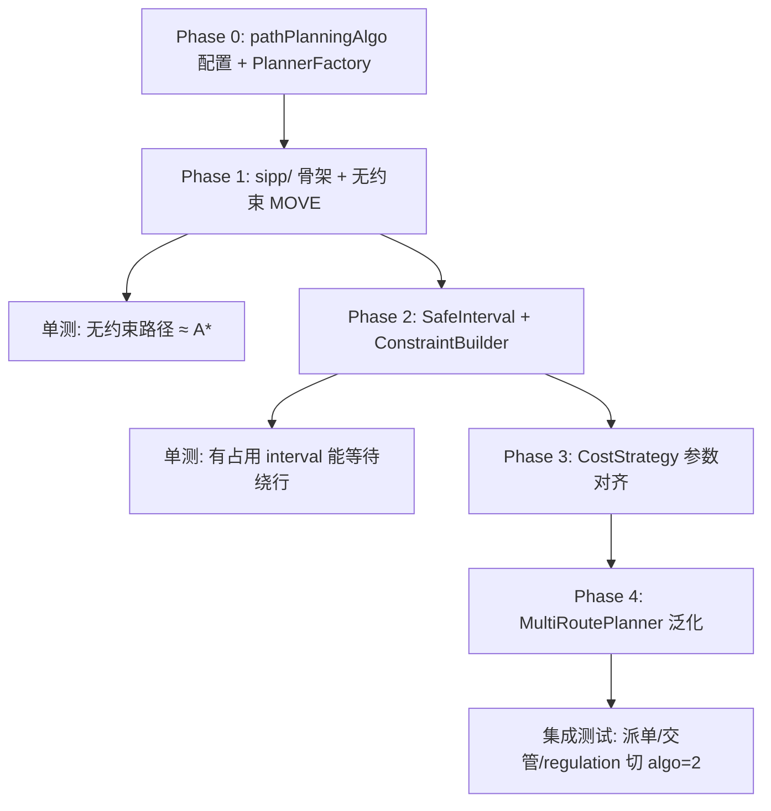

# sipp

下面是对「在 Core 内重写 SIPP 备选算法 + 配置切换」的完整拆解。先说明一个关键前提，再分阶段实施。

## 1. 现状与核心差距

### Core 现有路径规划

| 维度   | Core（A*）                          | Haiq（SIPP）                                   |
| ---- | --------------------------------- | -------------------------------------------- |
| 入口   | `planning::plan()` in `utils.hpp` | `SafeIntervalPP::findPath()`                 |
| 抽象   | `GlobalPlanner` 接口                | 独立类，不继承统一接口                                  |
| 图模型  | `Position`（路网点 ID）                | `StateID`（点位 + 姿态/底盘状态）                      |
| 边    | `RoadLine`（距离、方向、旋转边）             | `StateEdge`（多种 motion type + 通行时间）           |
| 时间   | 纯空间代价，`Route.positionCosts` 是累计代价 | `g` = 到达时间，Safe Interval 约束                  |
| 约束   | `CostStrategy`（旋转、禁行点等）           | `Constraint` + `MapModifier` 改 safe interval |
| 输出   | `Route`（点序列 + cost）               | `PathNodes`（点/边 + `TimeWindow`）              |
| 任务类型 | 起终点规划                             | MOVE / AVOID / EXPEL 等多种 Agent               |

当前所有调用方（派单、闲时、充电、交管）都走 `planning::plan()`，内部**硬编码** `AStarPlanner`：

```49:52:core/module/planning/include/planning/utils.hpp
        std::shared_ptr<planning::AStarPlanner> planner = std::make_shared<planning::AStarPlanner>();
        for(auto& strategy : strategies) {
            planner->registerStrategyBack(strategy);
        }
```

配置已有 `routePlanning` 分组（旋转/速度系数），但**没有**算法选择项：

```135:137:core/module/scene/include/scene/config.hpp
        const std::string routePlanning_vehicleRotateFactor = "vehicleRotateFactor";
        const std::string routePlanning_vehicleRotationalSpeedFactor = "vehicleRotationalSpeedFactor";
        const std::string routePlanning_vehicleTravelSpeedFactor = "vehicleTravelSpeedFactor";
```

### Haiq SIPP 算法骨架（需移植的核心）

`SafeIntervalPP` 主流程（约 420 行）可拆为 6 块：

1. **地图预处理** — `MapModifier`：删禁行点、恢复起终点、注入约束 safe interval  
2. **init** — 从已下发路径末尾作为搜索起点  
3. **主循环** — open set 弹出 `(state_id, interval_index)`，扩展邻居各 interval  
4. **expand** — 计算等待时间 + 通行时间，判断是否能在 safe interval 内通过  
5. **isTerminateSearch** — 到达目标 / 避让完成等终止条件  
6. **genPath** — 回溯生成带 `TimeWindow` 的路径，拼接已下发段  

Haiq 依赖较多外围模块（`Map`、`EquipManager`、`EquipRegister`、`Agent`、`Constraint`），**不能直接把 Haiq 链进 Core**，需要在 Core 内用 `RoadNetMap` / `Vehicle` 做适配层，算法逻辑在 `sipp/` 文件夹里重写。

---

## 2. 推荐目录结构

```
core/module/planning/
├── include/planning/
│   ├── planner_factory.hpp          # 按配置创建 GlobalPlanner
│   ├── path_planning_algo.hpp       # enum: AStar=1, Sipp=2
│   ├── sipp/
│   │   ├── sipp_types.hpp           # NodeKey, Node, TimeWindow, SafeInterval, Constraint
│   │   ├── sipp_graph.hpp           # 搜索图抽象（邻接、边耗时）
│   │   ├── road_net_graph_adapter.hpp  # RoadNetMap → SippGraph
│   │   ├── safe_interval_map.hpp    # plan 节点 safe interval 管理
│   │   ├── map_modifier.hpp         # 临时删点/改 interval（RAII 恢复）
│   │   ├── constraint_builder.hpp   # 从交管/其他车 reservation 构建 Constraint
│   │   ├── safe_interval_planner.hpp # SafeIntervalPP 核心（port）
│   │   ├── path_converter.hpp       # PathNodes → Route
│   │   └── sipp_planner.hpp         # 实现 GlobalPlanner
│   └── ... (现有 planner_a_star.hpp 等)
└── src/sipp/
    ├── safe_interval_planner.cpp
    ├── road_net_graph_adapter.cpp
    ├── path_converter.cpp
    └── sipp_planner.cpp
```

原则：**算法纯逻辑放 `sipp/`，对外只暴露 `SippPlanner : GlobalPlanner`**，与 A* 并列。

---

## 3. 分阶段实施计划

### Phase 0：配置与工厂（1–2 天，零算法风险）

**目标**：加开关，默认仍为 A*，行为不变。

| 改动点                       | 内容                                                                 |
| ------------------------- | ------------------------------------------------------------------ |
| `config.hpp`              | 增加 `routePlanning_pathPlanningAlgo = "pathPlanningAlgo"`           |
| `systemParams.json`       | `routePlanning` 组新增项：`type=int`, `defaultValue=1`, `options=[1,2]` |
| `http_server_api.cpp`     | 校验 `pathPlanningAlgo ∈ {1,2}`                                      |
| `path_planning_algo.hpp`  | `enum class PathPlanningAlgo { AStar = 1, Sipp = 2 }`              |
| `planner_factory.hpp`     | `createPlanner(algo)` → `AStarPlanner` 或 `SippPlanner`             |
| `utils.hpp`               | 两处 `make_shared<AStarPlanner>()` 改为 factory                        |
| `multi_route_planner.hpp` | `AStarPlanner` → `GlobalPlannerPtr`（否则 multiPlan 无法切 SIPP）         |

读取方式：

```cpp
auto algo = static_cast<PathPlanningAlgo>(
    scenes::routePlanning<int>(scenes::keys::routePlanning_pathPlanningAlgo, 1));
```

---

### Phase 1：SIPP 骨架 + 图适配（3–5 天）

**目标**：`SippPlanner` 能跑通「无约束、单目标 MOVE」场景，输出与 A* 等价的 `Route`。

#### 1.1 类型定义（`sipp_types.hpp`）

从 Haiq 移植并简化：

```cpp
struct NodeKey { std::string positionId; int intervalIndex; };
struct Node { std::optional<NodeKey> parent; double travelTime, g, h, sumTravel; bool hasVelocity; };
struct TimeWindow { double startLock, in, out, endLock; };
using SafeInterval = std::pair<double, double>;  // [start, end)
using Constraint = std::unordered_map<std::string, std::vector<SafeInterval>>; // positionId → blocked intervals
```

#### 1.2 图适配（`road_net_graph_adapter.hpp`）

把 `RoadNetMap` 映射为 SIPP 需要的接口：

| SippGraph 方法                       | Core 对应                                               |
| ---------------------------------- | ----------------------------------------------------- |
| `outNodes(posId)`                  | 遍历 `roadLines_`，找以该点为起点的边                             |
| `edgeTravelTime(from, to, hasVel)` | `RoadLine.dis / speed`，旋转边用 `RotationCostStrategy` 逻辑 |
| `heuristic(from, to)`              | 曼哈顿距离 / 速度（对齐现有 `ManhattanDistanceHeuristicStrategy`） |
| `planNodeId(posId)`                | MVP 阶段 **1:1 映射**（Position = PlanNode）                |
| `safeIntervals(planNodeId)`        | 默认 `[{0, MAX_TIME}]`                                  |

**重要简化**：Core 的图节点是 `Position`（无姿态维度），Haiq 的 `StateID`（含朝向）在 MVP 先不做展开；旋转代价仍可通过边类型 `RoadType::ROTATE` 体现。

#### 1.3 核心算法（`safe_interval_planner.cpp`）

按 Haiq 顺序重写，先只支持 **AgentType::MOVE**（有明确 target）：

```
findPath(context, constraint)
  → MapModifier 预处理（禁行点 = ForbiddenCostStrategy 等价物）
  → init(start = context.start, issuedPath = 空)
  → while open not empty:
       pop → isTerminate? → genPath
       for neighbor in outNodes:
         for each safe_interval of neighbor:
           expand(wait + travel time)
  → path_converter → Route
```

可先**不实现** Haiq 的 AVOID / EXPEL / AVOIDALLEY / AVOIDBACK（Core 的避让/推送走交管层，不是 planning::plan）。

#### 1.4 输出转换（`path_converter.hpp`）

```cpp
Route route;
route.positions = [...];           // 从 PathNode 提取 positionId
route.positionCosts[i] = node.g;   // 到达时间作为 cost（与 A* 语义略有不同，需文档说明）
route.cost = 末点 g;
```

Core 下游（`addRouteToControl`）目前用 `positionCosts` 做 timed route，SIPP 天然产出时间，这是优势。

#### 1.5 单元测试

- 参考 `test_planning.cpp` 用同一套 roadnet fixture  
- 无约束时 SIPP 与 A* 路径代价应接近（允许 tie-break 差异）  
- 参考 Haiq `sipp.t.cpp` 移植「有约束 interval」用例  

---

### Phase 2：约束与 Safe Interval（5–8 天，SIPP 真正价值）

**目标**：SIPP 能在有其他车占用时规划「等一等再走」的路径。

#### 2.1 Safe Interval 来源

Haiq 由 `MapModifier::modifySafeIntervals(constraint)` 注入；Core 需新建 `ConstraintBuilder`：

| 约束来源     | 构建方式                                                                                |
| -------- | ----------------------------------------------------------------------------------- |
| 其他车已下发路径 | 从 `Vehicle::timedRoute()` 或 section reservation 提取 `(positionId, [t_start, t_end])` |
| 禁行/占用点   | `ForbiddenCostStrategy` 中的 position → 全时段 block                                     |
| 空间干涉扩展   | Haiq 的 `transToInflConstraints` + `collPlanIDs`；Core MVP 可 1:1 映射，不做碰撞扩展            |

#### 2.2 MapModifier（RAII）

```cpp
class MapModifier {
  MapModifier(SafeIntervalMap& map);
  void removeNodes(const std::set<std::string>& ids);
  void modifySafeIntervals(const Constraint& c);
  ~MapModifier(); // 恢复
};
```

与 Haiq 一致：**每次规划**创建、析构时恢复，不影响全局地图。

#### 2.3 已下发路径拼接

Haiq `init()` 从 `robot().states_issued.back()` 起步，并拼接 `path_nodes`。

Core 对应：

- 从 `Vehicle` 当前 `positionId` + 已在执行的 control 路径末点作为起点  
- `genPath()` 里 locked 段 `start_lock_time = 0` 的逻辑需对齐  

这是与 Haiq 差异最大的集成点，建议在 `SippPlanner::plan()` 里从 `PlanContext` 扩展字段（或新建 `SippPlanContext : PlanContext`）传入 issued path。

---

### Phase 3：与现有 CostStrategy 对齐（2–3 天）

A* 通过策略链叠加代价：

```cpp
TravelCostStrategy, RotationCostStrategy, ForbiddenCostStrategy
```

SIPP 的 g 是**时间**，策略需映射：

| CostStrategy             | SIPP 映射                                      |
| ------------------------ | -------------------------------------------- |
| `TravelCostStrategy`     | 边 `travel_time = dis / (speed * factor)`     |
| `RotationCostStrategy`   | 旋转边额外 time                                   |
| `ForbiddenCostStrategy`  | `MapModifier::removeNodes` 或全 block interval |
| `pathAvoid` 等 traffic 配置 | 通过 `ConstraintBuilder` 注入                    |

不建议让 SIPP 直接复用 `CostEvaluator`（空间 cost vs 时间 g 语义不同），而是**在 adapter 层读取相同 config**。

---

### Phase 4：MultiRoutePlanner 与调用方（2 天）

`MultiRoutePlanner` 目前绑定 `AStarPlanner`：

```19:21:core/module/planning/include/planning/multi_route_planner.hpp
            std::shared_ptr<AStarPlanner> planner_; 
        public:
            MultiRoutePlanner(std::shared_ptr<AStarPlanner> planner) : planner_(planner){ }
```

改为 `GlobalPlannerPtr`，push 避让等 multiPlan 场景也能切 SIPP。

调用方**无需改动**（仍调 `planning::plan()`），只要 factory 读配置即可。

---

## 4. Haiq → Core 函数级对照表

| Haiq                       | Core `sipp/` 对应                 | 备注                                |
| -------------------------- | ------------------------------- | --------------------------------- |
| `SafeIntervalPP::findPath` | `SafeIntervalPlanner::findPath` | 主入口                               |
| `init`                     | 同                               | 起点 = 当前/已下发末点                     |
| `expand`                   | 同                               | 核心：wait + travel vs safe interval |
| `insertNode`               | 同                               | open/close map 更新                 |
| `isTerminateSearch`        | 简化版                             | 仅 target 到达                       |
| `genPath`                  | 同 + `PathConverter`             | 输出 Route                          |
| `predH`                    | `SippGraph::heuristic`          | 曼哈顿/速度                            |
| `transToInflConstraints`   | Phase 2 可选                      | 有碰撞组再做                            |
| `verifyResult`             | 可选                              | Dijkstra 连通性诊断                    |
| `MapModifier`              | 同                               | RAII                              |
| `Map` / `stateNode`        | `RoadNetGraphAdapter`           | 最大适配工作量                           |
| `EquipManager` / `Agent`   | `PlanContext` + `Vehicle`       | 简化 Agent 模型                       |

---

## 5. 风险与决策建议

### 5.1 图模型粒度

- **方案 A（推荐 MVP）**：Position 即 State，不做朝向展开 → 实现快，与现有 A* 图一致  
- **方案 B（完整）**：每点按 yaw 离散成多 State → 更接近 Haiq，工作量大，需改 roadnet 邻接构建  

建议先做 A，配置项先上线；验证效果后再考虑 B。

### 5.2 无约束时 SIPP ≈ A*

若 Phase 2 约束源未接好，SIPP 退化为「带时间戳的 A*」，与 A* 路径几乎相同。要体现 SIPP 价值，**Phase 2 是必做**，否则配置切换意义不大。

### 5.3 不建议 перв pass 移植的部分

Haiq 中与 Core 架构不对齐、可延后的逻辑：

- `AgentType::AVOID*` / `EXPEL`（Core 交管负责）  
- `avoid_pass_ids` / `dir_perf` 运动偏好惩罚  
- `collPlanIDs` 空间干涉扩展（Core 无 plan node 碰撞组）  
- CCBS 多机联合规划（Haiq PBS 层，超出单车 planner 范围）  

### 5.4 CMake

`planning/CMakeLists.txt` 现为 `aux_source_directory(src)`，新增 `src/sipp/*.cpp` 会自动编入；若用 header-only 则只加 adapter 的 .cpp。

---

## 6. 建议实施顺序（里程碑）



| 里程碑 | 交付物                     | 验收标准                         |
| --- | ----------------------- | ---------------------------- |
| M0  | 配置 + factory            | `pathPlanningAlgo=1` 行为与现网一致 |
| M1  | `sipp/` + `SippPlanner` | `algo=2` 能规划简单起终点，返回合法 Route |
| M2  | 约束集成                    | 有其他车 reservation 时能规划等待路径    |
| M3  | multiPlan 支持            | push 避让场景可用 SIPP             |
| M4  | 文档 + 默认仍 A*             | 生产默认 `1`，灰度切换 `2`            |

---

## 7. 配置项示例

`systemParams.json` 新增（Engine DefaultConfig + 部署同步）：

```json
{
  "module": "core",
  "group": "routePlanning",
  "key": "pathPlanningAlgo",
  "description": "路径规划算法：1=A*，2=SIPP",
  "type": "int",
  "value": "1",
  "defaultValue": "1",
  "minValue": "1",
  "maxValue": "2"
}
```

---

如果你准备开始实现，建议从 **Phase 0 + Phase 1 的 `sipp_types` / `road_net_graph_adapter` / `safe_interval_planner`（无约束版）** 入手；需要我按 Phase 0 直接改代码的话，切换到 Agent 模式即可。


# control right lost handle

已实现，变更如下，供你审阅。

## 实现摘要

### 1. `pauseOrderForControlLost` — 只挂任务，不 cancel

- 将 order/block 置为 `PAUSE`、写 DB、保留车辆绑定
- 调用 traffic 的 `pauseVehicleTaskForControlLost`（释放 traffic，**不发** `cancelMovement`）
- **不调用** `abortVehicleMovement`

### 2. `pauseVehicleOrdersForControlLost`

- 用 `resolvePauseOrderIds` 解析所有应挂起订单（比仅用 `vehicle->orderId()` 更稳）
- 对每个 order 调用 `pauseOrderForControlLost`

### 3. `dispatchBlockTasks` 顺序调整

- **控制权检查移到 `orderTake` gate 之前**
- RTT 抢控边沿：`pauseVehicleOrdersForControlLost` + 打日志（不 cancel）
- MRCS 回归边沿：`resumeVehicleOrders`（替代仅 `resumeOrder(orderId)`）
- 去掉 `stopVehicleOnMrcsControlLost`（cancelMovement）

### 4. Traffic 层

- 新增 `pauseVehicleTaskForControlLost`（1 参 / 3 参），逻辑同 pause，但跳过 `stopVehicleOnTaskCancel`

### 5. 头文件整理

| 文件                              | 作用                                                             |
| ------------------------------- | -------------------------------------------------------------- |
| `mrcs_control_lost_suspend.hpp` | `shouldSuspendTaskOnControlLost`、`logTaskSuspendOnControlLost` |
| `control_lost_pause.hpp`        | `evaluateControlRightDispatchEdge`（可单测的 dispatch 决策）           |
| `mrcs_control_lost_stop.hpp`    | 兼容转发到新头文件                                                      |

## 行为对照（需求）

```
RTT 抢控 (MRCS→RTT 边沿)
  → pauseVehicleOrdersForControlLost
  → order/block = PAUSE，traffic 释放
  → 不 cancel（车端到下一站停车 → FREE）
  → 任务绑定保留，MRCS 回归后 resumeVehicleOrders 恢复
```

## 单元测试

| 测试                                | 断言                                   |
| --------------------------------- | ------------------------------------ |
| `test_control_lost_pause.cpp`     | 18 条 — dispatch 边沿决策、orderTake 前处理契约 |
| `test_mrcs_control_lost_stop.cpp` | 15 条 — 挂起边沿、仅日志不 cancel              |

运行结果：**全部通过**。

```bash
/home/wp/Documents/Matrix/core/build/module/task_assign/unit_tests/unit_tests_control_lost_pause
/home/wp/Documents/Matrix/core/build/module/traffic/unit_tests/unit_tests_mrcs_control_lost_stop
```

## 主要改动文件

- `core/module/task_assign/src/task_assign_service.cpp`
- `core/module/task_assign/include/task_assign/task_assign_service.hpp`
- `core/module/task_assign/include/task_assign/control_lost_pause.hpp`（新）
- `core/module/traffic/src/traffic_control_service_regulation.cpp`
- `core/module/traffic/include/traffic/traffic_control_service_regulation.hpp`
- `core/module/traffic/include/traffic/mrcs_control_lost_suspend.hpp`（新）
- 单元测试与 `CMakeLists.txt`

**说明**：人工 pause / offline / cancel 仍走原 `pauseOrder`（含 cancel）；仅 RTT 抢控走新路径。如需我补充集成测试或 Engine 侧验证步骤，可以继续说。

当前项目的.gitignore文件填写我不太满意，我只把以下几个根目录下的文件夹代码进行版本管理：core/engine/deployKit/electronUI/h5UI/webUI/matrix_install_deploy，不想每次在根目录下新增类似于ess/Haiq/logs这些文件夹的时候手动填写到.gitignore文件中，维护成本有点高，帮我调整一下当前gitignore文件内容，保证技能不改变我们当前仓库已追踪的文件，未来我在根目录新增其他文件夹也不需要反复修改.gitignore文件
