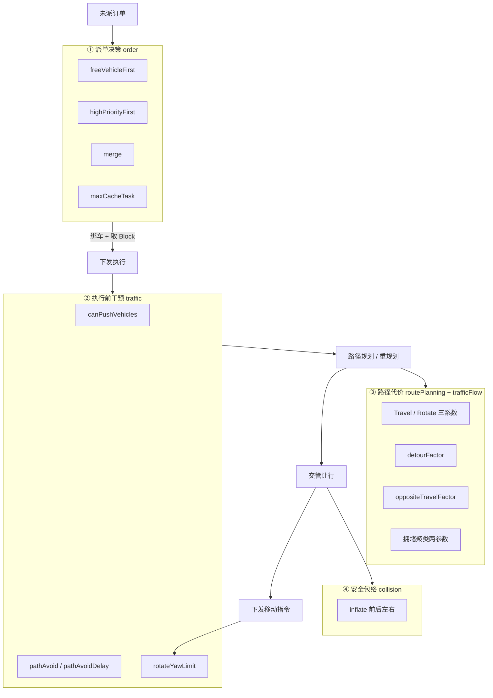
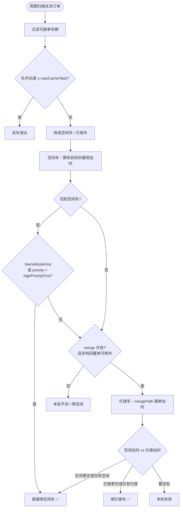
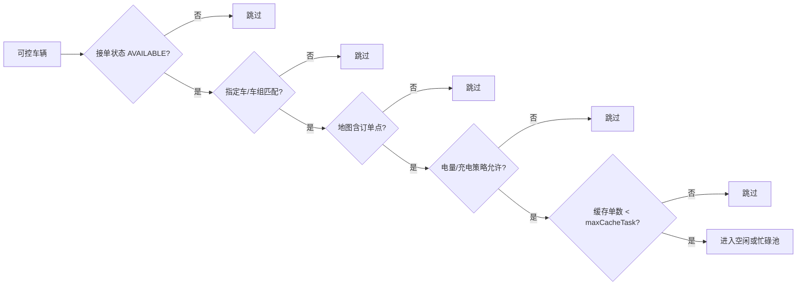
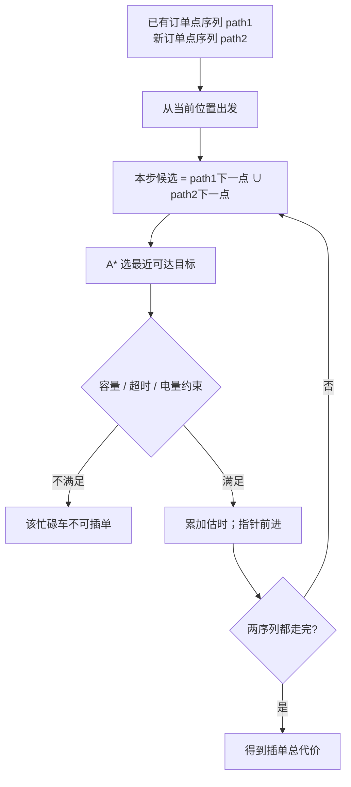
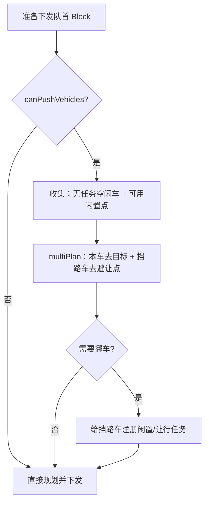
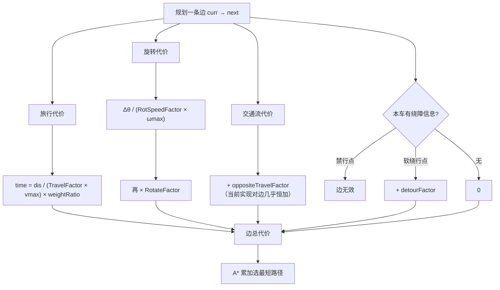
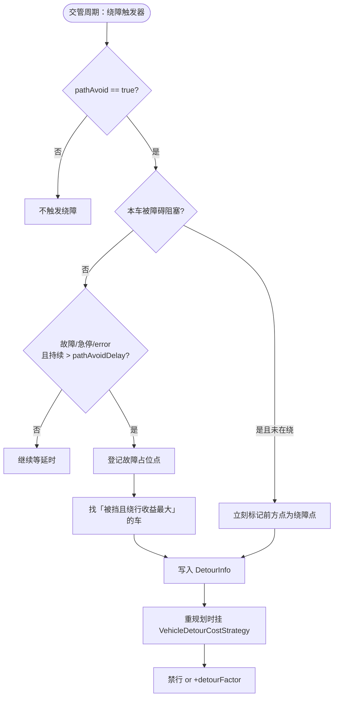
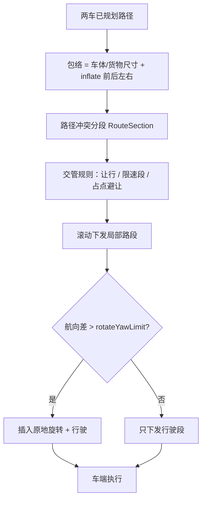
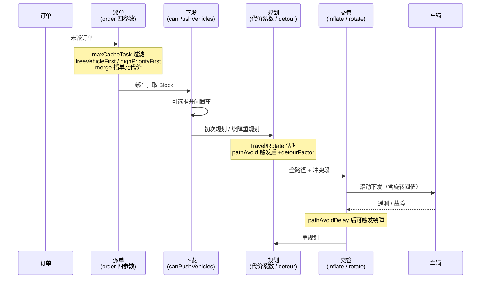

下面按**讲座叙事**整理：先总图，再五条算法主线。每张图都能单独讲 3–5 分钟。

---

## 讲座开场：参数落在哪一层

一句话：**参数不改车端物理速度，改的是 Core「选谁、选哪条路、何时让行/绕障」的决策。**

**讲法提示**：先让听众记住四层——**派谁 → 要不要推/绕 → 路怎么计价 → 包络多大**。

---

## 主线一：派单算法（最常问）

**对应参数**：`freeVehicleFirst` · `highPriorityFirst` · `merge` · `maxCacheTask`

### 1.1 总流程（讲座主图）

### 1.2 可接单过滤（讲 `maxCacheTask` 时展开）

### 1.3 拼单 `mergePath`（讲 `merge=true` 时展开）

**口播金句**：  
`freeVehicleFirst` 是「有空车先用空车」；`merge` 是「没空车或关掉空车优先时，允许在途插单」；`maxCacheTask` 是「单车口袋容量」。

---

## 主线二：下发前推车

**对应参数**：`canPushVehicles`

**口播**：推车只推「口袋空」的闲置车；干活的车不推，靠交管让行/绕障处理。

---

## 主线三：路径规划代价（选路的尺子）

**对应参数**：`vehicleTravelSpeedFactor` · `vehicleRotationalSpeedFactor` · `vehicleRotateFactor` · `detourFactor` · `oppositeTravelFactor`

**口播对照表**（适合贴幻灯片）：

| 调大参数           | 规划更倾向           |
| -------------- | --------------- |
| TravelFactor   | 觉得「开得慢」→ 更惜路程   |
| RotateFactor   | 更讨厌转弯 → 愿绕直路    |
| RotSpeedFactor | 觉得「转得快」→ 转弯惩罚变小 |
| detourFactor   | 更不愿贴绕障点（软惩罚）    |

---

## 主线四：绕障 / 故障避让

**对应参数**：`pathAvoid` · `pathAvoidDelay` · `detourFactor`  
（拥堵侧：`congestionClusteringDistanceMeter` · `congestionLevelCount`；`slowPenaltyFactor` 当前未接线）

### 4.1 故障/挡路触发（核心）

### 4.2 和拥堵参数的关系（次要支线）

**口播金句**：  
`pathAvoid` 管「开不开绕」；`pathAvoidDelay` 管「故障要僵多久才绕」；`detourFactor` 管「绕的时候有多讨厌原路线」。

---

## 主线五：碰撞膨胀 → 让行 → 旋转下发

**对应参数**：`inflate*` · `rotateYawLimit`

**口播**：inflate 越大越「胆小」；`rotateYawLimit` 越大越「懒得转」（小角度偏差不点转）。

---

## 讲座收束：一张「决策时序」总图

适合最后 2 分钟串场：

---

## 建议讲序（约 25–30 分钟）

| 时长  | 章节         | 只讲这些参数                                                      |
| --- | ---------- | ----------------------------------------------------------- |
| 3′  | 开场四层图      | 全部「归位」                                                      |
| 8′  | 主线一派单      | freeVehicleFirst / highPriorityFirst / merge / maxCacheTask |
| 3′  | 主线二推车      | canPushVehicles                                             |
| 5′  | 主线三代价      | Travel/Rotate 三因子 + detourFactor                            |
| 5′  | 主线四绕障      | pathAvoid / Delay / detour；提一句拥堵两参数                         |
| 4′  | 主线五安全      | inflate* / rotateYawLimit                                   |
| 2′  | 时序收束 + Q&A | 强调：`slowPenaltyFactor`、对向因子当前弱效                             |

如需，我可以把以上内容整理成 `core/docs` 下一份独立培训 Markdown（可直接投影），或导出为分页幻灯结构。
