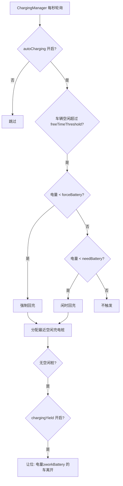

# 1. Charging Params

Matrix Core 的充电参数分为两层：**场景级全局参数**（`charge` 组，影响整个调度策略）和**单车级参数**（每台机器人的 `properties`，影响该车的电量阈值）。核心逻辑在 `ChargingManager` 和 `BatteryCfg` 中。

---

## 一、整体架构



---

## 二、场景级全局参数（`charge` 组）

定义在 `systemParams.json`，通过参数配置界面修改：

| 参数                    | 默认值     | 含义                                                                     |
| --------------------- | ------- | ---------------------------------------------------------------------- |
| **autoCharging**      | `true`  | 自动充电总开关。关闭后 `ChargingManager` 不再生成回充任务，任务分配也不再按 `forceBattery` 拦截低电量派单 |
| **chargingYield**     | `true`  | 充电让位。无空闲充电桩时，是否允许电量已够的车（≥ `chargedOk`）离开，把桩让给更急需充电的车                   |
| **freeTimeThreshold** | `60`（秒） | 空闲多久后才考虑生成回充任务。避免刚完成一单就立刻去充电                                           |
| **fullCharging**      | `false` | 满充模式。开启后部分车辆目标电量会被设为 100% 而非 `chargedFull`                             |
| **fullChargingLimit** | `0`     | 满充模式下，最多允许多少台车同时以 100% 为目标（按车辆列表顺序计数；配置描述里的「秒」应为笔误，实际是**台数**）          |

---

## 三、单车级参数（每台机器人）

存储在场景配置中每台车的 `properties`，运行时写入 `BatteryCfg`：

```9:17:core/module/domain/include/vehicle_types.hpp
struct BatteryCfg {
    bool chargingYield = false;         // 是否开启充电让位
    int minChargeTime = 0;              // 最小充电时长
    int forceBattery = 0;               // 强制充电电量
    int workBattery = 0;                // 可以工作电量
    int needBattery = 0;                // 需要充电电量
    int finishBattery = 0;              // 充电完成电量
    double chargeCRate = 0.0017;        // 充电速率
    double dischargeCRate = 0.0005;     // 放电速率
```

| UI/属性名             | 代码字段             | 默认值    | 实际含义                                                      |
| ------------------ | ---------------- | ------ | --------------------------------------------------------- |
| **chargeForce**    | `forceBattery`   | 50     | **强制充电阈值**。电量低于此值且 `autoCharging` 开启时，**不再接普通业务单**，必须优先回充 |
| **chargeNeed**     | `needBattery`    | 60     | **闲时充电阈值**。车辆空闲超过 `freeTimeThreshold` 后，电量低于此值会触发自动回充     |
| **chargedOk**      | `workBattery`    | 70     | **可工作电量**。充电中达到此值后，可被派新业务单；充电让位时也要求已充到此值以上                |
| **chargedFull**    | `finishBattery`  | 90     | **充电完成目标**。充到此值后停止充电（满充模式下可能改为 100%）                      |
| **minChargeTime**  | `minChargeTime`  | 20     | **最短充电时间**（界面标注为分钟）。设计意图是防止刚插上桩就被让位或打断；参与让位、停止充电等判断       |
| **chargeCRate**    | `chargeCRate`    | 0.0017 | **充电速率**（主要用于仿真），每 tick 增加的电量百分比                          |
| **dischargeCRate** | `dischargeCRate` | 0.0005 | **放电速率**（主要用于仿真），每 tick 消耗的电量，随运行状态有不同系数                  |

### 推荐阈值关系

```
chargeForce ≤ chargeNeed ≤ chargedOk ≤ chargedFull
```

典型配置示例：`50 → 60 → 70 → 90`，表示电量逐级升高时的不同行为边界。

---

## 四、各参数在运行中的具体作用

### 1. 何时触发回充（`ChargingManager::doCharging`）

需同时满足：

- `autoCharging = true`
- 自动模式、MRCS 控权、可接单、无故障/急停
- 无已派发业务单、无进行中充电任务
- 当前不在充电桩上
- 空闲时长 > `freeTimeThreshold`
- 电量 < `chargeForce`（强制）或 < `chargeNeed`（闲时）

### 2. 何时停止充电

- 电量 > `chargedFull`（充电完成）
- 已有新业务单需执行
- 电量 > `chargedOk` 且满足让位/派单条件（可被新任务打断）

### 3. 任务分配中的电量约束

| 场景                                     | 行为                                                  |
| -------------------------------------- | --------------------------------------------------- |
| 电量 < `chargeForce` 且 `autoCharging` 开启 | 不接普通单（`task_assigner_optimize`）                     |
| 正在充电且电量 > `chargedOk`                  | 仍可接单（边充边等任务）                                        |
| 路径规划能量约束                               | 预留 `forceBattery` 作为安全余量（`VehicleEnergyConstraint`） |

### 4. 充电让位（`chargingYield`）

无空闲桩时：

1. 找正在充电、电量 ≥ `chargedOk` 的车
2. 按电量从高到低排序
3. 满足最短充电时间后，命令其 `stopCharge` 离开，把桩让给更急需充电的车

---

## 五、参数配置入口

| 层级  | 配置位置              | 修改方式                                                         |
| --- | ----------------- | ------------------------------------------------------------ |
| 全局  | 参数配置 → `charge` 组 | Web UI / HTTP API                                            |
| 单车  | 场景配置 → 机器人属性      | 机器人管理界面 / `modifyChargeParam` API / 脚本 `setRobotChargeValue` |

Core API 字段映射（HTTP 与 C# 层）：

```
chargeForce  → forceBattery
chargeNeed   → needBattery
chargeOk     → workBattery   (chargedOk)
chargeFull   → finishBattery (chargedFull)
minChargeTime → minChargeTime
```

---

## 六、典型现场调参建议

| 诉求        | 建议调整                                    |
| --------- | --------------------------------------- |
| 车太频繁去充电   | 降低 `chargeNeed`，或增大 `freeTimeThreshold` |
| 低电量仍被派单   | 提高 `chargeForce`，确认 `autoCharging` 已开启  |
| 充电桩经常不够   | 开启 `chargingYield`，适当降低 `chargedOk`     |
| 希望充满再走    | 提高 `chargedFull`，或开启 `fullCharging`     |
| 仿真电量变化不真实 | 调整 `chargeCRate` / `dischargeCRate`     |

如需针对某台车或某个场景的参数做逐项解读，可以告诉我具体配置值。

---

# 2. Didnt stop!!!

方案 1–3 已落地，单测 **19 assertions / 4 cases 全绿**。

### 改动摘要

**1. 终止双保险**（`task_assign_service.cpp`）  
`cancelOrder` / `pauseOrder` 在 block 取消后，对绑定车辆再调 `abortVehicleMovement`；`block.vehicleId` 空时回退 `order.vehicle` / `order.vehicleId`。

**2. 堵住静默失败**  

- 构造时**始终**创建 `vehicleCommandSender_`，并提供 `ensureVehicleCommandSender()`  
- `stopVehicleOnTaskCancel`：sender/vehicle 空、`cancelMovement`/`stopCharge` 失败均打 **ERROR**  
- `doCancelMovement` 失败打 **ERROR**

**3. 放宽门控**（`cancelVehicleTask` / `pauseVehicleTask`）  
CREATED/DISPATCHED/RUNNING/PAUSE 一律 abort；FINISHED/TERMINATED 若车仍 `RUNNING`/`PAUSE` 或 `localPath>0` 仍 abort；`vehicleId` 用 `resolveCancelVehicleId` 回退。

策略抽到可测头文件：`traffic/vehicle_cancel_on_terminate.hpp`  
新增 API：`RegulationTrafficControlService::abortVehicleMovement`

### 单测（审阅）

`core/module/traffic/unit_tests/test_vehicle_cancel_on_terminate.cpp`

- `vehicleNeedsImmediateStop`（含 localPath>0 仍 FREE）  
- `shouldAbortMovementOnTaskCancel`  
- `resolveCancelVehicleId`  
- 复现 16:36:40：RUNNING + localPath=49 → 必须 abort  

运行：`./module/traffic/unit_tests/unit_tests_vehicle_cancel_on_terminate`

### 验收日志（重启加载新 SO 后）

终止后应连续出现：  
`stop vehicle on task cancel` → `cancelMovement sent` → `cancel movement task result:true`，车辆迅速 `FREE` / `localPath:0`。


- [x] 前端调用设置优先级的接口没有生效吗？

- [x] map update issue

根因仍是：旧地图残留 + `sameFloor` 跨地图乱匹配，和之前闲置点跨地图问题同一类。临时止血：重启 core（清空旧 mapId）。根治：切场景卸载旧图，且 `sameFloor`/规划按 `vehicle->mapId`（或 block.goal.mapId）查找。


# Old Map left off

**根治已落地，`matrix_core` 编译通过。** 切场景会卸旧图，查找/派车/闲置充电都按 `vehicle->mapId` 隔离，并支持一场景多图。

### 1. 切场景卸载旧图

`MapManager::updateMap` 在加载新场景地图后，**删除不在新集合中的 mapId**；场景无地图时清空全部。日志会打 `unloading stale mapId:...`。

### 2. `sameFloor` / 点位解析按地图优先

- 新增 `MapManager::findPosition(id, preferredMapId)`：先查优先地图，再扫已加载地图。
- traffic / assign 的 `sameFloor` 改为优先 `vehicle->mapId`（及 goal 的 prefer），避免同名点跨图乱匹配。
- 电梯 `lift`、loadOrders、HTTP/Core 建 block 都改为 `findPosition`，优先车辆绑定地图。

### 3. 多地图派车

`canWorkVehicles`：订单点位必须在 **该车 `vehicle->mapId`** 上存在，否则不接单。不同组绑不同图时，只会派同地图机器人。

### 4. 闲置 / 充电隔离

- `getLeisurePositionsByState` / `getChargePositionsByState` 支持按 `mapId` 过滤。
- 闲置/充电候选与状态更新使用 `mapId|positionId`，避免多图同名点互相覆盖。

### 5. 附带

AddOrder 正确接收 `vehicleGroup`（引擎传组时可用于按组派车）。

**建议验证**：切到只含一张图的场景后日志应出现 unload；两图两车组时，A 图点位只派 A 图车；闲置不再规划到外图 park。


---

# 模板Fn

```cpp
template <typename CancelFn>
inline void applyOrderTakeStateChange(const VehiclePtr& vehicle, OrderTakeState newState, maps::MapManagerRawPtr mapManager, VehicleManager* vehicleManager,
                                      CancelFn&& cancelFn) {
    if (!vehicle) {
        return;
    }
    const OrderTakeState oldState = vehicle->orderTakeState();
    if (oldState == newState) {
        return;
    }

    if (newState == OrderTakeState::UNAVAILABLE) {
        cancelFn(vehicle);
        applyUnavailableLogout(vehicle, mapManager);
        vehicle->setOrderTakeState(OrderTakeState::UNAVAILABLE);
        return;
    }

    vehicle->setOrderTakeState(newState);
    if (oldState == OrderTakeState::UNAVAILABLE) {
        if (vehicle->simulation()) {
            relocalizeSimulationOnline(vehicle, mapManager, vehicleManager);
        }
        // Real AGV: wait for vehicle login / station report before leaving UNKNOWN.
    }
}
```


好的，这段代码定义了一个通用函数，用于**安全地切换车辆（AGV）的订单接单状态**，并在状态变化时执行一系列附带逻辑（如取消任务、重新定位等）。下面我将分模块解释：

---

### 1. 函数模板与参数

```cpp
template <typename CancelFn>
inline void applyOrderTakeStateChange(const VehiclePtr& vehicle, OrderTakeState newState, 
                                      maps::MapManagerRawPtr mapManager, 
                                      VehicleManager* vehicleManager,
                                      CancelFn&& cancelFn)
```

- **模板参数 `CancelFn`**：允许传入任意可调用对象（函数、lambda、函数对象）作为取消回调。
- **参数列表**：
  - `vehicle`：要修改状态的车辆指针（智能指针）。
  - `newState`：目标状态（枚举 `OrderTakeState`）。
  - `mapManager`：地图管理器（裸指针，用于地图相关操作）。
  - `vehicleManager`：车辆管理器指针（用于管理车辆列表）。
  - `cancelFn`：**万能引用**接收的取消回调，用于在车辆变为不可用时执行特定取消逻辑。

---

### 2. 前置检查（防御性编程）

```cpp
if (!vehicle) return;                     // 车辆为空则直接返回
const OrderTakeState oldState = vehicle->orderTakeState();
if (oldState == newState) return;         // 状态没变化也直接返回
```

先做空指针和状态无变化的快速返回，避免后续无效操作。

---

### 3. 特殊状态处理：`UNAVAILABLE`（不可用）

```cpp
if (newState == OrderTakeState::UNAVAILABLE) {
    cancelFn(vehicle);                                    // ① 执行取消回调（如取消当前订单）
    applyUnavailableLogout(vehicle, mapManager);          // ② 执行不可用退出逻辑（可能清理地图注册）
    vehicle->setOrderTakeState(OrderTakeState::UNAVAILABLE); // ③ 设置状态
    return;
}
```

当目标状态是 `UNAVAILABLE` 时，**按顺序执行三件事**：

1. 调用外部传入的取消函数（例如取消正在执行的任务）。
2. 调用专门的退出处理函数（可能涉及地图资源的释放或标记）。
3. 最后才设置状态（确保前置清理完成）。

---

### 4. 通用状态切换（非 `UNAVAILABLE`）

```cpp
vehicle->setOrderTakeState(newState);  // 先设置新状态
if (oldState == UNAVAILABLE) {         // 如果是从不可用状态恢复
    if (vehicle->simulation()) {
        relocalizeSimulationOnline(vehicle, mapManager, vehicleManager);
    }
    // Real AGV: wait for vehicle login / station report before leaving UNKNOWN.
}
```

- **先设置状态**（与 `UNAVAILABLE` 分支不同，这里先设状态再处理后事）。
- **如果旧状态是 `UNAVAILABLE`**（即车辆从不可用变为可用）：
  - 如果是**仿真车辆**，立即调用 `relocalizeSimulationOnline` 重新定位。
  - 如果是**真实车辆**，注释说明了需要等待车辆登录或站点上报，再离开 `UNKNOWN` 状态（可能是为了安全，等待实际定位确认）。

---

### 5. 整体逻辑流程总结

```
输入新状态
  ↓
车辆为空或状态未变 → 直接返回
  ↓
新状态 == UNAVAILABLE？
  ├─ 是 → 执行取消回调 → 执行退出清理 → 设置 UNAVAILABLE → 结束
  └─ 否 → 设置新状态
         ↓
       旧状态 == UNAVAILABLE？
         ├─ 是且仿真 → 重新定位
         └─ 否则（真实车辆）→ 等待外部登录/上报（此处不处理）
```

---

### 6. 设计意图解读

- **状态机思想**：统一管理状态切换的副作用，避免散落在业务代码各处。
- **模拟与真实分离**：通过 `simulation()` 区分仿真和真实车辆，走不同恢复路径。
- **取消回调的外部注入**：让调用方自定义取消行为，提高函数复用性。
- **顺序敏感性**：`UNAVAILABLE` 分支中先清理再设状态，而恢复分支先设状态再定位，这反映了两种场景对数据一致性的不同要求。

---

如果你觉得阅读困难，可能是因为：

- **模板 + 万能引用** 的语法陌生；
- **状态切换附带多个副作用**（取消、地图清理、重定位）交织在一起；
- **枚举状态 `UNAVAILABLE` / `UNKNOWN`** 的含义需要结合上下文理解（例如 `UNKNOWN` 可能表示未定位或初始化中）。

如果你有具体哪一行或哪个概念不明白，可以继续问我，我可以进一步拆解。


