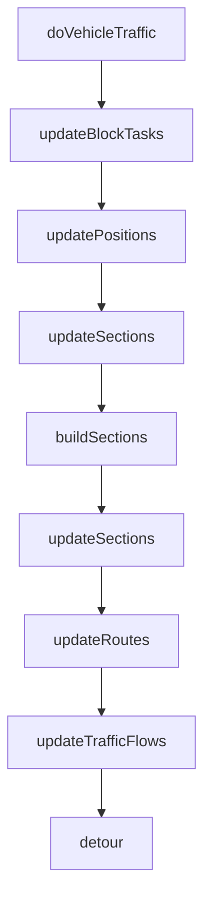

`RegulationTrafficControlService::updateRoutes` 是交通调度循环中的 **process-3** 阶段：在前面的 `updatePositions`（更新车辆位置/任务状态）和 `buildSections`/`updateSections`（构建路径冲突区段）之后，负责 **实际下发路径段给车辆**，并同步更新区域占用状态。

## 在整体流程中的位置



`updateRoutes` 的输入是 `routeVehicles`：每个元素是一个三元组 `(Vehicle::Meta, VehiclePtr, ControlPtr)`，表示 **有活跃控制块、需要继续调度路径的车辆**。

---

## 核心职责（一句话）

对每辆有任务的车辆：**先跑交通规则决定能走多远 → 再截取可下发的路段 → 下发移动指令 → 更新本地路径缓存和区域占用**。

---

## 逐步逻辑

### 1. 清空让行信息

```689:690:core/module/traffic/src/traffic_control_service_regulation.cpp
void RegulationTrafficControlService::updateRoutes(...) {
    yieldInfoManager_->clear();
```

每轮调度开始时清空上一轮积累的让行（yield）信息，后续规则处理会重新写入。

---

### 2. 遍历每辆待调度车辆

对 `routeVehicles` 中每辆车，依次执行以下步骤。

#### 2.1 交通规则处理 — 计算 `limitIndex`

```697:701:core/module/traffic/src/traffic_control_service_regulation.cpp
        regulations::TrafficRegulationContext context(vehicle, control);
        auto yieldInfo = ruleProcessor_.process(context);
        if (yieldInfo->isValidated()) {
            yieldInfoManager_->add(yieldInfo);
        }
```

`TrafficRegulationContext` 初始化时：

- 默认 `limitIndex = roadLines.size() - 1`（理论上可以走到路径末尾）
- `startIndex` 从 `sendIndex` 或 0 开始

然后按顺序执行 4 条规则（构造函数中注册）：

| 规则                                  | 作用                 |
| ----------------------------------- | ------------------ |
| `PositionOccupiedYieldRegulation`   | 目标点被占用时限制前进        |
| `RouteSectionYieldRegulation`       | 路径区段（对向冲突）被占用时限制前进 |
| `AreaYieldRegulation`               | 区域限制（禁行区等）         |
| `DependencyRelationYieldRegulation` | 车辆依赖关系让行           |

每条规则通过 `context.setLimitIndex(n)` **逐步收紧** 可下发的最远路段索引。规则触发时还会设置 `YieldReason`、冲突车辆、让行距离等，最终写入 `yieldInfoManager_`。

处理完成后，`context.complete()` 把结果写回：

```100:102:core/module/traffic/include/traffic/regulations/traffic_regulation.hpp
                void complete(){
                    control_->limitIndex = result_.limitIndex();
                }
```

**关键含义**：`limitIndex` 是本轮调度允许下发的 **最大 roadLine 索引**；若某规则发现冲突，会把 `limitIndex` 压到 `sendIndex` 或更小，从而阻止继续下发。

---

#### 2.2 截取可下发路段 — `applyRoadLines`

```703:706:core/module/traffic/src/traffic_control_service_regulation.cpp
        std::vector<maps::RoadLinePtr> applyRoads;
        double firstRotateYaw = DBL_MAX;
        bool firstRoadLine = (control->sendIndex == -1);
        applyRoadLines(vehicle, applyRoads, control->sendIndex, control->dockId, control->sendDock, control->taskType);
```

`applyRoadLines` 是实际决定 **本轮下发哪些 roadLine** 的函数，有多层门禁：

| 条件                                              | 行为                        |
| ----------------------------------------------- | ------------------------- |
| 手动模式 (`ControlMode::MANUAL`)                    | 直接返回，不下发                  |
| 无 control block                                 | 返回                        |
| `sendIndex - stepId >= passedRoadLineCount_(3)` | 返回（已下发段数超前 step 太多，等车辆执行） |
| `sendIndex >= limitIndex`                       | 返回（被规则限制，不能继续）            |
| `sendIndex >= roadCount - 1`                    | 返回（路径已全部下发）               |

通过门禁后，最多下发 `maxApplyRoadLineCount_`（默认 **5**）条路段，循环逻辑：

1. **对接点识别**：若是 LOAD/CHARGE 且需要 recognize，在倒数第二段时设置 `dockId`（对接点 ID）
2. **设备门控**：若下一段有关联设备（如自动门）且 `canEnter` 为 false，停止下发
3. **`++sendIndex`**，把 `roadLines[sendIndex]` 加入 `applyRoads`
4. 若 `sendIndex >= limitIndex` 或已到路径末尾，停止

**注意**：`sendIndex` 在这里是 **引用传参**，函数会直接修改 control 中的已下发索引。

---

#### 2.3 若有可下发路段 — 下发移动指令

```708:774:core/module/traffic/src/traffic_control_service_regulation.cpp
        if (!applyRoads.empty()) {
            // ... 首段补路、到达后旋转/调头逻辑 ...
            vehicleCommandSender_->startMovement(...);
            // ... 日志、更新 localRoadLines、更新 section ...
        }
```

##### a) 首段特殊处理 — `fillFirstRoadLine`

若 `sendIndex == -1`（尚未下发任何段）且非仿真车：

- 若车辆当前位姿离首段起点 > 0.3m，会找一条 **从当前位置到首段起点** 的过渡 roadLine
- 计算 `firstRotateYaw`，供车辆先旋转对齐

##### b) 到达终点后的姿态处理

当 `sendIndex == roadLines.size() - 1`（正在下发最后一段）时：

| 场景                                               | 标志                                         |
| ------------------------------------------------ | ------------------------------------------ |
| 终点是 `CHARGEPOINT` 且任务类型 `CHARGE`                 | `turnAroundAfterArrived = true`（到达充电点前需调头） |
| 终点非 ACTIONPOINT、无 recognize、是 goal 且 `spin=true` | `rotateAfterArrived = true`，目标 yaw 为终点角度   |

##### c) 倒车判断

```739:751:core/module/traffic/src/traffic_control_service_regulation.cpp
            PositionPtr position = mapManager_->getPosition(vehicle->mapId, vehicle->positionId());
            bool backward = position != nullptr && PositionType::ACTIONPOINT == position->type;
```

若车辆当前在 **ACTIONPOINT**（作业点），按倒车模式下发；若 roadLine 允许旋转则报错并跳过（属性冲突）。

##### d) 调用 `startMovement`

把 `applyRoads`、travelPoses、dockId、旋转限制、首段旋转角、倒车/调头/旋转标志等一并传给 `vehicleCommandSender_->startMovement()`，真正向 AGV 下发路径。

##### e) 路径下发日志

构建 `RouteDispatchContext`，调用 `logRouteDispatchIfVehicleStateChanged` 记录下发快照（用于调试/追踪）。

##### f) 充电调头特殊处理

```767:769:core/module/traffic/src/traffic_control_service_regulation.cpp
            if (turnAroundAfterArrived && position != nullptr && PositionType::PARKPOINT == position->type) {
                applyRoads.pop_back();
            }
```

若在停车点且需要调头，从 local 缓存中去掉最后一段（避免重复占用）。

##### g) 更新本地路径缓存

```771:773:core/module/traffic/src/traffic_control_service_regulation.cpp
            updateLocalRoadLines(vehicle, vehicle->positionId(), applyRoads);
            routeSectionManager_->update(vehicle->id, control->blockTaskId, control->stepId, control->sendIndex);
```

- `updateLocalRoadLines`：清除车辆已走过的 local roadLines，追加新下发的段
- `routeSectionManager_->update`：更新路径区段管理器（供下一轮冲突检测）

---

#### 2.4 区域占用更新（无论是否下发路径都会执行）

对三类区域，检查车辆 **从 stepId 到 sendIndex** 已走过的 roadLines，更新 enter/leave 状态：

**a) 限制区域 (`getRestricitedArea`)**

```776:795:core/module/traffic/src/traffic_control_service_regulation.cpp
        auto areas = areaManager_->getRestricitedArea();
        for (auto area : areas) {
            // 遍历 stepId..sendIndex 的 roadLine
            // 若 roadLine 在区域内 → area.enter(vehicle)
            // 若车辆在区域内但当前段不在 → area.leave(vehicle)
        }
```

**b) 绕路区域 (`getDetourAreas`)**

同上逻辑，额外处理：

- 若车辆有 `bypassAreaId` 且区域允许绕路 → `vehicleCommandSender_->permitBypass()`

**c) 互斥区域 (`getMutexAreas`)**

检查 roadLine 属于互斥组的哪一侧（group 0 或 1），调用 `area.enter(vehicle, groupId)`；若当前段不在任何组则 `area.leave(vehicle)`。

---

## 关键 Control 字段含义

```9:26:core/module/traffic/include/traffic/control_block.hpp
    struct Control {
        int sendIndex = -1;      // 已下发到第几条 roadLine（-1=未下发）
        int stepId = -1;         // 车辆实际执行到第几条
        int limitIndex = -1;     // 规则允许下发的最远索引
        std::vector<maps::RoadLinePtr> roadLines;  // 完整规划路径
        std::string dockId;      // 对接点（LOAD/CHARGE recognize 任务）
        TaskType taskType;
        // ...
    };
```

三者关系：

```
stepId ≤ sendIndex ≤ limitIndex ≤ roadLines.size()-1
  ↑          ↑            ↑
车辆实际    已下发给      规则允许
执行位置    车辆的位置    最远位置
```

---

## 典型场景示例（充电任务 P_18 → P_53）

假设规划路径为 4 个点（3 段 roadLine）：

```
P_18 → P_55 → P_54(dock) → P_53(charge)
index:  0      1           2
```

| 轮次           | sendIndex | 规则 limitIndex | applyRoadLines 下发           | 备注                               |
| ------------ | --------- | ------------- | --------------------------- | -------------------------------- |
| 1            | -1 → 0~2  | 2（无冲突）        | 最多 5 段，实际下发 index 0,1,2     | 首段可能 fillFirstRoadLine           |
| 下发 index=1 时 |           |               | dockId 设为 P_54              | recognize+CHARGE                 |
| 下发 index=2 时 |           |               | turnAroundAfterArrived=true | 最后段到充电点                          |
| 到达 P_53 后    | 2         | —             | applyRoads 空                | 由 updatePositions 触发 startCharge |

---

## 总结

`updateRoutes` 不做路径规划，只做 **分段下发 + 冲突约束 + 区域管理**：

1. **规则先行**：4 条 yield 规则决定 `limitIndex`，可能让车辆本轮停住
2. **按需截取**：`applyRoadLines` 在 `[sendIndex+1, limitIndex]` 范围内最多取 5 段
3. **智能下发**：首段补路、倒车、充电调头、终点旋转等特殊逻辑
4. **状态同步**：更新 localRoadLines、routeSection、三类区域占用

若某辆车本轮 `applyRoads` 为空，通常是因为：手动模式、已下发完全、`limitIndex` 被规则限制、或设备门未开——此时车辆会等待下一轮调度再尝试。

---

maintainedPlanned:[W0615a_P_10-W0615a_P_5(W0615a_L_10_5)[dir:1] -> W0615a_P_5-W0615a_P_4(W0615a_L_5_4)[dir:1] -> W0615a_P_4-W0615a_P_17(W0615a_L_4_17)[dir:1]] 

plannedRoute:[W0615a_P_10-W0615a_P_5(W0615a_L_10_5)[dir:1] -> W0615a_P_5-W0615a_P_4(W0615a_L_5_4)[dir:1] -> W0615a_P_4-W0615a_P_17(W0615a_L_4_17)[dir:1]] 

maintainedLocal:[] 

dispatchBatch:[W0615a_P_10-W0615a_P_5(W0615a_L_10_5)[dir:1] -> W0615a_P_5-W0615a_P_4(W0615a_L_5_4)[dir:1] -> W0615a_P_4-W0615a_P_17(W0615a_L_4_17)[dir:1]] nextLocal:[W0615a_P_10-W0615a_P_5(W0615a_L_10_5)[dir:1] -> W0615a_P_5-W0615a_P_4(W0615a_L_5_4)[dir:1] -> W0615a_P_4-W0615a_P_17(W0615a_L_4_17)[dir:1]]


