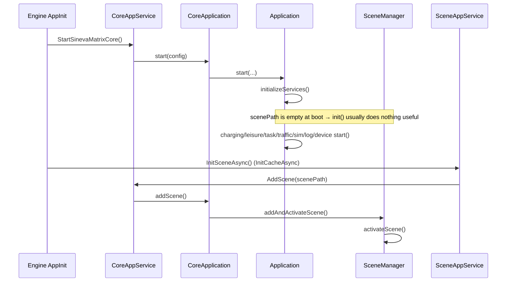
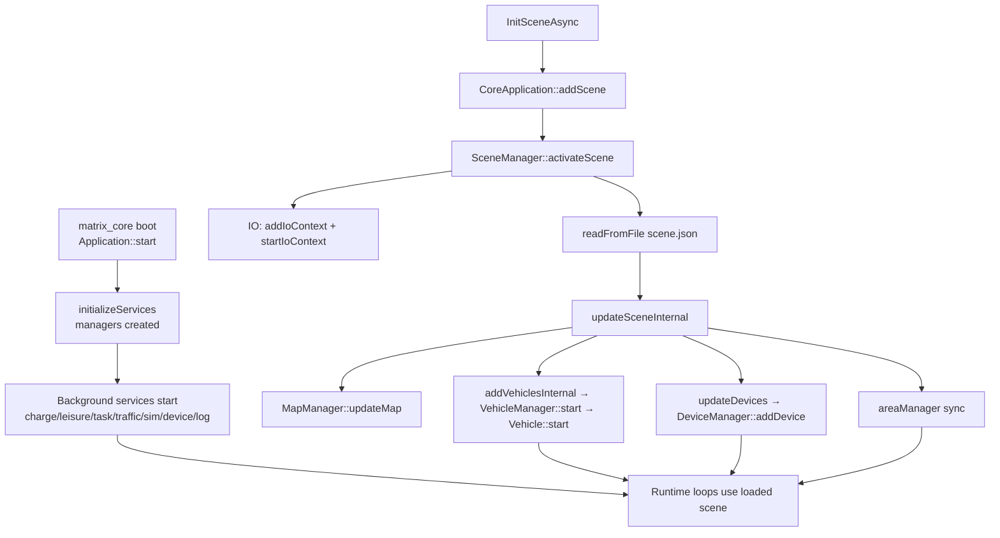

Assuming you mean **matrix_core booted** (started), not “Boost” the library — here is the important functional call chain around `SceneManager::activateScene` and what runs after core startup.

## When this happens relative to core boot

Core boot and scene activation are **two phases**:



Boot order in `AppInit.Init()`:

1. `StartSinevaMatrixCore()` → loads `libmatrix_core.so`, starts background services  
2. `InitCacheAsync()` → `InitSceneAsync()` → **this is where `activateScene` actually runs** for enabled scenes

---

## Entry into `activateScene`

Typical runtime path (after core is already running):

```
SceneAppService.InitSceneAsync()
  → CoreAppService.AddScene()
    → CoreApplication::addScene()          // core_application.cpp
      → SceneManager::addAndActivateScene()
        → SceneManager::addScene()
        → SceneManager::activateScene()    ← your anchor
```

Boot-time attempt (usually no-op because `scenePath` is empty in config):

```
Application::initializeServices()
  → SceneManager::init(scenePath_)
    → addAndActivateScene("")   // fails if path has no "/"
```

---

## Inside `activateScene` — important call chain

```112:188:core/module/scene/src/scene_manager.cpp
bool SceneManager::activateScene(const std::string& sceneName) {
    auto ctx = getContext(sceneName);
    // ...
    // 1) Deactivate previous scene (if any)
    vehicleManager_->stop();
    deviceManager_->removeDevice(...);
    oldCtx->stopIoContext();

    // 2) Mark active + wire async I/O
    activeSceneName_ = sceneName;
    vehicleManager_->addIoContext(ctx->sceneIoContext_);
    ctx->startIoContext();   // background thread: io_context::run()

    // 3) Load scene.json and apply it
    readFromFile(*ctx, ctx->path_ + "/scene.json");
    updateSceneInternal(*ctx, scene, ctx->content_);
}
```

### Phase 1 — Scene switch / I/O setup

| Step | Function                          | Purpose                                        |
| ---- | --------------------------------- | ---------------------------------------------- |
| 1    | `getContext(sceneName)`           | Resolve scene context                          |
| 2    | `vehicleManager_->stop()`         | Stop old vehicles + timers (scene switch only) |
| 3    | `deviceManager_->removeDevice()`  | Tear down old doors/lifts                      |
| 4    | `oldCtx->stopIoContext()`         | Stop old Boost.Asio thread                     |
| 5    | `vehicleManager_->addIoContext()` | Register scene’s `io_context`                  |
| 6    | `ctx->startIoContext()`           | Spawn thread running `io_context::run()`       |

`startIoContext()`:

```43:71:core/module/scene/include/scene/scene_context.hpp
void startIoContext() {
    ioThread_ = std::thread([ioCtx, wg, path = path_]() {
        ioCtx->run();
    });
}
```

### Phase 2 — Load config

```
readFromFile()
  → parse scene.json into ctx.sceneJson_ / ctx.content_
```

### Phase 3 — `updateSceneInternal()` (the heavy functional chain)

```888:1052:core/module/scene/src/scene_manager.cpp
bool SceneManager::updateSceneInternal(...) {
    mapManager_->updateMap(mapFileNames);
    addVehiclesInternal(ctx, scene.vehicleGroups, scene.areas, true);
    mapManager_->updateChargeAndLeisurePosition();
    updateDevices(ctx, scene);
    // build logicalMap / pointCloud / advanced areas / advanced points
    mapManager_->updateAreas(...);
    mapManager_->updatePositions(...);
    saveToFile(...);
    areaManager_->clear();
    areaManager_->add(...);   // from loaded road-net maps
}
```

Detailed sub-chain:

```
updateSceneInternal
│
├─ MapManager::updateMap()
│    └─ RoadNetMap::loadMapFromFile()     // .roadnet / .smap / Picasso parser
│
├─ addVehiclesInternal(..., isAll=true)
│    ├─ new Vehicle(protocol, *sceneIoContext_)
│    ├─ configure IP/port/map/battery/simulation state
│    └─ VehicleManager::addAllVehicles()
│         ├─ stop old vehicles
│         └─ VehicleManager::start()
│              ├─ spawn io_context runner thread(s)
│              └─ Vehicle::start(io)
│                   └─ createSessionClient()  // SINEVA or SEER TCP sessions
│
├─ MapManager::updateChargeAndLeisurePosition()
│
├─ updateDevices()
│    ├─ deviceManager_->addDevice(AutomaticDoor / WindingDoor / Lift)
│    └─ Lift::connect()  (non-simulation lifts)
│
├─ mapManager_->updateAreas() / updatePositions()
├─ saveToFile(scene.json)
└─ areaManager_->clear() + add()   // sync advanced areas into AreaManager
```

This is the **core functional outcome** of activation: maps loaded, vehicles online, devices registered, areas/positions indexed.

---

## What already started when matrix_core booted (before `activateScene`)

During `Application::start()` (inside `CoreApplication::start`), these loops start **before** `InitSceneAsync` loads any scene:

```123:129:core/src/application.hpp
chargingManager_->start();
leisureManager_->start();
taskAssignService_->start();
trafficControlService_->start();
simulationService_->start();
logService_->start();
deviceService_->start();
```

| Service                           | What it does once scene is loaded                                                                  |
| --------------------------------- | -------------------------------------------------------------------------------------------------- |
| `ChargingManager`                 | 1s loop: auto-charging using map charge positions + vehicles                                       |
| `LeisureManager`                  | 1s loop: idle-point dispatch                                                                       |
| `TaskAssignService`               | Order/block dispatch using `MapManager` + `VehicleManager`                                         |
| `RegulationTrafficControlService` | 1s loop: traffic regulation on active vehicles                                                     |
| `SimulationService`               | ~100ms loop: creates `Simulator` for simulation vehicles                                           |
| `DeviceService`                   | 1s loop: `connect()` / `queryStatus()` / `executeCommands()` on devices added by `updateDevices()` |
| `LogService`                      | 1s loop: logs vehicle/order status                                                                 |

So: **core boot starts the engine loops; `activateScene` fills them with scene data** (maps, robots, doors/lifts, areas).

---

## After `activateScene` returns (Engine side)

Still in the boot sequence:

```
InitSceneAsync()
  → _coreAppService.AddScene()   // activateScene already done
  → UpdateSceneMapCacheAsync()   // C# cache of scene maps

InitCacheAsync() continues
  → InitTaskDataCacheAsync()
  → InitPeriodicTaskTimerAsync()
  → robot/alarm/stats/PLC caches...

InitBackServiceAsync()
  → TaskExecuteService, RobotsStatusTimer, etc. start polling core APIs
     (e.g. VehicleStatus(), AddOrder(), ...)
```

Those background services **consume** the world built by `activateScene`; they do not re-run activation.

---

## End-to-end summary diagram



---

## Practical takeaway

- **`activateScene` is the scene “commit” point**: it wires async I/O, loads `scene.json`, loads road-net maps, starts vehicles, registers devices, and syncs areas.
- **Core boot alone does not fully activate a scene** in normal Engine startup (`scenePath` is empty); scene activation happens shortly after via `SceneAppService.InitSceneAsync()`.
- **The most important downstream native calls from `activateScene` are**:
  1. `MapManager::updateMap` → `RoadNetMap::loadMapFromFile`
  2. `VehicleManager::addAllVehicles` → `VehicleManager::start` → `Vehicle::start`
  3. `updateDevices` → `DeviceManager::addDevice`
  4. `AreaManager::add` (via map areas)

If you meant something else by “boosted” (e.g. Boost.Asio specifically, or a particular log line), say which and we can narrow to that path.
