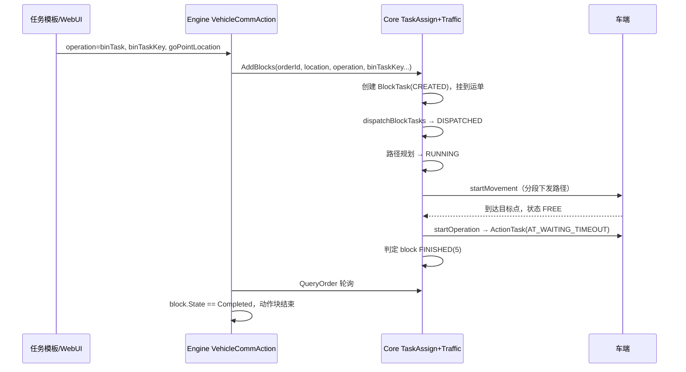

下面按 **Engine（任务编排）→ Core（调度/交管）→ 车端** 三层，说明 binTask 的下发与完成判定逻辑（基于当前代码，不改文件）。

---

## 一、整体链路概览



---

## 二、从调度下发到车端执行

### 1. Engine 层：任务模板 → Core 追加动作块

典型任务模板结构是：`CreateOrder` 块下挂子块 `VehicleCommAction`。

`VehicleCommActionHandler` 会读取参数：

- `goPointLocation`：目标点位  
- `operation`：`binTask` / `preBinTask`  
- `binTaskKey` / `preBinTaskKey`：binTask 参数  

然后调用 Core 的 `AddBlocks`，把动作块追加到当前运单：

```61:80:engine/Sineva.Matrix.Engine.Service/BackService/Services/TaskHandle/BlockHandle/VehicleCommActionHandler.cs
            var data = new CoreAddBlockRequest()
            {
                OrderId = _taskCache.CurrentOrderId,
                MarkComplete = false,
                Blocks = new List<CoreBlockRequestInfo>
                {
                    new CoreBlockRequestInfo {
                        Location = goPointLocation,
                        Operation = operation,
                        OperationArgs = new CoreBlockOperationArgs
                        {
                            BinTaskKey = binTaskKey,
                            PreBinTaskKey = preBinTaskKey,
                            // ...
                        }
                    }
                }
            };
```

`CreateOrderHandler` 会先创建运单并等待 Core 分配车辆，再执行上述子块。

### 2. Core 层：创建 BlockTask

`CoreApplication::AddBlocks` 为每个 block 创建 `BlockTask`，写入目标点、`operation`、`binTaskKey` 等：

```657:665:core/src/core_application.cpp
            orders::assignBlockTaskTypeAndOperation(*blockTaskPtr, block.operation, orderPtr->type);
            // ...
            blockTaskPtr->opreationArgs.binTaskKey = block.operationArgs.binTaskKey;
            blockTaskPtr->opreationArgs.preBinTaskKey = block.operationArgs.preBinTaskKey;
```

`assignBlockTaskTypeAndOperation` 的规则：

- `operation` 非空 → `blockTask.opreation = "binTask"`，`blockTask.type` **继承运单类型**（如 MOVE=0、LOAD=1）  
- `operation` 为空 → 纯移动块，`type = MOVE`

块加入运单后状态为 `CREATED`，由 `TaskAssignService::addBlockTasks` 持久化。

### 3. Core 层：调度下发（TaskAssign）

`TaskAssignService::dispatchBlockTasks` 周期性扫描已分配车辆的运单，对 `CREATED/DISPATCHED/RUNNING` 的 block 调用 `dispatchTask`：

- block 状态 → `DISPATCHED`  
- `trafficControl_->addVehicleTask(blockTask)` 进入交管模块  

### 4. Core 层：交管执行（Traffic Regulation）

交管模块对 block 做路径规划，状态变为 `RUNNING`，并把 `operation`、`operationArgs` 写入 `Control` 对象：

```1194:1212:core/module/traffic/src/traffic_control_service_regulation.cpp
            ControlPtr control = std::make_shared<Control>();
            control->setTaskInfo(taskGoal.id, blockTask->order->id, blockTask->id, blockTask->type, blockTask->opreation, blockTask->opreationArgs);
            // 路径规划、分段下发
            onSubtaskStateChanged(blockTask->order->id, blockTask->id, TaskState::RUNNING);
```

路径通过 `vehicleCommandSender_->startMovement(...)` **分段下发**给车端，车辆沿路径行驶到 `goPointLocation`。

### 5. 到达目标点后：下发 binTask 到车端

当路径全部发完（`sendIndex >= roadCount - 1`）、车辆在目标点且状态为 `FREE` 时，交管调用 `startOperation`：

```586:590:core/module/traffic/src/traffic_control_service_regulation.cpp
                } else if (control->taskType == TaskType::MOVE || control->taskType == TaskType::IDLE) {
                    const auto arrivalAction = orders::decideMoveArrivalAction(control->taskType, control->operation, control->sendOperation);
                    if (arrivalAction == orders::MoveArrivalAction::SendOperation) {
                        vehicleCommandSender_->startOperation(vehicle, control->blockTaskId, control->operation, control->operationArgs);
                        control->sendOperation = true;
```

`doStartOperation` 对 `binTask` / `preBinTask` 的处理：

- 构造 `proto::ActionTask`  
- 类型设为 `AT_WAITING_TIMEOUT`  
- 通过 `vehicle->sendNewActionTask()` → `CMD_NEW_ACTION_TASK` 发给车端（Sineva/Seer 协议）

```305:316:core/module/domain/include/vehicles/vehicle_command_sender.hpp
            if ("bintask" == lowerOperation) {
                args = operationArgs.binTaskKey;
                actionTask.set_type(proto::ActionTask::AT_WAITING_TIMEOUT);
            } else if ("prebintask" == lowerOperation) {
                args = operationArgs.preBinTaskKey;
                actionTask.set_type(proto::ActionTask::AT_WAITING_TIMEOUT);
            }
            if (vehicle->sendNewActionTask(actionTask)) {
```

**注意：** 当前实现里 `binTaskKey` 读入了局部变量 `args`，但 **没有写入 `ActionTask` 或 `TemplateTask` 再下发**；真正带 `bin_task_key` 的 `TemplateTask` 路径被 `isTemplateTask = false` 禁用了。也就是说，调度侧保存了 `binTaskKey`，但车端实际收到的是 **无 key 的 `AT_WAITING_TIMEOUT` 动作任务**。车端若依赖 key 选具体 binTask，需要确认车端是否从别处获取，或这是待完善点。

---

## 三、调度系统如何判断 binTask 执行完成

分 **Core 判定** 和 **Engine 感知** 两层。

### 1. Core（交管）的完成判定 —— 核心逻辑

对典型的 **MOVE 运单 + binTask 动作块**（最常见配置），完成条件在 `traffic_control_service_regulation.cpp`：

| 条件       | 含义                                         |
| -------- | ------------------------------------------ |
| 路径已全部下发  | `sendIndex >= roadCount - 1`               |
| 车辆在目标点   | `vehicle->positionId() == control->goalId` |
| 车辆空闲     | `vehicle->state() == VehicleState::FREE`   |
| 操作已下发过一次 | `control->sendOperation == true`           |

满足后走 `FinishAfterOperationSent` 分支，**直接将 block 标为 `FINISHED`**：

```591:597:core/module/traffic/src/traffic_control_service_regulation.cpp
                    } else if (arrivalAction == orders::MoveArrivalAction::FinishAfterOperationSent ||
                               arrivalAction == orders::MoveArrivalAction::FinishNow) {
                        onSubtaskStateChanged(control->orderId, control->blockTaskId, TaskState::FINISHED);
                        updateSubtasks(control->blockTaskId, TaskState::FINISHED);
                        delTraffic(control->blockTaskId, vehicle->id, TaskState::FINISHED);
                        clearVehicleBlockTaskInfo(vehicle);
```

`decideMoveArrivalAction` 的两步状态机：

1. **第一次**到点且 `sendOperation=false` → `SendOperation`（下发 binTask）  
2. **下一次** regulation 周期且 `sendOperation=true` → `FinishAfterOperationSent`（认为完成）

```49:56:core/module/domain/include/orders/block_operation_utils.hpp
inline MoveArrivalAction decideMoveArrivalAction(TaskType taskType, const std::string& operation, bool sendOperation) {
    if (!needsPostArrivalOperation(taskType, operation)) {
        return MoveArrivalAction::FinishNow;
    }
    if (sendOperation) {
        return MoveArrivalAction::FinishAfterOperationSent;
    }
    return MoveArrivalAction::SendOperation;
}
```

**关键点：Core 并不监听车端 `action_state.AT_FINISHED` 或 `NOTIFY_ACTION_TASK_FINISHED`。**  
代码里没有用 `SystemState.action_state` 做 binTask 完成判断；完成是 **“命令已发出 + 车辆仍 FREE”** 的启发式判定，而不是等车端回报 binTask 真正执行结束。

若运单类型是 **LOAD/UNLOAD** 且带 operation，则走另一套逻辑：下发操作后根据 `vehicle->load()` 载货状态判断完成（类似 JackLoad/JackUnload），与 binTask 典型用法不同。

状态变更通过回调写入数据库：

```531:540:core/module/task_assign/src/task_assign_service.cpp
    void TaskAssignService::onBlockTaskStateChanged(...) {
        // ...
        orderRepository_->updateBlockState(subtaskId, state);
    }
```

`TaskState::FINISHED = 5` 与 Engine 的 `BlockStateEnum.Completed = 5` 数值对齐。

### 2. Engine 层的完成感知

`VehicleCommActionHandler` 在追加 block 后进入 `WaitBkockFinishedAsync`，**每秒** `QueryOrder` 查询该 block 状态：

```182:184:engine/Sineva.Matrix.Engine.Service/BackService/Services/TaskHandle/BlockHandle/VehicleCommActionHandler.cs
                else if (blockCache.State == BlockStateEnum.Completed)
                {
                    return;
                }
```

当 Core 把 block 标为 `FINISHED(5)` 时，Engine 认为 **VehicleCommAction 块完成**，继续执行后续块；`CreateOrder` 子块全部完成后会 `MarkOrderComplete` 封口运单。

---

## 四、总结（一句话版）

| 阶段     | 做什么                                                                                 |
| ------ | ----------------------------------------------------------------------------------- |
| **配置** | 任务模板 `VehicleCommAction`：`operation=binTask`，`binTaskKey=...`，`goPointLocation=目标点` |
| **入队** | Engine `AddBlocks` → Core 创建 BlockTask，状态 `CREATED`                                 |
| **调度** | `dispatchBlockTasks` → `DISPATCHED` → 交管路径规划 `RUNNING`                              |
| **行驶** | 分段 `startMovement` 下发路径到车端                                                          |
| **动作** | 到点后 `startOperation` → 车端 `ActionTask(AT_WAITING_TIMEOUT)`                          |
| **完成** | Core：**操作命令已下发且车辆 FREE** → block `FINISHED`；Engine 轮询到 `Completed` 即认为 binTask 块结束  |

若你关心的是“车端 binTask 机械臂/货叉动作是否真正做完”，当前 Matrix Core **没有**按车端动作完成回报来判定；它判定的是 **调度侧动作块生命周期结束**（到点 + 下发 + 车辆空闲）。如需按车端真实完成信号判定，需要接 `action_state` 或 `NOTIFY_ACTION_TASK_FINISHED`，并走 `TemplateTask` 把 `binTaskKey` 传给车端——这两块在当前代码里都未启用。


# Coding

已在 `feature/bintask` 分支（基于 `develop`）完成开发与测试，未提交，等你验证后手动提交。

## 实现说明

### 问题

`binTask` 原先只下发空的 `ActionTask(AT_WAITING_TIMEOUT)`，`binTaskKey` 和 roadnet 中 `binLocationsList` 的 property 数据未传给车端。

### 方案

1. **地图解析**（`road_net_map_parser_care.hpp`）  
   加载 `.roadnet` 时保留原始 `binLocationsList` 到 `logicalMap`。

2. **属性解析**（`maps/bin_location_utils.hpp`）  
   
   - 按 `pointName`（或 `instanceName`）匹配目标点，例如 `test001_P_2`  
   - 按 `binTaskKey` 匹配 property `key`，例如 `Load`  
   - 读取 `stringValue` JSON，写入 `OperationArgs.scriptArgs`  
   - 从 JSON 解析 `recognize` / `recognizeFile`

3. **交管下发**（`traffic_control_service_regulation.cpp`）  
   调用 `startOperation` 前通过 `sendBlockOperation()` 从地图 enrichment 参数。

4. **车端协议**（`vehicle_command_sender.hpp`）  
   `binTask` / `preBinTask` 改为 `TemplateTask`（`CMD_TEMPLATE_TASK`），携带：
   
   - `bin_task_key` = `Load`
   - `script_args.key` = `Load`
   - `script_args.value` = `{"end_height":0.5,"operation":"ForkLoad",...}`

5. **附带修复**（`road_net_map.hpp`）  
   `RoadNetMap` 拷贝/移动时同步 `logicalMap_`，修复 `MapManager` 异步加载后 logicalMap 丢失的问题。

### 任务模板配置示例

| 参数                | 值             |
| ----------------- | ------------- |
| `goPointLocation` | `test001_P_2` |
| `operation`       | `binTask`     |
| `binTaskKey`      | `Load`        |

## 单元测试（全部通过）

```bash
cd core/build
cmake --build . --target unit_tests_bin_location_utils -j$(nproc)
./module/domain/unit_tests/unit_tests_bin_location_utils
```

5 个用例、27 条断言，覆盖：

- `test001.roadnet` 加载后保留 `binLocationsList`
- 解析 `test001_P_2` + `Load` 的 JSON
- `MapManager` enrichment
- `TemplateTask` 字段构建
- 缺失点位/属性的边界情况

## 变更文件

| 文件                                                                | 说明                  |
| ----------------------------------------------------------------- | ------------------- |
| `core/module/domain/include/maps/bin_location_utils.hpp`          | 新增                  |
| `core/module/domain/include/vehicles/bin_task_dispatch_utils.hpp` | 新增                  |
| `core/module/domain/unit_tests/test_bin_location_utils.cpp`       | 新增                  |
| `core/conf/test001.roadnet`                                       | 测试地图（当前未跟踪）         |
| `road_net_map_parser_care.hpp`                                    | 保留 binLocationsList |
| `road_net_map.hpp`                                                | 修复 logicalMap 拷贝    |
| `vehicle_command_sender.hpp`                                      | TemplateTask 下发     |
| `traffic_control_service_regulation.cpp`                          | 下发前 enrichment      |
| `unit_tests/CMakeLists.txt`                                       | 注册新测试               |

`matrix_core` 已编译通过。你验证测试后可自行 `git add` 并提交；建议把 `test001.roadnet` 一并纳入版本库，方便 CI 复现。


