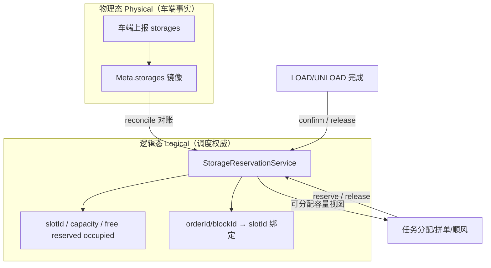

## 结论（先答“要不要备份”）

**不建议再镜像一份与车端上报完全同构的 `storages` 列表。**  
`VehicleRealtimeData::Meta.storages` 已经是车端上报的物理态镜像；再拷一份只会带来双写一致性问题。

拼单/顺风单真正缺的是：**调度侧的逻辑占用/预留态（reservation）**，以及 **订单↔储位绑定**。这层车端没有、也不该只靠车端上报推断。

---

## 当前 core 怎么做

### 储位信息

| 层级      | 现状                                                                                      |
| ------- | --------------------------------------------------------------------------------------- |
| 车端上报    | Sineva protobuf / Seer JSON → `parseProtoStorages` / `parseStorages`                    |
| Core 落点 | **唯一权威物理态**：`VehicleRealtimeData::Meta.storages`（每次遥测整表覆盖）                              |
| 字段      | `Storage{used, id, goodsId, describe}`                                                  |
| 任务完成    | 另用全局布尔 `vehicle.load()` / `loaded_`，**不看** `storages[].used`                            |
| 分配约束    | `VehicleCapacityConstraint` 只用 `storages.size()` 做 LOAD/UNLOAD **数量**平衡，**不看占用、不看具体槽位** |
| 预留字段    | `Order.container`、`BlockTask.useStorage` / `useStorageCap` 已定义，**分配/交管几乎未用**            |

$数据流本质是：$

```text
车端上报 → Meta.storages（覆盖） → 分配只读 size → API 再投影出去
```

### “拼单”相关能力（有合并，无业务拼单）

已有：

- 同 `externalId` 打组后整组派给一辆车  
- `order_merge` + `mergePath`：给在途车插停靠点（路程代价）  
- `maxCacheTask`：车辆订单队列上限  

未实现：

- 业务拼单（无关运单合车）  
- 顺风单（`pauseReason=2` 仅注释，无挂起/恢复逻辑）  
- 储位预留、槽位绑定、按占用容量决策  

因此：**当前是“多单缓存 + 路径合并”，不是依赖储位管理的拼单/顺风单。**

---

## 推荐架构：物理态 + 逻辑态（双层，不双备份）

这是仓储/运力调度常见做法：车端是事实源（physical），调度维护可分配视图（logical）。



### 1. 物理态（已有，保留）

- 继续只存在于 `Meta.storages`  
- 职责：展示、对账、故障诊断、清储位指令结果  
- **不要**在 MapManager/OrderRepository 再存一份同结构列表  

### 2. 逻辑态（建议新增，拼单依赖它）

新建轻量服务（名称示例：`VehicleStorageManager` / `StorageReservationService`），按车维护：

| 概念         | 含义                                 |
|:----------:|:----------------------------------:|
| 槽位目录       | 来自首次上报或车型配置（slotId、容量）             |
| `FREE`     | 物理空且无预留                            |
| `RESERVED` | 已派 LOAD、货未上车                       |
| `OCCUPIED` | 物理占用或 LOAD 确认后                     |
| 绑定         | `orderId/blockId/goodsId → slotId` |

分配/拼单只问逻辑态：  
`available = capacity - occupied_physical - reserved_logical`（再加规则过滤）。

### 3. 对账（reconcile），不是双写备份

周期或每次上报后：

- 车端 `used=1` 且 core 仍 `RESERVED` → 升为 `OCCUPIED`（确认装载）  
- 车端空、core 仍 `OCCUPIED` 且无进行中 UNLOAD → 告警/超时释放  
- 车端长时间无上报 → 分配降级（仅用配置容量或禁止拼单）  

逻辑预留**以调度为准**；物理占用**以车端为准**。冲突走对账策略，而不是再拷一份上报数据。

### 4. 与现有字段对齐（少造轮子）

| 已有字段                      | 建议用法                 |
|:------------------------- |:--------------------:|
| `Order.container`         | 上游指定槽位偏好/标签          |
| `BlockTask.useStorage`    | 派发时写入实际绑定槽位          |
| `BlockTask.useStorageCap` | 多容量槽位占用              |
| `pauseReason=2`           | 顺风单挂起：原任务暂停，插单执行完再恢复 |

### 5. 分阶段落地（便于评审）

**P0（拼单最小集）**

1. 容量检查种子改为：`当前物理占用 + 逻辑预留 + 新 LOAD`  
2. 派单时 `reserve`，LOAD 完成 `confirm`，UNLOAD 完成 `release`  
3. 填充 `useStorage`（即使车端暂不消费，调度侧先闭环）  

**P1（真拼单/顺风）**

4. 跨 `externalId` 合车规则 + 槽位兼容  
5. `pauseReason=2` 挂起/插单/恢复  
6. 完成判定从单一 `load()` 逐步过渡到槽位感知（多货并存）  

**P2**

7. 仿真同步改 `storages[].used`  
8. 持久化预留（重启可恢复）——仅逻辑态，不镜像物理态  

---

## 对你问题的直接回答

| 问题              | 建议                                                              |
| --------------- | --------------------------------------------------------------- |
| 要不要把车端储位再备份一份？  | **不必**做同构备份；`Meta.storages` 已是镜像                                |
| 拼单要不要 core 管储位？ | **要**，管的是**预留/绑定逻辑态**，不是再存一份上报                                  |
| 当前拼单能力？         | 仅有同组多单 + 路径 merge；无储位预留、无顺风挂起                                   |
| 改代码前？           | 先定：逻辑态模型、对账规则、与 `container/useStorage/pauseReason` 的语义；你确认后再动代码 |

如果你认可这个方向，下一步可以再出一版更细的接口草图（`reserve/confirm/release/reconcile` 签名 + 分配约束改动点），仍先审阅再改实现。
