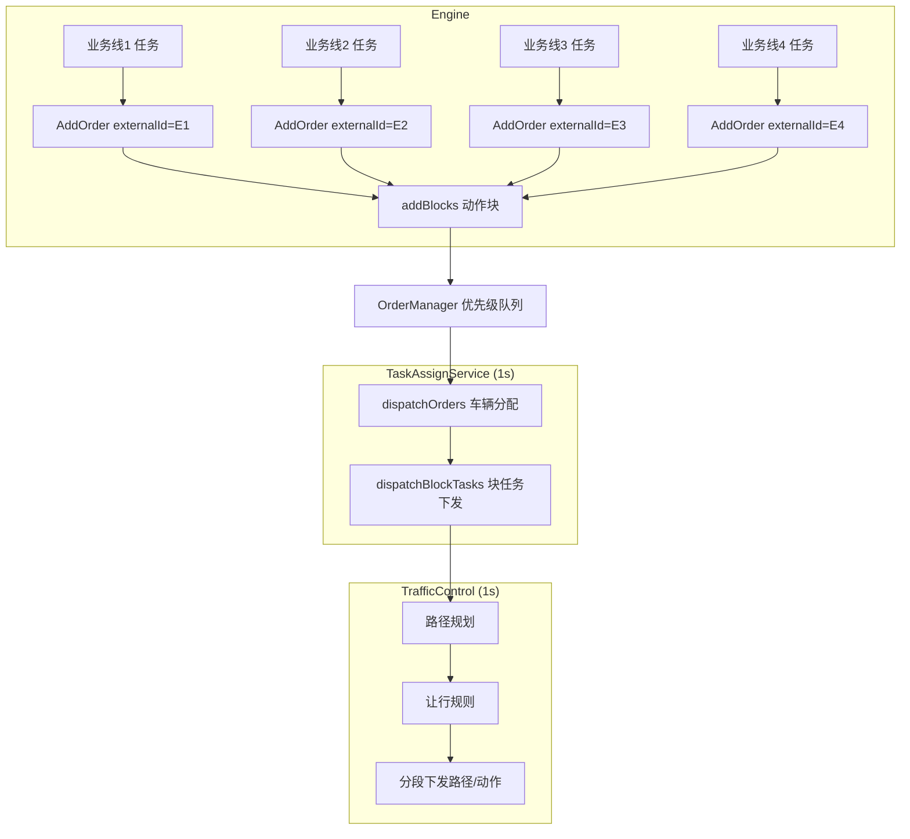

# Matrix-core 多车调度逻辑审查

## 一、整体调度架构

Matrix-core 的多车调度是 **两阶段、1 秒周期** 的流水线，业务线（Engine 侧任务）与机器人（Core 侧车辆）的绑定发生在第一阶段。



### 阶段 1：车辆分配（`dispatchOrders`）

- 从 `OrderManager` 取所有 **`order->vehicle == nullptr`** 的运单。
- 按 `externalId` 分组（一个业务任务 = 一个 `externalId` = 一组运单）。
- **整组原子绑定到一台车**，不会拆分到多车。
- 每组贪心选车：优先空闲车，或合并进正在执行的车辆队列（`merge`）。

关键代码：

```325:346:core/module/task_assign/src/task_assign_service.cpp
std::vector<orders::OrderPtr> TaskAssignService::getNeedDispatchOrders() {
    for (auto& order : orderManager_->getAllOrders()) {
        if (order->vehicle) continue;
        orders.emplace_back(order);
    }
    return orders;
}
```

```31:41:core/module/task_assign/src/task_assigner_optimize.cpp
void OptimizeTaskAssigner::assign(...) {
    groupOrders(orders, orderGroupManager);
    for (auto& group : orderGroupManager.groups()) {
        assignGroupOrders(group->orders());  // 按组顺序逐个分配
    }
}
```

**全局排序规则**（`OrderManager`）：

```111:116:core/module/domain/include/orders/order_manager.hpp
// priority 降序 → createTime 升序
std::stable_sort(orders_.begin(), orders_.end(), [](const OrderPtr& a, const OrderPtr& b) {
    if (a->priority != b->priority) return (a->priority > b->priority);
    if (a->createTime != b->createTime) return (a->createTime < b->createTime);
    return false;
});
```

### 阶段 2：块任务执行（`dispatchBlockTasks` → Traffic）

- 对已绑定车辆的运单，取 **队列首部** 运单的 block task。
- 调用 `trafficControl_->addVehicleTask()` 进入交通管制。
- 交通管制负责：路径规划 → 让行判断 → 分段下发移动/装卸指令。

---

## 二、目标工作点被占时，Core 如何处理？

这是与你场景最相关的部分。工作点（`WorkMarker` → `ACTIONPOINT`）**没有**像充电点/闲置点那样的 `PositionState::USED` 预留机制。

| 点位类型                  | 分配时预留                              | 执行时占用检测    | 完成后释放                               |
| --------------------- | ---------------------------------- | ---------- | ----------------------------------- |
| 充电点 `CHARGEPOINT`     | ✅ `setChargePositionsState(USED)`  | 地图状态       | ✅ `releaseChargeAndLeisurePosition` |
| 闲置点 `PARKPOINT`       | ✅ `setLeisurePositionsState(USED)` | 地图状态       | ✅ 同上                                |
| **工作点 `ACTIONPOINT`** | ❌ 无                                | **仅运行时让行** | ❌ 车辆停在原位                            |

### 2.1 下发前的"推走"逻辑（`processPushVehicles`）

在 block 下发前，会尝试把挡路车推到闲置点：

```467:504:core/module/task_assign/src/task_assign_service.cpp
void TaskAssignService::processPushVehicles(...) {
    // 只选 VehicleTaskManager 为空的车辆（无运单队列）
    for(auto v : vehicleManager_->allControlableVehicles()) {
        if(vehicleTaskManager_->empty(v->id)) {
            canMoveVehicles.emplace_back(v);
        }
    }
    // multiPlan 找挡路车 → addLeisureTask 触发挪车
}
```

**限制**：

- 只推 **无运单队列** 的车（`vehicleTaskManager_->empty`）。
- 只推 **状态为 FREE** 且站在路径上的车（`multi_route_planner.hpp:119`）。
- 需要有可用 **闲置点（PARKPOINT）** 作为推走目标。

### 2.2 运行时的让行（`PositionOccupiedYieldRegulation`）

另一台车要去同一工作点时：

```72:72:core/module/traffic/include/traffic/regulations/yield_position_occupied.hpp
if(position.id == v->positionId()) { return std::make_tuple<>(true, v); }
```

- 检测到目标点被其他车 `positionId` 占用 → **限制路径下发索引** → 等待。
- **不会主动命令占点车离开**（除非占点车满足推走条件）。

### 2.3 任务完成后车辆仍占着工作点

车辆到达工作点、完成 LOAD/UNLOAD 后：

```583:628:core/module/traffic/src/traffic_control_service_regulation.cpp
if (vehicle->state() == VehicleState::FREE && vehicle->positionId() == control->goalId) {
    // 完成 block → FINISHED → clearVehicleBlockTaskInfo
    // 但车辆仍停在 goalId，没有"离站"逻辑
}
```

车辆完成后 **停在目标点不动**，直到下一个 block 把它派走。若队列里还有后续任务或正在等 Engine 补单，它会一直占着该点。

---

## 三、与你场景对应的问题分析

你的配置：**4 条业务线 × 每线维持 1 个任务水位，5 台车**。现象：

- 后两条线（3/4）持续分配执行
- 前两条线（1/2）任务未下发、未执行
- 后两条线的车占住目标工作点，后续车无法到达

这与代码逻辑高度吻合，存在 **至少 3 类结构性问题**：

### 问题 1：业务线之间无公平调度，高优先级/先处理组垄断车辆

`assign()` 按 `OrderGroupManager.groups()` **顺序贪心**处理各 `externalId` 组，组顺序取决于未分配运单在优先级队列中的 **首次出现顺序**。

- 若业务线 3/4 的 `priority` 更高，或 `createTime` 更新更频繁（完成后立即补单），它们 **每轮都先抢到车**。
- 默认 `merge=true`：已在线路上跑的车还能继续接新单（最多 `maxCacheTask=3`），进一步减少空闲车。
- 默认 `freeVehicleFirst=true` 只在 **有空闲车** 时有效；5 台车被 3/4 线占满后，1/2 线永远分不到。

**结论**：这是 **分配层饥饿（starvation）**，不是偶发 bug，而是当前算法设计如此。

### 问题 2：工作点无预留 + 完成后不离站 → 占点阻塞链

业务线 3/4 的车完成装卸后 **停在工作点**：

- 业务线 1/2 的车即使后来分到任务，也会在 `PositionOccupiedYieldRegulation` 处被挡住。
- `processPushVehicles` **推不走** 有运单队列的占点车（`vehicleTaskManager` 非空）。
- 规划阶段（任务分配时的 A*）**不考虑** 其他车对目标点的占用，所以会出现"分配成功、执行不动"。

**结论**：这是 **执行层占点死锁**，多业务线共享工作点时必然恶化。

### 问题 3：同一周期内多组抢同一批车，无线路隔离

- 没有"每条业务线最多占 N 台车"的配额。
- 没有 `vehicleGroup` 线路绑定（除非 Engine 创建运单时显式传入）。
- 一台车理论上可通过 `merge` 连续服务同一条线，其他线饥饿。

---

## 四、代码逻辑缺陷汇总

| #   | 位置                                                      | 缺陷                                          | 影响          |
| --- | ------------------------------------------------------- | ------------------------------------------- | ----------- |
| 1   | `task_assigner_optimize.cpp` `assign()`                 | 按组顺序贪心，无跨线公平/配额                             | 前线饥饿        |
| 2   | `order_manager.hpp`                                     | 全局 priority 排序，无 per-line 轮询                | 高优先级线垄断     |
| 3   | `task_assigner_optimize.cpp` `merge` + `maxCacheTask=3` | 工作车可囤 3 单                                   | 车辆被少数线占满    |
| 4   | `dispatchTask()`                                        | 仅 charge/leisure 设 USED，**ACTIONPOINT 无预留** | 多车抢同工作点     |
| 5   | `processPushVehicles()`                                 | 只推无队列的车                                     | 完成作业占点的车推不走 |
| 6   | `traffic_control` 完成后                                   | 无自动离站 MOVE                                  | 车辆占点不释放     |
| 7   | `assignIdleVehicles()` 规划                               | A* 不考虑他车占点                                  | 分配成功但执行失败   |
| 8   | `getNeedDispatchOrders()`                               | 不区分"有 block / 无 block"                      | 可能分了车但没块可执行 |

---

## 五、修复方案（供审阅，暂不改代码）

建议分 **三层**：配置应急 → 小改动 → 结构性改造。

### 方案 A：配置层应急（不改 Core 代码，见效快）

在 `scene.json` 的 `order` / `traffic` 配置中调整：

| 参数                 | 建议值               | 作用                  |
| ------------------ | ----------------- | ------------------- |
| `merge`            | `false`           | 禁止向执行中车辆合并新单，释放车辆周转 |
| `maxCacheTask`     | `1`               | 每车最多缓存 1 单，避免囤单     |
| `freeVehicleFirst` | `true`（保持）        | 优先用空闲车              |
| `canPushVehicles`  | `true`（保持）        | 启用推走                |
| 各线 `priority`      | 线1 > 线2 > 线3 > 线4 | 显式保证前线优先            |

Engine 侧：

- 每条业务线创建运单时传入不同 `vehicleGroup`，将 5 台车划分到 4 线（如 R01→线1，R02→线2…）。
- 确保 `addBlocks` 在 `AddOrder` 之后及时调用，避免"分了车无块可跑"。

**优点**：零代码、可快速验证。  
**缺点**：不解决工作点占点死锁；车辆分组降低灵活性。

---

### 方案 B：Core 小改动（推荐优先实施）

#### B1. 业务线公平分配

在 `OptimizeTaskAssigner::assign()` 中：

- 对 `orderGroupManager.groups()` 按组内最高 `priority` + 轮询计数排序，而非遇序处理。
- 或增加 **每 `externalId` 在本周期最多分配 1 台车** 的限制。
- 记录每条线最后一次分配到车的时间，优先分配给最"饿"的线。

#### B2. 工作点占点检测与离站

在 block 完成（`FINISHED`）后，若 goal 是 `ACTIONPOINT`：

- 自动插入一个 **离站 MOVE**（到就近非工作点/闲置点），或
- 触发 `LeisureManager` 将该车挪到 `PARKPOINT`。

#### B3. 扩展推走逻辑

`processPushVehicles()` 中：

- 对 **已完成 block、状态 FREE、占着 ACTIONPOINT** 的车，即使 `vehicleTaskManager` 非空，也允许推走（或仅允许推走队列头部已完成的车）。
- `multiPlan` 的冲突检测增加 **RUNNING 且占目标点** 的车辆。

#### B4. 分配阶段考虑占点

`assignIdleVehicles()` 规划时：

- 将其他车当前 `positionId`（尤其是 ACTIONPOINT）加入 `ForbiddenCostStrategy`，避免分到"规划可达、实际被挡"的单。

---

### 方案 C：结构性改造（中长期）

1. **工作点预约机制**：为 `ACTIONPOINT` 增加 `IDLE/RESERVED/USED` 状态（类似充电点），分配时预约、完成时释放。
2. **线路调度器**：在 `TaskAssignService` 上层增加 `LineScheduler`，每条业务线独立水位与车辆池。
3. **占点超时告警**：车辆在某 ACTIONPOINT 停留超过 N 秒且阻塞他车 → 告警 + 强制离站。

---

## 六、建议的排查步骤（确认根因）

在测试环境抓一轮日志，重点看：

1. **四条线的 `externalId`、`priority`、`createTime`** — 确认 3/4 线是否优先级更高。
2. **`[task] [assign] [optimize] group started, external Id:...`** — 组处理顺序是否总是 3/4 在前。
3. **1/2 线运单是否 `vehicle == null`**（分配饥饿）还是 **`vehicle` 有值但 block 为空**（块未创建）。
4. **占点车辆 ID + `positionId`** — 3/4 线车辆完成后是否仍停在 1/2 线目标点。
5. **`[traffic] [control] [yield] [position occupied]`** — 1/2 线车辆是否被挡在此处。
6. **场景配置** `merge`、`maxCacheTask`、`canPushVehicles` 当前值。

---

## 七、推荐执行顺序

| 阶段    | 动作                    | 预期效果         |
| ----- | --------------------- | ------------ |
| 第 1 步 | 方案 A 配置调整 + 日志排查      | 验证是否为分配饥饿    |
| 第 2 步 | 方案 B1（公平分配）           | 解决 1/2 线分不到车 |
| 第 3 步 | 方案 B2 + B3（离站 + 扩展推走） | 解决占点阻塞       |
| 第 4 步 | 视需要上 B4 或方案 C         | 根治多线共享工作点冲突  |

---

请你确认希望优先走哪条路径（**仅配置调整 / B1 公平分配 / B2+B3 占点处理 / 全套**），以及四条业务线当前的 `priority`、`vehicleGroup` 配置和是否共用工作点。确认后我再按你的选择出具体改动方案和补丁。
