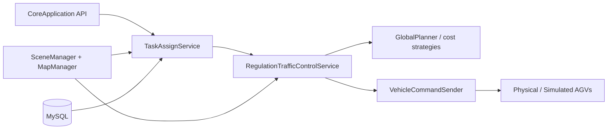

Here is my understanding of **Matrix — core** based on exploring the repo.

## What it is

**Matrix core** is the C++ **调度引擎** (dispatch / scheduling engine) for **Sineva AGV/AMR fleets**. It is the backend brain that:

- Accepts **运单 (orders)** with locations and actions (move, load, unload)
- **Assigns** orders to vehicles
- **Plans routes** on a road network
- **Controls traffic** (collision avoidance, yield, detour, area rules)
- **Commands vehicles** over TCP/Protobuf protocols
- Manages **charging**, **idle/leisure** parking, **simulation**, and **peripheral devices** (doors, lifts, etc.)

The README labels it plainly as a scheduling engine. The broader **Matrix** monorepo also includes `webUI`, `electronUI`, `h5UI`, `deployKit`, and an `engine/` wrapper — but **`core/` is the native algorithm and runtime**.

---

## Build & runtime shape

```
core/
├── src/           # Entry point, Application orchestrator, CoreApplication API
├── module/        # Feature modules (linked as lib `module`)
├── third_party/   # spdlog, httplib, nlohmann/json, etc.
└── CMakeLists.txt # Builds `matrix_core` (shared lib) + `matrix` (executable)
```

- **Language:** C++17  
- **Version:** CMake project `0.2.201`; runtime logo shows `0.2.20.1`  
- **Key deps:** Boost, MySQL (`mysqlcppconn`), Protobuf, GEOS, zlib/minizip, spdlog  
- **Output:** `matrix_core` shared library, consumed by the `matrix` binary and (via SWIG) the .NET engine in `engine/Sineva.Matrix.Core/`

Startup in `main.cpp` loads config (log path, MySQL, scene path like `/etc/sinevaAGV/matrix/scene/BJ5Lab`) and calls `CoreApplication::start()`.

---

## Architecture: two application layers

There is a clean split between **external API** and **internal runtime**:

| Layer                          | Role                                                              |
| ------------------------------ | ----------------------------------------------------------------- |
| `matrix_core::CoreApplication` | Stable public API — orders, vehicles, maps, scenes, i18n, devices |
| `Application` (internal)       | Wires singleton managers and starts background loop services      |

On start, `Application` initializes DB, scene/config, maps, vehicles, then starts:

- `ChargingManager` / `LeisureManager` — auto charge & idle tasks  
- `TaskAssignService` — order assignment loop  
- `RegulationTrafficControlService` — traffic regulation & route dispatch  
- `SimulationService` — simulated vehicles  
- `DeviceService` — PLC/door/lift integration  
- `LogService` — periodic status logging  

---

## Module breakdown

From `core/module/CMakeLists.txt`:

| Module              | Purpose                                                                                |
| ------------------- | -------------------------------------------------------------------------------------- |
| **common**          | Utilities, geometry, clustering, i18n, TCP, logging helpers                            |
| **domain**          | Core domain model: vehicles, maps/road net, orders, areas, devices, Protobuf protocols |
| **database**        | MySQL persistence                                                                      |
| **scene**           | Scene/config loading from filesystem                                                   |
| **planning**        | Global path planning with cost strategies (travel, forbidden areas, rotation, etc.)    |
| **task_assign**     | Order → vehicle assignment (`OptimizeTaskAssigner`)                                    |
| **task_generate**   | Charging & leisure task generation                                                     |
| **traffic**         | Traffic control, regulations, yield, detour, road-line dispatch                        |
| **traffic_predict** | Traffic flow prediction & congestion evaluation                                        |
| **simulation**      | Vehicle/battery/task simulation                                                        |
| **fault_diagnosis** | Fault message management                                                               |
| **external**        | HTTP / WebSocket server APIs (httplib-based; largely commented/legacy in headers)      |

The **domain** layer is the heart: `VehicleManager`, `MapManager`, `RoadNetMap`, `OrderManager`, vehicle sessions (`sineva_vehicle_protocol`, `seer_vehicle_protocol`), and `main.proto` for vehicle messaging.

---

## Main data flow



1. **Order arrives** via `addOrder()` → validated in `CoreApplication` → handed to `TaskAssignService`
2. **Assignment** picks a vehicle (constraints: energy, group, map, etc.)
3. **Traffic control** plans route sections, applies regulations (yield, collision, area mutex), dispatches **road lines** to the vehicle incrementally
4. **Vehicle** executes blocks (move/load/unload); state flows back via realtime data sessions
5. **Side loops** handle charging when battery is low, leisure parking when idle, and detour when blocked/faulted

The traffic module you were looking at (`traffic_control_service_regulation.cpp`) is the central runtime loop for route building, section updates, road-line application, and detour logic.

---

## Public API surface

`CoreApplication` exposes a rich RPC-style API (also SWIG-wrapped in `core_application.i` for `libmatrix_core`):

- **Orders:** add, terminate, unassign, priority, query, mark complete  
- **Blocks:** append/retry action blocks on an order  
- **Vehicles:** status, IO, charging params, control rights, pause/resume, simulation mode  
- **Maps/scenes:** upload/download/switch maps, query logical map & point cloud  
- **Config/i18n:** system config, language packs  
- **Devices:** manual door/device operations  

Responses use a consistent `code` / `message` / `createOn` pattern with **internationalized** fault messages via `culture::Internationalization`.

---

## How it fits in the full Matrix product

```
┌─────────────┐     HTTP/WS      ┌──────────────┐     SWIG/PInvoke    ┌─────────────┐
│  webUI /    │ ───────────────► │  Engine /    │ ──────────────────► │ matrix_core │
│  electronUI │                  │  Service     │                     │  (C++ core) │
└─────────────┘                  └──────────────┘                     └──────┬──────┘
                                                                             │
                                                                             ▼
                                                                      AGV fleet (TCP/Proto)
```

The UI layers talk to a service layer; the service layer binds to `matrix_core`. The standalone `matrix` executable can also run core directly for dev/testing.

---

## Things I noticed

1. **Active git merge state** — repo shows `MERGE_HEAD`, and `traffic_control_service_regulation.hpp` has an unresolved conflict on `maxApplyRoadLineCount_` / `passedRoadLineCount_` (5/3 vs 10/8). That may need resolution before a clean build.

2. **HTTP module** — `http_server_api.hpp` exists but much of it is block-commented; the primary integration path today appears to be `CoreApplication` + SWIG, not a standalone HTTP server inside core.

3. **Config is deployment-specific** — scene paths, DB credentials, and log paths in `main.cpp` point at `/etc/sinevaAGV/matrix/...`, typical of an on-prem AGV deployment.

---

That is the picture I have so far from the codebase. If you want to go deeper, I can walk through any specific area — traffic regulation logic, task assignment optimization, planning cost strategies, vehicle protocol, or the order/block state machine.
