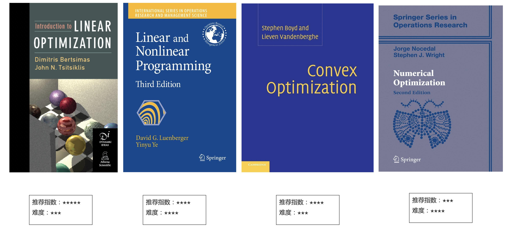

> 🎯 **[My Bucket List — life goals & travel checklist](../7_DairyAndLife/bucket_list.md)**

---

Over time, I noticed that my bookmarks folder had become almost full. Regardless of whether I use Safari on macOS, Microsoft Edge, Chrome on Windows, Firefox, or other browsers like Palemoon on Linux, it’s never perfect to import or sync all my bookmarks together seamlessly. Different systems and devices often require different accounts, and real-time synchronization is not always possible.

To address this, I created this website to organize and update all of my bookmarks in one central location.

I hope you find some of the content useful for your workflow as well.

    Dominic@AMS, NL
    May, 2024

---
BOOKMARKS IN FAVORITES FOLDER
=========

# A ACADEMIC

    Research is to see what everybody else has seen, and to think what nobody else has thought.       
    - Albert Szent-Györgyi

                     

---

##   1 Academic Textbook

这里根据知乎问题 [有哪些适合入门且较全面的运筹学书籍可以推荐一下吗？](https://www.zhihu.com/question/24620225/answer/1837628198) 整理而成。主要作者覃含章、王源、留德华教授等，这些内容非常详尽，对于想一窥“运筹优化-管理科学”的研究内容和方法的学者窃以为很有价值。再次整理希望使内容更有层次和条理。

---

<a href="https://archive.org/details/introductiontoli0000bert/page/n9/mode/2up" target="_blank">01\. Introduction to Linear Optimization; Bertsimas, Dimitris, and John N. Tsitsiklis. Vol. 6. Belmont, MA: Athena Scientific, 1997. </a> 推荐指数：★★★★★ 难度：★★★  这本书可以在线借阅。

[02\. Linear and nonlinear programming;Luenberger, David G., and Yinyu Ye. 1984](https://web.stanford.edu/class/msande310/310trialtext.pdf) 推荐指数：★★★★ 难度：★★★★

[03\. Convex optimization;Boyd, Stephen, Stephen P. Boyd and Lieven Vantenberghe, 2004](https://web.stanford.edu/~boyd/cvxbook/bv_cvxbook.pdf) 推荐指数：★★★★ 难度：★★★

[04\. Numerical Optimization; Jorge Nocedal 01 Google, Stephen Wright, 2006](https://www.csie.ntu.edu.tw/~r97002/temp/num_optimization.pdf) 推荐指数：★★★ 难度：★★★★

---

[05\. Integer and Combinatorial Optimization; Laurence A. Wolsey , George L. Nemhauser, 1999](https://www.pdfdrive.com/integer-and-combinatorial-optimization-d175219871.html) 推荐指数：★★★★ 难度：★★★★★

[06\. Lectures on Convex Optimization; Yurii Nesterov; 2018 Edition](https://link.springer.com/book/10.1007/978-3-319-91578-4) 推荐指数：★★★★ 难度：★★★★

[07\. Robust Optimization(鲁棒优化); Ben-Tal, Aharon, Laurent El Ghaoui, and Arkadi Nemirovski. 2009](https://www2.isye.gatech.edu/~nemirovs/FullBookDec11.pdf) 推荐指数：★★ 难度：★★★★ 

[08\. Network Flows Theory Algorithms and Applications; Ravindra Ahuja , Thomas Magnanti , James Orlin ](http://yalma.fime.uanl.mx/~roger/work/teaching/class_NetworkFlowProgramming/books/network%20flows-Ahuja.pdf) 推荐指数：★★★ 难度：★★★★

[09\. Introduction to Online Convex Optimization(在线凸优化导论); Hazan, Elad. 2019](https://arxiv.org/abs/1909.05207) 推荐指数：★★★★★ 难度：★★★★

[10\. Lectures on Modern Convex Optimization(现代凸优化讲义); Aharon Ben-Tal , Arkadi Nemirovski ](https://www2.isye.gatech.edu/~nemirovs/LMCOBookSIAM.pdf) 推荐指数：★ 难度：★★★★★

---

[11\. Lectures on Stochestic Programming: modeling and theory(随机规划讲义); Alexander Shapiro , Darinka Dentcheva , Andrzej Ruszczynski ](https://cpn-us-w2.wpmucdn.com/sites.gatech.edu/dist/4/1470/files/2021/03/SPbook.pdf) 推荐指数：★★★ 难度：★★★★★ 随机优化界的扛鼎之作。

[12\. Finite-dimentional variational inequalities and complementarity problems](https://www.gbv.de/dms/ilmenau/toc/362594643.PDF) 推荐词中提到了何炳生老师的研究，其中ADMM（The Alternating direction method of multipliers乘子交替方向法)是何老师的主要研究兴趣之一。

[13\. Semidefinite optimization and convex algebraic geometry](http://www.mit.edu/~parrilo/sdocag/SIAMBookFinalvNov12-2012.pdf)

[14\. Convex Analysis-slides for vision](https://vision.in.tum.de/_media/teaching/ss2015/multiscale_methods/chapter_1.pdf)

[15\. Variational Analysis变分分析](https://sites.math.washington.edu/~rtr/papers/rtr169-VarAnalysis-RockWets.pdf)

[16\. Nonlinear Programming](https://www.researchgate.net/publication/230872616_Nonlinear_Programming)

[17\. Convex Optimization Theory](http://web.mit.edu/dimitrib/www/Convex_Theory_Entire_Book.pdf)

[18\. Convex Optimization Algorithms](https://www.pdfdrive.com/convex-optimization-algorithms-d188753307.html)

[19\. Introduction to Probability](https://ece307.cankaya.edu.tr/uploads/files/introduction%20to%20probability%20(bertsekas,%202nd,%202008).pdf)

[20\. Probability: theory and examples](https://compress-pdf.bcad.info/)

[21\. Bandit Algorithms](https://tor-lattimore.com/downloads/book/book.pdf)

[22\. Introduction to Multi-Armed Bandits](https://click.endnote.com/viewer?doi=10.48550%2Farxiv.1904.07272&token=WzE1MzIwNzUsIjEwLjQ4NTUwL2FyeGl2LjE5MDQuMDcyNzIiXQ._g86yhUmLbl9rcQYUVZfGd98axY)

[23\. Neuro-Dynamic Programming神经驱动的动态规划](https://www.researchgate.net/publication/216722122_Neuro-Dynamic_Programming)

[24\. Dynamic\_Programming\_and\_Optimal\_Control](http://www.mit.edu/~dimitrib/DP2_Chapter%204_UPDATED.pdf)

[25\. Abstract dynamic programming](https://web.mit.edu/dimitrib/www/Abstract_DP_2ND_EDITION_Complete.pdf)

[26\. Approximate Dynamic Programming: Solving the Curses of Dimensionality, 2nd Edition | Wiley](https://www.wiley.com/en-us/Approximate+Dynamic+Programming%3A+Solving+the+Curses+of+Dimensionality%2C+2nd+Edition-p-9780470604458)

[26\. Approximate Dynamic Programming: Solving the Curses of Dimensionality](https://castlelab.princeton.edu/html/Presentations/Powell_ADP_tutorialOctober2008.pdf)

[27\. The elements of Statistical Learning](https://hastie.su.domains/Papers/ESLII.pdf)

[28\. Pattern Recognition and Machine Learning](https://www.microsoft.com/en-us/research/uploads/prod/2006/01/Bishop-Pattern-Recognition-and-Machine-Learning-2006.pdf)

[29\. High-Dimensional Statistics](https://www.cambridge.org/core/books/highdimensional-statistics/8A91ECEEC38F46DAB53E9FF8757C7A4E)

[30\. High dimentional statistics](https://math.mit.edu/~rigollet/PDFs/RigNotes17.pdf)

[31\. Introductory Econometrics: A Modern Approach](https://economics.ut.ac.ir/documents/3030266/14100645/Jeffrey_M._Wooldridge_Introductory_Econometrics_A_Modern_Approach__2012.pdf)

[32\. Introduction-to-econometric-2nd.pdf](https://jigjids.files.wordpress.com/2011/05/introduction-to-econometric-2nd.pdf)

[33\. Computational Geometry计算几何学](https://people.inf.elte.hu/fekete/algoritmusok_msc/terinfo_geom/konyvek/Computational%20Geometry%20-%20Algorithms%20and%20Applications,%203rd%20Ed.pdf)

---

####   2 Scholars

在一路的运筹学习道路上遇到了很多研究兴趣相近或很有意思的主题，这部分的收藏主要关注这些学者的研究和兴趣。  

[00. R. Tyrrell Rockafellar](https://sites.math.washington.edu/~rtr/mypage.html) 凸优化和变分分析的作者，这是其个人主页，老爷子的针对初学者的几个视频应该对凸优化和变分分析有兴趣的学者有价值。将其放到00是因为其对运筹的印象和贡献。

[01. Sven Koenig](http://idm-lab.org/) 研究MAPF问题的南加州课题组，对路径规划感兴趣的学者一定不陌生。

[02. Chase Murray](https://www.chasemurray.com/) 研究联合无人机配送系统的开山作者。论文很多方法论仍然很有启发，用数学规划比较早期的建立了模型并进行了求解。

[03. Jimmy S. Ren 任思捷](http://www.jimmyren.com/index.html#t3) 深研院人工智能实践课的校外指导老师。

[04. Google Scholar - Louis-Martin Rousseau](https://scholar.google.com/citations?user=DVZF0PIAAAAJ&hl=en&oi=ao) 蒙特利尔OR教授Martin

[05. Rousseau, Louis-Martin](https://www.polymtl.ca/expertises/en/rousseau-louis-martin) 校内网教授主页

[06. Google Scholar - Chun Cheng](https://scholar.google.com/citations?user=tyHyCW4AAAAJ&hl=en&oi=ao) 鲁棒优化

[07. Githubio - Chun Cheng](https://sites.google.com/site/chun123cheng/home) 个人网站

[08. Liu Changchun](http://orcid.org/0000-0002-3269-5009) 

[09. Yutong’s website](https://yutongli.me/)

####   3 Courses

[01. edX| edX](https://www.edx.org/)

[02. 教师资格证报名](http://ntce.neea.edu.cn/)

[03. Coursera ](https://www.coursera.org/)

[04. 北京大学讲座网](http://lecture.pku.edu.cn/?action=today&year=2013&month=3&date=22)

[05. Web of Science](https://apps.webofknowledge.com/UA_GeneralSearch_input.do?product=UA&search_mode=GeneralSearch&SID=5DcXtGoYXPnbdCkNhPr&preferencesSaved=)

[06. 百度学术](http://xueshu.baidu.com/)

[07. 烂番薯学术搜索](https://scholar.lanfanshu.cn/)

[08. Library Genesis](http://gen.lib.rus.ec/)

[09. 人类学家的使命-CNKI学问](http://xuewen.cnki.net/CCND-RMRH200007280013.html)

[10. 爱科学](https://www.iikx.com/)
下面网站可以用来在手机端求解线性规划问题
[11. tex2solver](https://tex2solver.com/)

[International - Advice and Counselling Service](https://www.welfare.qmul.ac.uk/international/)

[Log in to MySIS](https://mysis.qmul.ac.uk/urd/sits.urd/run/siw_lgn)

[Decision-making under uncertainty in air traffic control | The Alan Turing Institute](https://www.turing.ac.uk/research/research-projects/decision-making-under-uncertainty-air-traffic-control)

[Arrivals Term 1 - Accommodation](https://www.qmul.ac.uk/residences/college/arrival/)

[消息中心 - 哔哩哔哩弹幕视频网 - ( ゜- ゜)つロ 乾杯~ - bilibili](https://message.bilibili.com/#/whisper/mid270405831)

---

####   4. QMUL

[Fill in your passenger locator form - GOV.UK](https://www.gov.uk/provide-journey-contact-details-before-travel-uk)

[QMUL School of Engineering and Materials Science](https://www.sems.qmul.ac.uk/)

[HPC @ QMUL](https://docs.hpc.qmul.ac.uk/)

[Why airports are investing in automation | Airport Business](http://www.airport-business.com/2019/06/airports-investing-automation/#:~:text=Airports%20are%20extremely%20busy%20places,of%20high%20priority%20to%20passengers.&text=Unlike%20the%20retail%20industry%2C%20airports,about%20deploying%20new%20digital%20technologies)

[Academic Technology Approval Scheme (ATAS) - GOV.UK](https://www.gov.uk/guidance/academic-technology-approval-scheme)

[ATAS-Your applications](https://www.academic-technology-approval.service.gov.uk/dashboard)

[Jun Chen](https://www.sems.qmul.ac.uk/staff/jun.chen)

[Alternative support to counselling - Advice and Counselling Service](https://www.welfare.qmul.ac.uk/alternative-and-out-hours-support/alternative-support-counselling/)

[中华人民共和国驻大不列颠及北爱尔兰联合王国大使馆](https://www.fmprc.gov.cn/ce/ceuk/chn/)

[https://www.ctexcel.com/tofillperinfoForOrderNow.jspx](https://www.ctexcel.com/tofillperinfoForOrderNow.jspx)

[Rousseau, Louis-Martin | Directory of Experts](https://www.polymtl.ca/expertises/en/rousseau-louis-martin)

---

####   5 PolyMon

[01\. 入学指引](https://www.polymtl.ca/gopoly/parcours-du-nouvel-etudiant/parcours-du-nouvel-etudiant-aux-etudes-superieures)

[02\. Home | AEIP](https://aeipsuccess.ca/)

[03\. 边境服务署Canada Border Services Agency](https://www.cbsa-asfc.gc.ca/menu-eng.html)

[04\. 推迟一学期入学](https://www.polymtl.ca/gopoly/offre-dadmission/etudes-superieures#reporter)

[05\. 注册Computer tools | GO-POLY](https://www.polymtl.ca/gopoly/les-essentiels-de-la-rentree/outils-informatiques#code-dacces-informatique)

[06\. Study Costs and Financial Aid | DESS, Master's, PhD](https://www.polymtl.ca/futur/en/es/finances)

[07\. GO-POLY |](https://www.polymtl.ca/gopoly/en)

[08\. Moodle : Polytechnique Montréal](https://moodle.polymtl.ca/)

[09\. Confirmation of registration and course schedule | GO-POLY](https://www.polymtl.ca/gopoly/confirmation-dinscription-et-horaire-de-cours#confirmation-dinscription)

[10\. Webinars and Welcome Activities | GO-POLY](https://www.polymtl.ca/gopoly/en/back-school-essentials/webinars-and-welcome-activities)

[11\. BCI](https://www.bci-qc.ca/)

[12\. 神州学人](http://www.chisa.edu.cn/)

[13\. Log in to MySIS](https://mysis.qmul.ac.uk/urd/sits.urd/run/siw_lgn)

[14\. 下载文件 - CleverPDF.com](https://www.cleverpdf.com/cn/downSplit)

[15\. Polytechnique Montreal - Online Admission](https://admission.polymtl.ca/admission-main-web/pages/admission-dashboard.xhtml)

[16\. 10 个步骤 | 国际学生](https://www.polymtl.ca/etudiants-internationaux/preparatifs-de-sejour/10-etapes-suivre)

[17\. Submitting an application for temporary selection to study in Québec | Government of Quebec](https://www.quebec.ca/education/etudier-quebec/demande-selection-temporaire)

[18\. Engineering Mathematics option | Study programs](https://www.polymtl.ca/programmes/programmes/option-mathematiques-de-lingenieur)

[19\. Step 4 - Curriculum](https://www.form.services.micc.gouv.qc.ca/dcae/faces/pages/programmeEtud1.jspx?_afPfm=10&lang=fr)

[20\. CAQapply](https://www.quebec.ca/en/education/study-quebec)

[21\. Arrima](https://www.quebec.ca/en/immigration/online-immigration-services)

[22\. Initial Requests for Documents From Outside Canada | International Students](https://www.polymtl.ca/etudiants-internationaux/en/preparing-your-stay/1-initial-requests-documents-outside-canada)

[23\. Home - Canada.ca](https://www.canada.ca/en.html)

[24\. 国家公派留学管理信息平台](https://sa.csc.edu.cn/student/#/login?redirect=%2Fitems-change)

[25\. CSC](http://www.cscse.edu.cn/)

---

### B PAPER REVIEW

[01\. Sci-Hub](https://sci-hub.wf/)

[02\. THU thesis](http://166.111.120.42/Thesis/Thesis/ThesisSearch/Search_DataInit.aspx?dbid=7&Code=etdqh&nsukey=i8ezEDxGuggs7BU%2B9iyE%2BHs5WBezdRQZItXS35xkE9%2BqkqwwUY%2BkcV5LLErYrMGthRfbfBB8qIha%2Fb24cTqIWAtBHJcmtUOZVYEQRVoSXFNo76wzABAKyo4saY0RXZmfaCJtlAqcGNRai8TDUmqoWLZwG0Bo7GGxIduwtp7LV8HjAV8DE9nv9E4s34K0QsrtHTNMuifvyzBiGMzE3epJYg%3D%3D)

[03\. MIT Theses](https://dspace.mit.edu/handle/1721.1/7582)

[04\. GUFENacadimic](https://gfsoso.99lb.net/)

[05\. EndNoteOnlineReview](https://www.myendnoteweb.com/EndNoteWeb.html?cat=myrefs&)

[06\. 目录-小时百科](https://wuli.wiki/online/index.html)

[07\. 中国优秀硕士学位论文全文数据库](http://gb.oversea.cnki.net/kns55/brief/result.aspx?dbPrefix=CMFD)

[08\. 中国知网](http://www.cnki.net/)

[09\. 萌娘百科 万物皆可萌的百科全书 - zh.moegirl.org.cn](https://zh.moegirl.org.cn/Mainpage)

[10\. Amit’s Game Programming Information](http://www-cs-students.stanford.edu/~amitp/gameprog.html#Paths)

[11\. NTU: Academic Profile: Asst Prof Yan Zhenzhen](http://research.ntu.edu.sg/expertise/academicprofile/Pages/StaffProfile.aspx?ST_EMAILID=YANZZ)

[12\. Operations Research Group Bologna |](http://or.dei.unibo.it/)

[13\. Library Genesis](http://gen.lib.rus.ec/)

[14\. OR-LIBRARY](http://people.brunel.ac.uk/~mastjjb/jeb/info.html)

[15\. Libgen数据提交-自主获取文献-Donwload Papers](http://www.toukey.com/)

[16\. Scimago Journal & Country Rank](https://www.scimagojr.com/index.php)

[17\. 《教您高效的用好知云文献翻译》20200813.pdf · 语雀](https://www.yuque.com/office/yuque/0/2020/pdf/2344247/1599539030613-41ae17a8-c8cf-4134-aaee-b13be7509946.pdf?from=https%3A%2F%2Fwww.yuque.com%2Fxtranslator%2Fzy%2Fnffawe)

[18\. 百度学术](https://xueshu.baidu.com/)

[19\. Bing 学术](https://cn.bing.com/academic)

### C LAUGUAGE（ENGLISH，DUTCH）

####   1 Blocked site in CN

[1. 资讯](https://news.google.com/)

[2. Twitter](https://twitter.com/waylybaye)

[3. Instagram](https://www.instagram.com/dannisheee/)

[4. Netflix](https://www.netflix.com/browse)

[5. Facebook](https://www.facebook.com/)

[6. Quora](https://www.quora.com/)

[7. Google Translate](https://translate.google.com/)

[8. google map](https://maps.google.com/)

####   2 **Dictionaries:** 

[9. Oxford Learner's Dictionarie](https://www.oxfordlearnersdictionaries.com/)

[10. Cambridge - English to Mandarin Chinese](https://dictionary.cambridge.org/dictionary/english-chinese-simplified/)

[11. Dictionary by Merriam-Webster: America's most-trusted online dictionary](https://www.merriam-webster.com/)

[12.  The Free Dictionary](https://www.thefreedictionary.com/)

[13. Macmillan Dictionary](https://www.macmillandictionary.com/)

[14. Spotify Music](https://open.spotify.com/search/%E8%AE%B8%E5%B5%A9)

[15. China Daily](https://tophub.today/n/3adqR13eng)

[17. 英语脑筋急转弯](https://ceretrain.com/)

[Amazon.com. Spend less. Smile more.](https://www.amazon.com/)

[GeeksforGeeks | A computer science portal for geeks](https://www.geeksforgeeks.org/)

[泥巴影院-海外华人在线影院](https://www.mudvod.tv/?utm_source=ADSkejixiaolu)

[Watch CNN International Live TV from USA - Online TV channel](http://www.freeintertv.com/view/id-200)

[Watch CityNews HD Live TV from Canada - Online TV channel](http://www.freeintertv.com/view/id-3366)

[我的托福主页](https://toefl.neea.edu.cn/myHome/21305115/index#!/postTest)

[Ruihao in HTML Format](http://web.mit.edu/rzhu/www/)

[Longman](https://www.ldoceonline.com/dictionary/charcoal)

[Daily EN](https://dict.eudic.net/ting)

[Whats 3/7 chicken, 2/3 cat, and 2/4 goat? | Get the answer | CereTrain](https://ceretrain.com/riddle-717)

[GRE：Test\_Prepara](https://ereg.ets.org/ereg/testPrep/viewEbooksSerives)

[Steve Jobs' address (2005)](https://news.stanford.edu/2005/06/14/jobs-061505/)

[Facebook](https://www.facebook.com/)

[Test Your Vocabulary](http://testyourvocab.com/)

[wikiHow: How-to instructions you can trust.](https://www.wikihow.com/Main-Page)

[The Washington Post: Breaking News, World, US, DC News and Analysis](https://www.washingtonpost.com/)

[Amazon.com. Spend less. Smile more.](https://www.amazon.com/ref=nav_logo)

[Banggood : Global Leading Online Shop for Gadgets and Fashion](https://www.banggood.com/)

[领英Linkin](https://www.linkedin.com/feed/)

[在线翻译\_有道](https://fanyi.youdao.com/)

[Spotify – League of Legends 音乐全纪录](https://open.spotify.com/playlist/37i9dQZF1DZ06evO2pb4Ji)

[Protective Cases & Screen Protectors – RhinoShield](https://rhinoshield.io/)

[Zero to Hero Languages | Master any language by comprehensible input.](https://www.zerotohero.ca/)

[TikTok Online Viewer 📈 - Urlebird](https://urlebird.com/)

[抖音-记录美好生活](https://www.douyin.com/recommend)

[Python|Gurobi——零基础学优化建模](https://mp.weixin.qq.com/s/AeNxv8mG0ov3br1mhYKUVw)

[《新概念英语》动画 全4册全集\_哔哩哔哩\_bilibili](https://www.bilibili.com/video/BV1EJ411Q73N?p=188)

[Reddit - Dive into anything](https://www.reddit.com/)

[Love In The Dark · Adele](https://open.spotify.com/)

[Heygo - Live-streaming tour](https://www.heygo.com/tour-instances/89811)

[Heygo - Home](https://www.heygo.com/home)

### 2.3 Blocked

[资讯](https://news.google.com/)

[Twitter](https://twitter.com/waylybaye)

[Instagram](https://www.instagram.com/dannisheee/)

[Netflix](https://www.netflix.com/browse)

[Facebook](https://www.facebook.com/)

[Quora](https://www.quora.com/)

[翻译](https://translate.google.com/)

[google地图](https://maps.google.com/)

[首页 — SoCloud](https://cloudso.org/user)

### 2.2 ETS

[我的托福主页](https://toefl.neea.edu.cn/myHome/21305115/index#!/postTest)

[中国留学网](http://www.cscse.edu.cn/)

[GRE：Test\_Prepara](https://ereg.ets.org/ereg/testPrep/viewEbooksSerives)

[翻译](https://translate.google.com/)

[资讯](https://news.google.com/)

[Netflix](https://www.netflix.com/browse)

[Quora](https://www.quora.com/)

[My Profile - Zoom](https://us05web.zoom.us/profile)

[01\. GoogleNews](https://news.google.com/)

[02\. 每日英语听力](https://dict.eudic.net/ting)

[03\. 扇贝](https://www.shanbay.com/bdc/review/)

[04\. Amazon.com](https://www.amazon.com/)

[05\. 维基百科](https://www.wikipedia.org/)

[10\. Oxford Learner's Dictionaries](https://www.oxfordlearnersdictionaries.com/)

[11\. Cambridge English–Chinese (Simplified) Dictionary](https://dictionary.cambridge.org/dictionary/english-chinese-simplified/)

[13\. Dictionary by Merriam-Webste](https://www.merriam-webster.com/)

[14\. The Free Dictionary](https://www.thefreedictionary.com/)

[15\. Macmillan Dictionary](https://www.macmillandictionary.com/)

[06\. Spotify](https://open.spotify.com/search/%E8%AE%B8%E5%B5%A9)

[SoCloud](https://cloudso.org/user)

[Download Akka Books - Reactive Microservices Ebooks | Lightbend](https://www.lightbend.com/ebooks)

### 2.1 ENDIC

[Google Translate](https://translate.google.com/?sl=zh-CN&tl=en&op=translate)

[《新概念英语》动画 全4册全集\_哔哩哔哩\_bilibili](https://www.bilibili.com/video/BV1EJ411Q73N?p=242)

[OmeTV Video Chat - Omegle Random Chat Alternative 2021](https://ome.tv/)

[google地图](https://maps.google.com/)

[Twitter](https://twitter.com/waylybaye)

[Instagram](https://www.instagram.com/dannisheee/)

[Watch trending videos for you | TikTok](https://www.tiktok.com/foryou)

[Ruihao in HTML Format](https://rzhu.github.io/)

[Museum card | Museum/en\\](https://www.museum.nl/nl/museumkaart)

[ElMugress - Twitch](https://www.twitch.tv/elmugress)

[AES ØWNER League of Legends Live Stream Video - Watch AES ØWNER Playing League of Legends | Nimo TV](https://www.nimo.tv/live/5534315591)

[06\. Spotify](https://open.spotify.com/show/3cIYYsRFM55BH4p8IE7b4l)

[07\. Discord](https://discord.com/channels/707230275175841915/735451241005449217)

[HDmoli - 高品质在线影视](https://hdmoli.com/)

### 3 COD

### A. Programmer's Like

[00\. StackOverflow](https://stackoverflow.com/questions/4813129/how-to-get-the-line-number-from-a-file-in-c)

[01\. GitHub](https://github.com/)

[02\. Gitee](https://gitee.com/)

[03\. Gitlab](https://about.gitlab.com/)

[04\. CSDN](https://www.csdn.net/)

[05\. BlogsCN](https://www.cnblogs.com/)

[06\. Juejin](https://juejin.cn/)

[07\. SiFou](https://segmentfault.com/)

[08\. InfoQ](https://www.infoq.cn/)

[09\. GitChat](https://gitbook.cn/)

[10\. V2EX](https://v2ex.com/)

[11\. OsChina](https://www.oschina.net/)

[12\. JianShu](https://www.jianshu.com/)

### B. Algorithm Training

[01\. LeetCode](https://leetcode-cn.com/)

[02\. LintCode](https://www.lintcode.com/)

[03\. LuoGu](https://www.luogu.com.cn/)

[04\. NewCoder](https://www.nowcoder.com/)

[05\. ProgInn](https://www.proginn.com/)

[06\. CodeMart](https://codemart.com/developers)

[07\. YuanJiSong](https://yuanjisong.com/job)

[08\. OsChina](https://zb.oschina.net/)

[09\. ShiXian](https://shixian.com/)

[10\. ShenYang-zbj](https://shenyang.zbj.com/)

[11\. MaYiGeek](https://mayigeek.com/)

[12\. LaGou](https://www.lagou.com/)

[13\. BossZhiPin](https://www.zhipin.com/shenzhen/)

[14\. LiePin](https://www.liepin.com/)

### C. C/C++

[01\. Official C++ tutorial doc](http://www.cplusplus.com/doc/)

[02\. BDE Documentation](http://bloomberg.github.io/bde/knowledge_base/coding_standards.html)

[03\. CMake Tutorial](https://cmake.org/cmake/help/latest/guide/tutorial/index.html#guide:CMake%20Tutorial)

[C++: 练习知识点Kata | Codewars](https://www.codewars.com/kata/search/cpp)

[C++: cplusplus.com - The C++ Resources Network](https://www.cplusplus.com/)

[C++ Data Types - GeeksforGeeks](https://www.geeksforgeeks.org/c-data-types/)

[C++: Standard C++](https://isocpp.org/)

[首页 - EasyX Library for C++](https://easyx.cn/)

[C Library <ctype.h>](https://www.tutorialspoint.com/c_standard_library/ctype_h.htm)

[C++ 参考手册 - cppreference.com](https://zh.cppreference.com/w/cpp)

[C++ – 前端开发，JQUERY特效，全栈开发，vue开发](https://www.jqhtml.com/category/cplusplus)

[C++ Shell](http://cpp.sh/)

[C++: cppreference.com中文](https://zh.cppreference.com/w/%E9%A6%96%E9%A1%B5)

[C 指针的算术运算 | 菜鸟教程](https://www.runoob.com/cprogramming/c-pointer-arithmetic.html)

[Boost 1.79.0 Library Documentation](https://www.boost.org/doc/libs/1_79_0/)

[帮助 - IBM ILOG CPLEX Optimization Studio](http://127.0.0.1:53348/help/index.jsp?topic=%2Filog.odms.ide.help%2FOPL_Studio%2Fusroplide%2Ftopics%2Fopl_ide_distrib_MIP.html)

[IBM ILOG CPLEX Optimization Studio 20.1](file:///Applications/CPLEX_Studio_Community201/README.html)

[c++ faq - The Definitive C++ Book Guide and List - Stack Overflow](https://stackoverflow.com/questions/388242/the-definitive-c-book-guide-and-list/388282#388282)

[C++: cppreference.com英文](https://en.cppreference.com/w/)

[cppreference.com](https://zh.cppreference.com/w/)

### D. Linux

[01\. ArchWiki Homepage](https://wiki.archlinux.org/)

[02\. Linux Mint Forums](https://forums.linuxmint.com/)

[03\. VIM之魅（上）](https://blog.zhenghui.org/2011/11/30/charm-of-vim-1/)

[04\. Linux工具快速教程](https://linuxtools-rst.readthedocs.io/zh_CN/latest/)

[05\. 鸟哥的 Linux 私房菜](https://tiramisutes.github.io/images/PDF/vbird-linux-basic-4e.pdf)

[06\. Ubuntu-server-guide-2023-04-03.pdf](https://assets.ubuntu.com/v1/7ebfa3a7-ubuntu-server-guide-2023-04-03.pdf)

[07\. Linux基础](https://linuxtools-rst.readthedocs.io/zh_CN/latest/base/index.html)

[08\. Linux视频教程B站](https://www.bilibili.com/video/BV16b4y1Q7W2/?p=13&spm_id_from=pageDriver&vd_source=8cea6a5eaa2cd6c54ec3d72c1a3bc3ae)

[99\. Home - | TOP500\_Server](https://top500.org/)

[Docker Engine 23.0 release notes | Docker Documentation](https://docs.docker.com/engine/release-notes/23.0/)

### E. GreatProject

[01\. BDE Coding Standards](https://github.com/bloomberg/bde/wiki/Introduction-to-BDE-Coding-Standards)

[02\. xmake](https://xmake.io/#/guide/installation)

[03\. GUnit](https://github.com/cpp-testing/GUnit)

[04\. Copilot](https://github.com/features/copilot)

[05\. BDE C++ Coding Standards](https://bloomberg.github.io/bde/knowledge_base/coding_standards.html)

[06\. GoogleTest User’s Guide](https://google.github.io/googletest/)

[09\. mapf-visualizer](https://github.com/Kei18/mapf-visualizer)

### F. Java

[5\. JDK 16 Documentation - Home](https://docs.oracle.com/en/java/javase/16/index.html)

[Java Platform Standard Edition 8 Documentation](https://docs.oracle.com/javase/8/docs/)

[数组的长度，C语言获取数组长度详解](http://c.biancheng.net/view/186.html)

[MATLAB and Simulink Training](https://matlabacademy.mathworks.com/)

[国内树莓派DIY作品](https://make.quwj.com/)

[IBM ILOG CPLEX Optimization Studio V12.6.0](file:///C:/Program%20Files/IBM/ILOG/CPLEX_Studio126/README.html)

[W3cJava - 专注Java,分享免费Java教程、Java资源下载](http://www.w3cjava.com/)

[用Excel编程](https://www.w3cschool.cn/excelvba/)

[牛客网-wenpeng](https://www.nowcoder.com/home)

[HTML 实例](https://www.w3school.com.cn/html/html_examples.asp)

[Kattis, Kattis](https://open.kattis.com/)

### G. EdgeCode

[Pragmatic Bookshelf: By Developers, For Developers](https://pragprog.com/)

[C++ - Awesome Book](https://riptutorial.com/cplusplus/awesome-learning/book)

[The Boost Graph Library - 1.79.0](https://www.boost.org/doc/libs/1_79_0/libs/graph/doc/index.html)

[GoogleTest User’s Guide | GoogleTest](https://google.github.io/googletest/)

[microsoft C++](https://docs.microsoft.com/zh-cn/cpp/cpp/cpp-built-in-operators-precedence-and-associativity?view=msvc-170)

[Library Genesis: Jeff Langr - Modern C++ programming with test-driven development: code better, sleep better](http://libgen.is/book/index.php?md5=758D3245BF3605C8577ABDFB78CBD0AD)

[All Sites - Stack Exchange](https://stackexchange.com/sites)

[Java Platform Standard Edition 8 Documentation](https://docs.oracle.com/javase/8/docs/)

[C++: cplusplus.com - The C++ Resources Network](https://www.cplusplus.com/)

[C++: 练习知识点Kata | Codewars](https://www.codewars.com/kata/search/cpp)

[C++: Standard C++](https://isocpp.org/)

[国内树莓派DIY作品](https://make.quwj.com/)

[W3cJava - 专注Java,分享免费Java教程、Java资源下载](http://www.w3cjava.com/)

[用Excel编程](https://www.w3cschool.cn/excelvba/)

[C++ 参考手册 - cppreference.com](https://zh.cppreference.com/w/cpp)

[Kattis, Kattis](https://open.kattis.com/)

[Python风格规范 — Google 开源项目风格指南](https://zh-google-styleguide.readthedocs.io/en/latest/google-python-styleguide/python_style_rules/)

[What is the abbreviation for Requirement?](https://www.abbreviations.com/abbreviation/Requirement)

[机器学习系统：设计和实现](https://openmlsys.github.io/)

[Boost Graph Library-Contents](https://www.boost.org/doc/libs/1_79_0/libs/graph/doc/table_of_contents.html)

[swift](https://www.dropbox.com/sh/7aopencivoiegz4/AACy5lKSPRPTGAVHXaoeYk7ea?dl=0)

[01-OnlineGDB](https://www.onlinegdb.com/online_c++_compiler)

[02-ChatGPT](https://aigcfun.com/)

[3：系统管理 – Linux命令大全(手册)](https://www.linuxcool.com/category/system)

[芋道源码 —— 纯源码解析博客](http://www.iocoder.cn/?bilibili&data-structure)

[语义化版本 2.0.0 | Semantic Versioning](https://semver.org/lang/zh-CN/)

[天善智能-商业智能和大数据在线社区，用心创造价值](https://www.hellobi.com/)

[聚数力大数据平台 | 聚集数据的力量 | 大数据应用要素托管与交易平台](http://dataju.cn/Dataju/web/home)

[Get Started with Visual Assist - Whole Tomato Software](https://www.wholetomato.com/learn/getStarted)

[大数据在线社区](https://www.hellobi.com/)

[用Matlab制作一个你专属的App！](http://www.360doc.com/content/18/0724/21/54700046_772959421.shtml)

[删除矩阵中零元素 – MATLAB中文论坛](http://www.ilovematlab.cn/thread-182237-1-1.html)

[cppreference.com](https://zh.cppreference.com/w/)

[cplusplus.com - The C++ Resources Network](http://www.cplusplus.com/)

[Java安装第一步：JDK下载，文件说明](https://www.oracle.com/java/technologies/javase-downloads.html)

[Wang Zhe](https://wang-zhe.me/)

[Getting Started with Azure DevOps CI - Chapter 1 · unop](https://unop.uk/getting-started-with-azure-devops-ci/#:~:text=VS850048%3A%20The%20specified%20region%3A%20CUS%20is%20not%20supported,this%20you%20can%20create%20your%20organisation%20%2F%20project.)

[JDK 15 Documentation - Home](https://docs.oracle.com/en/java/javase/15/index.html)

[ConvNetJS demo: Classify toy 2D data](https://cs.stanford.edu/people/karpathy/convnetjs/demo/classify2d.html)

[Module: tf  |  TensorFlow Core v2.8.0](https://tensorflow.google.cn/api_docs/python/tf)

[Heresy's Space – Unlimited Blog Work](https://kheresy.wordpress.com/)

[Getting Started: Using Git · boostorg/wiki Wiki · GitHub](https://github.com/boostorg/wiki/wiki/Getting-Started%3A-Using-Git)

[华为开发者联盟](https://developer.huawei.com/consumer/cn/console#/apiList/dynamicimage)

[解决git error: invalid path - ALOVN的博客](https://blog.alovn.cn/2021/08/25/git-error-invalid-path/)

[About - ALOVN的博客](https://blog.alovn.cn/about/)

[pengzhile (Neo Peng) · GitHub](https://github.com/pengzhile)

[Introduction to the A\* Algorithm](https://www.redblobgames.com/pathfinding/a-star/introduction.html)

[Awesome Xmake - xmake](https://xmake.io/#/zh-cn/about/awesome)

[🎉 Docker 简介和安装 - Docker 快速入门 - 易文档](https://docker.easydoc.net/doc/81170005/cCewZWoN/lTKfePfP)

[Unicode字符表](https://www.rapidtables.org/zh-CN/code/text/unicode-characters.html)

[Akka 中文指南 | akka-guide](https://guobinhit.github.io/akka-guide/)

[1\. 在线编译器cpp/java/python](https://www.onlinegdb.com/online_c++_compiler)

[2\. ChatGPT2](https://aigcfun.com/)

[3\. ChatGPT](https://chat.openai.com/chat)

[弗洛伊德算法 - 算法与复杂度 | 小白·菜的空间](https://infinityglow.github.io/study/algorithm/dynamic-programming/Floyd-Warshall/)

[PyPI · The Python Package Index](https://pypi.org/)

[菜鸟教程-推荐书目](https://www.runoob.com/w3cnote/github-tools.html)

[清华大学 TUNA 协会](https://tuna.moe/)

### E. Projects

[01\. BDE Coding Standards](https://github.com/bloomberg/bde/wiki/Introduction-to-BDE-Coding-Standards)

[02\. xmake](https://xmake.io/#/guide/installation)

[03\. GUnit](https://github.com/cpp-testing/GUnit)

[04\. Copilot](https://github.com/features/copilot)

[05\. BDE C++ Coding Standards](https://bloomberg.github.io/bde/knowledge_base/coding_standards.html)

[06\. GoogleTest User’s Guide](https://google.github.io/googletest/)

[04 Gitignore Online Generator](https://gitignore.itranswarp.com/)

[阿里云-工业大脑](https://cn.aliyun.com/product/ai/brainindustrial?from_alibabacloud=)

[前端库 - 前端开发，JQUERY特效，全栈开发，vue开发](https://www.jqhtml.com/)

[Get Started with Anaconda](https://learning.anaconda.cloud/get-started-with-anaconda)

### 4 TOO

### A. Cloud Drive

[01\. 阿里云盘-10240G](https://www.aliyundrive.com/drive/)

[02\. 百度网盘-2055G](https://pan.baidu.com/disk/home?#/all?path=%2F&vmode=list)

[03\. 谷歌网盘-15G](https://drive.google.com/drive/my-drive)

[04\. 腾讯微云-30G](https://www.weiyun.com/disk)

[05\. 天翼云盘-10G](https://cloud.189.cn/web/main/file/folder/-11)

[07\. OneDrive-1024G](https://onedrive.live.com/?id=root&cid=FAD75ABF5491B2DD)

### B. E-MAILS

[01\. QQmail](https://mail.qq.com/cgi-bin/loginpage)

[02\. THU Alumnus Mail](http://mail.tsinghua.org.cn/)

[03\. GMail](https://accounts.google.com/b/0/AddMailService)

[04\. 163mail](http://mail.163.com/)

[05\. 189mail](https://webmail30.189.cn/w2/)

[06\. Alibaba Mail](https://qiye.aliyun.com/alimail/auth/login?reurl=%2Falimail%2F%23h%3DWyJmbV8yIixbIjIiLCIiLHsiZklkIjoiMiIsInNlbElkIjoiMl8wOkR6enp6eVJSRWM0JC0tLS5OcVdhdm82Iiwib2Zmc2V0Ijo0LCJyZyI6W1siMiIseyJpZCI6Im0hMl8wOkR6enp6eVJSRWM0JC0tLS5OcVdhdm82Iiwic2YiOjB9XV19LHsibGFiZWwiOiLpgq7ku7YifV1d)

[07\. Outlook](https://outlook.live.com/mail/0/)

[08\. iCloud mail](https://www.icloud.com.cn/mail/)

[海柔Outlook](https://outlook.office.com/mail/)

[清华校友邮箱](http://mail.tsinghua.org.cn/)

[清华邮件](https://mails.tsinghua.edu.cn/coremail/XT3/index.jsp?sid=CAnYXSVVKfErQSFJbNVVpQshgHaTYGvp#/md=welcome&_suid=91)

[163mail](https://mail.163.com/)

[Gmail](https://mail.google.com/mail/u/0/#inbox)

[邮件 - Li Wenpeng - Outlook](https://outlook.live.com/mail/0/inbox)

[iCloud 邮件](https://www.icloud.com/mail/)

[QQmail](https://mail.qq.com/cgi-bin/loginpage)

[Gmail](https://accounts.google.com/b/0/AddMailService)

[163mail](http://mail.163.com/)

[01\. Internet Archive](https://archive.org/details/CSPAN_20190525_043800_President_Trump_White_House_Departure/start/180/end/240)

[02\. Miro](https://miro.com/app/dashboard/)

[set designer - 国内版 Bing](https://cn.bing.com/search?q=set%20designer)

[Graph Editor](https://csacademy.com/app/graph_editor/)

[FreeGrabApp | Free Video Downloader and MP3 Converter](https://freegrabapp.com/)

[1000+ Highest Rated Riddles | CereTrain](https://ceretrain.com/)

[Whimsical](https://whimsical.com/)

[PDF转换器和工具](https://www.cleverpdf.com/cn)

[NCM2MP3](http://ncm.worthsee.com/)

[设计素材搜索 - 让设计更轻松！ - 设计常用](http://image.chongbuluo.com/)

[LookAE.com-大众脸影视后期特效](http://www.lookae.com/)

[设计导航 - 精选最好的设计网站大全](http://hao.shejidaren.com/index.html)

[在线免费编辑海报制作](https://818ps.com/)

[秀米首页 - 秀米 XIUMI](https://xiumi.us/#/)

[橡胶人 国配电影社区](http://www.ccvnn.com/home.php?mod=space&do=notice&view=system)

[编辑视频 – 爱美刻](https://aimeike.tv/app/edit/2244847)

[Trending posts — Steemit](https://steemit.com/)

[LT8390 Synchronous Buck-Boost DC-DC Converter | Projects | CircuitMaker](https://circuitmaker.com/Projects/Details/Craig-Peacock-4/LT8390-Synchronous-Buck-Boost-DC-DC-Converter)

[Created with Camtasia Studio 5](http://ltcconline.net/greenl/courses/202/Videos/VecCalc/FTLI/FTLI/pathInd.htm)

[iP地址查询--手机号码查询归属地 | 邮政编码查询 | iP地址归属地查询 | 身份证号码验证在线查询网](https://www.ip138.com/)

[Table Convert Online - allTableTo Markdown format](https://tableconvert.com/)

[在线PDF压缩](https://smallpdf.com/cn/compress-pdf)

[Whimsical Flowcharts](https://whimsical.com/flowcharts)

[单位换算大全 - 在线单位转换计算器](https://cn.unithelper.com/)

[03\. 短信轰炸](https://www.ahhhhfs.com/28756/)

[04\. 魔术橡皮擦](https://photokit.com/tools/magic-eraser/?lang=zh)

[埃隆·马斯克的决策逻辑：与万物原理同行！\_大脑\_思维\_想法](https://www.sohu.com/a/524953123_644547)

[19\. 狗屁不通文章生成器](https://suulnnka.github.io/BullshitGenerator/?%E4%B8%BB%E9%A2%98=%E6%80%9D%E6%83%B3%E6%B1%87%E6%8A%A5&%E9%9A%8F%E6%9C%BA%E7%A7%8D%E5%AD%90=3798357023)

[FlexSim Basics Tutorial](https://docs.flexsim.com/en/23.1/Tutorials/FlexSimBasics/BasicsOverview/BasicsOverview.html)

### A. MAIL

[01\. QQmail](https://mail.qq.com/cgi-bin/loginpage)

[02\. iCloud CN](https://www.icloud.com.cn/mail/)

[03\. GMail](https://accounts.google.com/b/0/AddMailService)

[04\. 163mail](http://mail.163.com/)

[05\. 189mail](https://webmail30.189.cn/w2/)

[07\. Outlook](https://outlook.live.com/mail/0/)

[08\. iCloud-US](https://www.icloud.com/)

### B. Cloud Drive

[01\. 阿里云盘-10240G](https://www.aliyundrive.com/drive/)

[02\. 百度网盘-2055G](https://pan.baidu.com/disk/home?#/all?path=%2F&vmode=list)

[03\. 谷歌网盘-15G](https://drive.google.com/drive/my-drive)

[04\. 腾讯微云-30G](https://www.weiyun.com/disk)

[05\. 天翼云盘-10G](https://cloud.189.cn/web/main/file/folder/-11)

[07\. OneDrive-1024G](https://onedrive.live.com/?id=root&cid=FAD75ABF5491B2DD)

[05 雨天窗前的沉浸式学习工作](https://www.bilibili.com/video/BV1DC4y1d7gR/?spm_id_from=333.1007.tianma.17-3-65.click&vd_source=a61087f39589ca585073e8548bdf0de5)

[06 1Password for pro](https://my.1password.com/home)

[UML Editor](http://alexdp.free.fr/violetumleditor/page.php)

[Welcome to Xslist.org](https://xslist.org/)

### 5 ST

### READ

[01\. 当当网](http://www.dangdang.com/)

[02\. 孔夫子旧书网](https://www.kongfz.com/)

[03\. 中国大百科全书ChinaBaike](https://www.zgbk.com/)

[04\. 方格子](https://vocus.cc/)

[05\. Zlibrary](https://b-ok.cc/)

[06\. 机器学习系统：设计和实现](https://openmlsys.github.io/)

### 丝竹管弦

[网易云音乐](https://music.163.com/#/my/m/music/playlist?id=97694557)

[李健-君子行 (经典咏流传第四季 第5期)-高清MV在线看-QQ音乐-千万正版音乐海量无损曲库新歌热歌天天畅听的高品质音乐平台！](https://y.qq.com/n/ryqq/mv/k0036qtvlzg)

### 9 EDIT

### 9.1 MovieMusic

[Library Genesis](http://libgen.rs/)

[揭密真相](https://factpedia.org/wiki/%E9%A6%96%E9%A1%B5)

[EPUB阅读器 | TXT阅读器](https://www.neat-reader.cn/)

[在线之家](https://www.zxzj.me/)

[看剧网](https://www.kan-ju.com/)

[新电影网\_在线看\_NOW直播\_电视剧\_综艺\_动漫](http://www.xdy.one/)

[Stanford Encyclopedia of Philosophy](https://plato.stanford.edu/)

[腾讯视频 - 中国领先的在线视频媒体平台,海量高清视频在线观看](https://v.qq.com/)

[唐人街影院-海外华人影视网站-在线高清播放](https://www.tangrenjie.tv/)

[Electronic library. Download books free. Finding books](https://4lib.org/)

[Power and Energy Webinar-Chinese.pdf](https://pages.gurobi.com/rs/181-ZYS-005/images/Power%20and%20Energy%20Webinar-Chinese.pdf)

[豆瓣FM](https://fm.douban.com/)

[网易云音乐](https://music.163.com/#/my/m/music/playlist?id=97694557)

[Apple Music](https://music.apple.com/cn/artist/enya/160847?l=en)

[QQ音乐](https://y.qq.com/n/ryqq/profile/like/song)

[酷狗](https://www.kugou.com/)

[LoL Esports](https://lolesports.com/)

[Match History](https://matchhistory.na.leagueoflegends.com/en/#match-details/NA1/4020254163/2784356991264640)

[LoL Stats, Record Replay, Database, Guide - OP.GG](https://na.op.gg/)

[努努影院-在线电影-最新电影-免费电影-电影在线观看](https://www.nunuyy.cc/)

[斗鱼云游戏\_免费的云游戏平台\_斗鱼云游戏官网](https://cloudgame.douyu.com/directory)

[Beijing Normal University (China)](http://cmap.systemsci.org/rid=1RV8Y4KF9-1G9WQCL-35G/Quantum)

[对联库](https://yl.chnlib.com/)

[壁炉中燃烧的柴火 7小时 真实时间「非循环」\_哔哩哔哩\_bilibili](https://www.bilibili.com/video/BV1Bx41147EW?from=search&seid=5000494978813495903&spm_id_from=333.337.0.0)

### 9.2 Write

[01\. GitHub](https://github.com/)

[02\. Gitee](https://gitee.com/)

[04\. 简书](https://www.jianshu.com/)

[05\. 质本瑚琏公众号](https://mp.weixin.qq.com/cgi-bin/home?t=home/index&lang=zh_CN&token=1136635347)

[06\. 锤子便签网页版](https://yun.smartisan.com/#/notes)

[微信公众平台](https://mp.weixin.qq.com/)

[英雄 | 印象笔记网页版](https://app.yinxiang.com/Home.action?_sourcePage=JqtXC2d7LvziMUD9T65RG_YvRLZ-1eYO3fqfqRu0fynRL_1nukNa4gH1t86pc1SP&__fp=L7gYfyljfv83yWPvuidLz-TPR6I9Jhx8&hpts=1628209598905&showSwitchService=true&usernameImmutable=false&rememberMe=true&login=&login=%E7%99%BB%E5%BD%95&login=true&username=714391856%40qq.com&hptsh=Dzk1hQWtLlV%2BvrvJr5xxRBGU4GQ%3D#n=9c274c0a-8372-4cb3-9a15-84ff88e15251&s=s13&ses=4&sh=2&sds=5&)

[我的B站直播间](https://live.bilibili.com/21949838)

### 9.3 OFFICE

[熊猫鹏的小酒馆21](https://www.notion.so/21-a4a68922274b45e48f73a0e1466bbb1b)

[梓潼的优化空间](https://blog.csdn.net/weixin_43464653?spm=1000.2115.3001.5343)

[质本瑚琏公众号](https://mp.weixin.qq.com/cgi-bin/home?t=home/index&lang=zh_CN&token=1136635347)

[博客园 -橡胶人](https://www.cnblogs.com/)

[GitHub](https://github.com/)

[我的桌面 - 石墨文档](https://shimo.im/desktop)

[iCloud](https://www.icloud.com/)

[锤子便签网页版](https://yun.smartisan.com/#/notes)

[微信公众平台](https://mp.weixin.qq.com/)

[英雄 | 印象笔记网页版](https://app.yinxiang.com/Home.action?_sourcePage=JqtXC2d7LvziMUD9T65RG_YvRLZ-1eYO3fqfqRu0fynRL_1nukNa4gH1t86pc1SP&__fp=L7gYfyljfv83yWPvuidLz-TPR6I9Jhx8&hpts=1628209598905&showSwitchService=true&usernameImmutable=false&rememberMe=true&login=&login=%E7%99%BB%E5%BD%95&login=true&username=714391856%40qq.com&hptsh=Dzk1hQWtLlV%2BvrvJr5xxRBGU4GQ%3D#n=9c274c0a-8372-4cb3-9a15-84ff88e15251&s=s13&ses=4&sh=2&sds=5&)

[首页 - 知乎](https://www.zhihu.com/)

[Word](https://www.office.com/launch/word?ui=zh-CN&rs=CN&auth=1)

[我的B站直播间](https://live.bilibili.com/21949838)

[01\. Notion 22 Plan](https://www.notion.so/21-22-a4a68922274b45e48f73a0e1466bbb1b)

[02\. 牛客网](https://www.nowcoder.com/profile/227662782)

[03\. Overleaf](https://www.overleaf.com/project)

[04\. 印象笔记](https://app.yinxiang.com/Home.action?_sourcePage=JqtXC2d7LvziMUD9T65RG_YvRLZ-1eYO3fqfqRu0fynRL_1nukNa4gH1t86pc1SP&__fp=L7gYfyljfv83yWPvuidLz-TPR6I9Jhx8&hpts=1628209598905&showSwitchService=true&usernameImmutable=false&rememberMe=true&login=&login=%E7%99%BB%E5%BD%95&login=true&username=714391856%40qq.com&hptsh=Dzk1hQWtLlV%2BvrvJr5xxRBGU4GQ%3D#n=9c274c0a-8372-4cb3-9a15-84ff88e15251&s=s13&ses=4&sh=2&sds=5&)

[05\. 豆瓣](https://www.douban.com/)

[06\. 北京家教](http://www.qinghuaxuezi.com/)

[07\. Feishu Docs](https://b7ofrxge0k.feishu.cn/drive/home/)

[Word](https://www.office.com/launch/word?ui=zh-CN&rs=CN&auth=1)

[简书 - 创作你的创作](https://www.jianshu.com/)

[质本瑚琏公众号](https://mp.weixin.qq.com/cgi-bin/home?t=home/index&lang=zh_CN&token=1136635347)

[锤子便签网页版](https://yun.smartisan.com/#/notes)

[09\. Word](https://www.office.com/launch/word?ui=zh-CN&rs=CN&auth=1)

[英雄 | 印象笔记网页版](https://app.yinxiang.com/Home.action?_sourcePage=JqtXC2d7LvziMUD9T65RG_YvRLZ-1eYO3fqfqRu0fynRL_1nukNa4gH1t86pc1SP&__fp=L7gYfyljfv83yWPvuidLz-TPR6I9Jhx8&hpts=1628209598905&showSwitchService=true&usernameImmutable=false&rememberMe=true&login=&login=%E7%99%BB%E5%BD%95&login=true&username=714391856%40qq.com&hptsh=Dzk1hQWtLlV%2BvrvJr5xxRBGU4GQ%3D#n=9c274c0a-8372-4cb3-9a15-84ff88e15251&s=s13&ses=4&sh=2&sds=5&)

[熊猫鹏的小酒馆21&22](https://www.notion.so/21-22-a4a68922274b45e48f73a0e1466bbb1b)

[我的B站直播间](https://live.bilibili.com/21949838)

[微信公众平台](https://mp.weixin.qq.com/)

[01\. 当当网](http://www.dangdang.com/)

[02\. 孔夫子旧书网](https://www.kongfz.com/)

[03\. 中国大百科全书ChinaBaike](https://www.zgbk.com/)

[04\. 方格子](https://vocus.cc/)

[05\. Zlibrary](https://b-ok.cc/)

[06\. 机器学习系统：设计和实现](https://openmlsys.github.io/)

[在线之家](https://www.zxzj.me/)

[唐人街影院-海外华人影视网站-在线高清播放](https://www.tangrenjie.tv/)

[LoL Stats, Record Replay, Database, Guide - OP.GG](https://na.op.gg/)

[Beijing Normal University (China)](http://cmap.systemsci.org/rid=1RV8Y4KF9-1G9WQCL-35G/Quantum)

[Via Login](https://inscriptions.cscmonavenir.ca/VIA/en/Account/LogOn)

[Library Genesis](http://libgen.rs/)

[揭密真相](https://factpedia.org/wiki/%E9%A6%96%E9%A1%B5)

[EPUB阅读器 | TXT阅读器](https://www.neat-reader.cn/)

[看剧网](https://www.kan-ju.com/)

[新电影网\_在线看\_NOW直播\_电视剧\_综艺\_动漫](http://www.xdy.one/)

[Stanford Encyclopedia of Philosophy](https://plato.stanford.edu/)

[腾讯视频 - 中国领先的在线视频媒体平台,海量高清视频在线观看](https://v.qq.com/)

[Electronic library. Download books free. Finding books](https://4lib.org/)

[Power and Energy Webinar-Chinese.pdf](https://pages.gurobi.com/rs/181-ZYS-005/images/Power%20and%20Energy%20Webinar-Chinese.pdf)

[What's New Songs | Music Licensing | Musicbed](https://www.musicbed.com/songs?playlists=whats-new)

[努努影院-在线电影-最新电影-免费电影-电影在线观看](https://www.nunuyy.cc/)

[斗鱼云游戏\_免费的云游戏平台\_斗鱼云游戏官网](https://cloudgame.douyu.com/directory)

[对联库](https://yl.chnlib.com/)

[壁炉中燃烧的柴火 7小时 真实时间「非循环」\_哔哩哔哩\_bilibili](https://www.bilibili.com/video/BV1Bx41147EW?from=search&seid=5000494978813495903&spm_id_from=333.337.0.0)

[微信读书-正版书籍小说免费阅读](https://weread.qq.com/)

[第七章 入职运筹优化算法岗 - 运筹优化算法工程师的成长之路](https://app.gitbook.com/s/wnBe2k0gT3qDEEgQXdre/part-2-yuan-meng-qing-hua/di-qi-zhang-ru-zhi-yun-chou-you-hua-suan-fa-gang)

[NeteaeMusic](https://music.163.com/)

[在线之家 - 在线观看最新美剧|最新韩剧|天天美剧|人人美剧](https://www.zxzjtv.com/)

### 7 HAI

### CBS

[mapf.info : webmaster: Sven Koenig | Main / Welcome! | browse](http://mapf.info/)

[mapf.info : webmaster: Sven Koenig | Main / Researchers | browse](http://mapf.info/index.php/Main/Researchers)

[mapf.info : webmaster: Sven Koenig | Main / Sven Koenig | browse](http://mapf.info/index.php/Main/Svenkoenig)

[LaCAM: Search-Based Algorithm for Quick Multi-Agent Pathfinding](https://arxiv.org/pdf/2211.13432.pdf)

[Priority Inheritance with Backtracking for Iterative Multi-agent Path Finding](https://arxiv.org/pdf/1901.11282.pdf)

[PIBT-github](https://kei18.github.io/pibt2/)

[Home | home](https://felner.wixsite.com/home)

[mapf.info : webmaster: Sven Koenig | Main / Information on MAPF | browse](http://mapf.info/index.php/Main/Tutorials)

[Amazon's AI tool can plan collision-free paths for 1,000 warehouse robots | VentureBeat](https://venturebeat.com/2020/05/18/amazons-ai-tool-can-plan-collision-free-paths-for-1000-warehouse-robots/)

[Jiaoyang-Li](https://github.com/Jiaoyang-Li)

[Jiaoyang Li - Jiaoyang Li](https://jiaoyangli.me/)

### PP

[PP代码讲解 Part 1](https://hairobotics.feishu.cn/minutes/obcnavu5yrz25dm28g58alv4?from=auth_notice)

[PP代码讲解 Part 2](https://hairobotics.feishu.cn/minutes/obcnhhugv3b91d9h161f9jq9)

[PP代码讲解 Part 3](https://hairobotics.feishu.cn/minutes/obcnhl9k3g13k8y5bptfc52e)

[PP 代码讲解 Part4](https://hairobotics.feishu.cn/minutes/obcniz8mde5lvl2u1l4d949s)

[PP 代码讲解 Part 5](https://hairobotics.feishu.cn/minutes/obcnkch6457s3guv33g3ul3l)

[ALT\_algorithm](https://faculty.cc.gatech.edu/~thad/6601-gradAI-fall2012/02-search-Goldberg03tr.pdf)

[01\. Pairwise symmetry reasoning for MAPF search](https://www.sciencedirect.com/science/article/pii/S0004370221001259)

### Netherland

[‌​‍​‌⁣⁤‍​‍⁣⁡‍‌⁡​​⁣‌⁡⁡​​​⁣⁤‌‬⁢‍⁤⁢‌​‍‬‌​⁢⁤​⁤⁤⁤⁣‍软件部外派海外人才报名-20230705备份 - 飞书云文档](https://hairobotics.feishu.cn/docx/Txy7dVC0jopaFsxh1fIcymoFnle)

[‍​⁢⁢⁤​​⁣⁢‬⁡​⁣​‌‬⁣​‬⁣‌​‍⁤‌⁤​​⁡‌‍​‌‌‌​⁤⁤‌​‌⁤​​‍⁢​Global Travel and Business Expenses Policy - 飞书云文档](https://hairobotics.feishu.cn/wiki/wikcn4IUxgNaH4UEQVridgJFSmg)

[Appointment to collect residence document | IND](https://ind.nl/en/appointment-to-collect-residence-document)

[When do I have to register with a Dutch municipality? | Netherlands Worldwide](https://www.netherlandsworldwide.nl/personal-records-database-brp/when-register)

[Online appointment form: individuals | IN Amsterdam | I amsterdam](https://www.iamsterdam.com/en/live-work-study/in-amsterdam/international-newcomers/make-an-appointment-individuals)

[Mia's world](https://www.douban.com/note/617971595/)

[美团技术团队](https://tech.meituan.com/)

[欢迎页（勿编辑） | 海柔软件部Wiki](http://wiki.hairoutech.com/)

[Hoenig\_RAL2019.pdf](http://act.usc.edu/publications/Hoenig_RAL2019.pdf)

[Python GUI运行 - 飞书云文档](https://hairobotics.feishu.cn/docs/doccnhRiluAih1zXn7uVaEHMwed)

[海图](http://172.20.8.212/#/)

[海图new](http://172.18.81.193/ess-admin)

[SCIP | 数学规划求解器SCIP超详细的使用教程 - 短短的路走走停停 - 博客园](https://www.cnblogs.com/dengfaheng/p/10041488.html)

[运筹算法组 - 飞书云文档](https://hairobotics.feishu.cn/drive/folder/fldcni0B0EjuUZQdr68UutrzdBT)

[MIT Mobility Initiative](https://www.mobilityinitiative.mit.edu/)

[海柔创新-箱式仓储机器人系统专家](http://oa.hairoutech.com:8066/wui/index.html#/main/attendance/checking?menuIds=100020,100021&menuPathIds=100020,100021&_key=59let2)

[用户学习计划明细 - HAIKE](https://elearning.hairobotics.com/plan/26b284bd0ae245e8b04d640aaa12a709.html)

[‌‍⁣‍​‌⁤⁡⁣‌​⁢​​‍​⁡‍‍‍⁤‌⁡⁢⁣‬‬​​​⁤‍​⁣‬⁤⁣​‌‌⁤‍PBS仿真平台调试问题汇总&&使用教程 - 飞书云文档](https://hairobotics.feishu.cn/docx/NvcbdnQyEoKr9YxF555cFRO7nsd)

[nova: 172.20.9.35](http://172.20.9.35/)

[算法镜像包下载地址](http://172.20.8.9/download/algo/release/)

[ESS+IMHS培训课程表+录屏导航 - 飞书云文档](https://hairobotics.feishu.cn/docx/WhqcdIVZUo3hhmxrwQ8cvCdpnRe)

[openTCS: User’s Guide](https://www.opentcs.org/docs/5.6/user/opentcs-users-guide.html#_default_strategies)

[京东亚一测试环境](http://172.20.8.137/#/equipment-manage/robot)

[EHR系统首页](https://www.italent.cn/portal/iTalentHome?_userSpecialType=1&xpuid=607529142)

[Docs](https://hairobotics.feishu.cn/docx/GsFBdh9gcoJtGLxIPx0c15uinNh)

[⁣⁡‬‍⁢⁡⁤‍‍⁡⁢⁢⁤⁢⁡​⁣‌​⁢​‌⁢‍​⁣⁢‬⁤‌‬‌​⁡‍‍‍​⁢​‍算法测试必备技能及相关资料 - 飞书云文档](https://hairobotics.feishu.cn/docx/doxcnA1RbjdLoDwJB9EwQt53YVc)

[You don't have permission to access this content.](https://hairobotics.feishu.cn/minutes/obcniz8mde5lvl2u1l4d949s)

[You don't have permission to access this content.](https://hairobotics.feishu.cn/minutes/obcnkch6457s3guv33g3ul3l)

[Reactive Design Patterns —](https://www.reactivedesignpatterns.com/)

[Projects · Dashboard · GitLab](https://git.hairoutech.com/)

[System Dashboard - Hairou Jira](https://jira.hairoutech.com/secure/Dashboard.jspa)

[Home](https://www.ifoy.org/en/#:~:text=The%20IFOY%20AWARD%20is%20presented,intralogistics%20products%20and%20system%20solutions.)

[About](https://ifoy.org/en/award)

[海柔创新 - 管理平台](http://172.20.110.16:9001/iwms/dashboard)

[Index of /download/](http://172.20.8.9/download/)

[OKR · Allen Ai](https://hairobotics.feishu.cn/okr/user/6981705069041632799/?okrId=7075785692794208284&type=leader)

[OKR · Dominic Li](https://hairobotics.feishu.cn/okr/user/7078473095992639489/?okrId=7080567605911732225&type=my)

[PP代码讲解 Part2](https://hairobotics.feishu.cn/minutes/obcnhhugv3b91d9h161f9jq9)

[主页 - 飞书云文档](https://hairobotics.feishu.cn/drive/home/)

[‌‬​⁡⁢‌⁣⁣​⁣⁤‬‌⁤⁡​‬​⁡‬‌⁡‬‬‍⁡‌⁤⁤⁢​‍​‌‍‬⁤⁡​‌​‬‬01 海柔产品术语库](https://hairobotics.feishu.cn/wiki/wikcnkrKhMb89V4M0LRAtQuL2gd#fxACoR)

[共享目录](http://172.20.8.9/)

[PP代码讲解 Part 1](https://hairobotics.feishu.cn/minutes/obcnavu5yrz25dm28g58alv4?from=auth_notice)

[PP代码讲解 Part 2](https://hairobotics.feishu.cn/minutes/obcnhhugv3b91d9h161f9jq9)

### 8 NL

[01 Louwman](https://www.louwman.nl/aanbod)

[02 DigiD](https://www.digid.nl/en/)

[03 Pararius – Het onafhankelijke woningplatform van Nederland](https://www.pararius.nl/)

[04 MAC Housing](https://www.machousing.nl/)

[05 Skyscanner](https://www.skyscanner.nl/?previousCultureSource=GEO_LOCATION&redirectedFrom=www.skyscanner.com)

[06 Hoofddorp parking](https://geoweb.haarlemmermeer.nl/Geoviewer/Index.html?viewer=Betaald_parkeren__blauwe_zones_Haarlemmermeer.Betaald_parkeren__blauwe_zones)

[07 expat reimbureance](https://hairobotics.feishu.cn/docx/I0b3djNNgoIx8lxTcoUcekwqn2b)

[08 0‌⁢​‬⁤​⁤​⁣⁣⁡⁡​​‬​⁡⁤‍⁡⁤‍⁢⁤⁢‌​⁡⁢‬‍‌​​⁢⁣⁣⁤‬⁡‍‬​‍‬​Attendence Management](https://hairobotics.feishu.cn/base/Pib6b7Fhma2NYPs1Of8cmDAvnGe?table=tblbLWwBnYwx6HTU&view=vewAg5EStC)

[09 工时填报](https://hairobotics.feishu.cn/base/PBf3brERWamYbQsm80UcNSgjn5c?table=tblKLyrBgZgptU8z&view=vewrAQwhUm)

[‌⁢​​​‌⁣​⁡​​​⁣‍‍⁢​‬​⁡‌⁡‬‌⁤‬⁡‍​⁡‬‬⁡‬⁣​‬⁢‌​11 WFH Schedule-EMEA](https://hairobotics.feishu.cn/sheets/Tegos7P7ehml1BtQq04cBoLknxe)

[Meerlanden Waste Calendar](https://inzamelkalender.meerlanden.nl/modules/800bf8d7-6dd1-4490-ba9d-b419d6dc8a45/kalender/calendar.html?1000044273&Juf%20van%20Kempenstraat---55%20%20%20---2132ZV---Hoofddorp---Haarlemmermeer)

[14 OA\_baoxiao](https://oa.hairoutech.com:8088/wui/index.html#/main/workflow/listDoing?menuIds=1,13&menuPathIds=1,13&_key=85vjl0)

[TravelHub Login Page](https://tripstaxaad.b2clogin.com/tripstaxaad.onmicrosoft.com/oauth2/v2.0/authorize?p=B2C_1A_TH_SIGNIN&client_id=dab090fc-628e-4acb-be1a-fb923173f9fc&nonce=pDK2WgFR6C1cMBMqQLomIwEhx&redirect_uri=https%3A%2F%2Ftravelhub.atpi.com%2Freply.php&scope=openid&response_type=id_token&prompt=login)

[Teams](https://teams.microsoft.com/_?tenantId=c8e8bdb6-8e7c-41d5-bc41-37fff3c33b75#/tab::00cc2b06-9654-42ac-a5cc-28d601b7dd11/Issues?threadId=19:88737630bde5402396b0d04dbd9886e1@thread.tacv2&ctx=channel)

[MijnOverheid](https://mijn.overheid.nl/)

[1Password — Password Manager for Teams, Businesses, and Families](https://start.1password.com/sign-up?c=PNSGHDP-G9T1SX84)

[Inloggen op Mijn Belastingdienst-TaxReturn](https://www.belastingdienst.nl/wps/wcm/connect/nl/home/content/inloggen-mijn-belastingdienst)

[职称评审](https://hrsspub.sz.gov.cn/rcyth/website/#/login?redirect=%2Ftype)

[00 RDW](https://mijn.rdw.nl/bevestiging)

[01 SkyScanner](https://www.skyscanner.nl/?previousCultureSource=GEO_LOCATION&redirectedFrom=www.skyscanner.net)

[02 Salary-NL](https://werknemer.loket.nl/#/persoon)

[05 Awesome Wallpapers](https://wallhaven.cc/)

[06 gitGas-德国CNG地图](https://www.gibgas.de/)

[07 Fashion for God | Museum/nl\\](https://www.museum.nl/nl/museum-catharijneconvent/tentoonstelling/fashion-for-god)

[08 DigiD](https://www.digid.nl/en)

[09 CBR](https://www.cbr.nl/nl/mijncbr/lopende-zaken)

[10 OAbaoxiao](https://oa.hairoutech.com:8088/wui/index.html#/?appid=ecology_oauth2&service=https%3A%2F%2Foa.hairoutech.com%3A8088%2Fwui%2Fcas-entrance.jsp%3Fpath%3D%252Fwui%252Findex.html%2523%252Fmain%252Fworkflow%252FlistDoing%253FmenuIds%253D1%252C13%2526menuPathIds%253D1%252C13%2526_key%253D85vjl0%26ssoType%3DOAUTH2)

[11 Announcements | MyGovernment](https://mijn.overheid.nl/mededelingen?category=onderhoud)

[12 UK Application](https://pos.tlscontact.com/ams_en/tma/application/)

[14 Apparata](https://www.apparata.nl/)

[21 ATPI eProfile](https://tripstaxaad.b2clogin.com/tripstaxaad.onmicrosoft.com/oauth2/v2.0/authorize?p=B2C_1A_EPT_SIGNIN&client_id=89f90301-911e-4769-8292-fe6e625dda6f&code_challenge=X6Dofr4sYm3mUp0GoORs6Io45QSZb2GS8hj6vs85OJ8&code_challenge_method=S256&state=TtCAGBpAQ2SKhZzW6OvPGOVt54WQiwP21uaDVHIb&nonce=defaultNonce&scope=openid&response_type=code&prompt=login&redirect_uri=https%3A%2F%2Funiversalprofile.atpi.com)

[22 TravelHub Login Page](https://tripstaxaad.b2clogin.com/tripstaxaad.onmicrosoft.com/oauth2/v2.0/authorize?p=B2C_1A_TH_SIGNIN&client_id=dab090fc-628e-4acb-be1a-fb923173f9fc&nonce=pDK2WgFR6C1cMBMqQLomIwEhx&redirect_uri=https%3A%2F%2Ftravelhub.atpi.com%2Freply.php&scope=openid&response_type=id_token&prompt=login)

### 9 ESS

[00 软件部工作看板 - 飞书云文档](https://hairobotics.feishu.cn/base/bascnaYWqjwrlrRgYXvsBwjaqXe?table=tblVonOQsiG2iPB0&view=vewCjUCKHJ)

[01 ESS开发环境部署指南（For Windows）](https://hairobotics.feishu.cn/docs/doccnAjlpgRarby2K2j2hPTBlbf)

[02 ⁡⁡⁤⁢⁢⁤‬‍‌‌​‌⁡⁡‌⁢⁣​‍​‍⁣‌⁢​‌​‌⁣⁡‍​⁣‬​​‌‍‌⁢⁤⁡‬仓库布局系统使用手册](https://hairobotics.feishu.cn/docs/doccnt3JacSZc8l4kI6t1IaocNe#)

[03 海康RCS系统安装部署手册.pdf - 飞书云文档](https://hairobotics.feishu.cn/file/boxcnSFHIs7qFNBWJOlYxkNuQVc)

[04 ‬⁡⁤‬‍​​‍⁡​⁡⁤‬⁢​⁤​⁣‌⁤⁢​‌​​‍⁤⁣‌‬‍​⁡⁢⁢⁣‬⁢​⁤⁢⁤‬⁣HAIPICK System ACR+AMR Solution V0.5.pptx - 飞书云文档](https://hairobotics.feishu.cn/file/GOEZbROhfoiKIoxBFEhcI9Cznch)

[05 0‍​⁣⁢⁤​‌⁡​‍​​⁣⁤‍​⁢‍‍​⁣⁢‌⁣‬‬​⁢​⁢​⁣‬⁣‌‌⁡⁡⁣​⁤​‬‬HAIQ 设备调度系统(ESS) API接口文档\_灰盒 V1.1-20220804.pdf - 飞书云文档](https://hairobotics.feishu.cn/file/boxcnLigSxcTARUBWBf2UCKRr6f)

[06 海柔机器人系统搭建手册（灰白盒） - 飞书云文档](https://hairobotics.feishu.cn/wiki/wikcn257nYRe6MIGijDAxz1Z29d)

[‍‬​​⁡⁤‍​⁣​​​⁡⁣⁡​⁤‍⁡⁢​⁤⁢⁡​⁣⁢​⁣⁤⁡⁣‍⁢‍​⁡⁣⁡‬‍07 海柔机器人调度系统搭建SOP（灰白盒）](https://hairobotics.feishu.cn/wiki/wikcnMxOX0N32D4bpuC13NrGCCg)

[⁡⁤‍⁤‌⁤⁢‌‬​⁣​‍⁢‬‌​​‌⁡​⁢⁤​​‌⁢⁣‬‬‬‬​⁣‬‍⁤⁡‍⁤‬‌​⁣‍‬08 Haiport上料和卸料使用说明 - 飞书云文档](https://hairobotics.feishu.cn/docs/doccnZdlKg2mUS82n8rIjCtQ2D7#)

[09 ESS-版本记录haiflow](https://haiflow.hairoutech.com/app/release?aid=0ee193e2ef6be54b04a069924336b410)

[1‍0 ​⁤​⁡⁡‬‌​⁣​‌⁡⁣⁡​‬‍​⁡⁤⁢⁣⁢‍‌⁤‌​⁢⁤‍⁡​‌⁡⁡‍⁡​​⁤⁣‌⁡​⁡现场实施赋能-课件-HAI课视频链接](https://hairobotics.feishu.cn/sheets/shtcnXPVVRhm2uYlEm6cUyoKtda)

[11 ‬⁣⁢​‍‍⁣⁤‬‌⁤​⁢‍⁤⁡⁤⁣​⁣⁣‌⁤⁣​‬⁡‍‌‌⁤⁤‍⁤⁤⁡⁢⁣⁢​‍​​⁢⁣​⁤ESS内置算法-ppv2/mcv2/chargev2](https://hairobotics.feishu.cn/docx/doxcnKW6pKnmjaX2QwnfI6frFdf)

[12 ⁣​‬‌​‌‍⁢⁣⁢⁢​⁡​‬​⁤‬⁢​‌​​⁡​​‬⁡⁤​‌​‬⁣⁢​⁡⁤‬⁣​‬​​‌​ESS测试资料导航](https://hairobotics.feishu.cn/base/bascns4Cla9LIFXu5EWJPdlKP8a?table=tblsnYceb5h5yBwL&view=vew54wfNwm)

[13 modbus模拟工具](https://hairobotics.feishu.cn/drive/folder/fldcnPLu0MNTDTo75YlPG6Au4be)

[1‌4 ​⁡⁣​⁢‬‍‍⁡⁤⁡⁡‬‌⁢⁢‌‌⁤⁢‬⁣⁣⁡‍‌​⁣‬‬​⁤⁤⁣⁤‌⁢⁡‌⁤⁣⁢‌⁣⁣​‍ModBus模式输送线配置流程](https://hairobotics.feishu.cn/docx/CKC7dvs80oBId7xso7Kc3kKtn6O)

[1‌5 ⁡⁡‍⁣⁡⁤⁤⁢⁤​⁤​⁡‌⁣‬​⁡​​⁢⁤​⁡⁣⁡​​​‍‬​‌⁢‌⁢⁣⁣⁤‍⁤⁤​ESS直连机器人与haiport配置手册 - 飞书云文档](https://hairobotics.feishu.cn/docs/doccnjIoehs52gbLTakmbfBJjdb#Bn9AIF)

[1‍6 ‬⁡​‬​⁤⁡​​​‬⁣‌‌​‍​​​‬⁡‍​⁢⁣⁤​​‬​⁡‌‍​⁤​‬​⁤‬⁡⁤⁡⁢ESS监控前端](https://hairobotics.feishu.cn/docs/doccnXMFJPyrje92HJNZJNnhooH)

[1‌‍7 ‌​​‬​​​​⁢⁤⁢‬‌⁤​‌⁢⁢⁢⁣⁣​​⁡⁢⁢⁤‍‬​​​⁣​⁡‍⁤⁤⁡地图分区及随机码配置](https://hairobotics.feishu.cn/wiki/wikcnJ4Tzv17LIKQOksWA5xBZWd)

[⁢​‬‌⁤⁣⁣⁣​⁢‌‬​‌‍‍​⁣​‬​‬‌‍‍⁢⁡⁤⁤⁡‬​⁢​​​​‬⁢⁣‍18 ⁣‍‍ESS入门](https://hairobotics.feishu.cn/docs/doccn7YPFQdqDkCP8MGH17MTyFb#)

[0 2‍‬‍⁢⁤‍​⁢‬​​⁤‌‍‬‍⁤‌‬‍​⁡⁢​‌‍​‍⁢​⁣⁣⁡⁢⁡‌⁤‍‬​⁡⁢​‬‌‍软件部产品文档发布](https://hairobotics.feishu.cn/wiki/wikcnXK6c3YRFctg9LGJcPJi3Pf)

[Nova Suite 系统介绍和出入库演示](https://hairobotics.feishu.cn/minutes/obcnthqmdo4v2voy349lr8s4)

[‍⁡​‍​⁣⁡⁢⁡​⁢‍⁣​‍⁢‬‍‌⁡⁤⁤‍⁤​⁤⁢⁤​​⁢⁡⁢⁡‌⁢‬​‍​‬​​‬⁢‬19. HAIQ ESS 23.1.1.0 功能清单-20230330 - 飞书云文档](https://hairobotics.feishu.cn/wiki/wikcnXMqQ0IDkygx3Z4pVB6LuIg)

[网络问题排查 - Feishu Docs](https://hairobotics.feishu.cn/wiki/OeTjwuAxyitk0nk8AnhcjXzDnOe)

[00-Dic](https://dictionary.cambridge.org/)

[01\. CambrageDict](https://dictionary.cambridge.org/)

[02\. Runoob](https://www.runoob.com/)

[03\. W3school](https://www.w3school.com.cn/)

[04\. YiiBai](https://yiibai.com/)

[05\. Bilibili Courses](https://www.bilibili.com/)

[06\. MOOC-China](https://www.icourse163.org/)

[07\. MOOC](https://www.imooc.com/)

[08\. NetEase Study](https://study.163.com/)

[09\. LanQiao](https://www.lanqiao.cn/courses/)

[10\. lofi hip hop radio](https://www.youtube.com/watch?v=jfKfPfyJRdk)

[06\. MOOC-CN](https://www.icourse163.org/)

[121.40.143.58 AuroraBorealis - ECS-Workbench](https://ecs-workbench.aliyun.com/?from=EcsConsole&instanceType=ecs&regionId=cn-hangzhou&instanceId=i-bp10piyzy39hgye6f9dg&resourceGroupId=&language=zh)

### Reading List Saves
