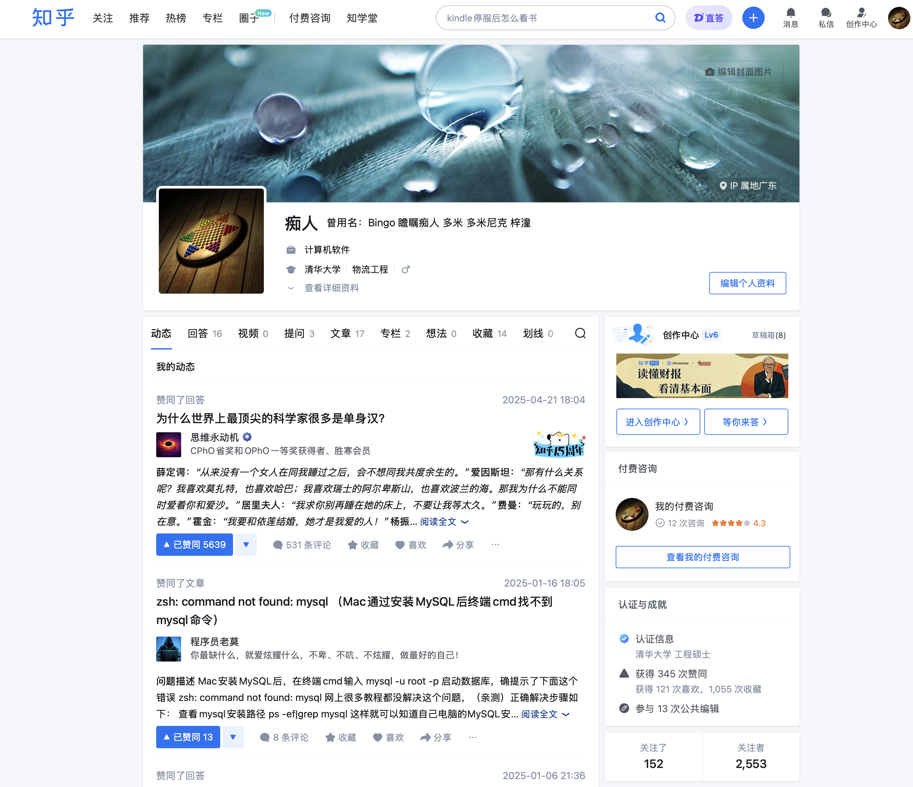
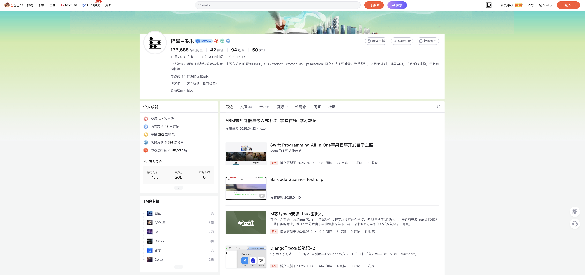
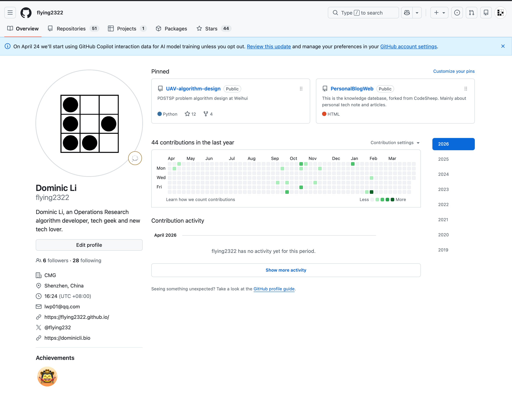
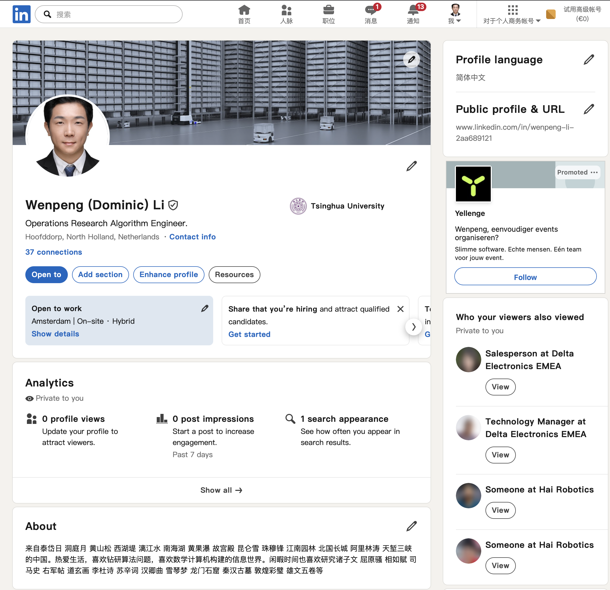
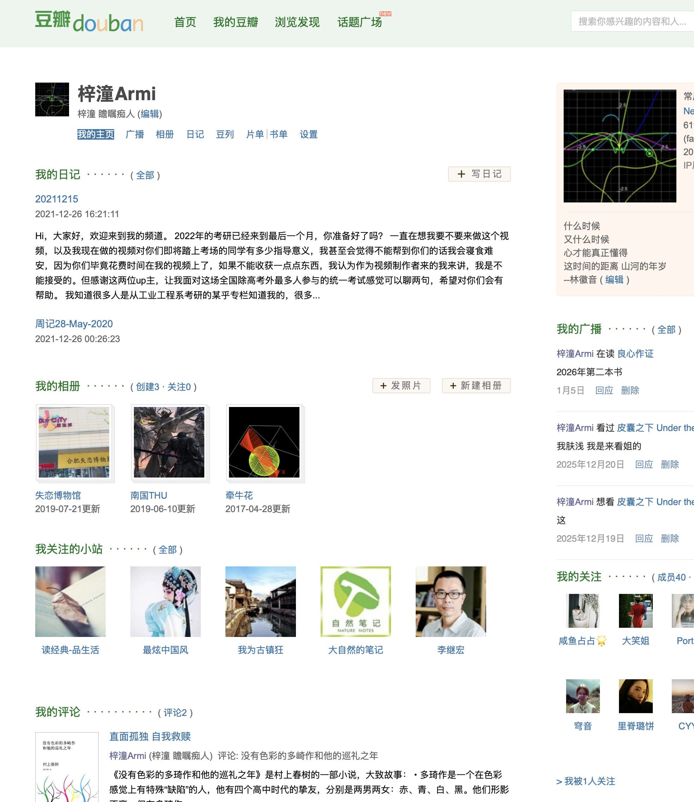
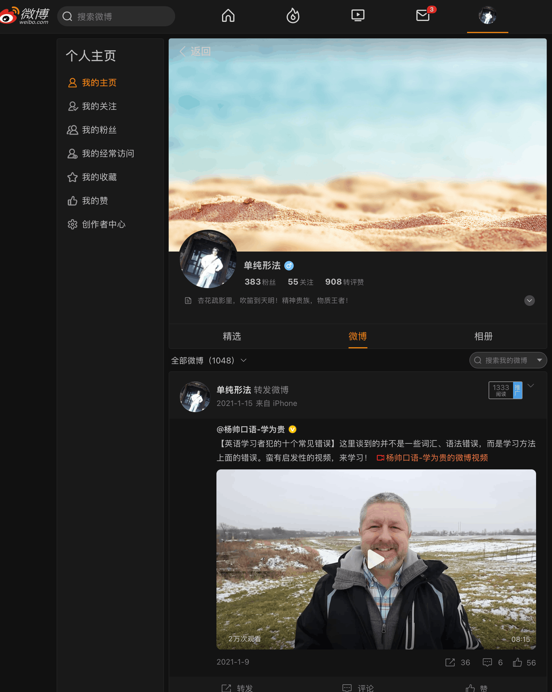
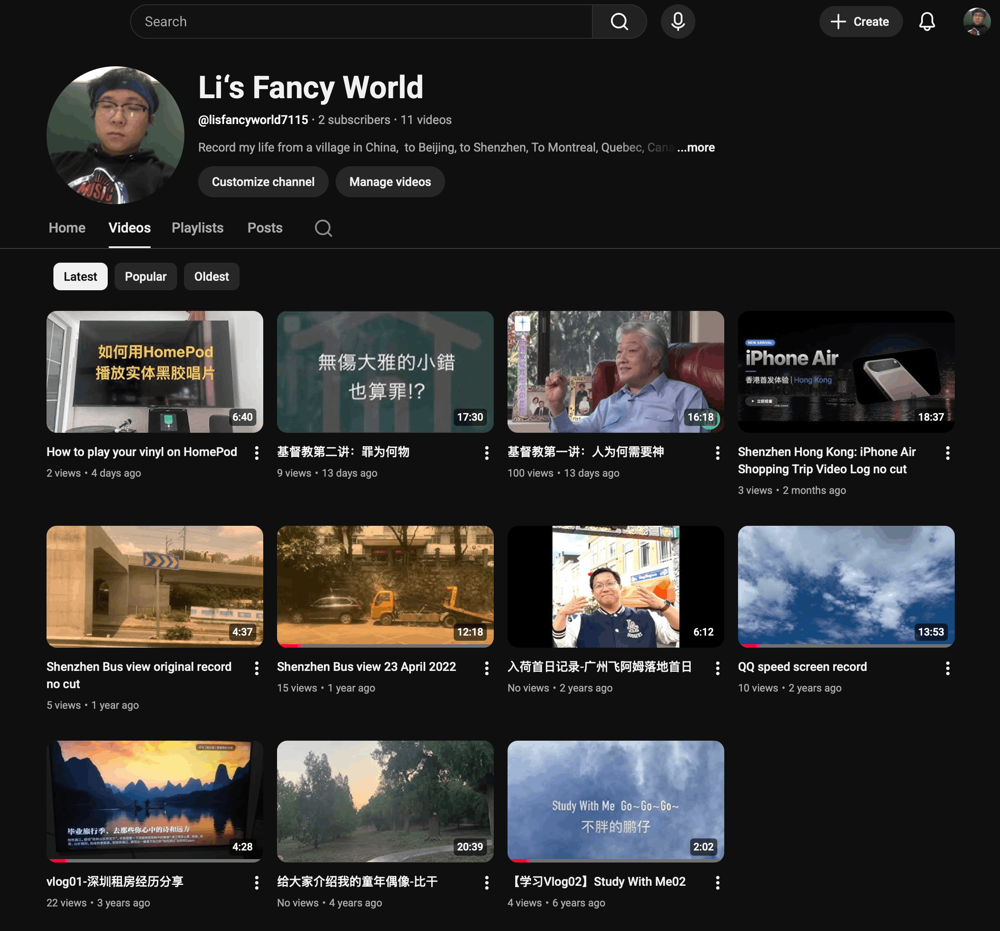
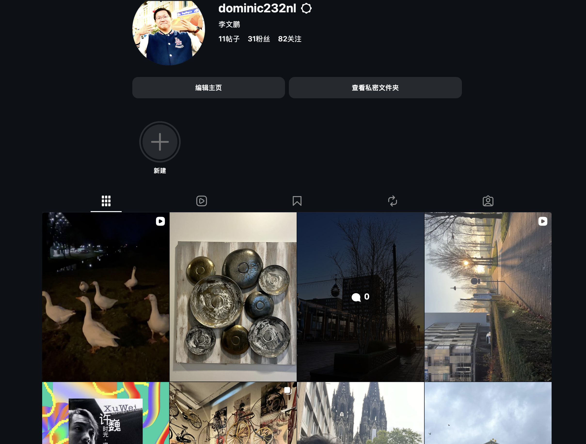
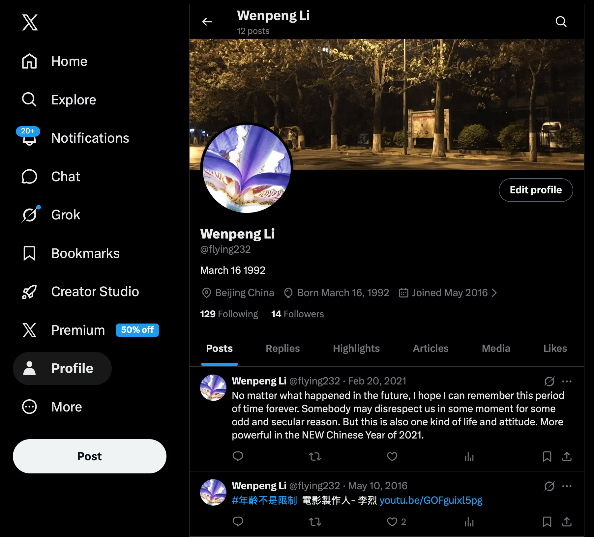

This is a page I wanna to summary my link and posts platforms.
> 🎯 **[My Bucket List — life goals & travel checklist](../7_DairyAndLife/bucket_list.md)**
# Bucket List

> *"We are all going to die, but before we do, I want to do everything I've ever wanted to do."*
> 
> This is a bucket list written for myself. Not to show off, but to remind myself of how much is left undone when I feel lost, and to push myself forward when I feel slack. Every checkmark is one step closer to the complete version of myself.

---
## I. 🌍 Travel the World: Countries & Regions
*Goal: Set foot in every country and region in the world (Continuously updating)*
### China (All Provincial-Level Administrative Regions)
- [x] Henan: Xinxiang/Zhengzhou/Luoyang/Kaifeng/Dengfeng/Nanyang
- [x] Beijing: Haidian/Yizhuang/Daxing
- [ ] Tianjin: Hohai, Tianjin University, Nankai University, Italian Style Town
- [ ] Shanghai: Oriental Pearl Tower
- [x] Guangdong: Shenzhen/Guangzhou/Zhuhai/Shunde/Foshan/Zhongshan
- [x] Hong Kong: Victoria Harbour
- [x] Macau: University of Macau
- [ ] Taiwan: Taipei 101, Sun Moon Lake, National Tsing Hua University (Hsinchu), City God Temple
- [ ] Tibet: Potala Palace/Nyingchi
- [ ] Xinjiang: Westernmost Point of China, Tianshan Mountains, Kunlun Mountains, Kashgar, Urumqi, Altay
- [x] Hunan: Changsha/Mount Heng
- [x] Hubei: Wuhan/Shiyan
- [x] Hebei: Sanhe/Chengde
- [x] Fujian: Xiamen/Quanzhou
- [x] Guangxi: Guilin/Yangshuo
- [x] Gansu: Tianshui
- [x] Jiangxi: Ji'an
- [ ] Shandong: Mount Tai, Qingdao, Weihai
- [x] Jiangsu: Nanjing
- [ ] Hebei: Shijiazhuang/Xingtai/Baoding/Langfang
- [ ] Shanxi: Yungang Grottoes (Datong), Zhaozhou Bridge
- [ ] Shaanxi: Xi'an, Terracotta Warriors/Huaqing Pool/Xianyang/Bell and Drum Towers
### Asia (4/47)
- [ ] Japan
- [ ] South Korea
- [x] Mongolia
- [ ] North Korea
- [ ] Vietnam
- [ ] Laos
- [ ] Cambodia
- [ ] Thailand
- [ ] Myanmar
- [ ] Malaysia
- [x] Singapore
- [ ] Indonesia
- [ ] Philippines
- [ ] Brunei
- [ ] Timor-Leste
- [ ] India
- [ ] Sri Lanka
- [ ] Maldives
- [ ] Pakistan
- [ ] Bangladesh
- [ ] Nepal
- [ ] Bhutan
- [ ] Kazakhstan
- [ ] Uzbekistan
- [ ] Kyrgyzstan
- [ ] Tajikistan
- [ ] Turkmenistan
- [ ] Afghanistan
- [ ] Iran
- [ ] Iraq
- [ ] Syria
- [ ] Jordan
- [ ] Lebanon
- [ ] Israel
- [ ] Palestine
- [ ] Saudi Arabia
- [ ] Yemen
- [ ] Oman
- [ ] United Arab Emirates
- [ ] Qatar
- [ ] Bahrain
- [ ] Kuwait
- [x] Georgia
- [ ] Armenia
- [ ] Azerbaijan
- [x] Turkey
- [ ] Cyprus
### Europe (20/44)
- [x] United Kingdom
- [x] France
- [x] Germany
- [x] Italy
- [x] Spain
- [ ] Portugal
- [x] Netherlands
- [x] Belgium
- [x] Luxembourg
- [x] Switzerland
- [x] Austria
- [ ] Liechtenstein
- [ ] Ireland
- [ ] Iceland
- [x] Denmark
- [x] Norway
- [x] Sweden
- [ ] Finland
- [ ] Poland
- [x] Czech Republic
- [x] Slovakia
- [x] Hungary
- [ ] Greece
- [ ] Croatia
- [ ] Slovenia
- [ ] Bosnia and Herzegovina
- [x] Serbia
- [ ] Montenegro
- [ ] North Macedonia
- [ ] Albania
- [x] Bulgaria
- [ ] Romania
- [ ] Moldova
- [ ] Ukraine
- [ ] Belarus
- [ ] Estonia
- [ ] Latvia
- [ ] Lithuania
- [x] Russia
- [ ] Malta
- [ ] Monaco
- [ ] Andorra
- [ ] San Marino
- [x] Vatican City
### Africa (1/53)
- [x] Egypt
- [ ] Libya
- [ ] Tunisia
- [ ] Algeria
- [ ] Morocco
- [ ] Mauritania
- [ ] Senegal
- [ ] Gambia
- [ ] Mali
- [ ] Burkina Faso
- [ ] Guinea
- [ ] Guinea-Bissau
- [ ] Sierra Leone
- [ ] Liberia
- [ ] Ivory Coast
- [ ] Ghana
- [ ] Togo
- [ ] Benin
- [ ] Niger
- [ ] Nigeria
- [ ] Chad
- [ ] Cameroon
- [ ] Equatorial Guinea
- [ ] Gabon
- [ ] Congo (Brazzaville)
- [ ] Congo (Kinshasa)
- [ ] Central African Republic
- [ ] São Tomé and Príncipe
- [ ] Sudan
- [ ] South Sudan
- [ ] Ethiopia
- [ ] Eritrea
- [ ] Djibouti
- [ ] Somalia
- [ ] Kenya
- [ ] Uganda
- [ ] Tanzania
- [ ] Rwanda
- [ ] Burundi
- [ ] Mozambique
- [ ] Madagascar
- [ ] Comoros
- [ ] Mauritius
- [ ] Seychelles
- [ ] Angola
- [ ] Zambia
- [ ] Zimbabwe
- [ ] Malawi
- [ ] Botswana
- [ ] Namibia
- [ ] South Africa
- [ ] Eswatini
- [ ] Lesotho
### North America (1/23)
- [x] United States (Mar 2026): San Francisco
- [ ] Canada
- [ ] Mexico
- [ ] Guatemala
- [ ] Belize
- [ ] El Salvador
- [ ] Honduras
- [ ] Nicaragua
- [ ] Costa Rica
- [ ] Panama
- [ ] Cuba
- [ ] Jamaica
- [ ] Haiti
- [ ] Dominican Republic
- [ ] Bahamas
- [ ] Trinidad and Tobago
- [ ] Barbados
- [ ] Antigua and Barbuda
- [ ] Saint Kitts and Nevis
- [ ] Dominica
- [ ] Saint Lucia
- [ ] Saint Vincent and the Grenadines
- [ ] Grenada
### South America
- [ ] Colombia
- [ ] Venezuela
- [ ] Guyana
- [ ] Suriname
- [ ] Ecuador
- [ ] Peru
- [ ] Brazil
- [ ] Bolivia
- [ ] Chile
- [ ] Argentina
- [ ] Paraguay
- [ ] Uruguay
### Oceania
- [ ] Australia
- [ ] New Zealand
- [ ] Papua New Guinea
- [ ] Fiji
- [ ] Samoa
- [ ] Tonga
- [ ] Vanuatu
- [ ] Solomon Islands
- [ ] Kiribati
- [ ] Tuvalu
- [ ] Nauru
- [ ] Palau
- [ ] Marshall Islands
- [ ] Federated States of Micronesia
---
## II. ✍️ Creation & Expression
- [ ] Publish a travel book: Road trip experiences and cultural exchange records
- [ ] Publish a novel
- [ ] Publish a technical book
- [ ] Write lyrics that get officially performed/released (with the help of AI)
- [ ] Shoot a complete documentary film
- [x] Publish an academic paper in a national/international journal
- [ ] Write a letter to myself 50 years from now and seal it
- [ ] Build a personal blog system with over 100,000 words
- [ ] Give a TED or equivalent level public speech
---
## III. 💼 Career & Business
- [x] Start my own company
- [ ] Take the company public (IPO)
- [ ] Create 10,000 jobs
- [ ] Build a product with over 1 million Daily Active Users (DAU)
- [ ] Complete a successful cross-border M&A
- [ ] Reach an annual company revenue of 1 billion
- [ ] Reach a personal net worth of 100 million
- [ ] Build a continuously profitable passive income system
- [ ] Invest in and support at least 10 startups
- [ ] Turn the tide in a major business negotiation
---
## IV. 🧗 Extreme & Experiences
- [ ] Skydive (from at least 5,000 meters)
- [ ] Bungee jump
- [ ] Scuba dive (obtain PADI AOW or above certification)
- [ ] Complete a full marathon (42.195km)
- [ ] Summit a snow mountain over 7,000 meters in altitude
- [ ] Sail a yacht on a long voyage
- [ ] Learn to fly a helicopter or a light aircraft
- [ ] Camp overnight in an environment of -30°C
- [ ] Hike an international long-distance trail (e.g., AT, PCT, etc.)
- [ ] Participate in a triathlon
---
## V. 🎓 Learning & Skills
- [ ] Master 5 or more foreign languages (conversational fluency)
    - [x] English
    - [ ] Japanese
    - [ ] French
    - [ ] Spanish
    - [ ] Arabic
    - [ ] Russian
    - [ ] German
- [ ] Master a musical instrument to a level capable of performing on stage
- [ ] Obtain a Private Pilot License (PPL)
- [ ] Learn to cook at least 5 state-banquet-level signature dishes
- [ ] Master a martial art and obtain a black belt / high dan rank
- [ ] Independently complete a full car engine overhaul
- [ ] Learn to surf and sustain a stand on waves over 1 meter high
- [ ] Read 1,000 classic non-fiction books
- [ ] Pass all three levels of the CFA exam
- [ ] Hand-code a complete operating system kernel
---
## VI. ❤️ Emotions & Life
- [ ] Marry the person I truly love
- [ ] Witness the birth of my own child with my own eyes
- [ ] Take my parents on a trip to the place they want to visit the most
- [ ] Buy a house that my parents truly love
- [ ] Have a perfect study/workspace of my own
- [ ] Raise a pet that accompanies me for over 15 years
- [ ] Go on a spontaneous trip with an old friend I haven't seen in years
- [ ] Attend a stranger's wedding and give sincere blessings
- [ ] Give a hot meal to a homeless person on the coldest day
- [ ] Forgive someone who once deeply hurt me
---
## VII. 🌍 Contribution & Legacy
- [ ] Establish a charitable foundation in my own name
- [ ] Help fund the construction of at least 10 Hope Primary Schools
- [ ] Sponsor at least 100 underprivileged students to complete their university education
- [ ] Plant 10,000 trees and form a real forest
- [ ] Contribute a widely-used project to the open-source community (Star > 10k)
- [ ] Drive an industry standard or proposal that substantially changes the industry
- [ ] Donate my organs (sign the agreement)
- [ ] Leave behind a complete autobiography
- [ ] Do something that "changes at least one person's fate" and never tell them about it
- [ ] Make the world a little bit better just because I was here
---
> *Last Updated: 2026-04-03*
> 
> *"Everything I Never Told You" — Celeste Ng*

---

---

### 1. 主要视频分享平台 [哔哩哔哩 Bilibili](https://bilibili.com)
这是我目前最活跃的视频内容平台，主要用来分享技术教程、项目实战演示以及一些学习心得的Vlog。如果你对我的视频内容感兴趣，欢迎关注我的频道，也欢迎在弹幕和评论区和我交流讨论，你的反馈和关注是我持续更新的最大动力。

当前主要的分享内容聚焦当下生活，有游戏实景、直播、各种黑胶，旅行、阅读、值得关注APP及软件项目等内容，主要都是自己关注和喜爱的事物。

---

### 2. [知乎](https://zhihu.com)

我在知乎主要输出技术长文和深度回答，涉及我日常学习和工作中遇到的问题总结与经验复盘。相比视频，这里更适合阅读逻辑性较强的文章。欢迎关注我的专栏，也欢迎在评论区提出你的看法，我很乐意和大家持续探讨。

---

### 3. [CSDN](https://csdn.net)

CSDN是我记录代码片段和发布技术博文的主要阵地之一，内容偏向于具体的开发问题排查与解决方案。如果你也是开发者，欢迎关注我，希望我的踩坑记录能帮到你，也期待互相交流技术心得。

---

### 4. [Github](https://github.com)

我的所有开源项目和个人代码仓库都在这里，包括一些side project和练习项目。如果你对我的代码实现细节感兴趣，或者想参与贡献，欢迎来Github follow我或者给我提Issue/PR，一起玩开源。

---

### 5. [LinkedIn](https://linkedin.com)

我在LinkedIn主要分享职业发展动态、行业观察以及一些英文的技术总结。如果你希望了解我的职业背景，或者想在职场层面建立连接，欢迎加我好友，期待与更多同行交流。

---

### 6. [豆瓣](https://douban.com)

豆瓣是我的精神自留地，主要记录读书笔记、观影感想以及一些生活相关的内容。技术之外我也很乐意分享人文社科方面的阅读体会，欢迎关注，一起交流书单和片单。

---

### 7. [微博 (2011-2015年使用)](https://weibo.com)

这是我的早期社交平台账号，2011到2015年间有比较活跃的使用记录，承载了很多早期的碎片化想法和生活日常。目前该账号已基本停更，仅作为个人互联网足迹的存档保留在这里。

---

### 8. [Youtube](https://youtube.com)

和Bilibili互为镜像平台，我会将部分视频内容同步发布到Youtube上，主要面向海外观众。如果你更习惯使用Youtube，欢迎订阅我的频道，也欢迎通过视频评论区和我保持交流。

---

### 9. [Facebook](https://facebook.com)

我在Facebook上主要做一些内容的同步分发以及和海外朋友的日常联络。更新频率不高，但会选择性转发一些重要的动态和文章，欢迎点赞我的主页，保持联络。

---

### 10. [Instagram](https://instagram.com)

Instagram是我的图文生活向平台，主要分享旅行摄影、日常随拍和一些生活碎片。如果想了解技术之外更生活化的一面，欢迎关注，期待在这里和你互动。

---

### 11. [Twitter/X](https://x.com)

我在X上主要关注科技前沿动态，偶尔分享技术短评、项目进展和一些即时想法。内容偏向碎片化和轻量级，如果你喜欢这种快节奏的信息获取方式，欢迎关注我，随时交流。
