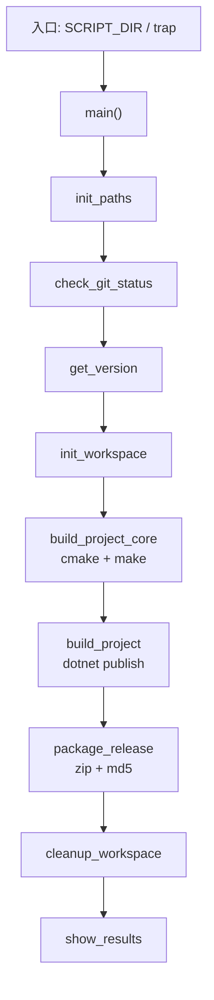

作为 C++ 开发者，可以把 Bash 脚本理解成：**没有类型系统的、以字符串和外部进程为主的“胶水语言”**。下面结合 `publish.sh`，从「快速上手」到「语法全景」梳理一遍。

---

## 一、C++ 开发者的心智映射

| C++ 概念     | Bash 对应                       |
| ---------- | ----------------------------- |
| `main()`   | 脚本末尾 `main` + 入口判断（460–475 行） |
| 函数         | `func_name() { ... }`         |
| 全局变量       | 无 `local` 的赋值，全脚本可见           |
| 局部变量       | `local var=...`（169、284 行）    |
| `const`    | 无真正 const，约定用大写或 `readonly`   |
| `#include` | 无；直接调用外部命令（`cmake`、`git`）     |
| 异常         | 基本没有；用 `set -e` + `exit`      |
| 类型         | 一切都是字符串，数字运算靠 `$(( ))`        |
| 编译         | 解释执行，改完即跑                     |
| 类/命名空间     | 无；用函数 + 全局变量组织                |

---

## 二、`publish.sh` 用到的语法（按出现顺序）

### 1. Shebang 与脚本选项

```bash
#!/bin/bash          # 指定用 bash 解释，不是 sh
set -e               # 任一命令返回非 0 → 脚本立即退出（类似“遇错即停”）
```

### 2. 变量

```bash
PROJECT_NAME="Sineva.Matrix.Engine"   # 赋值，等号两侧无空格
WORKSPACE_DIR=""                      # 空字符串

branch=$(git rev-parse --abbrev-ref HEAD)  # 命令替换：捕获 stdout
short_commit_id=${commit_id:0:8}            # 子串：从 0 起取 8 字符（类似 substr）

version_full="${branch}_v${version}.${current_date}"  # 字符串拼接
safe_version_full="${version_full//\//_}"              # 全局替换 / → _
```

**引号规则（极重要）：**

| 写法                     | 含义            |
| ---------------------- | ------------- |
| `"$VAR"`               | 双引号：展开变量，保留空格 |
| `'$VAR'`               | 单引号：原样，不展开    |
| `` `cmd` `` 或 `$(cmd)` | 命令替换          |

### 3. 环境变量

```bash
export DOTNET_ROOT="$HOME/.dotnet"
export PATH="$DOTNET_ROOT:$PATH"
```

`export` ≈ 把变量放进子进程（`cmake`、`dotnet`）的环境。

### 4. 条件判断 `[ ]` 与 `[[ ]]`

```bash
# 单括号 [ ]：POSIX test，较老
if [ -d "$WORKSPACE_DIR" ]; then ... fi      # 目录存在
if [ -f "$CORE_LIB_NAME" ]; then ... fi      # 文件存在
if [ -z "$branch" ]; then ... fi             # 字符串为空
if [ -n "$(git status --porcelain)" ]; then  # 非空
if [ $? -ne 0 ]; then ... fi                 # 上一条命令退出码 ≠ 0
if [ ! -d "$PROJECT_NAME" ]; then ... fi     # 取反

# 双括号 [[ ]]：bash 扩展，支持正则
if [[ ! "$confirm" =~ ^[Yy]$ ]]; then ... fi
if [[ "${BASH_SOURCE[0]}" == "${0}" ]]; then ... fi  # 是否直接执行（非 source）
```

**逻辑组合：**

```bash
if ! command -v dotnet &>/dev/null; then     # ! 取反；&> 重定向 stdout+stderr
elif [ -x "$HOME/.dotnet/dotnet" ] && [ -d "..." ]; then  # && 短路与
```

### 5. 函数

```bash
print_info() {
    echo -e "${GREEN}[INFO]${NC} $1"   # $1 = 第一个参数（类似 argv[1]）
}

init_paths() {
    CORE_SOURCE_BUILD_DIR="$SCRIPT_DIR/$CORE_BUILD_RELATIVE_PATH"
}
```

调用：`init_paths`（无括号，像调用 shell 内置命令）。

### 6. 循环

```bash
while true; do
    read -p "请输入版本号: " version
    if [ -z "$version" ]; then
        continue          # 类似 continue
    fi
    break                 # 类似 break
done
```

`publish.sh` 里未用 `for`，但常见写法：

```bash
for f in *.cpp; do g++ "$f"; done
for ((i=0; i<10; i++)); do echo $i; done
```

### 7. 输入输出与重定向

```bash
echo -e "${GREEN}..."           # -e 解析 \033 转义（颜色）
read -p "是否继续? (y/n): " confirm

git rev-parse --git-dir > /dev/null 2>&1   # stdout 丢弃，stderr 合并到 stdout 再丢弃
{ echo "a"; echo "b"; } > version        # 命令组输出重定向到文件

command &>/dev/null              # stdout+stderr 全丢弃
```

### 8. 管道与命令链

```bash
md5sum file.zip | awk '{print $1}' > md5sum
$(du -k "$path" | awk '{printf "%.2fMB", $1/1024}')   # 嵌套命令替换

cmake .. && make                 # 前成功才执行后（publish 用 if $? 分开写）
git describe ... 2>/dev/null || echo ""   # 失败则用默认值
```

### 9. 行续接

```bash
dotnet publish \
    -c $BUILD_CONFIGURATION \
    -r $TARGET_RUNTIME \
    -o "$publish_dir"
```

行末 `\` 表示命令未结束（类似 C++ 宏续行）。

### 10. 特殊变量

| 变量            | 含义             |
| ------------- | -------------- |
| `$0`          | 脚本路径           |
| `$1` `$2` ... | 位置参数           |
| `$?`          | 上一条命令退出码（0=成功） |
| `$#`          | 参数个数           |
| `$$`          | 当前 shell PID   |
| `$HOME`       | 用户主目录          |

```bash
SCRIPT_DIR="$(cd "$(dirname "$0")" && pwd)"  # 脚本所在目录的绝对路径
```

### 11. 信号捕获 `trap`

```bash
trap 'cleanup_workspace; exit 1' INT TERM
# Ctrl+C (INT) 或 kill (TERM) 时执行清理
```

类似 C++ 里注册 `signal(SIGINT, handler)`。

### 12. 直接执行 vs source

```bash
if [[ "${BASH_SOURCE[0]}" == "${0}" ]]; then
    main    # 只有 ./publish.sh 执行时跑 main
fi
# source publish.sh 时不会跑 main（避免副作用）
```

---

## 三、`publish.sh` 的执行流程（结构图）



这就是典型的 **“配置 → 检查 → 构建 → 打包 → 清理”** 流水线脚本结构。

---

## 四、Bash 语法全景（速查表）

### A. 基础

```bash
# 注释
# 这是注释

# 变量
name=value          # 无空格！
readonly PI=3.14
unset name

# 数组（publish.sh 未用）
arr=(a b c)
echo ${arr[0]}
echo ${#arr[@]}     # 长度
```

### B. 字符串操作

```bash
${s:0:8}            # 子串
${s/old/new}        # 首次替换
${s//old/new}       # 全局替换（433 行）
${#s}               # 长度
${s%.zip}           # 去最短后缀
${s##*/}            # basename 风格
```

### C. 算术

```bash
$((1 + 2))
((i++))
let "i=i+1"
```

### D. 测试运算符（`[ ]` / `[[ ]]`）

| 测试                 | 含义                |
| ------------------ | ----------------- |
| `-f file`          | 普通文件              |
| `-d dir`           | 目录                |
| `-x file`          | 可执行               |
| `-z str`           | 空串                |
| `-n str`           | 非空                |
| `str1 = str2`      | 字符串相等（`[ ]` 里要空格） |
| `str1 != str2`     | 不等                |
| `int1 -eq int2`    | 整数相等              |
| `int1 -ne/-lt/-gt` | 不等/小于/大于          |

### E. 流程控制

```bash
if ...; then ...; elif ...; then ...; else ...; fi
case $x in a) ...;; b) ...;; *) ...;; esac
while ...; do ...; done
until ...; do ...; done
for x in ...; do ...; done
break / continue / return [n] / exit [n]
```

### F. 函数

```bash
func() { local x=1; echo "$1"; return 0; }
```

### G. 重定向

```bash
cmd > file          # stdout 覆盖写
cmd >> file         # 追加
cmd 2> file         # stderr
cmd &> file         # stdout+stderr
cmd < file          # stdin
cmd << 'EOF'        # Here Document
line1
EOF
```

### H. 进程相关

```bash
cmd1 | cmd2         # 管道
cmd1 && cmd2        # 前成功才执行后
cmd1 || cmd2        # 前失败才执行后
(cmd1; cmd2)        # 子 shell
{ cmd1; cmd2; }     # 当前 shell 组
$(cmd)              # 命令替换
`cmd`               # 老式，少用
nohup cmd &         # 后台
wait $!             # 等后台任务
```

### I. 常用内置命令

| 命令                | 作用            |
| ----------------- | ------------- |
| `echo` / `printf` | 输出            |
| `read`            | 读输入           |
| `cd` / `pwd`      | 目录            |
| `test` / `[`      | 条件测试          |
| `true` / `false`  | 恒真/恒假         |
| `shift`           | 移位参数          |
| `source` / `.`    | 当前 shell 执行脚本 |
| `eval`            | 二次解析字符串为命令    |

### J. 选项与安全

```bash
set -e          # 遇错退出
set -u          # 未定义变量报错
set -o pipefail # 管道中任一失败则失败
set -x          # 调试：打印每条命令
```

生产脚本常见：`set -euo pipefail`（`publish.sh` 只用了 `-e`）。

### K. 正则（`[[ =~ ]]`）

```bash
[[ "$s" =~ ^[0-9]+$ ]]
```

### L. 关联数组（bash 4+）

```bash
declare -A map
map[key]=value
echo ${map[key]}
```

---

## 五、C++ 开发者易踩的坑

1. **空格**：`a=1` 对，`a = 1` 错（会被当成命令 `a`）。
2. **引号**：路径有空格必须 `"$path"`，不要 `$path`。
3. **`[` 两侧要有空格**：`[ -f "$f" ]`。
4. **`$?` 要立即用**：中间插了别的命令， `$?` 就变了（224 行在 `cmake` 后马上检查）。
5. **没有类型**：`"0"` 和 `0` 在 `[ ]` 里行为不同，算术用 `$(( ))`。
6. **`set -e` 的例外**：`if`、`||`、`&&` 里的失败不会触发退出。
7. **变量在子 shell 里改不了父 shell**：`(...)` 或管道右侧；函数里改全局变量不用 `local`。
8. **单词分割**：未加引号的 `$var` 会按 IFS（空格/tab/换行）拆成多个参数。

---

## 六、建议学习路径（针对维护 `publish.sh`）

1. 先读懂：`变量` → `if` → `函数` → `$()` → `trap` → `main` 流程。
2. 本地试验：

```bash
bash -x ./publish.sh    # 逐行打印执行过程（类似调试）
shellcheck publish.sh   # 静态检查（若已安装）
```

3. 改脚本时优先：**加引号、用 `local`、检查 `$?`、路径用 `$SCRIPT_DIR` 拼**。

4. 想系统学：Bash 手册 `man bash` 的 **SHELL GRAMMAR**、**PARAMETERS**、**EXPANSION** 三节。

---

## 七、对照：`publish.sh` 一行 C++ 伪代码

```cpp
// 近似理解 main() 在 publish.sh 里做的事
int main() {
    init_paths();
    if (!check_git_status()) return 0;
    std::string version = get_version();
    std::string version_full = branch + "_v" + version + "." + date;
    init_workspace();
    if (!build_project_core()) exit(1);  // set -e
    if (!build_project()) exit(1);
    package_release();
    cleanup_workspace();
    show_results();
    return 0;
}
```

差别在于：Bash 里这些都是**调用外部程序**（`git`、`cmake`、`dotnet`、`zip`），脚本本身主要负责**编排和错误处理**。

如果你想下一步深入，可以指定 `publish.sh` 里某一段（比如 `trap`、`${var//x/y}`、`[[ =~ ]]`），我可以按 C++ 类比逐行拆开讲。
