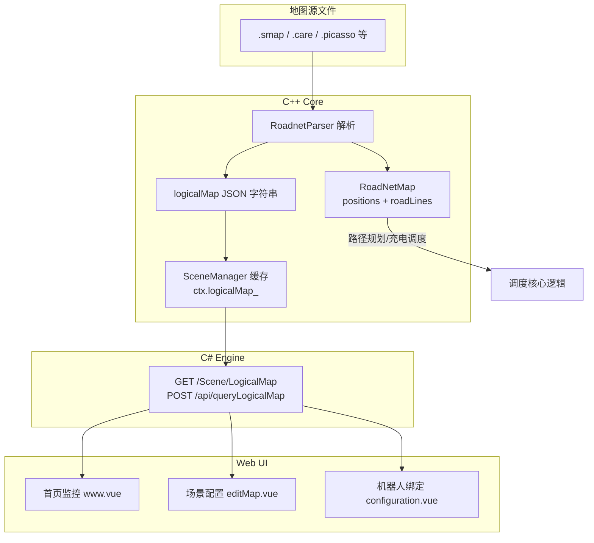
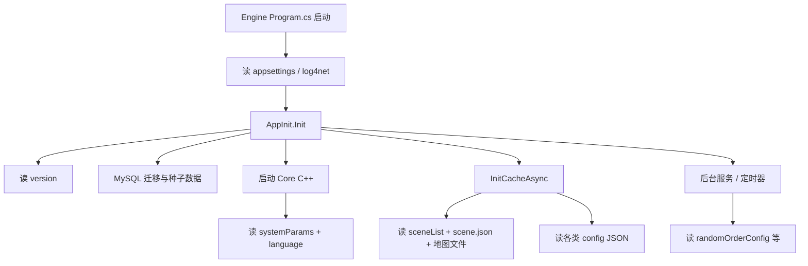
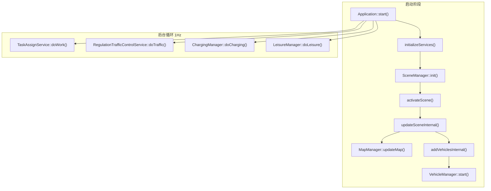
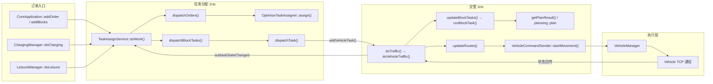
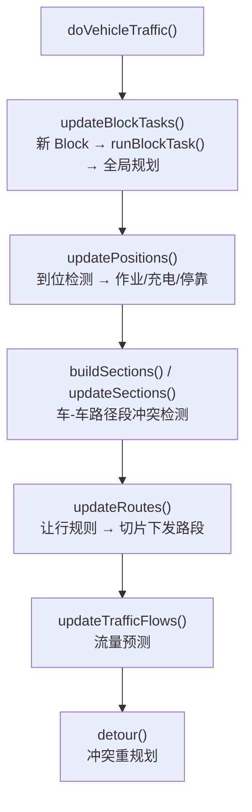

# traffic_control_service_regulation

Optimized tool selection我要先查看 traffic_control_service_regulation.cpp 的代码以理解下发逻辑，马上读取文件内容。

Read [](file:///home/wp/Matrix/core/module/traffic/src/traffic_control_service_regulation.cpp#1-1), lines 1 to 400

继续读取文件剩余内容以定位下发路径相关函数和逻辑。

Read [](file:///home/wp/Matrix/core/module/traffic/src/traffic_control_service_regulation.cpp#400-400), lines 400 to 800

继续读取 `runBlockTask` 以及与路径下发相关的后续逻辑。

Read [](file:///home/wp/Matrix/core/module/traffic/src/traffic_control_service_regulation.cpp#800-800), lines 800 to 1022

下一步我将打开对应头文件查看 `Control` 结构与相关常量定义，以便准确说明字段含义。

Read [](file:///home/wp/Matrix/core/module/traffic/include/traffic/traffic_control_service_regulation.hpp)

我将搜索 `Control` 结构定义以确定 `sendIndex`、`stepId`、`limitIndex` 等字段含义。

Searched for text `struct Control`, 2 results

Read [](file:///home/wp/Matrix/core/module/traffic/include/traffic/control_block.hpp)

Searched for text `limitIndex`, 40 results

Read [](file:///home/wp/Matrix/core/module/traffic/include/traffic/regulations/traffic_regulation.hpp)

Searched for text `control_->limitIndex`, 2 results

Read [](file:///home/wp/Matrix/core/module/traffic/include/traffic/regulations/yield_area.hpp)

Searched for text `.complete()`, 2 results

Read [](file:///home/wp/Matrix/core/module/traffic/include/traffic/regulations/processor.hpp)

我已查看代码并定位到下发逻辑，实现点见下面的要点与代码位置说明（快速参考后再读细节）。下一步：把关键字段与流程按条件和例子解释清楚。

**主要代码位置**
- `Control` 结构：control_block.hpp  
- 下发逻辑：`applyRoadLines`：traffic_control_service_regulation.cpp  
- 发送/步进限制与规则：`TrafficRegulationContext` / 规则处理：traffic_regulation.hpp  
- 参数定义（默认值）：traffic_control_service_regulation.hpp

- sendIndex/stepId/limitIndex 含义（来自 `Control`）：
  - **`sendIndex`**：最后已经“下发”的路段索引（初始为 -1，表示还未下发任何段）。见 `Control` 中定义。  
  - **`stepId`**：车辆当前位置对应的路段索引（由当前位置更新，表示车辆正在/刚通过的段）。  
  - **`limitIndex`**：当前允许下发的最远路段索引，由交通规则处理器（各类 `Yield` 规则）决定，默认初始化为整条路的末端，然后规则可能把它缩短以限制下发。

**什么时候会下发新的路段（总体条件）**
- 在 `updateRoutes()` 中会调用 `applyRoadLines()`，真正决定下发。主要前置条件（函数内检查）：
  - 车辆不是手动控制（`controlMode != MANUAL`）。  
  - `control` 非空 且 `control->roadLines` 非空。  
  - 当前 `sendIndex < limitIndex` 且 `sendIndex < roadCount - 1`（未到达允许的最远或已到终点）。  
  - 不允许下发距离超过“已通过段数”限制：如果 `(sendIndex - stepId) >= passedRoadLineCount_` 则不再下发（默认 `passedRoadLineCount_ = 3`）。  
  - 若已发送对接/停靠命令（`sendDock`）且非仿真模式，会中止继续下发（避免重复下发）。

（参见 `applyRoadLines` 里的这些判断：traffic_control_service_regulation.cpp）

**每次下发多远 / 下发多少段**
- 单次循环最多追加 `maxApplyRoadLineCount_` 段（默认 `maxApplyRoadLineCount_ = 5`）。  
- 实际下发的段数还会被下列条件截断：到达 `limitIndex`、到达路段结尾（`roadCount - 1`）、或满足其它中止条件（如 `sendDock`）。  
- 算法上每次迭代在加入路段前会 `++sendIndex`，因此 `sendIndex` 在下发后指向“最新已下发”的那一段的索引（初始 -1，第一次下发后变为 0）。

**规则如何影响“下发最远索引（limitIndex）”**
- 在 `updateRoutes()` 前会构造 `TrafficRegulationContext(vehicle, control)` 并交给规则处理器 `ruleProcessor_.process(context)`。各类规则（区域、占位、路段冲突、依赖关系等）会计算并通过 `context.setLimitIndex()` 调整允许下发的最远索引。默认若无限制则为整条路线末端。见：`TrafficRegulationContext` 与规则处理器实现。  
- 规则可把 `limitIndex` 缩短到某个索引（并保证不小于 `sendIndex`），从而限制 `applyRoadLines` 本轮实际能下发到哪一段。

**stepId / sendIndex 的交互（防止提前下发过多）**
- `stepId` 会在车辆位置改变时通过 `updateVehilceStepId()` 更新（匹配当前 `position` 对应的路段索引）。  
- 条件 `(sendIndex - stepId >= passedRoadLineCount_)` 用来保证“已下发的最远段” 不会比车辆当前位置提前太多段，避免给车辆分配过远的命令（默认允许提前 3 段）。  

**其它细节**
- 对加载/充电任务：当即将下发到倒数第 1 段（`sendIndex == roadCount - 2`）且为 `LOAD`/`CHARGE`，会设置 `dockId` 以触发后续的对接/充电命令。  
- 初次下发（`sendIndex == -1`）会被视为“第一段下发”，函数 `fillFirstRoadLine` 还有额外处理以确保首段角度/位置平滑衔接。  
- 若某次规则决定 `limitIndex <= sendIndex`（意味着不能再下发新段），处理器会早期返回并把 `control->limitIndex` 设置为规则选定值；随后 `applyRoadLines` 会看到 `sendIndex >= limitIndex` 而不下发。

**举例（示意）**
- 设 `passedRoadLineCount_ = 3`，`maxApplyRoadLineCount_ = 5`，车辆 `stepId = 4`，当前 `sendIndex = 5`，`limitIndex = 12`：
  - 计算 `sendIndex - stepId = 1 < 3`，允许下发。`applyRoadLines` 会尝试在本次调用中把 `sendIndex` 逐次 ++ 并追加最多 5 段（但若在第 3 次 ++ 之后 `sendIndex` 达到 `limitIndex` 或到达路尾，就会停止）。  
- 若规则把 `limitIndex` 缩短为 6，则本次最多只会下发到索引 6（即只允许再下发 1 段）。

总结：下发由 `applyRoadLines` 控制，受三类约束共同决定：
- 规则限制：`limitIndex`（由规则计算并设置）；  
- 位置差距限制：`sendIndex - stepId < passedRoadLineCount_`（默认 3）；  
- 单次数量限制：`maxApplyRoadLineCount_`（默认 5），以及路尾或对接等特殊中止条件。

如果你要我：
- 标注出代码中这些关键判断的具体行号并在代码中增加注释，或者  
- 用几个具体运行时场景（带真实字段值）生成步进/下发序列示例，

告诉我你更想要哪种，我会直接在仓库里做并给出改动或示例。


# LogicalMap 是什么

**LogicalMap（逻辑地图）** 是 Matrix 项目里对 AGV **路网拓扑** 的结构化描述：站点、路径、库位、区域等“可导航、可调度”的逻辑元素，与 **点云地图（PointCloudMap）** 相对。

点云负责 SLAM/背景显示（`header`、`normalPosList`），逻辑地图负责业务语义和路径规划输入。

核心 C++ 定义在 `core/module/scene/include/scene/scene.hpp`：

```524:548:core/module/scene/include/scene/scene.hpp
struct LogicalMap {
    std::vector<AdvancedPoint> advancedPoints;
    std::vector<AdvancedCurve> advancedCurves;
    std::vector<BinLocation> binLocations;
    std::vector<AdvancedArea> advancedAreas;
};

inline void to_json(json& j, const LogicalMap& v) {
    j = json{{"advancedPointList", v.advancedPoints}, {"advancedCurveList", v.advancedCurves}, {"binLocationList", v.binLocations}, {"advancedAreaList", v.advancedAreas}};
}
```

---

## 数据结构组成

| 字段 | JSON 键名 | 含义 |
|------|-----------|------|
| `advancedPoints` | `advancedPointList` | 高级点：动作点、充电点、停靠点等 |
| `advancedCurves` | `advancedCurveList` | 路径曲线：直线、贝塞尔等 |
| `binLocations` | `binLocationList` / `binLocationsList` | 库位 |
| `advancedAreas` | `advancedAreaList` | 地图内区域（如禁行区 `BlockArea`） |

### 1. AdvancedPoint（高级点）

```378:385:core/module/scene/include/scene/scene.hpp
struct AdvancedPoint {
    std::string className;
    std::string instanceName;
    Position2d pos;
    double direction;
    std::vector<Property> properties;
    bool ignoreDir;
};
```

常见 `className`（见 `road_net_map_parser_smap.hpp`）：

- `ActionPoint` — 动作/作业点
- `ChargePoint` — 充电点
- `ParkPoint` — 停靠/闲置点

### 2. AdvancedCurve（路径）

连接起止点，支持直线（`StraightPath`）和贝塞尔（`BezierPath`），含控制点与方向等属性。

### 3. BinLocation（库位）

货架/料箱位置，关联 `groupName`、`pointName` 等。

### 4. AdvancedArea（区域）

多边形区域，如 `BlockArea`（限制区）。

---

## 与原始地图文件的关系

地图文件（如 `.smap`）加载时，解析器会**拆成两部分**：

```16:48:core/module/domain/include/maps/road_net_map_parser_smap.hpp
// logicalMap：拓扑元素
if (data.contains("advancedPointList")) {
    logicalMap["advancedPointList"] = data["advancedPointList"];
}
// ...
// pointCloudMap：点云背景
if (data.contains("header")) {
    pointCloudMap["header"] = data["header"];
}
if (data.contains("normalPosList")) {
    pointCloudMap["normalPosList"] = data["normalPosList"];
}
```

同一份地图还会被解析成 `RoadNetMap` 的运行时结构（`Position`、`RoadLine`），供路径规划、充电点/停靠点管理等使用。  
**LogicalMap 更偏展示与编辑的 JSON 视图；RoadNetMap 更偏调度引擎的运行时模型。**

---

## 在项目中的数据流



### 1. Core 层（C++）

- **加载**：`MapManager::loadMap(path, isLogicalMap=true)` 返回逻辑地图 JSON 字符串。
- **场景激活**：`SceneManager` 把各区域的 logicalMap 缓存在 `SceneContext::logicalMap_`。
- **查询 API**：
  - `queryLogicalMapByPath` — 按文件路径查询
  - `queryLogicalMap` — 按当前场景的 `areaName` 查询

### 2. Engine 层（C#）

- `SceneAppService.GetLogicalMapAsync()` 取区域地图路径，再调 Core 的 `QueryLogicalMapByPath`。
- 对外：`GET /Scene/LogicalMap?sceneName=&areaName=`。

### 3. Web UI 层

| 页面 | 用途 |
|------|------|
| `home/www.vue`、`home/index.vue` | 实时监控：渲染点、曲线、库位 |
| `scenarioConfiguration/editMap.vue` | 地图编辑：加载/展示逻辑地图，配合点云背景 |
| `scenarioConfiguration/configuration.vue` | 从 `advancedPointList` 提取 `ParkPoint`、`ChargePoint` 做机器人绑定 |
| `replayMonitoring/` | 回放监控 |

典型前端解析方式：

```javascript
points.value = data.advancedPointList || []
curves.value = data.advancedCurveList || []
binLocationsList.value = (data.binLocationsList || []).flatMap(g => g.binLocationList || [])
```

---

## 与 Scene 中 Area 的区别

容易混淆的两套概念：

| 概念 | 位置 | 作用 |
|------|------|------|
| **LogicalMap** | 地图文件内 | 路网拓扑（点、线、库位、区域） |
| **Scene.Area.advancedPoints / advancedAreas** | 场景 JSON（`scene.json`） | 场景级叠加配置（如业务高级点、禁行区等） |

场景加载时会**主动剥离**场景文件里内嵌的 `logicalMap`，避免和地图文件重复：

```521:526:core/module/scene/src/scene_manager.cpp
for (auto& area : data["areas"]) {
    if (area.contains("logicalMap")) {
        area.erase("logicalMap");
    }
}
```

逻辑地图以独立地图文件为准，通过 `VehicleMap`（`robotId`、`mapName`、`md5`）关联到场景区域。

---

## 总结

**LogicalMap** 是 AGV 地图的**逻辑拓扑层**：定义“在哪里、怎么走、库位在哪、哪些区域受限”。它与点云地图分工明确——点云负责背景，逻辑地图负责导航语义。

在 Matrix 中它贯穿：

1. **地图解析**（smap/care/picasso → JSON）
2. **Core 调度**（与 `RoadNetMap` 同源，支撑路径与充电/停靠）
3. **API 暴露**（Engine → Web UI）
4. **前端可视化与配置**（监控、编辑、机器人绑点）

如果你还想深入某一块（比如 `AdvancedPoint` 的 `property` 字段，或 LogicalMap 与路径规划的具体衔接），可以说一下关注点，我可以按那条链路展开。

---
# Files Read


Matrix 是 **Engine（C#）+ Core（C++）** 两层启动。下面按启动顺序说明会读哪些文件、各自用途，并区分「必定读取」和「按场景/按需读取」。

## 启动总流程



---

## 一、Engine 层（必定读取）

| 文件 | 路径 | 目的 |
|------|------|------|
| **appsettings.json** | 程序目录 | Kestrel 端口、JWT 密钥、Swagger 等 ASP.NET 配置 |
| **log4net.config** | 程序目录 | 日志输出配置 |
| **version** | 程序目录 | 应用版本信息，写入 `AppGlobalCache` |
| **Resources/*.json** | `Resources/zh.json`、`en.json` 等 | Engine 层多语言（API 异常、校验提示等） |

---

## 二、Core 层（Engine 调用 `Core.Start()` 时读取）

Core 启动时 `scenePath` 为空，**不会直接加载场景**；场景由 Engine 的 `InitSceneAsync` 后续通过 `AddScene` 注入。

| 文件 | 路径 | 目的 |
|------|------|------|
| **systemParams.json** | `/etc/sinevaAGV/matrix/config/systemParams.json` | Core 调度参数：订单、充电、交管、路径规划等（`ConfigManager` 只取 `moduleName=core` 的项） |
| **language/** 下各语言文件 | `/etc/sinevaAGV/matrix/config/language/*` | Core API 错误码多语言文案（`Internationalization`） |

对应代码：

```186:199:core/src/application.hpp
        configManager_->initialize(systemPath_);
        internationalization_.initialize(systemPath_);
        // ...
        sceneManager_ = singleton<scenes::SceneManager>();
        sceneManager_->init(scenePath_);  // Engine 启动时 scenePath 为空
```

---

## 三、InitCacheAsync（Engine 初始化缓存阶段）

### 1. 场景相关（核心，数量不固定）

| 文件 | 路径 | 目的 |
|------|------|------|
| **sceneList.json** | `/etc/sinevaAGV/matrix/scene/sceneList.json` | 场景清单及 `IsEnabled` 开关 |
| **scene.json** | `/etc/sinevaAGV/matrix/scene/{场景名}/scene.json` | 每个**已启用**场景的配置：区域、机器人组、门/电梯、绑点等 |
| **地图文件** | `scene.json` 中 `areas[].maps[].mapName` 指向的文件（如 `.smap`） | 路网拓扑：站点、路径、库位；解析为 `RoadNetMap` 供调度，并提取 LogicalMap / PointCloud |

场景加载链路：

1. Engine 读 `sceneList.json` → 遍历 `IsEnabled=true` 的场景  
2. 读各场景 `scene.json` → 写入 `SceneDataCache`  
3. 调 Core `AddScene` → Core 再读 `scene.json` 和其中引用的地图文件  
4. `UpdateSceneMapCacheAsync` → 再次经 Core 解析地图，缓存 LogicalMap 供 Web UI 快速查询  

```547:577:engine/Sineva.Matrix.Engine.Service/Implement/SceneAppService.cs
        public async Task InitSceneAsync()
        {
            var sceneList = await GetSceneListAsync();
            foreach (var sceneInfo in sceneList.Where(s => s.IsEnabled))
            {
                string scenePath = Path.Combine(_sceneFolder, sceneInfo.Name);
                var scene = await _fileManager.ReadJsonAsync<SceneCacheModel>(sceneFilePath);
                _sceneDataCache.Add(sceneInfo.Name, scene);
                _coreAppService.AddScene(new() { ScenePath = scenePath });
            }
            await UpdateSceneMapCacheAsync();
        }
```

**地图文件数量 = 各启用场景中 `areas[].maps` 引用的地图数**（通常每区域 1 个，也可能多个）。

### 2. 配置类 JSON（固定几类）

| 文件 | 路径 | 目的 |
|------|------|------|
| **systemParams.json** | `/etc/sinevaAGV/matrix/config/systemParams.json` | Engine 侧系统参数（与 Core 共用；不存在时从 `DefaultConfig/systemParams.json` 生成） |
| **dynamicCache.json** | `/etc/sinevaAGV/matrix/config/dynamicCache.json` | 任务运行时动态缓存持久化（`DynamicCache` 单例构造时加载） |
| **plcDevice.json** | `.../config/plcDevice.json` | PLC 设备定义 |
| **plcPanel.json** | `.../config/plcPanel.json` | PLC 面板配置 |
| **pagerConfig.json** | `.../config/pagerConfig.json` | 呼叫器配置 |

### 3. 数据库（非文件，但启动时必读）

| 数据源 | 目的 |
|--------|------|
| **MySQL `sineva_matrix`** | 迁移表结构；种子 admin 用户、内置任务模板；加载未完成任务、未清除报警、机器人统计等到内存缓存 |

---

## 四、后台服务 / 定时器启动时（稍后读取）

| 文件 | 路径 | 目的 |
|------|------|------|
| **randomOrderConfig.json** | `/etc/sinevaAGV/matrix/config/randomOrderConfig.json` | 随机发单配置（`RandomOrderService` 启动时读取） |

---

## 五、启动时不读、按需读取

| 文件/目录 | 何时读 | 目的 |
|-----------|--------|------|
| `config/taskConfig/` | 创建/执行任务时 | 任务模板 |
| `config/interfaceConfig/` | 调用外部接口时 | 接口定义 |
| `/etc/chrony/chrony.conf` | 配置时间同步时 | NTP 配置 |
| 场景 `maps/` 下机器人定位图 | 机器人连接后 | 单车定位地图（扫描目录，非启动必读） |

---

## 数量小结（典型部署）

假设 **1 个启用场景、2 个区域、每区域 1 张地图**：

| 类别 | 大约文件数 |
|------|-----------|
| Engine 内置配置 | 3～5（appsettings、log4net、version、语言资源） |
| 全局 config | 6～7（systemParams、dynamicCache、plc×2、pager、randomOrder） |
| 场景 | 2（sceneList + scene.json） |
| 地图 | N（scene.json 中引用的地图数） |
| 数据库 | 1 个 MySQL 实例（多表） |

**合计：约 12～15 个文件 + N 张地图 + MySQL**，N 由场景配置决定。

---

## 各文件在系统中的角色

```
/etc/sinevaAGV/matrix/
├── config/
│   ├── systemParams.json    → Core 调度 + Engine 管理参数
│   ├── language/*           → Core API 多语言
│   ├── dynamicCache.json    → 任务中间状态持久化
│   ├── plcDevice.json       → PLC 设备
│   ├── plcPanel.json        → PLC 面板
│   ├── pagerConfig.json     → 呼叫器
│   └── randomOrderConfig.json → 随机发单
└── scene/
    ├── sceneList.json       → 场景开关清单
    └── {SceneName}/
        ├── scene.json       → 场景业务配置（机器人、区域、设备）
        └── *.smap 等        → 路网地图（调度 + 可视化）
```

如果你关心的是某个具体场景目录（例如 `BJ5Lab`）里实际有哪些文件，可以说一下场景名，我可以按该目录帮你列一份清单。


# Core Top 10
下面聚焦 **Core C++ 调度层**，按「整体流水线 → 调用关系图 → Top 10 类 → Top 10 函数 → 时序关系」组织，方便你快速定位代码。

---

## 一、核心调度逻辑（一句话）

Core 调度是 **两条 1Hz 主循环 + 若干辅助循环** 协作：

1. **TaskAssignService**：订单 → 选车 → Block 下发给交管  
2. **RegulationTrafficControlService**：路径规划 → 冲突让行 → 下发运动/作业指令  
3. **ChargingManager / LeisureManager**：自动生成充电/回闲置点订单  

底层靠 **SceneManager / MapManager / VehicleManager** 提供场景、路网、机器人状态。

---

## 二、主流程调用关系图

### 2.1 启动与基础设施



### 2.2 订单全链路（最重要）



### 2.3 交管单周期内部（`doVehicleTraffic`）



---

## 三、最重要的 10 个类

| # | 类 | 文件 | 职责 |
|---|-----|------|------|
| 1 | **Application** | `core/src/application.hpp` | 总入口：初始化所有单例，启动/停止调度循环 |
| 2 | **TaskAssignService** | `core/module/task_assign/include/task_assign/task_assign_service.hpp` | **任务分配中枢**：1Hz 循环，订单选车 + Block 下发交管 |
| 3 | **RegulationTrafficControlService** | `core/module/traffic/include/traffic/traffic_control_service_regulation.hpp` | **交管中枢**：1Hz 循环，路径规划、让行、运动指令 |
| 4 | **OptimizeTaskAssigner** | `core/module/task_assign/src/task_assigner_optimize.cpp` | 订单→车辆匹配（路径代价、电量、容量、分组约束） |
| 5 | **SceneManager** | `core/module/scene/include/scene/scene_manager.hpp` | 加载 scene.json、地图、机器人、设备，驱动场景激活 |
| 6 | **MapManager** | `core/module/domain/include/maps/map_manager.hpp` | 路网图（Position/RoadLine）、充电/闲置点占用状态 |
| 7 | **VehicleManager** | `core/module/domain/include/vehicles/vehicle_manager.hpp` | 机器人注册表、io_context 线程、100ms 通信定时器 |
| 8 | **OrderManager** | `core/module/domain/include/orders/order_manager.hpp` | 内存订单队列（按优先级排序） |
| 9 | **VehicleCommandSender** | `core/module/domain/include/vehicles/vehicle_command_sender.hpp` | 协议层：把交管决策转成移动/装卸/充电/停靠指令 |
| 10 | **ChargingManager** | `core/module/task_generate/include/charging/charging_manager.hpp` | 1Hz 检测低电量空闲车，自动生成充电订单 |

> 紧挨 Top 10 的辅助类：`VehicleTaskManager`（每车订单队列）、`TrafficControlBlockManager`（每车 Block 路由状态）、`OrderRepository`（MySQL 持久化）。

---

## 四、最重要的 10 个核心逻辑函数

| # | 函数 | 文件 | 作用 |
|---|------|------|------|
| 1 | **`TaskAssignService::doWork()`** | `task_assign_service.cpp:39` | 分配主循环：清完成单 → `dispatchOrders` → `dispatchBlockTasks` |
| 2 | **`OptimizeTaskAssigner::assign()`** | `task_assigner_optimize.cpp:31` | 按 externalId 分组，约束选车，绑定到 `VehicleTaskManager` |
| 3 | **`TaskAssignService::dispatchBlockTasks()`** | `task_assign_service.cpp:323` | 筛选可调度车辆，取下一 Block，必要时推空闲车，调用 `dispatchTask` |
| 4 | **`TaskAssignService::dispatchTask()`** | `task_assign_service.cpp:484` | Block 状态 → DISPATCHED，调用 `trafficControl_->addVehicleTask()` |
| 5 | **`RegulationTrafficControlService::doVehicleTraffic()`** | `traffic_control_service_regulation.cpp:224` | 交管单周期流水线（规划→位置→路段→下发→绕路） |
| 6 | **`RegulationTrafficControlService::runBlockTask()`** | `traffic_control_service_regulation.cpp:1127` | 对新 Block 做 `getPlanResult()` 全局规划，写入路由控制 |
| 7 | **`RegulationTrafficControlService::updateRoutes()`** | `traffic_control_service_regulation.cpp:688` | 让行规则处理 → `applyRoadLines` → `VehicleCommandSender::startMovement` |
| 8 | **`RegulationTrafficControlService::addVehicleTask()`** | `traffic_control_service_regulation.cpp:79` | 接收 Block，注册到 `TrafficControlBlockManager` 等待执行 |
| 9 | **`SceneManager::updateSceneInternal()`** | `scene_manager.cpp:888` | 加载地图、注册机器人、初始化充电/闲置点、场景区域 |
| 10 | **`CoreApplication::addOrder()` / `addBlocks()`** | `core_application.cpp` | 外部 API 入口：创建 Order + Block，送入 `TaskAssignService` |

---

## 五、前后调用时序（建议按这个顺序读代码）

```
【启动】
Application::start()
  └─ initializeServices()
       ├─ ConfigManager / MapManager / SceneManager 初始化
       └─ SceneManager::init() → activateScene() → updateSceneInternal()
            ├─ MapManager::updateMap(地图文件)
            └─ VehicleManager::addAllVehicles() → start()  // TCP + 100ms 定时器
  └─ 启动循环：ChargingManager / LeisureManager / TaskAssignService / RegulationTrafficControlService

【外部下单】
CoreApplication::addOrder()
  → TaskAssignService::addOrders() → OrderManager + OrderRepository(MySQL)
CoreApplication::addBlocks()
  → TaskAssignService::addBlockTasks()  // 解析地图点位，挂 BlockTask

【每 1 秒 - 任务分配】
TaskAssignService::doWork()
  ├─ dispatchOrders()
  │    └─ OptimizeTaskAssigner::assign()  // 订单 → 车辆
  └─ dispatchBlockTasks()
       ├─ processPushVehicles()  // 可选：推挡路空闲车
       └─ dispatchTask()
            └─ RegulationTrafficControlService::addVehicleTask()

【每 1 秒 - 交管执行】
RegulationTrafficControlService::doTraffic()
  └─ doVehicleTraffic()
       ├─ updateBlockTasks() → runBlockTask() → getPlanResult()  // A* 规划
       ├─ updatePositions()   // 到位 → startOperation/startCharge
       ├─ buildSections()     // 车-车冲突段
       ├─ updateRoutes()      // 让行 → startMovement()
       └─ detour()            // 冲突重规划

【状态回传闭环】
Vehicle 状态更新
  → RegulationTrafficControlService 检测 Block 完成
  → subtaskStateChanged 回调
  → TaskAssignService::onBlockTaskStateChanged()
  → OrderRepository 持久化
  → 下一 Block / 下一订单继续 dispatch
```

---

## 六、三个关键设计点（读代码时留意）

**1. 两阶段解耦**  
- **分配阶段**（TaskAssign）：决定「哪辆车做哪个订单」  
- **执行阶段**（Traffic）：决定「怎么走、何时动、何时作业」  
交接点是 `addVehicleTask()`。

**2. Order 与 Block 分离**  
`addOrder` 只建订单壳；必须有 `addBlocks`（或充电/闲置管理器）挂上带目标点的 `BlockTask`，调度才能真正动起来。

**3. 全单例协作**  
`Application::initializeServices()` 里 `singleton<T>()` 把 Map/Vehicle/Order/Traffic/TaskAssign 连成一张网，没有独立 DI 容器。

---

## 七、建议阅读路径（最快上手）

| 顺序 | 文件 | 关注点 |
|------|------|--------|
| 1 | `core/src/application.hpp` | 启动了哪些服务 |
| 2 | `core/module/task_assign/src/task_assign_service.cpp` | `doWork`、`dispatchBlockTasks`、`dispatchTask` |
| 3 | `core/module/traffic/src/traffic_control_service_regulation.cpp` | `doVehicleTraffic`、`runBlockTask`、`updateRoutes` |
| 4 | `core/module/task_assign/src/task_assigner_optimize.cpp` | 选车约束逻辑 |
| 5 | `core/module/scene/src/scene_manager.cpp` | `updateSceneInternal` 场景如何驱动地图和机器人 |

如果你接下来想深入某一段（比如让行规则、`OptimizeTaskAssigner` 约束、或 Block 状态机），可以说一下，我可以按那条链路把类和函数再展开一层。