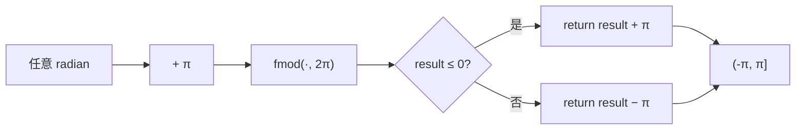

# 1. BOE B4 Lab Jerky Move

从代码上看，你现场描述的“先停顿一下，再继续执行后面的路径”更像是下发逻辑的分段发送/暂停，而不是路径本身没有规划。

### 关键代码点

在 traffic_control_service_regulation.cpp 的 `applyRoadLines()` 中，路径下发受这些条件限制：

- `if (sendI - stepId >= passedRoadLineCount_) return;`
  
  - 这里 `passedRoadLineCount_` 默认是 `3`
  - 也就是说：已下发最远段 `sendIndex` 与当前车辆所在段 `stepId` 的差值不能超过 3
  - 如果超过，就不再下发新段，表现为“暂停等待车辆走近一点再继续”

- `if (sendIndex >= limitIndex) return;`
  
  - `limitIndex` 是规则允许下发的最远索引，可能因为交通规则/避让被收缩
  - 如果当前已下发段已经达到规则允许的最远范围，就不再继续下发

- `if (sendIndex >= roadCount - 1) return;`
  
  - 到终点了，自然不再发送新的段

同时，每次实际添加路段时也最多只会发送 `maxApplyRoadLineCount_` 段（默认 5）。

### 你现场问题的最可能原因

这就说明：

- 路径本身很可能已经被规划好，车辆在这些点位前后是“增量下发”的
- 当车辆到某些地标点/二维码点时，`stepId` 可能刚好跟 `sendIndex` 变化不一致
- 只要 `sendIndex - stepId >= 3`，调度就会暂停下发新路段
- 加上调度循环本身每秒一次，短暂停顿会被放大，现场看起来就是“系统没及时下发”

### 另一个可能原因：点位与旋转处理有关

还有一个与点位属性直接相关的地方：

- `updateRoutes()` 中先计算 `applyRoads`
- 在 `sendMovementCommand()` 里，如果当前位置点位是 `CHARGEPOINT` 或 `!position->spin`，代码会特殊处理：
  - 这段逻辑会让首段命令带上旋转/朝向调整
  - 也就是说某些点位本身会触发“先转向再走”，这在现场看起来像“停一下再继续”

所以你描述的“地标点/二维码点上会卡顿，但不是所有点都有这个问题”很符合这两种情况：

1. 特定点位导致 `stepId`/`sendIndex` 触发下发暂停
2. 特定点位因为 `spin`/角度差大而被发送成“先旋转再移动”的命令

### 结论

你现场的症状更可能是：

- 路径在调度系统里已经存在
- 但增量下发被 `sendIndex-stepId`、`limitIndex` 或点位旋转逻辑限制住
- 因而出现“在某些点停一下，再继续发后面的路段”

如果你要进一步定位，我建议优先检查这两个点：

- 这些卡顿点的 `Position` 是否为 `spin=false` 或特殊 `PositionType`
- 调度日志中该车到达该点时的 `stepId/sendIndex/limitIndex` 值，以及 `applyRoadLines()` 是否直接返回

这样能进一步确认是“中断下发”还是“旋转命令造成停顿”。

---

# 2.  Traffic control service regulation

我要先把任务拆为 TODO 并记录，然后在 traffic_control_service_regulation.cpp 中添加注释。

Created 3 todos

现在我将修改 traffic_control_service_regulation.cpp，在下发逻辑处插入中文注释并标注关键判断位置。

Apply Patch

修正路径后再次应用补丁，目标为工作区中的绝对路径文件。

更新 TODO 状态：将注释任务标记为已完成并保留生成示例的后续任务。

Starting: *Provide runtime scenarios and step-by-step sequences* (3/3)

进度更新：我已在 traffic_control_service_regulation.cpp 中为关键判断添加了中文注释，下一步给出几个运行时场景的逐步下发示例。

修改位置（快速参考）  

- 规则处理处（注释，规则会设置 `limitIndex`）：traffic_control_service_regulation.cpp  
- stepId 更新处（匹配当前位置到索引）：traffic_control_service_regulation.cpp  
- 下发逻辑 `applyRoadLines`（插入了关于 `sendIndex`/`stepId`/`limitIndex`、`maxApplyRoadLineCount_` 及 `dockId/sendDock` 的注释）：traffic_control_service_regulation.cpp  
- 相关结构定义：`Control`（字段含义）：control_block.hpp

简要回顾（关键变量含义）

- `sendIndex`：最后已“下发”的路段索引（初始 -1）。  
- `stepId`：车辆当前位置对应的路段索引（由 `updateVehilceStepId` 更新）。  
- `limitIndex`：规则允许下发的最远路段索引（默认路线末端，规则会缩短它）。  
- `maxApplyRoadLineCount_`：单次最多下发段数（默认 5）。  
- `passedRoadLineCount_`：已下发与当前位置允许的最大差值（默认 3），即 (sendIndex - stepId) < passedRoadLineCount_。

运行时场景示例（逐步说明 sendIndex 变化）

- 场景 A（常规连续下发）  
  
  - 初始：`stepId=4`、`sendIndex=5`、`limitIndex=12`、`roadCount=20`、`maxApplyRoadLineCount_=5`、`passedRoadLineCount_=3`。  
  - 检查：sendIndex-stepId = 1 < 3 → 允许下发；sendIndex < limitIndex。  
  - 本次下发循环：最多 5 次 ++sendIndex 并加入路段，最终 sendIndex 会从 5 依次变为 6,7,8,9,10；若在某次达到 `limitIndex` 或路尾则提前停止。  
  - 结果：本次追加 5 段，下发后 `sendIndex=10`。

- 场景 B（规则限制缩短下发距离）  
  
  - 初始：`stepId=2`、`sendIndex=3`、`limitIndex`（规则计算后）变为 5、`roadCount=30`。  
  - 检查：sendIndex-stepId = 1 < 3 → 允许下发；但 `limitIndex=5` 会限制最多下发到索引 5。  
  - 本次下发：sendIndex 由 3 -> 4，然后 4 -> 5（到达 limitIndex）并停止。  
  - 结果：本次追加 2 段，下发后 `sendIndex=5`（即受规则限幅）。

- 场景 C（位置差距超过允许提前量，暂停下发）  
  
  - 初始：`stepId=2`、`sendIndex=6`、`passedRoadLineCount_=3`。  
  - 计算：sendIndex - stepId = 4 >= 3 → 达到或超过允许提前量，`applyRoadLines` 在早期会直接返回，不进行任何下发。  
  - 结果：本次不下发；等待车辆前进并更新 `stepId` 后才会继续下发。

- 场景 D（接近终点，需要对接/充电）  
  
  - 初始：`roadCount=3`、`sendIndex=0`、`taskType=LOAD`。  
  - 在循环中，当 `sendIndex == roadCount - 2`（即 1 == 1）且为 LOAD/CHARGE，代码会设置 `dockId`（准备对接），并在 `sendDock` 触发且为实车时停止继续下发，从而在到达对接点后触发 `startDock` 等命令。  
  - 结果：下发到接近终点的路段并准备触发对接逻辑；如果 `sendDock` 被置位并车辆非仿真，则后续下发停止。

如果你希望，我可以：

- 将我在代码中添加的注释标注对应的行号并提交一个带有行号引用的更详细说明（可把注释行号输出成列表）；或  
- 在仓库里添加一个小测试脚本/单元测试来模拟上述场景并打印每步 `sendIndex/stepId/limitIndex` 变化（需要我创建测试文件并运行）。  

你想先要哪一个？

Made changes.


# 3. 旋转/直线行走

下面用你们项目里的**实际公式和默认参数**做量化计算。

---

## 计算公式（来自代码）

**行驶一段路的时间代价：**

${\text{travel}} = \frac{D}{\text{vehicleTravelSpeedFactor} \times \text{maxSpeed}}$


**旋转时间代价（90° 拐弯时，内角为 90°，\(|π - \frac{π}{2}| = \frac{π}{2}\)）：**

${\text{rotate}} = \frac{\text{vehicleRotateFactor} \times \frac{\pi}{2}}{\text{vehicleRotationalSpeedFactor} \times \text{maxRotationalSpeed}}$


**等效直线距离**（规划器眼里「转 90° 相当于多走多少米」）：

${\text{equiv}} = T_{\text{rotate}} \times \text{vehicleTravelSpeedFactor} \times \text{maxSpeed}$

---

## 当前项目默认参数

| 参数                             | 来源           | 值                        |
| ------------------------------ |:------------:| ------------------------ |
| 车型VehicleModel                 | `omni`       | 全场车辆默认 `omni`            |
| `maxSpeed`                     | 车型默认值        | **1.0 m/s**              |
| `maxRotationalSpeed`           | 车型默认值        | **0.1 rad/s**（≈ 5.73°/s） |
| `vehicleTravelSpeedFactor`     | `scene.json` | **1.0**                  |
| `vehicleRotationalSpeedFactor` | `scene.json` | **1.0**                  |
| `vehicleRotateFactor`          | `scene.json` | **1.0**                  |

---

## 核心结果：转 90° 相当于多走多少米？


$T_{90°} = \frac{π/2}{0.1} \approx 15.71 \text{ 秒}$


$D_{\text{equiv}} = 15.71 \times 1.0 = \mathbf{15.7 \text{ 米}}$

结论：在当前默认配置下，规划器眼里「路口转 90°」≈ 多走 15.7 米直线。

---

## 常见转角对照表（默认 omni + scene 因子全 1.0）

| 转角       | 旋转耗时        | 等效直线距离     |
| -------- | ----------- | ---------- |
| 10°      | 1.74 s      | **1.7 m**  |
| 30°      | 5.24 s      | **5.2 m**  |
| 45°      | 7.85 s      | **7.9 m**  |
| **90°**  | **15.71 s** | **15.7 m** |
| 135°     | 23.56 s     | **23.6 m** |
| 180°（掉头） | 31.42 s     | **31.4 m** |

起点车头与第一条边偏差 90° 时，起步对齐代价同样是 **15.7 m** 等效。

---

## 和你们 80 cm 站间距的关系

单段 0.8 m 行驶代价：

$T_{0.8m} = 0.8 / 1.0 = 0.8 \text{ 秒}$

一次 90° 拐弯代价：

$T_{90°} = 15.71 \text{ 秒}$

比值：

$\frac{15.71}{0.8} \approx 19.6$

**每转一次 90°，在规划代价上约等于连续走 20 个 80 cm 站点。**

所以在密集站点地图里，**旋转代价其实非常大**，A* 会强烈倾向选拐弯少的路，并不是「几乎只看距离」。

---

## 参数灵敏度（调参时怎么用）

### 1. 只改 `vehicleRotateFactor`（放大旋转权重）

| vehicleRotateFactor | 90° 等效距离 |
| ------------------- | -------- |
| 1.0（当前）             | 15.7 m   |
| 2.0                 | 31.4 m   |
| 0.5                 | 7.9 m    |

### 2. 只改 `vehicleRotationalSpeedFactor`（等效旋转快慢）

| vehicleRotationalSpeedFactor | 有效转速       | 90° 耗时 | 等效距离       |
| ---------------------------- | ---------- | ------ | ---------- |
| 1.0（当前）                      | 0.1 rad/s  | 15.7 s | 15.7 m     |
| 2.0                          | 0.2 rad/s  | 7.9 s  | 7.9 m      |
| 0.5                          | 0.05 rad/s | 31.4 s | 31.4 m     |
| 10.0（代码缺配置时的默认值）             | 1.0 rad/s  | 1.57 s | **1.57 m** |

注意：`RotationCostStrategy` 里 `vehicleRotationalSpeedFactor` 的**代码默认是 10.0**，但你们 `scene.json` 配的是 **1.0**，所以实际用的是 1.0，不是 10.0。

### 3. 若改成更接近真实 AGV 的型号参数

假设在 `VehicleModelManager` 里把 omni 改成：

- `maxSpeed = 1.5 m/s`（常见 AMR 空载速度）
- `maxRotationalSpeed = 0.785 rad/s`（约 45°/s）

仍用 scene 因子全 1.0：

$T_{90°} = \frac{π/2}{0.785} \approx 2.0 \text{ s}, \quad D_{\text{equiv}} = 2.0 \times 1.5 = \mathbf{3.0 \text{ m}}$

这时 90° 只相当于 **3 m**，旋转对路径选择的影响会弱很多，会更接近「主要看距离」的直觉。

---

## 和交管惩罚的对比

`TrafficFlowCostStrategy` 对向冲突默认加 **20 s** 固定惩罚（`trafficFlow_oppositeTravelFactor` 默认 20.0）：

| 代价类型    | 时间代价   | 等效距离（maxSpeed=1.0） |
| ------- | ------ | ------------------ |
| 90° 旋转  | 15.7 s | 15.7 m             |
| 对向冲突路段  | 20.0 s | 20.0 m             |
| 走 0.8 m | 0.8 s  | 0.8 m              |

绕开对向车的意愿，和绕开一次 90° 拐弯差不多。

---

## 综合判断

1. **当前默认参数下，旋转并非被忽略**——一次 90° ≈ 15.7 m，在 80 cm 站间距场景里权重很高。
2. **若实车旋转比 0.1 rad/s 快很多**，而规划仍用默认 omni，则**规划会过度害怕转弯**（偏保守）。
3. **若实车旋转更慢**，默认参数反而可能**低估**转弯代价。
4. 执行阶段 `addRouteToControl` 的精细角度（贝塞尔、5° 阈值、终点 spin）**不参与**上述代价，可能造成「规划选的路」和「实际执行旋转耗时」有偏差。

---

## 调参建议（按目标）

| 目标          | 建议                                                                                                                                                                                              |
| ----------- | ----------------------------------------------------------------------------------------------------------------------------------------------------------------------------------------------- |
| 让规划更贴近实车    | 把 omni 的 `maxSpeed` / `maxRotationalSpeed` 改成实测值                                                                                                                                                |
| 密集站点、少拐弯    | 保持或略增 `vehicleRotateFactor`                                                                                                                                                                     |
| 旋转很快、希望更偏距离 | 增大 `vehicleRotationalSpeedFactor`，或降低 `vehicleRotateFactor`                                                                                                                                     |
| 快速验证        | 用公式：$D_{\text{equiv}} = \frac{\frac{\pi}{2} \times \text{maxSpeed}}{\text{maxRotationalSpeed}} \times \frac{\text{rotateFactor}}{\text{rotationalSpeedFactor} \times \text{travelSpeedFactor}}$ |

如果你能提供实车的**最大线速度**和**原地旋转 90° 实测耗时**，我可以反推一组更合理的 `maxSpeed` / `maxRotationalSpeed` / 三个 factor 配置。


# 4. Normalize Radian

`normalizeRadian` 把任意弧度角**归一到主值区间** `(-π, π]`（约 (-180°, 180°]），和上面的 `normalizeRadianPositive`（归到 `[0, 2π)`）是同一类工具，只是区间不同。

先看完整函数：

```29:34:core/module/common/include/geometry/angles.hpp
    inline double normalizeRadian(double radian){
        // (-pi pi]
        const double result = std::fmod(radian + maths::pi, maths::pi2);
        if(result <= 0.0) return result + maths::pi;
        return result - maths::pi;
    }
```

---

## 第 29 行：函数签名

```cpp
inline double normalizeRadian(double radian){
```

- `inline`：头文件里的短函数，建议编译器内联，减少调用开销。
- 入参 `radian`：任意实数弧度（可远超 ±2π，如 `7.5`、`−10.2`）。
- 返回值：落在 `(-π, π]` 的等价角。

**和 C++ 角度的关系**：类似把角度「折」到一圈以内，但用**对称区间** `(-180°, 180°]`，而不是 `[0°, 360°)`。

---

## 第 30 行：注释

```cpp
        // (-pi pi]
```

目标区间：

| 符号  | 含义            |
| --- | ------------- |
| `(` | 不包含 −π（-180°） |
| `]` | 包含 +π（+180°）  |

即：**大于 −π，小于等于 π**。

```
        -π          0          π
         |----------|----------|
        开区间                    闭区间
```

为什么 −π 和 +π 是同一方向却只保留 +π？这是主值区间的常见约定，避免边界重复。

---

## 第 31 行：核心 — `fmod` 先平移再取模

```cpp
        const double result = std::fmod(radian + maths::pi, maths::pi2);
```

常量（来自 `maths.hpp`）：

- `maths::pi` = π  
- `maths::pi2` = 2π  

`std::fmod(x, y)`：求 **x 除以 y 的余数**，结果与 x 同号，范围 **`[0, y)`** 或 **`(-y, 0]`**（取决于 x 正负）。

**思路**：先把角度整体 **+π**，模 **2π**，余数落在 `[0, 2π)` 或 `(-2π, 0]`；后面两行再减回 π，映射到 `(-π, π]`。

**小例子**（设 π≈3.14）：

| 输入 `radian`  | `radian + π` | `fmod(..., 2π)` → `result` |
| ------------ | ------------ | -------------------------- |
| 0            | π            | π                          |
| π            | 2π           | 0                          |
| 3π（≈540°）    | 4π           | 0                          |
| −π/2（−90°）   | π/2          | π/2                        |
| −3π/2（−270°） | −π/2         | −π/2（负数余数）                 |

此时 `result` 还在 `[0, 2π)` 或负余数区间，**还不是**最终 `(-π, π]`。

---

## 第 32 行：余数 ≤ 0 时，加 π

```cpp
        if(result <= 0.0) return result + maths::pi;
```

处理 `fmod` 的**非正余数**（0 或负数）：

| `result` | `result + π` | 最终值                      |
| -------- | ------------ | ------------------------ |
| 0        | π            | **π**（+180°）             |
| −π/2     | π/2          | **π/2**（+90°）            |
| −π（理论上）  | 0            | 但 0 不落在 `(-π, π]` 的「正侧」… |

当 `result == 0` 时返回 **π**，对应输入为 ±π、±3π 等奇数倍 π 的情况，统一归到 **+π**（符合注释里的右闭 `]`）。

---

## 第 33 行：余数 > 0 时，减 π

```cpp
        return result - maths::pi;
```

处理 `fmod` 的**正余数** `(0, 2π)`：

| `result` | `result - π` | 最终值            |
| -------- | ------------ | -------------- |
| π/2      | −π/2         | **−π/2**（−90°） |
| π        | 0            | **0**          |
| 3π/2     | π/2          | **π/2**        |

正余数先减 π，压到 `(-π, π]`。

---

## 合在一起：数据流



---

## 和 `normalizeRadianPositive` 的对比

```15:20:core/module/common/include/geometry/angles.hpp
    inline double normalizeRadianPositive(double radian){
        //[0 2*pi)
        const double result = std::fmod(radian, maths::pi2);
        if(result < 0) return result + maths::pi2;
        return result;
    }
```

| 函数                        | 目标区间      | 典型用途                  |
| ------------------------- | --------- | --------------------- |
| `normalizeRadianPositive` | `[0, 2π)` | 方向角、罗盘 0°~360°        |
| `normalizeRadian`         | `(-π, π]` | **角度差**、最短旋转（见第 46 行） |

第 46 行：

```cpp
shortestAngularRadianDistance(from, to) = normalizeRadian(to - from);
```

先算 `to - from`，再归一到 `(-π, π]`，得到**最短旋转弧度**（可正可负，表示左/右旋）。

---

## 数值例子速查

| 输入（度） | 输入（rad） | 输出（rad） | 输出（度）          |
| ----- | ------- | ------- | -------------- |
| 0°    | 0       | 0       | 0°             |
| 90°   | π/2     | π/2     | 90°            |
| 180°  | π       | π       | 180°           |
| 270°  | 3π/2    | −π/2    | −90°           |
| 450°  | 5π/2    | π/2     | 90°            |
| −90°  | −π/2    | −π/2    | −90°           |
| −180° | −π      | π       | 180°（边界统一到 +π） |
| −270° | −3π/2   | π/2     | 90°            |

---

## 使用注意（结合你们项目）

1. **浮点误差**：`fmod` + 比较 `<= 0.0` 在极接近 ±π 时可能有 1 ULP 级抖动；一般工程够用。
2. **−π 的表示**：输入 −π 会得到 **+π**（同一物理方向，符号不同）；算角度差时通常没问题。
3. **在交管里的用法**：`vehicle->pose().yaw`、`addRouteToControl` 里多处 `angles::normalizeRadian(...)`，保证车头角、路段目标角在同一主值区间，再算 `shortestAngularRadianDistance` 判断要不要原地转。

如果你愿意，我可以接着用 `addRouteToControl` 里某一段 `sourceYaw` / `targetYaw` 的实际数值，走一遍 `normalizeRadian` + `shortestAngularRadianDistance` 的完整计算。