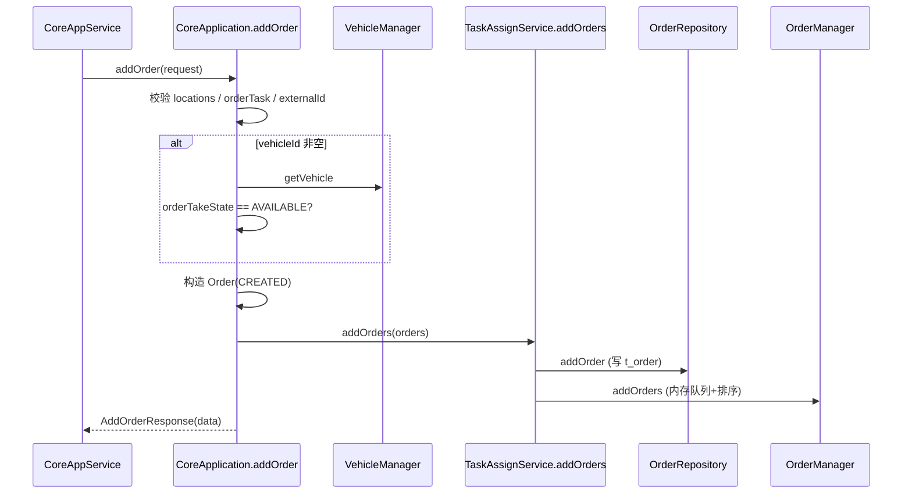

`[Core.AddOrder]` 之后分两段：**同步建单返回**，以及约 1s 周期线程里的**异步分配/下发**。

## 1. Engine → Core 入口（到 native 为止）

```
TaskExecuteService.CreateOrderAsync
  → CoreAppService.AddOrder
    → ExecuteManagedCoreResponseWithLogging
      → ExecuteWithNativeRequest（托管请求 → AddOrderRequest）
        → CoreApplication.addOrder          // SWIG → libmatrix_core
      → CoreResponseMapper.ToCoreResponse
      → ValidateResponse（code≠0 抛异常，如 801）
```

日志里的 `[Core.AddOrder] 开始执行` 来自 `ExecuteWithLogging`。

---

## 2. Core 同步链（`addOrder` 内，本次调用结束前）



| 阶段    | 主要函数                                                                                                             |
| ----- | ---------------------------------------------------------------------------------------------------------------- |
| 校验    | `CoreApplication::addOrder`：`orderTask()`、`getOrderByExternalId`、`VehicleManager::getVehicle`、`orderTakeState()` |
| 建单    | 循环构造 `Order`（`utils::uuid`、类型/优先级/容器等）                                                                           |
| 落库+入队 | `TaskAssignService::addOrders` → `OrderRepository::addOrder` → `OrderManager::addOrders` / `sortOrdersInternal`  |
| 回包    | `build(order)` 填 `AddOrderResponse.data`                                                                         |

此阶段**不做选车、路径规划、交通下发**；失败则直接 `failed(..., 800/801/...)` 返回。

---

## 3. Core 异步链（`TaskAssignService` 周期线程，约 1s）

`Application` 启动后 `taskAssignService_->start()`，循环：

```
TaskAssignService::doWork
  → dispatchOrders
      → getNeedDispatchOrders / clearStaleVehicleBinding
      → OptimizeTaskAssigner::assign
          → groupOrders
          → assignGroupOrders
              →（指定车）assignOrderToVehicle
              →（自动）canWorkVehicles → assignIdleVehicles / assignWorkVehicles → assignOrderToVehicle
  → dispatchBlockTasks
      → processPushVehicles（可选顶车 leisure）
      → dispatchTask
          → OrderRepository::updateBlockState(DISPATCHED)
          → TrafficControlService::addVehicleTask   // RegulationTrafficControlService
```

| 阶段  | 主要函数                                                                          |
| --- | ----------------------------------------------------------------------------- |
| 分配  | `OptimizeTaskAssigner::assign` / `assignGroupOrders` / `assignOrderToVehicle` |
| 下发  | `dispatchBlockTasks` → `dispatchTask` → `addVehicleTask`                      |
| 顶车  | `processPushVehicles` → `planning::multiPlan` → `addLeisureTask`              |

之后才进入交通管制周期（路权、yield、发车等），那是 `addVehicleTask` 之后的链路，已超出 AddOrder 本身。

---

## 4. 和 17:14:35 的关系

同步路径在 `addOrder` 里发现 `orderTakeState != AVAILABLE` → **801**，**不会**走到 `addOrders` / `doWork` 分配链。打开接单后，同一条同步链成功入库，再由 `doWork` → `assign` → `dispatchTask` → `addVehicleTask` 继续执行。
