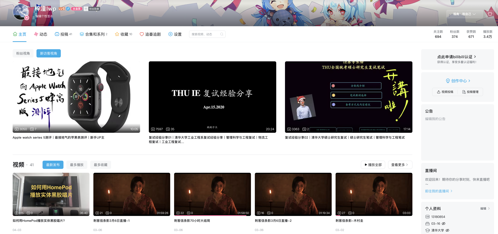
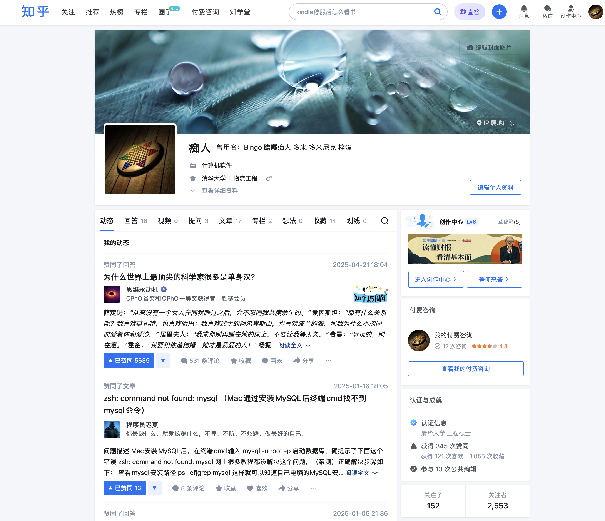
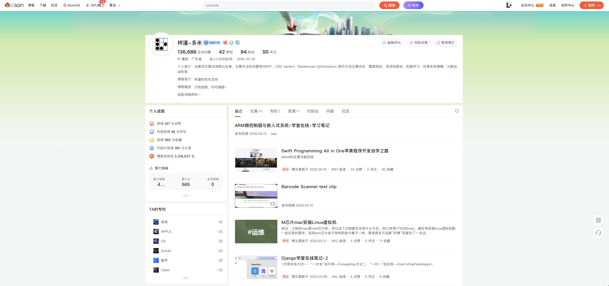
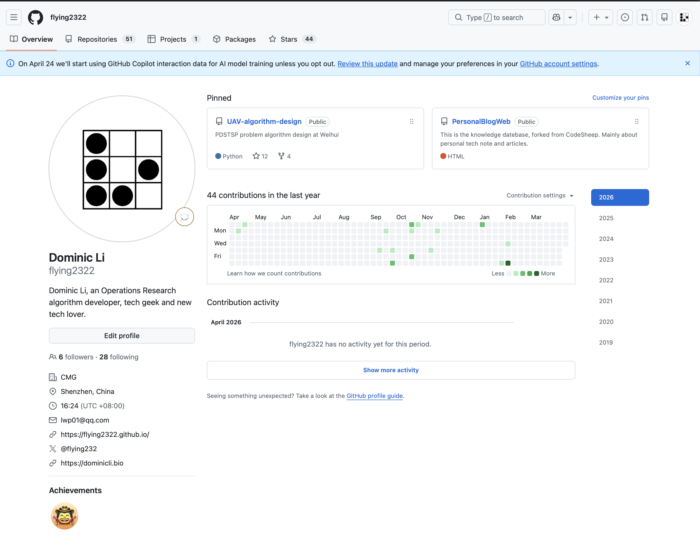
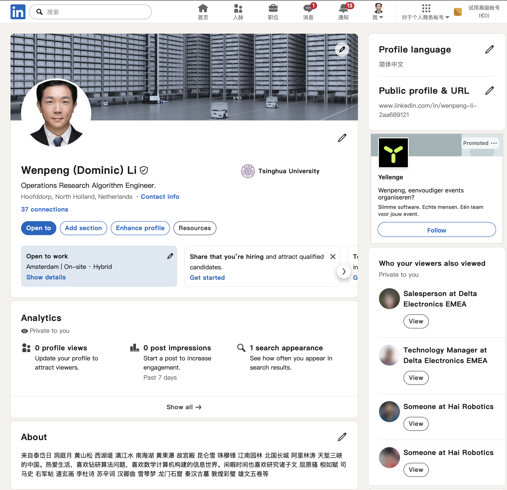
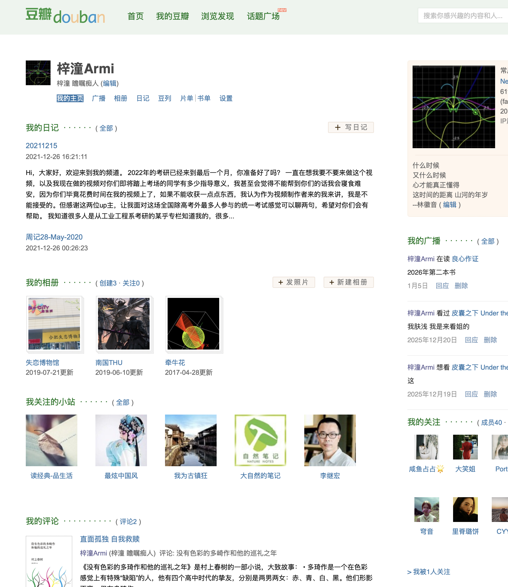
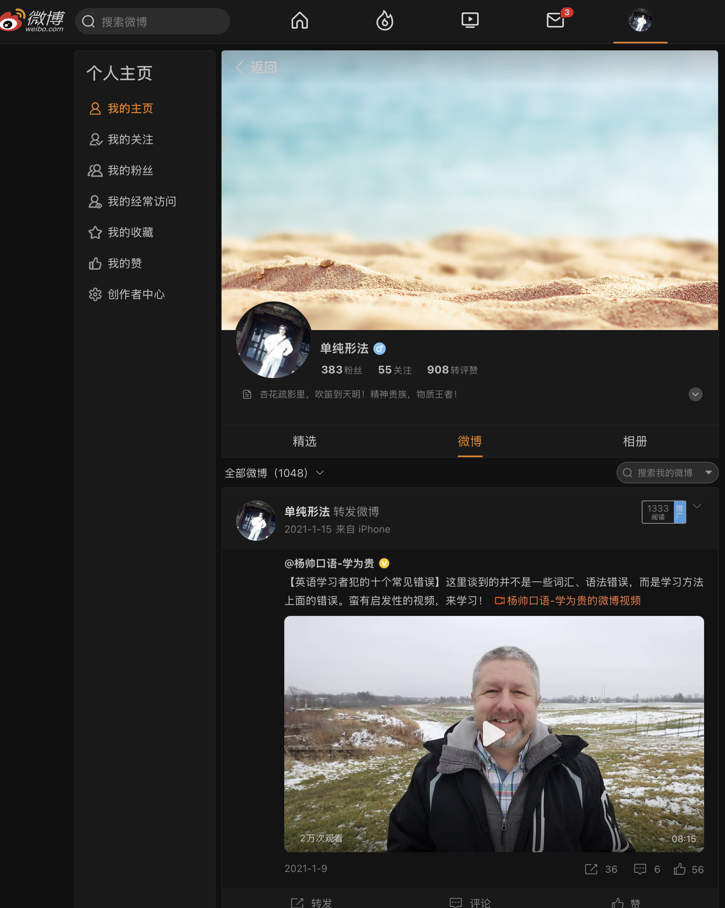
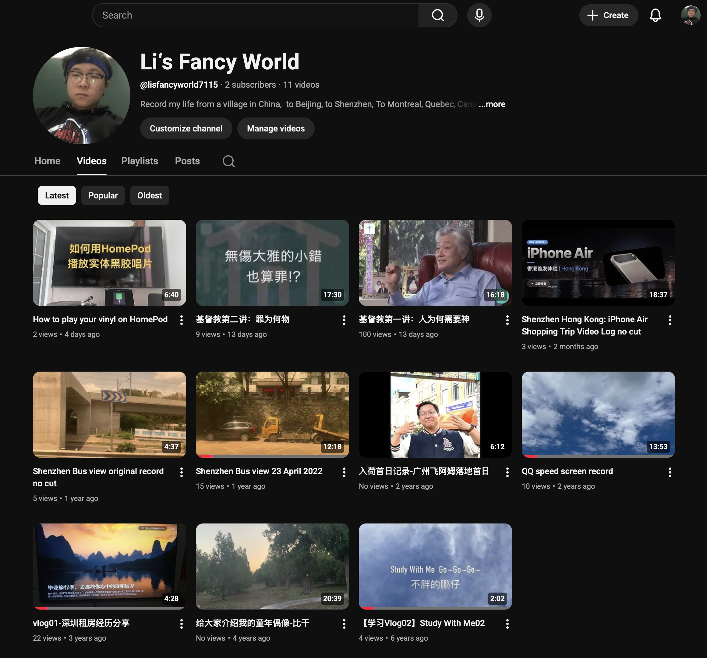
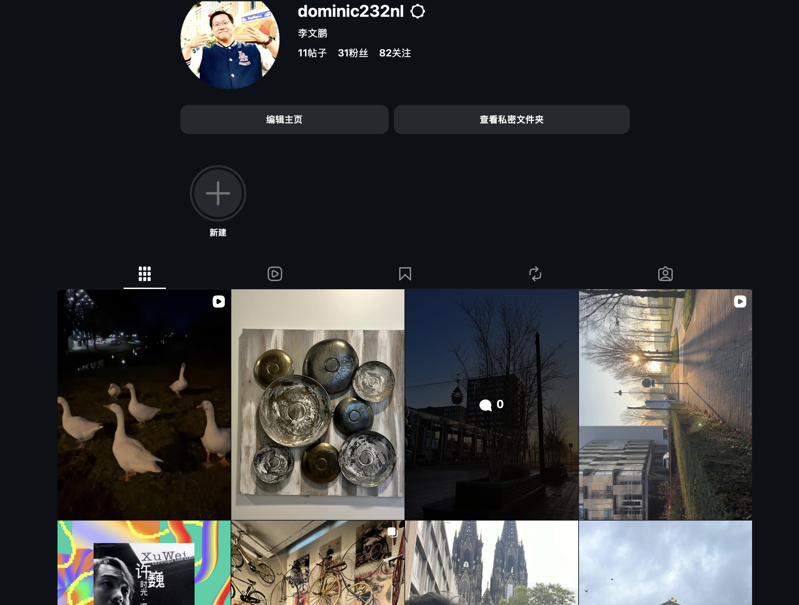
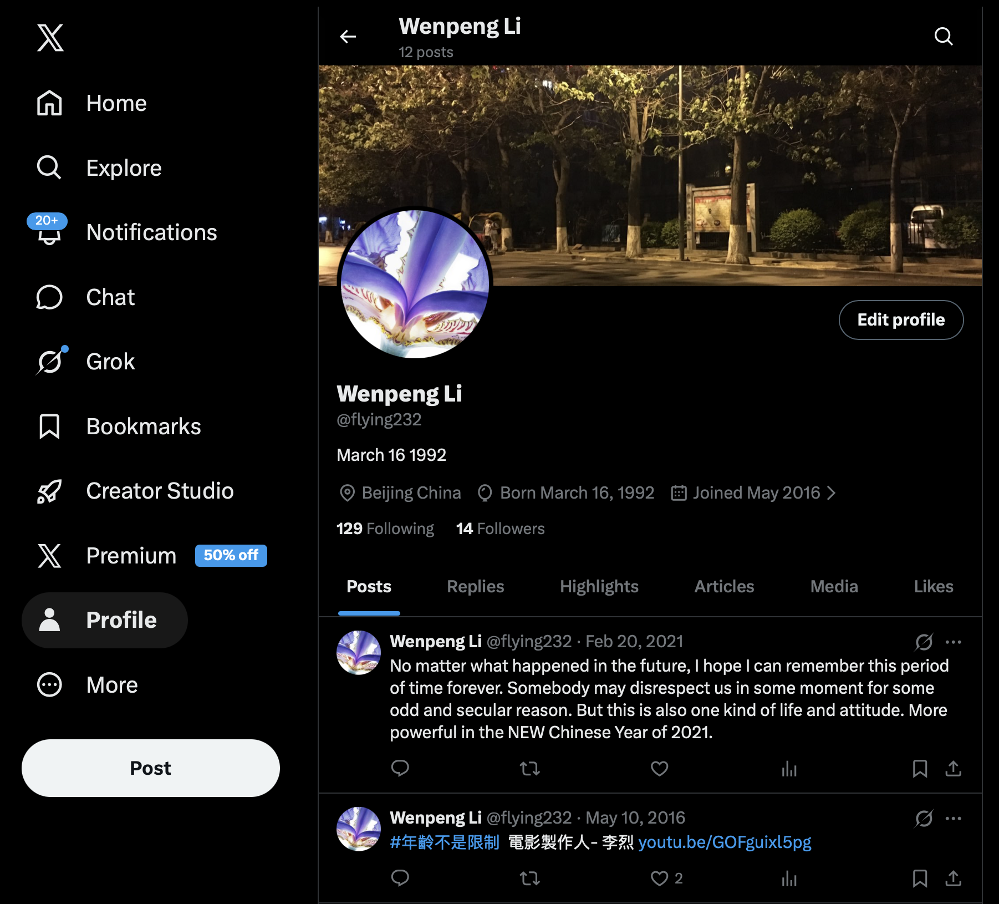

This is a page I wanna to summary my link and posts platforms.

---

### 1. 主要视频分享平台 [哔哩哔哩 Bilibili](https://bilibili.com)
这是我目前最活跃的视频内容平台，主要用来分享技术教程、项目实战演示以及一些学习心得的Vlog。如果你对我的视频内容感兴趣，欢迎关注我的频道，也欢迎在弹幕和评论区和我交流讨论，你的反馈和关注是我持续更新的最大动力。

当前主要的分享内容聚焦当下生活，有游戏实景、直播、各种黑胶，旅行、阅读、值得关注APP及软件项目等内容，主要都是自己关注和喜爱的事物。

---

### 2. [知乎](https://zhihu.com)

我在知乎主要输出技术长文和深度回答，涉及我日常学习和工作中遇到的问题总结与经验复盘。相比视频，这里更适合阅读逻辑性较强的文章。欢迎关注我的专栏，也欢迎在评论区提出你的看法，我很乐意和大家持续探讨。

---

### 3. [CSDN](https://csdn.net)

CSDN是我记录代码片段和发布技术博文的主要阵地之一，内容偏向于具体的开发问题排查与解决方案。如果你也是开发者，欢迎关注我，希望我的踩坑记录能帮到你，也期待互相交流技术心得。

---

### 4. [Github](https://github.com)

我的所有开源项目和个人代码仓库都在这里，包括一些side project和练习项目。如果你对我的代码实现细节感兴趣，或者想参与贡献，欢迎来Github follow我或者给我提Issue/PR，一起玩开源。

---

### 5. [LinkedIn](https://linkedin.com)

我在LinkedIn主要分享职业发展动态、行业观察以及一些英文的技术总结。如果你希望了解我的职业背景，或者想在职场层面建立连接，欢迎加我好友，期待与更多同行交流。

---

### 6. [豆瓣](https://douban.com)

豆瓣是我的精神自留地，主要记录读书笔记、观影感想以及一些生活相关的内容。技术之外我也很乐意分享人文社科方面的阅读体会，欢迎关注，一起交流书单和片单。

---

### 7. [微博 (2011-2015年使用)](https://weibo.com)

这是我的早期社交平台账号，2011到2015年间有比较活跃的使用记录，承载了很多早期的碎片化想法和生活日常。目前该账号已基本停更，仅作为个人互联网足迹的存档保留在这里。

---

### 8. [Youtube](https://youtube.com)

和Bilibili互为镜像平台，我会将部分视频内容同步发布到Youtube上，主要面向海外观众。如果你更习惯使用Youtube，欢迎订阅我的频道，也欢迎通过视频评论区和我保持交流。

---

### 9. [Facebook](https://facebook.com)

我在Facebook上主要做一些内容的同步分发以及和海外朋友的日常联络。更新频率不高，但会选择性转发一些重要的动态和文章，欢迎点赞我的主页，保持联络。

---

### 10. [Instagram](https://instagram.com)

Instagram是我的图文生活向平台，主要分享旅行摄影、日常随拍和一些生活碎片。如果想了解技术之外更生活化的一面，欢迎关注，期待在这里和你互动。

---

### 11. [Twitter/X](https://x.com)

我在X上主要关注科技前沿动态，偶尔分享技术短评、项目进展和一些即时想法。内容偏向碎片化和轻量级，如果你喜欢这种快节奏的信息获取方式，欢迎关注我，随时交流。
