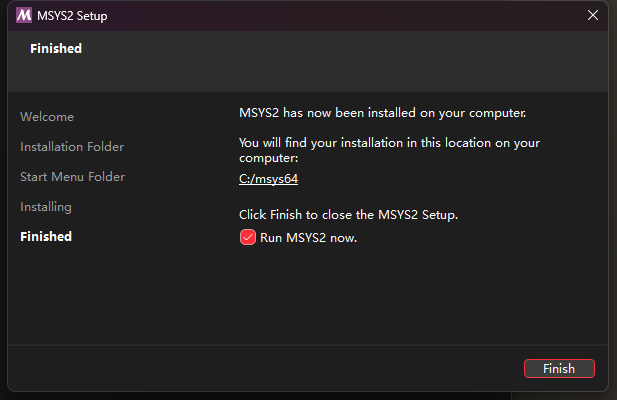
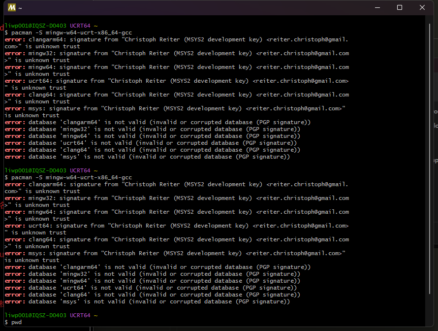
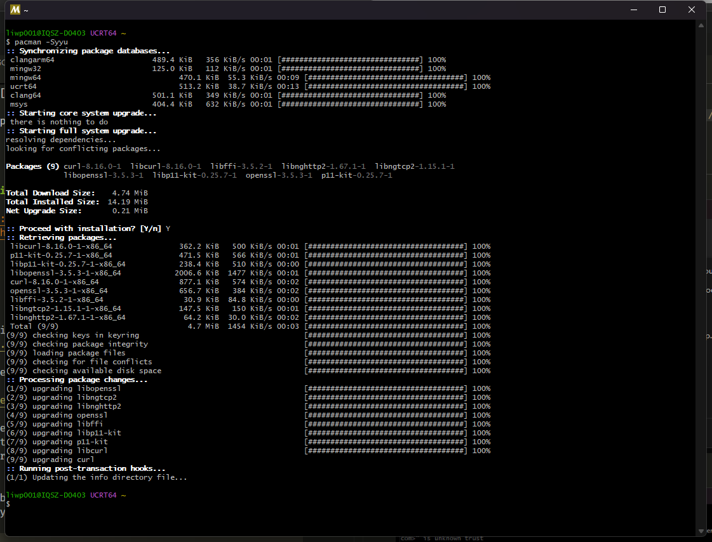
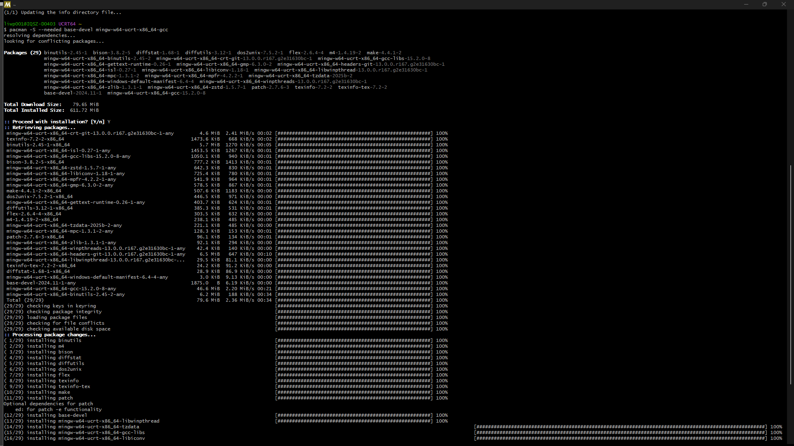
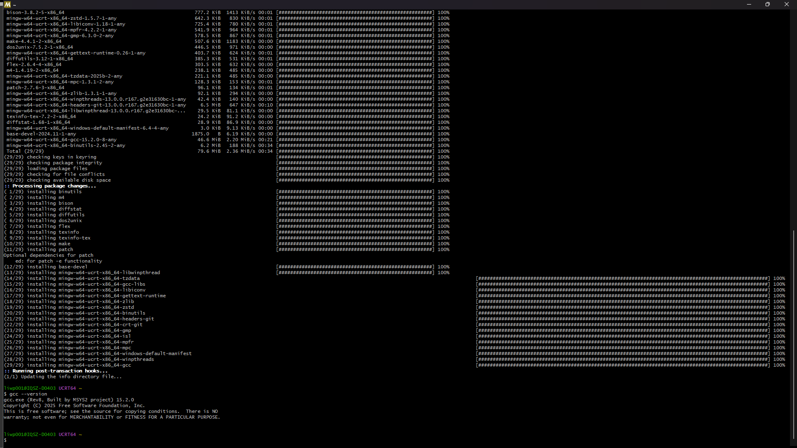

Neovim Toturial for truely beginners on win11 and colemak users

---

As a long-time Vim user, I'm now ready to learn more about its export capabilities. I prefer Vim-based IDEs over VS Code or JetBrains all-in-one solutions because they are:

1. Easy to use and truly customizable to my workflow
2. Clean, simple, and lightweight
3. Aesthetically pleasing yet professional
4. Server-ready (no local installation required)
5. Highly efficient


## 1. Neovim install

Without any ado, let's jump to a truely beginner friendly tutorial at 2025.

### 1.1 Neovim install on win11
Administrator authority needed.
`winget install neovim` 

### 1.2 check the path of neovim position
`echo $env:LOCALAPPDATA\nvim`

Reply:  `D:\Users\liwp001\AppData\Local\nvim`

### 1.3 create a basic config(init.lua) 

`mkdir $env:LOCALAPPDATA\nvim`

`notepad $env:LOCALAPPDATA\nvim\init.lua`

`D:\Users\liwp001\AppData\Local\nvim\init.lua`

File details:

```lua
-- Basic settings
vim.opt.number = true       -- line numbers
vim.opt.relativenumber = true -- relative numbers
vim.opt.tabstop = 4
vim.opt.shiftwidth = 4
vim.opt.expandtab = true
vim.opt.smartindent = true

-- Colemak-friendly movement (if you want hjkl remapped)
-- n = move left, e = move down, i = move up, o = move right
--vim.keymap.set('', 'n', 'h')
vim.keymap.set('', 'n', 'j')
vim.keymap.set('', 'e', 'k')
vim.keymap.set('', 'i', 'l')

-- Leader key (space is popular)
vim.g.mapleader = ' '

-- Plugins: use lazy.nvim (modern plugin manager)
local lazypath = vim.fn.stdpath("data") .. "/lazy/lazy.nvim"
if not vim.loop.fs_stat(lazypath) then
  vim.fn.system({
    "git", "clone", "--filter=blob:none",
    "git@github.com:flying2322/lazy.nvim.git", lazypath
  })
end
vim.opt.rtp:prepend(lazypath)

require("lazy").setup({
  -- Fuzzy finder (Telescope)
  { "nvim-telescope/telescope.nvim", dependencies = { "nvim-lua/plenary.nvim" } },
  
  -- Treesitter for syntax highlighting
  { "nvim-treesitter/nvim-treesitter", build = ":TSUpdate" },

  -- LSP support for autocompletion and diagnostics
  { "neovim/nvim-lspconfig" },

  -- Autocompletion plugin (cmp)
  { "hrsh7th/nvim-cmp" },
  { "hrsh7th/cmp-nvim-lsp" },
  { "hrsh7th/cmp-buffer" },
  { "hrsh7th/cmp-path" },
  { "hrsh7th/cmp-cmdline" },
  
  -- File explorer (NerdTree or similar)
  { "preservim/nerdtree" },

  -- Colorscheme
  { "folke/tokyonight.nvim" }
})

-- Additional settings for LSP
local lspconfig = require("lspconfig")
lspconfig.ts_ls.setup({})
lspconfig.pyright.setup({})

-- Autocompletion setup (cmp)
local cmp = require("cmp")
cmp.setup({
  snippet = {
    expand = function(args)
      vim.fn["vsnip#anonymous"](args.body)
    end,
  },
  mapping = {
    ["<C-p>"] = cmp.mapping.select_prev_item(),
    ["<C-n>"] = cmp.mapping.select_next_item(),
    ["<C-d>"] = cmp.mapping.scroll_docs(-4),
    ["<C-u>"] = cmp.mapping.scroll_docs(4),
    ["<C-y>"] = cmp.mapping.confirm({ select = true }),
    ["<C-Space>"] = cmp.mapping.complete(),
  },
  sources = {
    { name = "nvim_lsp" },
    { name = "buffer" },
    { name = "path" },
  },
})

-- Telescope keybindings
vim.api.nvim_set_keymap('n', '<leader>ff', '<cmd>Telescope find_files<cr>', { noremap = true })
vim.api.nvim_set_keymap('n', '<leader>fg', '<cmd>Telescope live_grep<cr>', { noremap = true })
vim.api.nvim_set_keymap('n', '<leader>fb', '<cmd>Telescope buffers<cr>', { noremap = true })

-- Treesitter setup for better syntax highlighting
require'nvim-treesitter.configs'.setup {
-- ensure_installed = "maintained", -- Install only maintained parsers
  ensure_installed = {
    "bash",
    "c",
    "cpp",
    "lua",
    "python",
    "javascript",
    "typescript",
    "json",
    "yaml",
    "html",
    "css",
    "markdown",
    },
  highlight = { enable = true },
}
```
Save and close it.

## 2. Essential Plugins to Start With

Lazy.nvim → plugin manager

telescope.nvim → fuzzy finder (<leader>ff to find files)

nvim-treesitter → better syntax highlighting

nvim-lspconfig → language server support (intellisense/autocomplete)


## 3. Trouble Shooting


===
Error detected while processing D:\Users\liwp001\AppData\Local\nvim\init.lua:               E5113: Error while calling lua chunk: D:\Users\liwp001\AppData\Local\nvim\init.lua:29: module 'lazy' not found:                                                                                 no field package.preload['lazy']                                                            no file '.\lazy.lua'                                                                        no file 'C:\Program Files\Neovim\bin\lua\lazy.lua'                                          no file 'C:\Program Files\Neovim\bin\lua\lazy\init.lua'                                     no file '.\lazy.dll'                                                                        no file 'C:\Program Files\Neovim\bin\lazy.dll'                                              no file 'C:\Program Files\Neovim\bin\loadall.dll'                                   stack traceback:                                                                                    [C]: in function 'require'                                                                  D:\Users\liwp001\AppData\Local\nvim\init.lua:29: in main chunk


===

Github repo clone issue
If github issue exists:
`$env:HTTPS_PROXY="http://127.0.0.1:7890"; $env:HTTP_PROXY="http://127.0.0.1:7890"; git clone https://github.com/LazyVim/starter $env:LOCALAPPDATA\nvim`


## 4. Usage Tips for Neovim
Run `:checkhealth` → diagnose missing dependencies.

Use `:Lazy sync` → install/update plugins.

With LSP:

`gd` → go to definition

`K` → hover docs

`<leader>rn` → rename symbol

Telescope quick start:

`<leader>ff` → find files

`<leader>fg` → live grep

`<leader>fb` → buffers


## 5. Intall GCC(MinGW）

1. Follow the installation on website: https://www.msys2.org/


the follow the procedures:`pacman -S mingw-w64-ucrt-x86_64-gcc`



This is the source truted issue normally happend in Mainland China for:
1. PGP key was not trusted
2. MSYS2's official source connection error(timeout)

Solution:
1. source change and rebuild keyring 
2. Jump across the annoying checking process.

We use method 2 to quick debug.
`nano /etc/pacman.conf`

find [option] paragragh and modify:
`SigLevel = Never`

Then `pacman -Syyu` agagin



Then we can back to the GCC installation.






up to now, the gcc installation successfully commpleted.


### Finally checking the output of :checkhealth

```\
==============================================================================
lazy:                                                               2 ⚠️  1 ❌

lazy.nvim ~
- {lazy.nvim} version `11.17.1`
- ✅ OK {git} `version 2.36.0.windows.1`
- ✅ OK no existing packages found by other package managers
- ✅ OK packer_compiled.lua not found

luarocks ~
- checking `hererocks` installation
- ✅ OK no plugins require `luarocks`, so you can ignore any warnings below
- ✅ OK {python} `Python 3.12.1`
- ❌ ERROR {D:/Users/liwp001/AppData/Local/nvim-data/lazy-rocks/hererocks/bin/luarocks} not installed
- ⚠️ WARNING {D:/Users/liwp001/AppData/Local/nvim-data/lazy-rocks/hererocks/bin/lua} version `5.1` not installed
- ⚠️ WARNING Lazy won't be able to install plugins that require `luarocks`.
  Here's what you can do:
   - fix your `luarocks` installation
   - disable *hererocks* with `opts.rocks.hererocks = false`
   - disable `luarocks` support completely with `opts.rocks.enabled = false`

==============================================================================
lspconfig:                                                                  ✅

- Skipped. This healthcheck is redundant with `:checkhealth vim.lsp`.

==============================================================================
nvim-treesitter:                                                          2 ⚠️

Installation ~
- ⚠️ WARNING `tree-sitter` executable not found (parser generator, only needed for :TSInstallFromGrammar, not required for :TSInstall)
- ⚠️ WARNING `node` executable not found (only needed for :TSInstallFromGrammar, not required for :TSInstall)
- ✅ OK `git` executable found.
- ✅ OK `cc` executable found. Selected from { vim.NIL, "cc", "gcc", "clang", "cl", "zig" }
  Version: cc (Rev8, Built by MSYS2 project) 15.2.0
- ✅ OK Neovim was compiled with tree-sitter runtime ABI version 15 (required >=13). Parsers must be compatible with runtime ABI.

OS Info:
{
  machine = "x86_64",
  release = "10.0.22631",
  sysname = "Windows_NT",
  version = "Windows 11 Pro"
} ~

Parser/Features         H L F I J
  - bash                ✓ ✓ ✓ . ✓
  - c                   ✓ ✓ ✓ ✓ ✓
  - cpp                 ✓ ✓ ✓ ✓ ✓
  - css                 ✓ . ✓ ✓ ✓
  - html                ✓ ✓ ✓ ✓ ✓
  - javascript          ✓ ✓ ✓ ✓ ✓
  - json                ✓ ✓ ✓ ✓ .
  - lua                 ✓ ✓ ✓ ✓ ✓
  - markdown            ✓ . ✓ ✓ ✓
  - python              ✓ ✓ ✓ ✓ ✓
  - typescript          ✓ ✓ ✓ ✓ ✓
  - yaml                ✓ ✓ ✓ ✓ ✓

  Legend: H[ighlight], L[ocals], F[olds], I[ndents], In[j]ections
         +) multiple parsers found, only one will be used
         x) errors found in the query, try to run :TSUpdate {lang} ~

==============================================================================
telescope:                                                          1 ⚠️  1 ❌

Checking for required plugins ~
- ✅ OK plenary installed.
- ✅ OK nvim-treesitter installed.

Checking external dependencies ~
- ❌ ERROR rg: not found. `live-grep` finder will not function without [BurntSushi/ripgrep](https://github.com/BurntSushi/ripgrep) installed.
- ⚠️ WARNING fd: not found. Install [sharkdp/fd](https://github.com/sharkdp/fd) for extended capabilities

===== Installed extensions ===== ~

==============================================================================
vim.deprecated:                                                             ✅

- ✅ OK No deprecated functions detected

==============================================================================
vim.health:                                                               1 ⚠️

Configuration ~
- ✅ OK no issues found

Runtime ~
- ✅ OK $VIMRUNTIME: C:\Program Files\Neovim\share/nvim/runtime

Performance ~
- ✅ OK Build type: Release

Remote Plugins ~
- ✅ OK Up to date

External Tools ~
- ⚠️ WARNING ripgrep not available

==============================================================================
vim.lsp:                                                                    ✅

- LSP log level : WARN
- Log path: D:/Users/liwp001/AppData/Local/nvim-data/lsp.log
- Log size: 0 KB

vim.lsp: Active Clients ~
- No active clients

vim.lsp: Enabled Configurations ~

vim.lsp: File Watcher ~
- file watching "(workspace/didChangeWatchedFiles)" disabled on all clients

vim.lsp: Position Encodings ~
- No active clients

==============================================================================
vim.provider:                                                             6 ⚠️

Clipboard (optional) ~
- ✅ OK Clipboard tool found: win32yank

Node.js provider (optional) ~
- ⚠️ WARNING `node` and `npm` (or `yarn`, `pnpm`) must be in $PATH.
  - ADVICE:
    - Install Node.js and verify that `node` and `npm` (or `yarn`, `pnpm`) commands work.

Perl provider (optional) ~
- ⚠️ WARNING No perl executable found
  - ADVICE:
    - See :help |provider-perl| for more information.
    - You can disable this provider (and warning) by adding `let g:loaded_perl_provider = 0` to your init.vim
- ⚠️ WARNING No usable perl executable found

Python 3 provider (optional) ~
- ⚠️ WARNING No Python executable found that can `import neovim`. Using the first available executable for diagnostics.
- ⚠️ WARNING Could not load Python :
  python3 not found in search path or not executable.
  python3.13 not found in search path or not executable.
  python3.12 not found in search path or not executable.
  python3.11 not found in search path or not executable.
  python3.10 not found in search path or not executable.
  python3.9 not found in search path or not executable.
  C:\Program Files\Python312\python.EXE does not have the "neovim" module.
  - ADVICE:
    - See :help |provider-python| for more information.
    - You can disable this provider (and warning) by adding `let g:loaded_python3_provider = 0` to your init.vim
- Executable: Not found

Python virtualenv ~
- ✅ OK no $VIRTUAL_ENV

Ruby provider (optional) ~
- ⚠️ WARNING `ruby` and `gem` must be in $PATH.
  - ADVICE:
    - Install Ruby and verify that `ruby` and `gem` commands work.

==============================================================================
vim.treesitter:                                                             ✅

Treesitter features ~
- Treesitter ABI support: min 13, max 15
- WASM parser support: false

Treesitter parsers ~
- ✅ OK Parser: bash                      ABI: 14, path: D:\Users\liwp001\AppData\Local\nvim-data\lazy\nvim-treesitter\parser\bash.so
- ✅ OK Parser: c                         ABI: 14, path: D:\Users\liwp001\AppData\Local\nvim-data\lazy\nvim-treesitter\parser\c.so
- ✅ OK Parser: c                    (not loaded), path: C:\Program Files\Neovim\lib\nvim\parser\c.dll
- ✅ OK Parser: cpp                       ABI: 14, path: D:\Users\liwp001\AppData\Local\nvim-data\lazy\nvim-treesitter\parser\cpp.so
- ✅ OK Parser: css                       ABI: 14, path: D:\Users\liwp001\AppData\Local\nvim-data\lazy\nvim-treesitter\parser\css.so
- ✅ OK Parser: html                      ABI: 14, path: D:\Users\liwp001\AppData\Local\nvim-data\lazy\nvim-treesitter\parser\html.so
- ✅ OK Parser: javascript                ABI: 14, path: D:\Users\liwp001\AppData\Local\nvim-data\lazy\nvim-treesitter\parser\javascript.so
- ✅ OK Parser: json                      ABI: 14, path: D:\Users\liwp001\AppData\Local\nvim-data\lazy\nvim-treesitter\parser\json.so
- ✅ OK Parser: lua                       ABI: 14, path: D:\Users\liwp001\AppData\Local\nvim-data\lazy\nvim-treesitter\parser\lua.so
- ✅ OK Parser: lua                  (not loaded), path: C:\Program Files\Neovim\lib\nvim\parser\lua.dll
- ✅ OK Parser: markdown                  ABI: 14, path: D:\Users\liwp001\AppData\Local\nvim-data\lazy\nvim-treesitter\parser\markdown.so
- ✅ OK Parser: markdown             (not loaded), path: C:\Program Files\Neovim\lib\nvim\parser\markdown.dll
- ✅ OK Parser: markdown_inline           ABI: 15, path: C:\Program Files\Neovim\lib\nvim\parser\markdown_inline.dll
- ✅ OK Parser: python                    ABI: 14, path: D:\Users\liwp001\AppData\Local\nvim-data\lazy\nvim-treesitter\parser\python.so
- ✅ OK Parser: query                     ABI: 15, path: C:\Program Files\Neovim\lib\nvim\parser\query.dll
- ✅ OK Parser: typescript                ABI: 14, path: D:\Users\liwp001\AppData\Local\nvim-data\lazy\nvim-treesitter\parser\typescript.so
- ✅ OK Parser: vim                       ABI: 15, path: C:\Program Files\Neovim\lib\nvim\parser\vim.dll
- ✅ OK Parser: vimdoc                    ABI: 15, path: C:\Program Files\Neovim\lib\nvim\parser\vimdoc.dll
- ✅ OK Parser: yaml                      ABI: 14, path: D:\Users\liwp001\AppData\Local\nvim-data\lazy\nvim-treesitter\parser\yaml.so


```

### Trouble-Shooting
太好了 🎉，你的 Neovim 已经能正常跑了，`:checkhealth` 里显示的那些 **❌/⚠️** 基本都是 *可选依赖*，不影响核心功能。我们逐条看一下：

---

#### 🔍 1. `luarocks` 相关

```
❌ luarocks not installed
⚠️ lua 5.1 not installed
```

👉 这是 **Lua 插件依赖管理器**，但大多数插件（尤其是 Lazy.nvim 配置的主流插件）**根本不需要**。
解决方案：

* 最简单：在 `init.lua` 里禁用 luarocks 支持：

  ```lua
  require("lazy").setup({
    -- 你的插件配置
    rocks = {
      enabled = false,
    },
  })
  ```
* 或者等你以后真的遇到要用 LuaRocks 的插件，再考虑装它。

---

#### 🔍 2. Treesitter 警告

```
⚠️ tree-sitter executable not found
⚠️ node executable not found
```

👉 这两个只影响 `:TSInstallFromGrammar`，但你一般只会用 `:TSInstall`，所以 **完全可以忽略**。
你现在的 parsers (`c, cpp, python, lua, json ...`) 已经正常 ✅。

如果以后要写前端（JS/TS），建议装个 Node.js 就能解决：

* [Node.js LTS 下载安装](https://nodejs.org/en/)
* 装好后 `:checkhealth` 就不会再报 node 的 warning。

---

#### 🔍 3. Telescope 缺少工具

```
❌ rg not found
⚠️ fd not found
```

👉 这是 **模糊搜索插件 Telescope** 的外部依赖：

* `rg` = ripgrep（超级快的全文搜索工具）
* `fd` = fd-find（比 `find` 快）

安装方式（Windows 下推荐 scoop，或者 winget）：

```powershell
winget install BurntSushi.ripgrep
winget install sharkdp.fd
```

装好以后 Telescope 的 live-grep / file finder 功能就能用。

---

#### 🔍 4. Provider 警告

```
⚠️ Node.js not found
⚠️ Perl not found
⚠️ Python not found
⚠️ Ruby not found
```

👉 这是 Neovim 的 **语言 provider**。它们只在你写对应语言插件时需要。

* **Python**：如果要用 `pynvim`，装一下即可：

  ```powershell
  pip install pynvim
  ```
* **Node.js**：前端必备，很多 LSP 和 formatter 依赖它。
* Perl / Ruby：一般人不用，直接禁用就行，在 `init.lua` 加：

  ```lua
  vim.g.loaded_perl_provider = 0
  vim.g.loaded_ruby_provider = 0
  ```

---

#### ✅ 总结

* **必须解决的**：`rg` 和 `fd`（Telescope 核心功能依赖）。
* **建议解决的**：安装 Node.js（前端 / LSP 很常用），安装 Python 的 `pynvim`。
* **可以忽略的**：LuaRocks、Perl、Ruby、tree-sitter 警告。


