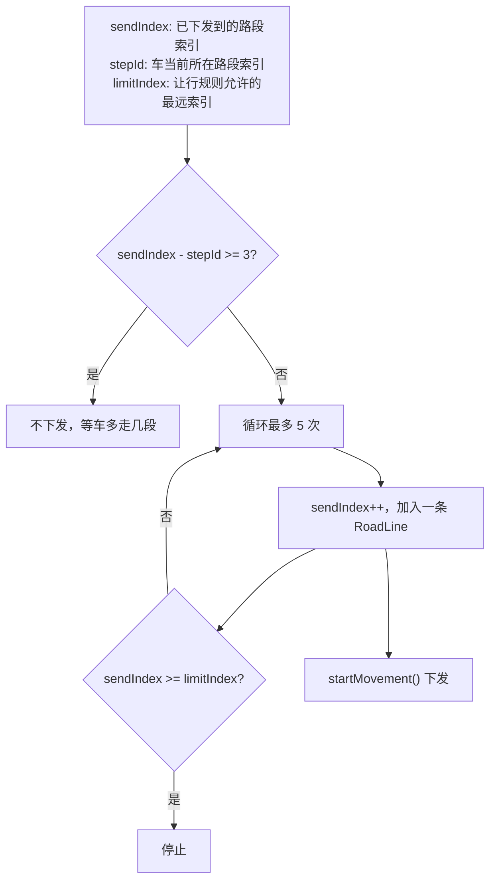
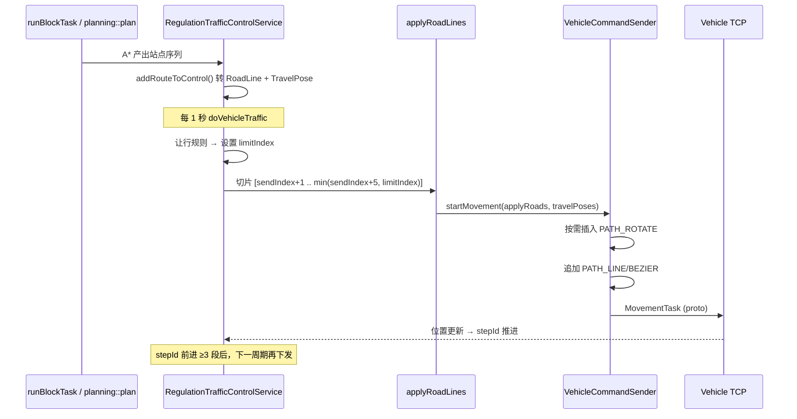

下面按 Core 调度代码，说明**路径下发是否带角度**、**大约下发多远**、以及**规划/下发逻辑**。

---

## 一、发路段非离散点

先澄清：下发的是「路段」，不是「离散路径点」

全局规划（A*）产出的是 **站点序列**（`Route.positions`），交管再转成 **路段序列**（`RoadLine` 列表）下发给机器人。

```1041:1121:core/module/traffic/src/traffic_control_service_regulation.cpp
void RegulationTrafficControlService::addRouteToControl(...) {
    // positions: [A, B, C, D] → roadLines: [A→B, B→C, C→D]
    control->roadLines = roadLines;
    control->travelPoses = travelPoses;  // 每个站点的进出角度
}
```

每条 `RoadLine` 包含：

- 起止坐标 `(sx,sy)` → `(ex,ey)`
- 贝塞尔控制点 `(cx,cy)`, `(dx,dy)`（曲线时）
- 前进/后退 `direction`
- 路段长度 `dis`
- 起终点出/入向角 `beginOut` / `endIn`

---

## 二、分段角度信息

 角度信息：有，但是「分段表达」，不是每个点都带 yaw

### 1. 直线/贝塞尔路段（`PATH_LINE` / `PATH_BEZIER`）

```143:163:core/module/domain/include/vehicles/vehicle_command_sender.hpp
pathMsg->set_sx(...); pathMsg->set_sy(...);
pathMsg->set_ex(...); pathMsg->set_ey(...);
pathMsg->set_rotate_angle(0);   // 路段本身不带目标角度
pathMsg->set_direction(static_cast<int>(direction));  // 前进/后退
```

路段消息里 **不直接带目标航向角**，运动方向由 `direction`（前进/后退）表达。  
贝塞尔曲线时，中间插值点 `midPoses` 含 yaw，用于仿真和碰撞检测，但下发给真车时贝塞尔可能被展平为直线（仿真模式例外）。

### 2. 旋转路段（`PATH_ROTATE`）—— 显式角度

当站点间需要转向时，会在路段前插入独立的旋转段：

```109:118:core/module/domain/include/vehicles/vehicle_command_sender.hpp
rotatePathMsg->set_type(proto::Path::PATH_ROTATE);
int rad = rotateYaw * 1000;  // 单位: 1/1000 rad
rotatePathMsg->set_rotate_angle(rad);
```

触发条件（SINEVA 协议）：

- 当前航向与 `VehicleTravelPose.targetYaw` 差值 > `rotateYawLimit`（默认 1.0 rad ≈ 57°）
- 首段离机器人较远时，`fillFirstRoadLine` 补一段接入路并设 `firstRotateYaw`
- 到达终点后：充电调头、或终点 `spin=true` 时按地图 `pose.yaw` 旋转

### 3. `VehicleTravelPose`：规划阶段的「站点角度表」

```10:39:core/module/domain/include/vehicles/vehicle_travel_pose.hpp
class VehicleTravelPose {
    double sourceYaw_;   // 进入该站点时的航向
    double targetYaw_;   // 离开该站点时的航向（下一段行驶方向）
    bool needRotate_;    // 是否需要原地旋转（>5° 且非贝塞尔）
};
```

在 `addRouteToControl()` 里为每个站点计算：

- **直线段**：`targetYaw` = 起止点连线方向角
- **贝塞尔段**：`targetYaw` = 曲线 `midPoses` 首尾 yaw
- **终点**：`targetYaw` = 地图站点 `pose.yaw`（若 `spin=true`）

这些角度不直接写在直线 Path 里，而是用来决定**是否插入 `PATH_ROTATE`**。

### 4. 终点角度

```725:728:core/module/traffic/src/traffic_control_service_regulation.cpp
if (lastPos->spin) {
    rotateAfterArrived = true;
    rotateYawAfterArrived = lastPos->pose.yaw;  // 地图 AdvancedPoint 的 dir
}
```

---

## 三、大约下发多远？

 —— 按「路段数」而非固定米数

核心参数（类成员默认值）：

```21:22:core/module/traffic/include/traffic/traffic_control_service_regulation.hpp
int maxApplyRoadLineCount_ = 5;   // 每次最多下发 5 条路段
int passedRoadLineCount_   = 3;   // 车走过 3 条后才允许再下发
```

### 下发逻辑（`applyRoadLines`）



关键代码：

```1288:1362:core/module/traffic/src/traffic_control_service_regulation.cpp
if (sendI - stepId >= passedRoadLineCount_) { return; }  // 未走够 3 段不再发

for (int index = 0; index < maxApplyRoadLineCount_; ++index) {
    ++sendIndex;
    addRoad(applyRoads, control->roadLines[sendIndex]);
    if (sendIndex >= limitIndex) break;
    if (sendIndex + 1 >= roadCount) break;
}
```

### 距离估算

**没有固定「下发 X 米」的配置**，实际距离 ≈ 本次下发路段的 `dis` 之和：

| 因素    | 含义                                    |
| ----- | ------------------------------------- |
| 单次最多  | **5 条路段**                             |
| 再下发条件 | 车至少走过 **3 条**（`stepId` 追上）            |
| 最远限制  | `limitIndex`（让行规则动态收紧，可能为 -1 表示完全不让走） |
| 依赖让行  | 最多超前 `sendIndex + 5` 条                |

举例：若每段平均 2m，单次大约 **2～10m**（1～5 段），具体取决于路网和交管。

`limitIndex` 由四类让行规则决定：

- 点位占用（`yield_position_occupied`）
- 路径段冲突（`yield_route_section`）
- 区域限制（`yield_area`）
- 车辆依赖（`yield_dependency_relation`，且硬限制不超过 `sendIndex + 5`）

---

## 四、完整下发流程



---

## 五、特殊场景

| 场景          | 行为                                                    |
| ----------- | ----------------------------------------------------- |
| **动作点倒车**   | 车在 `ActionPoint` 时 `backward=true`，首段后退               |
| **识别停靠**    | 倒数第二段设 `dockId`，真车不下发最后一段，改发 `startDock`              |
| **充电调头**    | 最后一段前插入 180° 旋转（`turnAroundAfterArrived`）             |
| **SEER 协议** | 跳过 SINEVA 的旋转段逻辑，主要下发直线/贝塞尔                           |
| **仿真车**     | 贝塞尔保留；`beginOut/endIn` 通过 `limit_acc/limit_dec` 传给仿真器 |

---

## 六、总结

| 问题          | 答案                                                                                                                       |
| ----------- | ------------------------------------------------------------------------------------------------------------------------ |
| **是否包含角度？** | **有，但是分段处理**：直线/贝塞尔路段用 `direction`（前进/后退）；需要转向时单独发 `PATH_ROTATE`（`rotate_angle`，单位 1/1000 rad）；终点可能按地图 `pose.yaw` 做到达后旋转 |
| **下发多远？**   | **不固定米数**；每次最多 **5 条路段**，总距离 = 这些路段 `dis` 之和；车走过 **3 条**后才再下发；让行规则用 `limitIndex` 动态限制最远路段                                |
| **规划点逻辑？**  | 规划产出站点序列 → 转成路段序列 + 每站 `sourceYaw/targetYaw` → 交管切片下发 → 按行走进度滚动 `sendIndex`/`stepId`                                     |

如果你接下来想跟某辆车的一次实际下发（看日志里 `send index / limit index / total`），或想改 `maxApplyRoadLineCount_` / `passedRoadLineCount_`，可以说一下场景我帮你对一下参数影响。


---

# addRouteToControl

`addRouteToControl` 是交管模块里的一个**路径落地函数**：把路径规划器输出的「站点序列」转成车辆可执行的 `RoadLine` 列表和姿态序列，写入 `Control` 控制块。

---

## 函数签名与职责

```78:78:core/module/traffic/include/traffic/traffic_control_service_regulation.hpp
            void addRouteToControl(const VehiclePtr& vehicle, const std::vector<Position>& positions, ControlPtr control);
```

| 参数          | 含义                                                     |
| ----------- | ------------------------------------------------------ |
| `vehicle`   | 当前车辆，主要用它的实时朝向 `pose().yaw`                            |
| `positions` | 规划路径的站点序列（如 A→B→C→D），来自 `route.second->getPositions()` |
| `control`   | 交管控制块，函数会填充其中的 `roadLines` 和 `travelPoses`             |

**输出（写入 `Control`）：**

```23:24:core/module/traffic/include/traffic/control_block.hpp
        std::vector<maps::RoadLinePtr> roadLines;
        std::vector<vehicles::VehicleTravelPose> travelPoses;
```

可以把它理解成 C++ 里的一个**转换适配器**：

```
PlanResult (站点 ID 序列)  →  Control (地图边 + 每段行驶姿态)
```

---

## 在整体流程中的位置


**三处调用：**

1. **`runBlockTask`**（1150 行）— 新任务首次规划成功后，创建 `Control` 并写入路径
2. **`detour`**（384、447 行）— 绕障/重规划后，`control->reset()` 再写入新路径

典型调用模式：

```cpp
control->reset();  // 重规划时先清空
addRouteToControl(vehicle, route.second->getPositions(), control);
vehicle->setRoadLines(control->roadLines);
vehicle->setTimedRoute(timeRoute);  // 站点→路段+代价 的映射
```

---

## 核心算法（1041–1125 行）

### 1. 前置检查

```cpp
if (control != nullptr && !positions.empty())
```

任一为空则直接返回，不写 `Control`。

### 2. 逐段解析路径

`positions` 是站点链，`count = positions.size() - 1` 即路段数。对每对相邻站点 `(i, i+1)`：

```cpp
maps::RoadLinePtr roadLine = mapManager_->getRoadLine(mapId, startId, endId);
if (roadLine == nullptr) { continue; }  // 地图上找不到边则跳过
roadLines.emplace_back(roadLine);
```

规划器给的是**点序列**，这里通过地图查**边**（`RoadLine`），把抽象路径变成可下发的路网线段。

### 3. 计算每段的 `VehicleTravelPose`（含角度）

`VehicleTravelPose` 描述车辆在某一站点处的朝向要求：

```10:40:core/module/domain/include/vehicles/vehicle_travel_pose.hpp
    class VehicleTravelPose {
        // positionId_  - 所在站点
        // sourceYaw_   - 进入该段时的朝向
        // targetYaw_   - 离开该段时的朝向
        // needRotate_  - 是否需要在站点原地旋转（calcRotate 计算）
```

**第一段（i == 0）：**

- `sourceYaw` = 车辆当前朝向 `vehicle->pose().yaw`
- `targetYaw`：
  - 直线/弧线：起点→终点的几何角度
  - 贝塞尔曲线（`BEZIER`）：取曲线中间点 `midPoses.front().yaw`

**中间段（i > 0）：**

- `sourceYaw` = 上一段终点的 `targetYaw`（保证朝向连续）
  - 若上一段是贝塞尔：用 `prevRoadLine->midPoses.back().yaw`
- `targetYaw`：同第一段的计算方式

**最后一段额外补终点姿态（i == count - 1）：**

```cpp
travelTargetPose.setPositionId(roadLine->endPos.id);  // 路径最终站点
travelTargetPose.setSourceYaw / setTargetYaw(...);    // 到达终点的最终朝向
```

因此 `travelPoses` 数量通常是 **`roadLines.size() + 1`**（每段起点各一个 pose，最后再加终点 pose）。

### 4. 直线 vs 贝塞尔的分支

| 路段类型       | 朝向来源                                        |
| ---------- | ------------------------------------------- |
| 非 `BEZIER` | 用起终点坐标算 `geometries::angleRadian(pts, ptt)` |
| `BEZIER`   | 用曲线中间控制点的 `yaw`（`midPoses.front/back`）      |

贝塞尔段不依赖简单两点连线角度，而是沿用地图里预置的曲线姿态。

### 5. 写回并打日志

```cpp
control->roadLines = roadLines;
control->travelPoses = travelPoses;
SPDLOG_INFO("... travel poses:{}", ...);
```

---

## 下游如何使用这些数据

`updateRoutes` 会从 `control` 取出路径，按 `sendIndex` 截取本次要下发的路段，再调用：

```747:750:core/module/traffic/src/traffic_control_service_regulation.cpp
                vehicleCommandSender_->startMovement(vehicle, applyRoads, control->travelPoses, ...);
```

也就是说：

- **`roadLines`** → 实际行驶路段（含几何、限速等）
- **`travelPoses`** → 每段起/终点的**角度约束**（是否原地旋转、目标朝向）

角度信息是在 `addRouteToControl` 里就算好的，下发时直接带上。

---

## 数据流示意

假设规划结果：`P0 → P1 → P2 → P3`

```
positions:  [P0, P1, P2, P3]

roadLines:  [P0─P1, P1─P2, P2─P3]     ← 3 条边

travelPoses:
  [0] @P0: source=车辆当前yaw, target=P0→P1方向
  [1] @P1: source=上一段target,   target=P1→P2方向
  [2] @P2: source=上一段target,   target=P2→P3方向
  [3] @P3: source=target=终点最终朝向   ← 额外终点姿态
```

---

## 需要注意的细节

1. **`roadLine == nullptr` 时 `continue`**：某段在地图里找不到边会被静默跳过，可能导致 `roadLines` 比规划路径短，属于潜在风险点。
2. **不负责下发**：只填充 `Control`；真正 `startMovement` 在 `updateRoutes` 里，且会经过 `applyRoadLines` 做分段截取（`maxApplyRoadLineCount_` 等）。
3. **`control->reset()` 不清 `roadLines`**：`reset()` 只清 `sendIndex`、`travelPoses` 等状态，重规划前通常配合重新 `addRouteToControl` 整体覆盖 `roadLines`。
4. **与 `setTimedRoute` 配合**：调用方会用 `route.second->positionCosts` 建立「站点 → (路段, 代价)」映射，供后续进度跟踪使用。

---

## 一句话总结

`addRouteToControl` 把路径规划器的**站点序列**翻译成交管系统可用的**路网边 + 每段行驶姿态（含角度）**，是「规划结果」到「可下发控制指令」之间的关键桥梁。新任务创建和绕障重规划都会走这个函数。

如果你想继续深入，我可以接着讲它和 `applyRoadLines` / `fillFirstRoadLine` 如何配合做「分段下发」。


